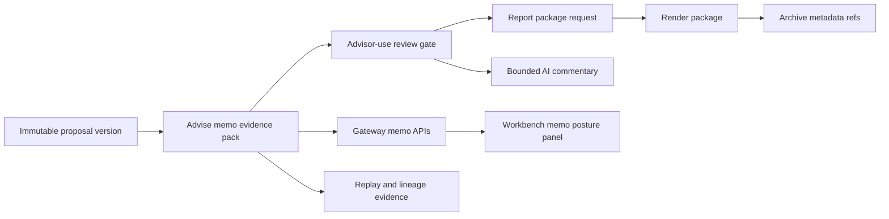

# RFC-0024 Advisor Proposal Memo Commercial Support

## Purpose

This guide is the implementation-backed commercial, demo, and RFP-support source for the
RFC-0024 advisor proposal memo.

It is deliberately narrower than RFC-0028. It supports memo-specific sales and pre-sales
explanation for the implemented advisor-use memo posture, while broader bank-demo journeys,
security packs, architecture decks, ROI material, and client-ready proof remain RFC-0028 scope.

## Implementation-Backed One-Pager

The advisor proposal memo turns a persisted advisory proposal version into a governed
private-banking decision record. It combines proposal evidence, decision summary, alternatives,
memo-critical suitability and product eligibility posture, cost and friction limitations,
disclosures, conflict blockers, review events, report-package refs, archive refs, AI commentary
lineage, and replay evidence.

Supported today:

1. deterministic memo creation and immutable read for proposal versions,
2. advisor-use projection and review posture,
3. exact memo hash continuity for advisor-use approval, report-package requests, and AI commentary,
4. advisor-use report/render/archive realization through downstream service refs,
5. review-gated advisor-use AI commentary through `proposal_memo_commentary.pack@v1`,
6. Gateway-routed memo APIs and Workbench Gateway/BFF-only memo posture,
7. replay and lineage evidence for audit and operations.

Not supported today:

1. client-ready memo publication,
2. send-to-client controls,
3. active `AdvisoryProposalMemoEvidencePack:v1` data-product promotion,
4. broad bank-demo proof packs,
5. enterprise RFP/security packs beyond the memo-specific answers in this guide.

## Claim Register

| Claim | Commercial wording | Support status | Evidence |
| --- | --- | --- | --- |
| Advisor-use memo evidence | Lotus can generate and persist an advisor-use proposal memo from immutable proposal-version evidence. | Supported | `POST` and `GET /advisory/proposals/{proposal_id}/versions/{version_no}/memo`; Slice 5-7 evidence. |
| Review-gated report package | Lotus requires matching memo hash continuity and `APPROVE_FOR_ADVISOR_USE` before requesting a memo report package. | Supported | `POST /advisory/proposals/{proposal_id}/versions/{version_no}/memo/report-packages`; Slice 9 evidence. |
| Archive visibility | Lotus records support-safe report, render, and archive references in memo lineage. | Supported | Memo lineage endpoint and Slice 9 report/render/archive evidence. |
| AI commentary | Lotus can request bounded advisor-use AI commentary only after advisor-use memo approval, and AI cannot change memo evidence or approval posture. | Supported when `lotus-ai` is configured; deterministic unavailable posture otherwise | `POST /advisory/proposals/{proposal_id}/versions/{version_no}/memo/ai-commentary`; Slice 10 evidence. |
| Workbench visibility | Advisors and support users can inspect memo posture, projection, report package, archive refs, AI commentary, lineage, and replay through Gateway-backed Workbench surfaces. | Supported | Slice 11 Gateway/Workbench evidence. |
| Client-ready memo | Lotus can publish or send a client-ready memo. | Not supported | Gated for later RFC-0024 slices. |
| Active memo data product | `AdvisoryProposalMemoEvidencePack:v1` is an active governed data product. | Not supported | Declaration and telemetry remain proposed/blocked. |
| Full bank demo and enterprise RFP pack | Lotus has a complete client-demo journey, architecture deck, security pack, ROI story, and RFP response set. | Not supported in RFC-0024 | RFC-0028 owns broader demo and RFP proof. |

## Demo Notes

Use the demo as an advisor-use operations and supportability walkthrough, not as a client-ready
publication demo.

Recommended talk track:

1. create or select a persisted proposal version,
2. create the memo and show section readiness,
3. inspect advisor, compliance, operations, and client-draft projection posture,
4. approve only for advisor use with the exact memo hash,
5. request report package realization and inspect returned report/render/archive refs,
6. request AI commentary only after advisor-use approval,
7. inspect replay evidence and lineage,
8. explain blocked or degraded source evidence as `PENDING_REVIEW`, `BLOCKED`, or `NOT_AVAILABLE`.

Do not label screenshots or outputs as demo-ready for clients unless RFC-0028 proof later marks the
journey and artifacts as client-demo safe.

## API Examples

Create or read memo evidence for a proposal version:

```bash
curl -X POST "http://advise.dev.lotus/advisory/proposals/{proposal_id}/versions/{version_no}/memo" \
  -H "Content-Type: application/json" \
  -H "Idempotency-Key: memo-create-demo-001" \
  --data '{"requested_audience":"ADVISOR"}'
```

Approve the memo for advisor use with exact hash continuity:

```bash
curl -X POST "http://advise.dev.lotus/advisory/proposals/{proposal_id}/versions/{version_no}/memo/review" \
  -H "Content-Type: application/json" \
  -H "Idempotency-Key: memo-review-demo-001" \
  --data '{"action":"APPROVE_FOR_ADVISOR_USE","source_memo_hash":"sha256:...","reviewer_id":"advisor-demo"}'
```

Request report-package realization after advisor-use approval:

```bash
curl -X POST "http://advise.dev.lotus/advisory/proposals/{proposal_id}/versions/{version_no}/memo/report-packages" \
  -H "Content-Type: application/json" \
  -H "Idempotency-Key: memo-report-package-demo-001" \
  --data '{"source_memo_hash":"sha256:...","requested_by":"advisor-demo"}'
```

Request bounded AI commentary after advisor-use approval:

```bash
curl -X POST "http://advise.dev.lotus/advisory/proposals/{proposal_id}/versions/{version_no}/memo/ai-commentary" \
  -H "Content-Type: application/json" \
  -H "Idempotency-Key: memo-ai-commentary-demo-001" \
  --data '{"source_memo_hash":"sha256:...","requested_section_keys":["executive_summary"],"requested_by":"advisor-demo"}'
```

## Architecture Flow



The flow is implementation-backed for advisor-use memo posture. It does not represent client-ready
publication, external client communication, or active data-product certification.

## Operator Guidance

When supporting demos or RFP walkthroughs:

1. verify `/health/ready` and `GET /platform/capabilities` before claiming runtime readiness,
2. treat `AI_UNAVAILABLE` as an expected bounded posture when `lotus-ai` is not configured,
3. use memo lineage rather than screenshots as the source of report/render/archive refs,
4. use replay evidence when explaining audit posture,
5. describe missing policy, product, fee, cost, tax, friction, disclosure, or conflict facts as
   explicit blockers or limitations, not positive suitability evidence.

## Security And RFP-Safe Wording

Safe RFP wording:

1. "The advisor proposal memo is generated from persisted proposal-version evidence and preserves
   memo hash continuity for advisor-use review, report-package requests, and AI commentary."
2. "AI commentary is bounded, review-gated, and cannot mutate memo evidence, suitability,
   approvals, report status, archive status, or client-ready posture."
3. "Report, render, and archive references are recorded as support-safe lineage rather than raw
   storage paths."
4. "Client-ready memo publication and external client communication are not currently supported."
5. "`AdvisoryProposalMemoEvidencePack:v1` remains proposed/blocked until active data-product
   certification, access, SLO, evidence-policy, and final proof gates close."

Unsafe wording:

1. "The memo is client-ready."
2. "AI approves or changes recommendations."
3. "The memo product is certified as an active data product."
4. "The bank-demo journey or full RFP pack is complete."
5. "Missing product or policy evidence implies suitability."

## RFC-0028 Boundary

No RFC-0028 source update is required for this slice because this guide does not change the broader
bank-demo or enterprise RFP scope. RFC-0028 remains the owner for complete client-demo journeys,
RFP/security packs, architecture decks, ROI material, and supported-claim proof packs.
