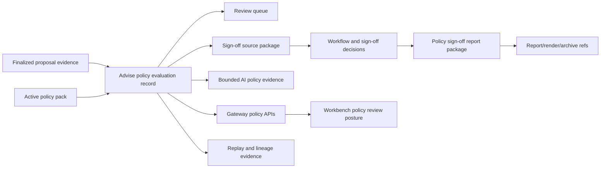

# RFC-0025 Enterprise Policy Pack Commercial Support

## Purpose

This guide is the implementation-backed commercial, demo, and RFP-support source for RFC-0025
enterprise suitability and best-interest policy packs.

It is deliberately narrower than RFC-0028. It supports policy-pack-specific sales and pre-sales
explanation for the implemented advisor, compliance, supervisory, operations, and audit posture,
while complete bank-demo journeys, security packs, architecture decks, ROI material, and
client-ready proof remain RFC-0028 scope.

## Implementation-Backed One-Pager

The enterprise policy-pack capability turns active policy-pack definitions and finalized proposal
evidence into governed policy evaluation records. It covers source readiness, mandate alignment,
product eligibility, complex-product disclosure and consent requirements, best-interest cost
evidence, conflict posture, approval dependencies, sign-off source packages, report-package lineage,
AI policy-evidence summary lineage, Gateway routing, and Workbench review posture.

Supported today:

1. policy-pack catalog, validation, activation, content hashes, maker-checker controls, and audit
   events,
2. internal source-backed applicability and rule evaluation for active policy packs,
3. finalized policy evaluation persistence with source, policy, evaluation, and per-rule hashes,
4. certified Advise policy evaluation APIs, review queue, replay, lineage, events, workflow, and
   sign-off source-package endpoints,
5. sign-off decision recording with maker-checker enforcement and source-hash validation,
6. typed policy sign-off report-package requests with report, render, and archive lineage refs,
7. bounded AI policy-evidence summaries through `policy_evidence_summary.pack@v1`,
8. Gateway-routed policy APIs and Workbench Gateway/BFF-only review posture, selected evidence,
   sign-off package posture, workflow posture, and bounded request-more-evidence actions,
9. active `AdvisoryPolicyEvaluationRecord:v1` data-product posture with current trust telemetry,
   `/platform/capabilities`, and platform SLO/access/evidence-policy support.

Not supported today:

1. approval, waiver, or completed sign-off authority,
2. client-ready policy publication or send-to-client controls,
3. broad bank-demo proof packs, enterprise security packs, architecture decks, ROI material, or full
   RFP response sets.

## Claim Register

| Claim | Commercial wording | Support status | Evidence |
| --- | --- | --- | --- |
| Policy-pack catalog | Lotus can manage versioned reference policy packs with validation, content hashes, maker-checker activation, and audit events. | Supported as implementation fixture and reference examples, not legal advice | Slice 5 evidence and policy-pack catalog APIs. |
| Source-backed policy evaluation | Lotus can evaluate active policy packs against finalized proposal evidence and preserve source gaps, rule posture, approval dependencies, disclosure requirements, consent requirements, and per-rule hashes. | Supported inside Advise policy evaluation records | Slice 6 and Slice 7 evidence. |
| Certified Advise policy APIs | Lotus exposes canonical Advise APIs for policy evaluation create/read, review queue, replay, events, lineage, sign-off source packages, workflow, sign-off decisions, report packages, and AI evidence. | Supported | Slice 8 through Slice 11 evidence. |
| Sign-off source package | Lotus can produce an auditable source package for review, disclosure, consent, approval-dependency, and sign-off evidence. | Supported for advisor/compliance/supervisory review posture | Slice 8 and Slice 9 evidence. |
| Report/render/archive lineage | Lotus records support-safe report, render, and archive references for signed-off policy evaluations. | Supported after valid sign-off posture | Slice 10 evidence. |
| AI policy evidence | Lotus can request bounded AI policy-evidence summaries, record prompt/output lineage, and prevent AI output from changing policy status, approvals, waivers, disclosures, consent, or client-ready posture. | Supported when `lotus-ai` is configured; deterministic unavailable posture otherwise | Slice 11 evidence. |
| Workbench visibility | Advisors, compliance, supervisory users, and support users can inspect Gateway-backed policy review posture, selected evidence, sign-off package posture, workflow posture, and request-more-evidence actions. | Supported | Slice 12 Gateway/Workbench evidence. |
| Active policy data product | `AdvisoryPolicyEvaluationRecord:v1` is an active governed data product and advertised platform capability. | Supported for advisor/compliance policy evidence | Slice 16 final closure, trust telemetry, `/platform/capabilities`, and platform SLO/access/evidence-policy support. |
| Client-ready policy publication | Lotus can approve, waive, complete, publish, or send policy evidence to a client. | Not supported | Client-ready publication and external communication remain blocked. |
| Full bank demo and enterprise RFP pack | Lotus has a complete client-demo journey, architecture deck, security pack, ROI story, and RFP response set. | Not supported in RFC-0025 | RFC-0028 owns broader demo and RFP proof. |

## Demo Notes

Use the demo as an advisor, compliance, supervisory, operations, and supportability walkthrough, not
as a client-ready publication demo.

Recommended talk track:

1. select a finalized proposal version with policy source-readiness evidence,
2. show the active policy-pack catalog and activation posture,
3. create or open a finalized policy evaluation,
4. inspect material rule posture, source gaps, approval dependencies, disclosure requirements, and
   consent requirements,
5. review the sign-off source package and workflow posture,
6. record only bounded review/sign-off decisions with exact source-hash validation,
7. request a policy sign-off report package only after the required sign-off posture exists,
8. request bounded AI policy-evidence summary only as non-authoritative review assistance,
9. inspect replay evidence, lineage, and support-safe report/render/archive refs,
10. explain blocked, pending, or unavailable source evidence as explicit review posture rather than
    positive suitability evidence.

Do not label screenshots or outputs as demo-ready for clients unless RFC-0028 proof later marks the
journey and artifacts as client-demo safe.

## API Examples

List policy packs:

```bash
curl "http://advise.dev.lotus/advisory/policy-packs"
```

Create a policy evaluation for a proposal version:

```bash
curl -X POST "http://advise.dev.lotus/advisory/proposals/{proposal_id}/versions/{proposal_version_id}/policy-evaluations" \
  -H "Content-Type: application/json" \
  -H "Idempotency-Key: policy-evaluation-demo-001" \
  --data '{"policy_pack_id":"GLOBAL_PRIVATE_BANKING_BASELINE","requested_by":"advisor-demo"}'
```

Read the review queue:

```bash
curl "http://advise.dev.lotus/advisory/policy-evaluations/review-queue?portfolio_id=PB_SG_GLOBAL_BAL_001"
```

Record a bounded sign-off decision with exact source-hash validation:

```bash
curl -X POST "http://advise.dev.lotus/advisory/policy-evaluations/{evaluation_id}/sign-off-decisions" \
  -H "Content-Type: application/json" \
  -H "Idempotency-Key: policy-signoff-demo-001" \
  --data '{"action":"REQUEST_MORE_EVIDENCE","source_evaluation_hash":"sha256:...","reviewer_id":"compliance-demo","reason":"Cost evidence requires desk confirmation"}'
```

Request bounded AI policy-evidence summary:

```bash
curl -X POST "http://advise.dev.lotus/advisory/policy-evaluations/{evaluation_id}/ai-evidence" \
  -H "Content-Type: application/json" \
  -H "Idempotency-Key: policy-ai-demo-001" \
  --data '{"source_evaluation_hash":"sha256:...","requested_by":"advisor-demo"}'
```

## Architecture Flow



The flow is implementation-backed for advisor, compliance, supervisory, operations, and support
review posture, including active policy-evaluation data-product support. It does not represent
completed approval authority, completed sign-off authority, client-ready publication, external
client communication, or full bank-demo/RFP proof.

## Operator Guidance

When supporting demos or RFP walkthroughs:

1. verify `/health/ready` before claiming service readiness,
2. verify `/platform/capabilities` before claiming supported platform capabilities and state that
   policy evaluation is promoted for advisor/compliance evidence only,
3. use policy lineage and replay evidence rather than screenshots as the source of report, render,
   archive, AI, and review-event refs,
4. treat `AI_UNAVAILABLE` as an expected bounded posture when `lotus-ai` is not configured,
5. describe source gaps, stale hashes, missing documents, unresolved conflicts, and incomplete
   consent/disclosure evidence as blockers or limitations,
6. use Gateway and Workbench only for product-surface review posture; do not describe Workbench as
   calculating policy suitability locally.

## Security And RFP-Safe Wording

Safe RFP wording:

1. "Policy evaluations are generated from active policy packs and finalized proposal evidence, with
   source, policy, evaluation, and per-rule hashes preserved for replay."
2. "The review workflow records source-hash-validated decisions and preserves sign-off source
   packages, events, lineage, and report/render/archive refs."
3. "AI policy-evidence summaries are bounded, review-assistive, and cannot change rule results,
   approvals, waivers, disclosures, consent, sign-off status, or client-ready posture."
4. "Gateway and Workbench expose review posture and request-more-evidence actions without local
   policy calculation or unsupported approval authority."
5. "`AdvisoryPolicyEvaluationRecord:v1` is active for advisor/compliance policy evidence; completed
   authority and client-ready publication remain gated."
6. "Client-ready publication and external client communication are not currently supported."

Unsafe wording:

1. "The policy evaluation is legally approved for client use."
2. "Lotus grants waivers or completes policy sign-off automatically."
3. "AI approves suitability, best-interest, disclosures, or consent."
4. "Policy evaluation grants legal approval, waiver authority, or completed sign-off authority."
5. "The bank-demo journey or full RFP pack is complete."
6. "Missing source evidence implies suitability or best-interest compliance."

## RFC-0028 Boundary

No RFC-0028 source update is required for this slice because this guide does not change the broader
bank-demo or enterprise RFP scope. RFC-0028 remains the owner for complete client-demo journeys,
RFP/security packs, architecture decks, ROI material, and supported-claim proof packs.
