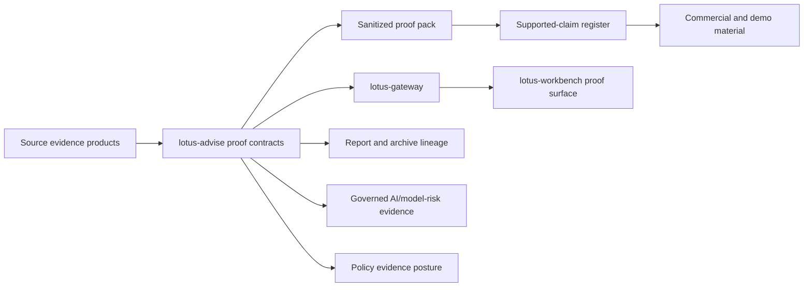

# RFC-0028 Bank Demo And Client Proof Materials

## Purpose

This guide is the claim-controlled commercial, RFP, security, architecture, ROI, and demo source for
the RFC-0028 private-banking advisory proof journey.

It is grounded in the RFC-0028 supported-claim register and the sanitized proof pack. It is safe for
sales, pre-sales, operations, and client-demo preparation when the boundaries in this guide are kept
intact. It is not a legal, regulatory, investment, security-certification, or execution-system
attestation.

## Implementation-Backed Product One-Pager

Lotus can demonstrate a governed private-banking advisory journey from source evidence to advisor
review posture. The current proof covers:

1. canonical scenario identity for `RFC28_BANK_DEMO_CLIENT_READY_PROOF_CANONICAL`,
2. canonical private-banking portfolio `PB_SG_GLOBAL_BAL_001`,
3. sanitized proof-pack capture from live runtime evidence,
4. advisor journey evidence across proposal lifecycle, narrative, memo, policy, cockpit, and
   execution-boundary posture,
5. report, render, and archive lineage for advisor-use memo and policy evidence,
6. AI/model-risk evidence showing review-gated, non-authoritative AI assistance,
7. Gateway and Workbench proof for the governed `advisory.bank_demo_proof` surface,
8. material-field review that blocks unsupported client-ready and policy-approval claims,
9. security and operations posture from health, readiness, dependency, CI, and production-profile
   controls,
10. a supported-feature matrix that separates supported proof from blocked claims.

The commercial position is precise: Lotus has an implementation-backed private-banking advisory
proof journey and claim-controlled demo material. Lotus does not claim client-ready publication,
external client communication, bank-specific certification, legal advice, completed policy
approval, or OMS order/fill/settlement authority from this proof.

## Supported-Claim Mapping

| Material | Claim ids | Allowed audiences | Required wording boundary |
| --- | --- | --- | --- |
| Product one-pager | `commercial_rfp_security_material_available`, `advisor_journey_backend_evidence_available`, `client_ready_publication_blocked` | Sales, pre-sales, client demo | Describe governed advisor proof, not a client-ready publication workflow. |
| RFP response pack | `commercial_rfp_security_material_available`, `backend_proof_capture_repeatable`, `degraded_runtime_boundary_evidence_available`, `client_ready_publication_blocked` | Sales, pre-sales, RFP/security | Use implementation evidence and state blocked external attestations. |
| Security posture pack | `commercial_rfp_security_material_available`, `degraded_runtime_boundary_evidence_available`, `client_ready_publication_blocked` | Pre-sales, RFP/security, operations | Describe platform controls and CI evidence, not bank certification. |
| Architecture outline | `commercial_rfp_security_material_available`, `ai_policy_cockpit_proof_integrated`, `client_ready_publication_blocked` | Sales, pre-sales, developers, operations | Show source authority and boundaries without exposing raw payloads. |
| Demo script | `commercial_rfp_security_material_available`, `advisor_use_document_proof_available`, `ai_policy_cockpit_proof_integrated`, `client_ready_publication_blocked` | Sales, pre-sales, client demo, operations | Keep advisor-use and blocked client-ready posture visible. |
| Proof guide | `commercial_rfp_security_material_available`, `backend_proof_capture_repeatable`, `client_ready_publication_blocked` | Developers, operations, pre-sales | Interpret sanitized evidence only; do not use raw logs or prompts. |
| ROI story | `commercial_rfp_security_material_available`, `advisor_journey_backend_evidence_available`, `client_ready_publication_blocked` | Sales, pre-sales | Use qualitative operating-value claims only; do not invent quantified savings. |
| Feature matrix | `commercial_rfp_security_material_available`, `client_ready_publication_blocked` | Sales, pre-sales, RFP/security, operations | Mark blocked claims as blocked, not planned proof. |
| Client-demo boundaries | `commercial_rfp_security_material_available`, `client_ready_publication_blocked` | Sales, pre-sales, client demo | State what the demo proves and what it does not prove. |
| Operator checklist | `commercial_rfp_security_material_available`, `backend_proof_capture_repeatable`, `client_ready_publication_blocked` | Operations, pre-sales | Require green validation before screenshots or client playback. |

## RFP Response Pack

Safe RFP wording:

1. "Lotus provides a repeatable proof pack for the governed private-banking advisory journey,
   including scenario identity, source-product references, evidence markers, material-field review,
   and blocked-claim boundaries."
2. "The proof pack is generated from sanitized runtime evidence and excludes secrets, raw prompts,
   raw source payloads, and local-only runtime bundles from committed or client-facing material."
3. "AI evidence is review-assistive and non-authoritative. It cannot approve advice, change policy
   posture, clear review blockers, or publish client-ready content."
4. "Policy proof is framed as configurable advisory and compliance evidence support, not legal or
   regulatory advice."
5. "Gateway and Workbench surfaces consume source-owned contracts. Workbench does not reconstruct
   suitability, memo, policy, narrative, or advisory workflow semantics locally."
6. "Client-ready publication, external client communication, completed approval/sign-off authority,
   and OMS order/fill/settlement remain blocked unless separately implemented and proven."

Unsafe RFP wording:

1. "Lotus provides client-ready publication approval."
2. "Lotus gives legal, regulatory, or suitability sign-off."
3. "AI approves recommendations or policy decisions."
4. "Workbench calculates suitability or policy outcomes locally."
5. "The proof pack certifies a bank's security posture or regulatory compliance."
6. "The advisory proof includes OMS order execution, fills, settlement, or external client
   communication."

## Security Posture Pack

Implementation-backed posture:

1. proof artifacts are classified as commit-safe summary, customer-consumable summary, local runtime
   evidence, operator diagnostics, or secret material,
2. secrets, tokens, prompts, raw provider payloads, raw source evidence, and raw runtime logs are
   blocked from committed and client-facing proof material,
3. runtime posture records health, liveness, readiness, and platform-capability checks,
4. CI covers lint, typecheck, OpenAPI quality, no-alias governance, API vocabulary, data-product
   declarations, dependency health, security audit, unit, integration, e2e, coverage, Docker, and
   production-profile smoke/guardrail checks,
5. degraded source paths are represented as bounded proof posture rather than hidden failures,
6. evidence refs use support-safe lineage and hashes rather than raw business payload dumps.

Not claimed:

1. SOC, ISO, MAS, FINMA, FCA, SEC, or bank-specific certification,
2. customer tenant isolation attestation,
3. legal-entity production onboarding,
4. production disaster-recovery RTO/RPO certification,
5. penetration-test completion,
6. client data processing approval.

## Deck-Ready Architecture Outline

Architecture talk track:

1. Source evidence stays owned by the source services and data products.
2. Advise creates the scenario contract, supported-claim register, proof pack, document proof,
   integration proof, and commercial material pack.
3. Gateway publishes the source-owned Advise contracts without changing semantics.
4. Workbench renders the proof through Gateway/BFF and does not calculate advisory suitability,
   policy, narrative, memo, or AI semantics locally.
5. Commercial materials consume the supported-claim register rather than free-form product claims.

## Demo Script And Talk Track

Pre-demo rule: do not capture or share client-demo screenshots until the canonical API and panel
validation have passed for `PB_SG_GLOBAL_BAL_001`.

Recommended flow:

1. open the advisor cockpit and show the governed portfolio context,
2. show proposal narrative posture as advisor-review evidence,
3. show memo evidence and report/archive lineage as advisor-use proof,
4. show policy posture as pending review or blocked where source evidence requires review,
5. show AI evidence as review-assistive, non-authoritative, and lineage-bound,
6. show the bank demo proof panel and evidence marker `BANK_DEMO_PROOF_PACK_CREATED`,
7. explain the supported-claim register and blocked boundaries,
8. close with the operator checklist and repeatable validation command, not with unsupported client
   publication claims.

Business-facing summary:

"This demo shows how Lotus makes a private-banking advisory journey explainable, reviewable, and
auditable across advisor, compliance, operations, and pre-sales audiences. It proves what is
implemented, flags what requires review, and blocks claims the platform has not implemented."

## Proof-Pack Interpretation Guide

Read the proof pack in this order:

1. `scenario-contract.json` confirms the canonical scenario, portfolio, proof marker, and required
   Workbench panels.
2. `supported-claim-register.json` defines which claims are allowed in each material type.
3. `proof-pack.json` lists evidence markers, source products, unsupported boundaries, and assets.
4. `document-proof-summary.json` explains advisor-use memo and policy report/render/archive posture.
5. `journey-integration-proof-summary.json` explains AI/model-risk, policy, and cockpit boundaries.
6. `commercial-material-pack.json` maps every sales, RFP, security, architecture, ROI, demo, and
   operator asset to supported claims.
7. `material-field-review.json` is the lowest-level claim drift guard.
8. `runtime-posture.json` records health, readiness, and platform capability probes.

Treat a missing marker or blocked material-field review as a stop condition for demo promotion.

## ROI Story

Use qualitative, implementation-backed value language:

1. fewer manual proof gaps because demo claims are tied to a supported-claim register,
2. faster advisor and pre-sales preparation because proof, evidence, and boundaries are packaged,
3. lower review friction because AI, policy, cockpit, report, and archive evidence are separated by
   source authority,
4. better operational control because degraded paths and blocked claims are explicit,
5. reduced demo risk because screenshots and client-facing language are gated by validation.

Do not present quantified time savings, cost savings, capital impact, risk reduction percentages, or
conversion uplift unless a separate measured dataset supports those figures.

## Supported Versus Blocked Feature Matrix

| Area | Status | What may be said |
| --- | --- | --- |
| Canonical bank demo scenario | Supported | The canonical `PB_SG_GLOBAL_BAL_001` proof journey is implementation-backed. |
| Backend proof capture | Supported | The proof pack is repeatable and sanitized. |
| Gateway/Workbench proof surface | Supported | The `advisory.bank_demo_proof` panel is Gateway-backed and canonically validated. |
| Advisor-use document proof | Supported with boundaries | Memo and policy report/render/archive lineage is advisor-use proof, not client-ready publication. |
| AI/model-risk proof | Supported with boundaries | AI is review-assistive, non-authoritative, and cannot approve advice. |
| Policy evidence proof | Supported with boundaries | Policy evidence supports review posture and is not legal advice or completed sign-off authority. |
| RFP/security material | Supported with boundaries | This guide is the claim-controlled source; external certifications are not claimed. |
| Client-ready publication | Blocked | Do not claim publication, send-to-client, or external communication. |
| OMS/order/fill/settlement | Blocked | Do not claim execution system-of-record behavior. |
| Bank-specific certifications | Blocked | Do not claim customer or regulator attestations. |

## Client-Demo Boundaries

Allowed:

1. show the canonical portfolio and proof marker,
2. show advisor-use and review-posture evidence,
3. show proof-pack and supported-claim governance,
4. explain blocked claims using business language,
5. show validated Workbench proof surfaces after canonical validation passes.

Blocked:

1. client-ready publication,
2. external client communication,
3. legal or regulatory advice,
4. completed policy approval, waiver, or sign-off authority,
5. AI approval or autonomous recommendation authority,
6. OMS order, fill, settlement, or external execution status,
7. bank-specific security or compliance certification.

## Operator And Demo-Lead Checklist

Before client playback:

1. confirm the latest merged `main` commit and PR validation status,
2. run the canonical Workbench validation for `PB_SG_GLOBAL_BAL_001`,
3. capture screenshots only after validation passes,
4. generate or review the RFC-0028 proof pack,
5. confirm `commercial-material-pack.json` includes every material family,
6. confirm `material-field-review.json` has no blocked rows,
7. confirm the supported-claim register still maps every product, RFP, security, architecture, ROI,
   demo, proof-guide, feature-matrix, boundary, and operator statement,
8. remove raw prompts, raw source evidence, local logs, tokens, and local-only runtime paths from
   any shared artifact,
9. use this guide for talk track and RFP wording,
10. stop the demo if a blocked claim is needed to answer the question.

## Source References

Implementation evidence:

1. `src/core/bank_demo_proof/commercial_materials.py`,
2. `scripts/capture_rfc0028_backend_proof.py`,
3. `src/core/bank_demo_proof/capture.py`,
4. `docs/rfcs/RFC-0028-bank-demo-journey-and-client-ready-proof.md`,
5. `wiki/Supported-Features.md`,
6. `docs/demo/README.md`.

Primary validation:

1. `make check`,
2. `python -m pytest tests/unit/advisory/engine/test_engine_bank_demo_proof_capture.py tests/unit/advisory/api/test_api_bank_demo_proof.py tests/unit/scripts/test_capture_rfc0028_backend_proof.py tests/unit/test_rfc0028_gold_standard_tightening_contract.py -q`,
3. `lotus-platform/automation/Sync-RepoWikis.ps1 -CheckOnly -Repository lotus-advise`.
