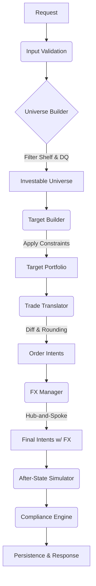

# RFC-0001: Enterprise Rebalance Simulation MVP (DPM Platform)

| Metadata | Details |
| --- | --- |
| **Status** | IMPLEMENTED |
| **Created** | 2026-02-13 |
| **Target Release** | MVP-1 |
| **Doc Location** | docs/rfcs/RFC-0001-rebalance-simulation-mvp.md |

---

## 1. Executive Summary

This RFC specifies the architecture and implementation details for the **Rebalance Simulation Service**, the "brain" of the Discretionary Portfolio Management (DPM) platform.

The service provides a **single, golden endpoint** that accepts a portfolio snapshot and a mandate/model strategy, and deterministically calculates the required trades (`OrderIntents`) to bring the portfolio into alignment.

**Key Architectural Decisions:**

* **Simulation Only:** This service does *not* execute orders. It produces a "proposed trade plan" (Order Intents) and a "simulated after-state."
* **Pure Determinism:** Identical inputs (snapshots + config) must always produce identical outputs (down to the decimal).
* **Audit Lineage:** Every run produces an "Evidence Bundle" linking the decision to specific immutable versions of the mandate, policy rules, and market data.
* **Hub-and-Spoke FX:** All currency management is calculated relative to the Portfolio Base Currency.

### 1.1 Implementation Alignment (As of 2026-02-17)

1. Implemented canonical endpoint is `POST /rebalance/simulate` (`src/api/main.py`).
2. Implemented run statuses are `READY`, `PENDING_REVIEW`, `BLOCKED` (`src/core/models.py`).
3. Implemented domain failures return HTTP 200 with `status=BLOCKED` for valid payloads.
4. Persistence and durable idempotency store are not implemented in this codebase yet.

---

## 2. Problem Statement

Automating portfolio rebalancing in a private banking context requires strict adherence to governance and correctness. Ad-hoc scripts or "black box" optimization solvers are insufficient because:

1. **Explainability:** Clients and auditors need to know *why* a trade was generated (e.g., "Cash drift" vs. "Model update").
2. **Safety:** Hard constraints (e.g., "Do not buy Banned assets") must be enforced by the machine, not human review.
3. **Reproducibility:** We must be able to replay a decision from 6 months ago using the exact data and rules from that time.

---

## 3. Scope & Goals

### 3.1 In Scope (MVP, Implemented Core)

* **Core Endpoint:** `POST /rebalance/simulate`.
* **Universe Construction:** Filtering investable assets based on Product Shelf (Approved/Restricted/Banned) and Data Quality.
* **Target Generation:** Heuristic-based construction (Target % * Total Value).
* **Constraint Solving:** Single-pass redistribution for "Single Position Max" constraints.
* **Trade Generation:** Calculation of buys/sells for Securities (Notional & Unitized) and FX Spot.
* **Compliance Check:** Post-simulation evaluation of Hard (Block) and Soft (Warning) rules.
* **Persistence:** Deferred in current implementation.

### 3.2 Out of Scope

* **Order Execution:** Connection to OMS/EMS.
* **Recursive Optimization:** If a constraint redistribution triggers a secondary breach, the run fails (no multi-pass solving).
* **Tax Optimization:** HIFO/LIFO lot selection (hooks only).
* **Direct Cross-Currency FX:** (e.g., JPY to GBP direct). All FX goes through Base Currency.
* **Corporate Actions:** Handling pending splits/mergers.

---

## 4. System Architecture

The system follows a **Functional Pipeline** architecture. The engine is stateless; all state is provided via inputs.

### 4.1 Logical Data Flow



### 4.2 Core Components

1. **Universe Builder:** Intersects the Model Portfolio with the Product Shelf. Handles exclusions (Banned/Suspended) and Data Quality (Missing Price) logic.
2. **Target Builder:** Converts Model Weights into Target Monetary Values. Applies "Single Position Max" logic.
3. **Trade Translator:** Calculates the delta (`Target - Current`). Handles rounding (floor) and dust suppression.
4. **FX Manager:** Aggregates cash requirements per currency and generates funding trades (FX Spot).
5. **Compliance Engine:** Runs logic checks on the *simulated* post-trade state.

---

## 5. Domain Model (Canonical Schemas)

> All monetary values are represented as `{ "amount": Decimal, "currency": "ISO" }`.
> All IDs are Strings (UUID or K-Sortable).

### 5.1 RebalanceRun (The Aggregate Root)

This object represents the request/response contract and the persisted record.

```json
{
  "rebalance_run_id": "rr_20260213_001",
  "status": "READY", // READY | BLOCKED | PENDING_REVIEW
  "inputs": {
    "portfolio_snapshot_id": "ps_...",
    "market_data_snapshot_id": "md_...",
    "mandate_id": "man_...",
    "model_portfolio_id": "mod_...",
    "options": {
      "suppress_dust_trades": true,
      "fx_buffer_pct": 0.01
    }
  },
  "outputs": {
    "intents": [], // Array of OrderIntent
    "diagnostics": {},
    "rule_results": [],
    "explanation": {}
  },
  "lineage": {
    "effective_policy_version": "v1.2",
    "shelf_snapshot_version": "s_2026..."
  }
}

```

### 5.2 OrderIntent (The Trade)

```json
{
  "intent_id": "oi_01",
  "type": "SECURITY_TRADE", // or FX_SPOT
  "instrument_id": "US0378331005",
  "side": "BUY",
  "quantity": 50,
  "notional_estimated": { "amount": 11250.00, "currency": "USD" },
  "rationale": {
    "code": "REBALANCE_DRIFT",
    "message": "Allocation 15% < Target 20%"
  }
}

```

---

## 6. Algorithm Specification

### Step 1: Input Validation

* Verify `PortfolioSnapshot.as_of` and `MarketDataSnapshot.as_of` are within `max_skew_minutes` (config, default 15 min).
* Verify `BaseCurrency` exists in Market Data FX rates.

### Step 2: Universe Construction (Filtering)

Iterate through all instruments in the Model Portfolio and Current Holdings.

1. **Shelf Check:** Look up `ProductShelfEntry` for the portfolio's entity context (e.g., SG/UHNW).
* If `BANNED` or `SUSPENDED` → Exclude.
* If `RESTRICTED` → Exclude unless `options.allow_restricted = true`.


2. **Data Quality Check:**
* If Price is missing or `staleness > max_staleness_minutes` → **BLOCK RUN** (Configuration: can optionally just exclude instrument, but MVP default is to block for safety).


### Step 3: Target Construction & Constraint Application

1. **Raw Target:** `TargetValue_i = ModelWeight_i * TotalPortfolioValue_Base`.
2. **Single Position Limit (Hard Constraint):**
* Rule: `MaxWeight = 10%`.
* Logic:
* If `TargetWeight_i > MaxWeight`:
* `Excess = TargetWeight_i - MaxWeight`.
* `TargetWeight_i = MaxWeight`.
* **Redistribution:** Distribute `Excess` proportionally to other eligible instruments in the *same* Asset Class.
* **Check:** If a redistribution recipient *now* exceeds `MaxWeight`, the run is **BLOCKED** with error `INFEASIBLE_CONCENTRATION`. (No recursive looping in MVP).


### Step 4: Trade Translation

For each instrument:

1. `DeltaValue = TargetValue - CurrentValue`.
2. **Action:**
* `Delta > 0` → BUY.
* `Delta < 0` → SELL.


3. **Sizing (Determinism Rules):**
* **Unitized (Equities/ETFs):** `Qty = floor(abs(DeltaValue) / Price)`.
* *Rationale:* Floor on Buy to prevent overdraft. Floor on Sell to prevent overselling (unless `ExitPosition` logic is triggered, which is post-MVP).


* **Notional (Funds):** `Amount = round(abs(DeltaValue), 2)`.


4. **Dust Suppression:**
* If `Notional < MinTradeSize` (from Shelf) AND `options.suppress_dust = true`, discard the intent.


### Step 5: FX Manager (Hub-and-Spoke)

1. **Netting:** Calculate `NetFlow` for each currency based on generated Security trades.
2. **Evaluation:**
* If `NetFlow + CurrentCash < 0` (Deficit):
* Generate **FX BUY** (Buy Foreign / Sell Base).
* `BuyAmount = abs(Deficit) * (1 + options.fx_buffer_pct)`.


* If `NetFlow + CurrentCash > Threshold` (Excess):
* (Optional MVP feature) Generate **FX SELL** (Sell Foreign / Buy Base) to repatriate excess cash.


3. **Dependency:** Mark Security Buys as dependent on the generated FX Buys.

### Step 6: Post-Trade Compliance

1. Simulate the `AfterState` by applying the `OrderIntents` to the `PortfolioSnapshot`.
2. Evaluate `PolicyRuleSet` against `AfterState`.
* **HARD Fail:** Set Run Status = `BLOCKED`.
* **SOFT Fail:** Set Run Status = `PENDING_REVIEW` (requires human override).
* **PASS:** Set Run Status = `READY`.


---

## 7. API Specification

### Endpoint: `POST /rebalance/simulate`

**Headers:**

* `Idempotency-Key`: Required (UUID).
* `X-Correlation-ID`: Optional (Generated if missing).

**Response Codes:**

* `200 OK`: Simulation processed (run status may be READY, BLOCKED, or PENDING_REVIEW).
* `422 Unprocessable Entity`: Request schema/header validation failure.

**Current behavior note:**

RFC 7807 domain-error payloads are not implemented; domain failures are represented inside `RebalanceResult` with `status=BLOCKED`.

```json
{
  "type": "https://api.dpm.com/errors/infeasible-constraint",
  "title": "Constraint Redistribution Failed",
  "status": 422,
  "detail": "Redistributing excess weight from Apple (AAPL) caused Microsoft (MSFT) to exceed the 10% cap.",
  "instance": "/rebalance/simulate",
  "correlation_id": "corr_123"
}

```

---

## 8. Persistence & Idempotency

### 8.1 Schema

PostgreSQL persistence is planned but not implemented in current code.

* **Table:** `rebalance_runs`
* `id` (PK)
* `idempotency_key` (Unique Index)
* `request_hash` (SHA256 of inputs)
* `status`
* `payload` (JSONB - full input/output)
* `created_at`


### 8.2 Idempotency Logic

1. Check `idempotency_key`.
2. If exists:
* Verify `request_hash` matches current request.
* If match: Return stored JSON.
* If mismatch: Return `409 Conflict`.


3. If new: Process, Persist, Return.

---

## 9. Observability

### 9.1 Structured Logs

All logs must include `correlation_id`, `portfolio_id`, and `run_id`.

* `INFO`: "Run started", "Universe built (N eligible, M excluded)", "Run completed".
* `WARN`: "Soft constraint breach", "Price stale but within tolerance".
* `ERROR`: "Hard constraint breach", "Data quality block".

### 9.2 Metrics

* `dpm_sim_latency_seconds`: Histogram.
* `dpm_sim_status_total{status="READY|BLOCKED"}`: Counter.
* `dpm_sim_exclusion_total{reason="BANNED|STALE"}`: Counter.

---

## 10. Testing Strategy

### 10.1 Unit Tests

* Test individual calculator functions (e.g., `calculate_target_value`, `redistribute_excess`).
* Mock shelf data to test exclusion logic.

### 10.2 Golden Data Tests (Regression)

A suite of 10+ JSON scenarios (Input + Expected Output) stored in `tests/dpm/golden/`.

* **Scenario A:** Simple Cash Inflow (Proportional Buy).
* **Scenario B:** Single Position Cap Breach (Redistribution).
* **Scenario C:** Banned Asset (Exclusion).
* **Scenario D:** FX Funding (Base -> USD).

The test runner will execute these inputs and assert:

1. `Output JSON` matches `Expected JSON` exactly.
2. Calculated trades match expected rounding.

---

## 11. Deployment & Rollout

1. **Phase 1 (Shadow Mode):** Deploy service. Run production portfolios through it in "Shadow Mode" (logging only, no trade generation sent to advisors). Compare output with manual spreadsheets.
2. **Phase 2 (Pilot):** Enable for internal "Staff" portfolios.
3. **Phase 3 (GA):** Full rollout.

---

## Appendix A: Reason Codes

**Universe Exclusion:**

* `SHELF_STATUS_BANNED`
* `SHELF_STATUS_SUSPENDED`
* `SHELF_ENTRY_MISSING`
* `PRICE_MISSING`
* `PRICE_STALE`

**Intent Rationale:**

* `REBALANCE_DRIFT` (Weight deviation)
* `CASH_INVESTMENT` (Investing excess cash)
* `FUNDING` (FX generation)
* `CONSTRAINT_CAP` (Capped at max)
* `LIQUIDATION` (Selling excluded asset)

**Run Status:**

* `READY` (Good to go)
* `PENDING_REVIEW` (Soft breach, needs Ack)
* `BLOCKED` (Hard breach or DQ failure)
