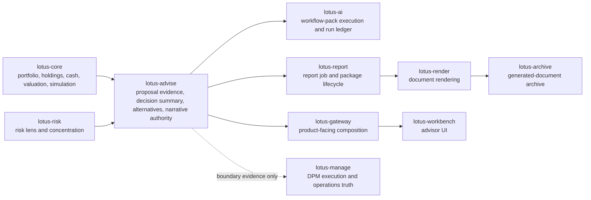

# RFC-0023 Slice 0: Critical Review, Source Map, and Product-Gap Allocation

| Metadata | Details |
| --- | --- |
| **RFC** | RFC-0023: Grounded Advisory AI Narrative and Client-Ready Proposal Commentary |
| **Slice** | 0 - critical review, source map, and product-gap allocation |
| **Status** | IMPLEMENTED - SOURCE-MAP AND SCOPE-GATE ONLY |
| **Implemented Date** | 2026-05-22 |
| **Owner** | `lotus-advise` |
| **Implementation Branch** | `rfc0023-slice0-source-map` |
| **Capability Posture** | This slice does not implement proposal narrative generation. It fixes implementation scope, source authority, downstream ownership, and non-claiming documentation posture before Slice 1 code work. |

## Decision

RFC-0023 implementation will start with an advisor-review narrative over deterministic proposal
evidence only. Client-draft and client-ready wording remain blocked until the policy, disclosure,
review, report, render, archive, Gateway, Workbench, and live proof gates in later slices are
implemented and validated.

The current implemented AI seam in `lotus-advise` is workspace rationale through
`workspace_rationale.pack@v1`. That seam is not a proposal narrative implementation and must not be
described as client-ready commentary. Slice 1 must create a distinct proposal narrative domain
boundary instead of extending UI copy, report copy, or workspace rationale semantics ad hoc.

## Current Implementation Truth

| Capability | Current source | Slice 0 classification |
| --- | --- | --- |
| Proposal simulation | `src/core/advisory/proposal_engine.py`, proposal routes, and lifecycle tests | Source authority for before/after proposal facts. |
| Proposal artifact | `src/core/advisory/artifact.py` | Deterministic evidence container that can later carry narrative inputs and approved narrative refs. |
| Decision summary | `src/core/advisory/decision_summary.py` | Backend-owned decision, blocker, approval, confidence, and next-action source. |
| Proposal alternatives | `src/core/advisory/alternatives_projection.py` | Backend-owned alternative ranking and comparison source. |
| Workspace rationale | `src/api/services/workspace_ai_service.py` and `src/integrations/lotus_ai/rationale.py` | Supported AI seam for workspace explanation only; not proposal narrative. |
| Capability publication | `src/api/capabilities/service.py` and `GET /platform/capabilities` | Must advertise proposal narrative only after implementation-backed capability exists. |
| Reporting handoff | proposal delivery and report-request routes | Current seam can request/report advisory evidence, but does not produce client-ready narrative artifacts. |
| Execution handoff/status | proposal execution handoff/status routes | Boundary evidence only; downstream execution truth remains outside `lotus-advise`. |

## Source Authority Matrix

| Narrative claim family | Authoritative source | RFC-0023 handling |
| --- | --- | --- |
| Portfolio identity, positions, cash, valuation, allocation, FX, and simulation state | `lotus-core` and canonical simulation evidence consumed by `lotus-advise` | Narrative may cite only fields present in the grounding packet. Missing or degraded source data must surface as a blocker. |
| Risk lens and concentration context | `lotus-risk` risk-lens evidence consumed by `lotus-advise` | Narrative may describe risk only from returned source evidence; absent risk lens remains `NOT_AVAILABLE`. |
| Recommendation status, blockers, approval requirements, confidence, and next action | `lotus-advise` decision summary | AI must not calculate or override these values. |
| Alternative ranking and comparison | `lotus-advise` alternatives projection over canonical simulation/risk evidence | AI may explain selected comparisons but must not generate alternatives or rankings. |
| Suitability, best-interest, product eligibility, costs, fees, conflicts, and disclosures | Existing advisory evidence where present; full enterprise policy packs remain RFC-0025/RFC-0015/RFC-0016 scope | Client-draft/client-ready sections are blocked until policy/disclosure evidence exists. |
| Report, render, archive, and client-delivery artifact state | `lotus-report`, `lotus-render`, and `lotus-archive` | Later RFC-0023 slices may hand approved narrative into these services; `lotus-advise` must not claim document lifecycle ownership. |
| Product-facing composition and UI state | `lotus-gateway` and `lotus-workbench` | Downstream surfaces must consume backend-owned narrative state and must not generate proposal text locally. |
| DPM execution, campaigns, action registers, outcome reviews, and operations workflow | `lotus-manage` | Advisory/DPM handoff narrative may explain boundary evidence only; DPM truth remains manage-owned. |
| AI workflow execution, model posture, run ledger, supportability findings, and guardrail telemetry | `lotus-ai` | Proposal narrative must use a bounded workflow-pack or adapter seam with explicit caller, pack, lineage, and supportability evidence. |

## Product-Gap Allocation

| Gap | Slice 0 decision | Owning implementation path |
| --- | --- | --- |
| Advisor-review proposal narrative | Implement next as the first supported narrative target. | RFC-0023 Slice 1 in `lotus-advise`, with a bounded `lotus-ai` adapter or deterministic degraded state. |
| Grounding packet contract | Implement before any generated text is promoted. | RFC-0023 Slice 1 in `lotus-advise`; source refs must include proposal, artifact, decision summary, alternatives, risk lens, lifecycle, and supportability evidence. |
| Unsupported-claim and evidence-ref guardrails | Implement with tests before AI output is accepted. | RFC-0023 Slice 1 or Slice 2, depending on the `lotus-ai` workflow-pack boundary. |
| Persisted narrative versions, replay, and review actions | Required before any non-transient narrative is product-supported. | RFC-0023 later slice in `lotus-advise`; may need persistence migration and OpenAPI examples. |
| Client-draft and client-ready narrative | Blocked until policy, disclosure, review, report, render, archive, Gateway, and Workbench proof exists. | RFC-0023 later slices plus RFC-0024, RFC-0025, RFC-0028 consumers. |
| Advisor proposal memo | Do not implement in RFC-0023 except reusable narrative inputs. | RFC-0024 owns full memo and evidence pack. |
| Enterprise suitability and best-interest packs | Do not fake policy/disclosure evidence inside narrative. | RFC-0025, RFC-0015, and RFC-0016. |
| Cockpit workflow and operating worklists | Do not build broad cockpit behavior in RFC-0023. | RFC-0026 consumes narrative review state after backend support exists. |
| Broad AI copilot | Do not add chat or free-form prompt behavior. | RFC-0027 consumes governed narrative lineage and safety controls. |
| Bank demo journey | Do not demo unsupported client-ready commentary. | RFC-0028 after implementation, live proof, and wiki truth are merged. |

## Cross-Repository Source Map

## First Supported Narrative Scope

The first implementation slice that adds narrative capability should implement the smallest
production-grade narrative scope:

1. a proposal-narrative domain module in `lotus-advise`,
2. deterministic grounding packet construction from existing proposal evidence,
3. advisor-review output target only,
4. explicit source refs and missing-evidence blockers,
5. bounded degraded state when `lotus-ai` or required source evidence is unavailable,
6. OpenAPI field descriptions and examples,
7. meaningful unit and API tests proving AI does not own decisions, suitability, risk, rankings, or source metrics,
8. capability publication that remains conservative until the route is implemented and tested.

Client-draft, client-ready, report/archive, Gateway, Workbench, and DPM handoff proof must remain
later slices, each closed only after implementation-backed validation.

## No WTBD Execution Decision

No new WTBD entries are allowed for RFC-0023. Any additional upstream, downstream, platform, UI,
report, AI, documentation, security, data-product, or operational work discovered during RFC-0023
implementation must be added to this RFC's slice plan, implemented in the owning repository, marked
blocked with an owner and reason, or removed from the product claim.

## Documentation and Feature-Truth Guard

README, wiki, and demo material may say that RFC-0023 Slice 0 is complete as a planning and
source-authority gate. They must not say proposal narrative, client-ready commentary, or generated
proposal text is currently supported until the implementing slices are merged, validated, and
published with `/platform/capabilities` support posture.

## Slice 0 Acceptance Evidence

| Gate | Evidence |
| --- | --- |
| Stranded-truth reconciliation | `git fetch origin --prune` and `git branch -r --no-merged origin/main` returned no governance-bearing unmerged branches before Slice 0 implementation. |
| Current-state review | Reviewed `lotus-advise` proposal, artifact, decision summary, alternatives, workspace rationale, capability, report-handoff, execution-handoff, docs, wiki, and tests. |
| Cross-repo classification | Scanned `lotus-ai`, `lotus-gateway`, `lotus-workbench`, `lotus-report`, `lotus-archive`, and `lotus-manage` for narrative/proposal ownership signals; no existing proposal-narrative implementation was found. |
| Non-claiming documentation | Wiki supported-features truth remains explicit that workspace rationale is supported and broader proposal narrative remains planned RFC-0023 work. |
| Next-slice readiness | Slice 1 has a bounded advisor-review target and explicit source-authority rules. |
