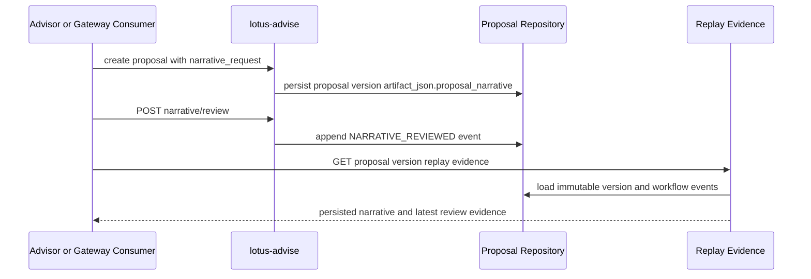

# RFC-0023 Slice 8: Review Workflow, Persistence, Idempotency, Artifact, and Replay

| Metadata | Details |
| --- | --- |
| RFC | RFC-0023 Grounded Advisory AI Narrative and Client-Ready Proposal Commentary |
| Slice | Slice 8 |
| Status | IMPLEMENTED - REVIEW WORKFLOW, PERSISTENCE, IDEMPOTENCY, AND REPLAY BASELINE |
| Implemented On | 2026-05-22 |
| Primary Repository | `lotus-advise` |
| Capability Posture | Adds version-scoped narrative review actions and exact replay evidence for proposal versions that already contain `proposal_narrative`. It does not promote client-ready commentary, report/render/archive inclusion, data-product telemetry, Gateway, or Workbench consumption. |

## Outcome

Slice 8 turns the Slice 5-7 artifact-path narrative from a transient response field into proposal-version evidence that can be reviewed and replayed without regenerating text.

The implemented baseline:

1. persists `proposal_narrative` inside immutable `ProposalVersionRecord.artifact_json` when a lifecycle create/version request includes `narrative_request`,
2. records append-only `NARRATIVE_REVIEWED` workflow events for approve, reject, and regeneration-request decisions,
3. stores review actor, review reason, client-ready release request posture, source narrative hash, replacement narrative id, and idempotency evidence,
4. exposes `POST /advisory/proposals/{proposal_id}/versions/{version_no}/narrative/review`,
5. returns persisted narrative and latest narrative review evidence from proposal-version and async replay responses,
6. treats duplicate review requests with the same idempotency key and identical payload as replay, and rejects payload drift with `IDEMPOTENCY_KEY_CONFLICT`.

## Supported API Shape

```http
POST /advisory/proposals/{proposal_id}/versions/{version_no}/narrative/review
Idempotency-Key: proposal-narrative-review-idem-001
```

```json
{
  "action": "APPROVE",
  "reviewed_by": "compliance_reviewer_001",
  "reason": "Narrative is evidence-grounded and suitable for advisor use.",
  "client_ready_release_requested": false
}
```

Response evidence includes:

1. proposal summary after the review event is recorded,
2. `ProposalNarrativeReviewRecord`,
3. the latest workflow event with `event_type = NARRATIVE_REVIEWED`.

## Replay Contract

Replay responses now include:

1. `evidence.proposal_narrative` - the exact persisted narrative JSON from the immutable proposal version,
2. `evidence.proposal_narrative_review` - the latest review projection for that version and narrative id, or `null` when no review exists.

Replay does not call `lotus-ai` or rebuild narrative text. The review record includes `source_narrative_hash`, so audit and support tooling can compare the reviewed payload with the replayed payload.



## Client-Ready Boundary

Slice 8 adds review evidence, not client-ready publication.

Client-ready release remains blocked unless all of these are true:

1. the review action is `APPROVE`,
2. the persisted narrative status is `READY_FOR_ADVISOR_REVIEW`,
3. the persisted narrative is still in draft review state,
4. narrative policy has no client-ready blockers,
5. guardrails contain no `FAIL` result.

Current artifact-path narratives still carry known limitations such as report/archive lineage and downstream client artifact readiness. Therefore this slice can prove review and replay, but it must not be sold as client-ready proposal commentary.

## Implementation Evidence

| Requirement | Evidence |
| --- | --- |
| Persist narrative with proposal versions | `ProposalVersionRecord.artifact_json["proposal_narrative"]` produced by lifecycle create/version requests with `narrative_request`. |
| Review actions | `ProposalNarrativeReviewRequest`, `ProposalNarrativeReviewRecord`, `NARRATIVE_REVIEWED`, and `ProposalWorkflowService.record_narrative_review`. |
| Idempotency | `src/core/proposals/narrative_review.py` hashes proposal id, version, narrative id, and payload; matching keys replay, drift conflicts. |
| Exact replay | `src/core/replay/service.py` returns persisted narrative and latest review evidence without model calls. |
| OpenAPI quality | `tests/unit/advisory/contracts/test_contract_openapi_lifecycle_docs.py` pins request/response docs and route shape. |
| Behavioral tests | `tests/unit/advisory/engine/test_engine_proposal_workflow_service.py` and `tests/unit/advisory/api/test_api_advisory_proposal_lifecycle.py` cover review replay, conflict, client-ready blocking, and persisted replay evidence. |
| Wiki truth | `wiki/Supported-Features.md` and `wiki/RFC-Index.md` distinguish supported review/replay baseline from still-gated client-ready and downstream artifact claims. |

## Non-Promoted Behavior

The following remain explicitly out of scope until later RFC-0023 slices or dependent RFCs implement and prove them:

1. standalone narrative read/regeneration endpoints outside proposal-version lifecycle,
2. mutable narrative text updates,
3. compliance-review or client-draft narrative surfaces,
4. client-ready proposal commentary,
5. report/render/archive artifact inclusion,
6. Gateway or Workbench rendering,
7. `/platform/capabilities` narrative feature promotion,
8. narrative data-product or trust-telemetry promotion.

## Acceptance Gate

1. Persistence and replay tests prove exact persisted narrative replay.
2. Review tests prove client-ready status requires approval and clear policy/guardrails.
3. API tests prove only review-approved and source-hashed narrative evidence can be replayed as reviewed evidence.
4. Idempotency tests prove duplicate review requests replay and payload drift conflicts.
5. Documentation contract tests pin the RFC, README index, and wiki boundary.

## Next Slice

RFC-0023 may proceed to Slice 9 after this slice is merged and validated. Slice 9 should enrich narrative sections from RFC-0021 decision summary, RFC-0022 alternatives, approval posture, material-change evidence, risk limitations, and suitability limitations without duplicating source business logic.
