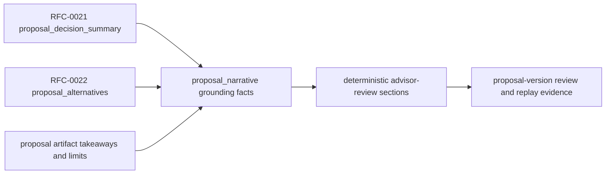

# RFC-0023 Slice 9: Alternatives, Decision Summary, and Policy Evidence Integration

| Metadata | Details |
| --- | --- |
| RFC | RFC-0023 Grounded Advisory AI Narrative and Client-Ready Proposal Commentary |
| Slice | Slice 9 |
| Status | IMPLEMENTED - DECISION SUMMARY, ALTERNATIVES, APPROVAL, AND LIMITATION NARRATIVE INTEGRATION |
| Implemented On | 2026-05-22 |
| Primary Repository | `lotus-advise` |
| Capability Posture | Strengthens existing artifact-path and proposal-version advisor-review narrative sections so they explain decision-summary posture, blockers, approvals, material changes, alternatives tradeoffs, and risk/suitability limitations from persisted backend evidence. It does not promote client-ready commentary, report/render/archive inclusion, Gateway, Workbench, data-product telemetry, or `/platform/capabilities` narrative support. |

## Outcome

Slice 9 enriches deterministic RFC-0023 narrative rendering without adding a new source of truth.
The narrative still consumes the existing `proposal_narrative` grounding packet and source refs, but
its sections now use the RFC-0021 decision summary and RFC-0022 alternatives evidence directly.

The implemented baseline:

1. expands grounding facts with decision confidence, primary summary, approval requirement counts,
   blocking approval counts, approval summaries, material-change summaries, missing-evidence
   summaries, selected-alternative identity, selected-alternative status, selected-objective,
   tradeoff summaries, improvement summaries, deterioration summaries, and rejected-candidate
   summaries,
2. makes blocked proposals lead with remediation before any benefit-oriented wording,
3. makes insufficient-evidence proposals state that suitability pass and client-ready
   recommendation posture cannot be asserted,
4. renders selected-alternative commentary from persisted alternatives comparison and tradeoff
   evidence,
5. renders approval and next-step commentary from decision-summary action and approval requirement
   evidence rather than only from the coarse workflow gate,
6. renders material-change commentary from persisted material-change summaries and existing artifact
   takeaways.

## Evidence Flow

The AI-assisted draft path continues to inherit deterministic source references and limitation refs
from these rendered sections. `lotus-ai` still cannot create decision, suitability, approval,
material-change, or alternative facts.

## Section Behavior

| Section | Slice 9 behavior |
| --- | --- |
| `EXECUTIVE_SUMMARY` | Leads blocked proposals with remediation, leads insufficient-evidence proposals with evidence limitations, and otherwise summarizes decision status, primary summary, and recommended action. |
| `RECOMMENDATION_RATIONALE` | Includes decision reason and confidence in addition to objectives and trade/FX counts. |
| `SUITABILITY_AND_MANDATE` | States suitability scanner evidence posture without implying client-ready approval. |
| `MATERIAL_CHANGES` | Includes material-change count and persisted material-change summaries before artifact takeaways. |
| `ALTERNATIVES_CONSIDERED` | Includes feasible/rejected counts, selected alternative, selected objective, selected status, tradeoff summary, improvements, deteriorations, and rejected-candidate evidence when available. |
| `APPROVALS_AND_NEXT_STEPS` | Includes workflow gate, decision-summary action, active approval/remediation count, blocking count, and approval/remediation summaries. |

## Implementation Evidence

| Requirement | Evidence |
| --- | --- |
| Decision-summary sections | `src/core/advisory/narrative.py` consumes `proposal_decision_summary` fields already persisted on the artifact. |
| Blockers before benefits | `test_advisory_proposal_narrative_leads_blocked_proposal_with_remediation` proves blocked narrative begins with remediation. |
| Insufficient evidence limitation | `test_advisory_proposal_narrative_does_not_imply_suitability_pass_with_insufficient_evidence` proves the narrative does not imply suitability pass or client-ready posture when evidence is insufficient. |
| Alternatives tradeoff narrative | `test_advisory_proposal_narrative_uses_selected_alternative_tradeoff_evidence` proves selected-alternative tradeoff and comparison evidence feed the alternatives section. |
| Approval requirements retained | Blocked-proposal tests prove approval/remediation requirements and blocking counts are present in `APPROVALS_AND_NEXT_STEPS`. |
| Grounding contract | `test_advisory_proposal_artifact_can_include_deterministic_advisor_narrative` pins the enriched grounding fact keys. |

## Non-Promoted Behavior

The following remain explicitly out of scope until later RFC-0023 slices or dependent RFCs implement
and prove them:

1. standalone narrative read/regeneration endpoints outside proposal-version lifecycle,
2. compliance-review, client-draft, or client-ready narrative states,
3. report/render/archive artifact inclusion,
4. Gateway or Workbench rendering,
5. `/platform/capabilities` narrative feature promotion,
6. narrative data-product or trust-telemetry promotion,
7. sales/demo-safe narrative proof.

## Acceptance Gate

1. Blocked proposal narrative highlights blockers before benefits.
2. Insufficient evidence narrative does not imply suitability pass.
3. Alternatives narrative explains tradeoffs using backend comparison evidence.
4. Approval requirements are not omitted.
5. Documentation and wiki source distinguish enriched advisor-review narrative from still-gated
   client-ready and downstream artifact claims.

## Next Slice

RFC-0023 may proceed to Slice 10 after this slice is merged and validated. Slice 10 should certify
the canonical narrative API/OpenAPI shape, route inventory, examples, and governance controls before
any downstream consumer promotes broader narrative use.
