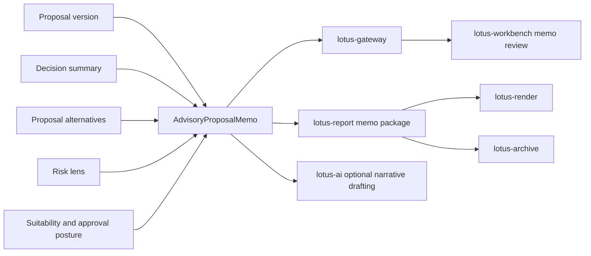

# RFC-0024: Advisor Proposal Memo and Evidence Pack

| Metadata | Details |
| --- | --- |
| **Status** | DRAFT |
| **Created** | 2026-05-22 |
| **Owner** | `lotus-advise` |
| **Business Sponsor Persona** | relationship manager, investment advisor, advisory desk head, compliance reviewer, operations support, audit, sales/pre-sales |
| **Depends On** | RFC-0006, RFC-0011, RFC-0013, RFC-0019, RFC-0020, RFC-0021, RFC-0022, RFC-0023 |
| **Downstream Realization Depends On** | `lotus-gateway`, `lotus-workbench`, `lotus-report`, `lotus-render`, and `lotus-archive` product-surface and document-delivery work after the backend contract is stable |
| **Doc Location** | `docs/rfcs/RFC-0024-advisor-proposal-memo-and-evidence-pack.md` |

---

## 0. Executive Summary

RFC-0024 defines the `AdvisoryProposalMemo`: a durable, reviewable advisory evidence product that
turns a proposal, decision summary, alternatives comparison, risk lens, suitability posture,
approval trail, and downstream readiness into a business-readable memo package.

The memo is not a generic report and not an AI free-text feature. It is a governed advisory
decision artifact for:

1. advisor preparation,
2. client conversation support,
3. compliance review,
4. investment committee or desk approval,
5. operations handoff explanation,
6. audit and replay,
7. sales and pre-sales demonstration.

This RFC is deliberately focused on a bank-buyable product outcome: a private bank should be able to
look at a proposal and understand why the recommendation exists, what evidence supports it, what
alternatives were considered, what suitability and approval issues remain, and what downstream
actions are ready or blocked.

The initial implementation belongs in `lotus-advise`. Rendering, external archive retention,
product UI, and gateway composition remain owned by their respective applications. The advisory
backend must still provide the canonical memo evidence and never rely on the UI to reconstruct
proposal truth.

---

## 1. Problem Statement

Current `lotus-advise` proposal surfaces are materially stronger than an MVP. They expose proposal
simulation, artifact generation, lifecycle persistence, approval posture, decision summaries,
proposal alternatives, workspace handoff, execution-boundary evidence, and supportability state.

The remaining product gap is human consumption. A banker, reviewer, or buyer should not need to
inspect raw JSON across several endpoints to understand the advisory story.

The product needs one memo package that answers:

1. what is being recommended,
2. why the recommendation is suitable or not suitable,
3. what material portfolio impact is expected,
4. which alternatives were considered and rejected,
5. what evidence was available, degraded, or missing,
6. what approvals, consents, and disclosures are required,
7. what downstream report, execution, and archive posture exists,
8. how the memo can be replayed for audit.

Without this capability, `lotus-advise` can look technically competent but not bank-buyable. Banks
buy controls, evidence, repeatability, and human workflow, not only simulation endpoints.

## 2. Business Outcomes

RFC-0024 targets these outcomes:

1. **Improve advisor productivity**
   reduce manual preparation time for client meetings and internal reviews.
2. **Increase compliance confidence**
   expose suitability, approvals, disclosures, lineage, and missing evidence in one artifact.
3. **Strengthen advisory consistency**
   make proposal explanations repeatable across bankers, desks, jurisdictions, and channels.
4. **Improve client conversation quality**
   give advisors a clear, evidence-backed narrative without letting unapproved text become final
   advice.
5. **Create a premium demo asset**
   show a full advisory evidence story with concrete source refs, reason codes, decision timeline,
   alternatives, and readiness posture.
6. **Reduce support and audit cost**
   make a proposal diagnosable from a single memo id and immutable evidence refs.

## 3. Current Baseline

Implementation-backed foundations already available:

1. `POST /advisory/proposals/simulate` with canonical proposal execution,
2. `POST /advisory/proposals/artifact` with deterministic artifact posture,
3. persisted proposal lifecycle and immutable versions,
4. approval and consent workflow history,
5. advisory workspace drafting and handoff,
6. backend-owned `proposal_decision_summary`,
7. backend-owned `proposal_alternatives`,
8. canonical allocation and risk-lens convergence,
9. execution handoff/status boundary evidence,
10. `GET /platform/capabilities` supportability posture,
11. bounded workspace rationale seam through `lotus-ai`.

Known gaps:

1. no first-class memo aggregate,
2. no memo section model or section readiness taxonomy,
3. no memo-level hash, version, replay, or immutable evidence manifest,
4. no audience-aware memo projection for advisor, client, compliance, and operations views,
5. no typed handoff package for report/render/archive,
6. no backend-owned memo API contract for Gateway/Workbench to consume,
7. no supported-feature claim for advisor proposal memos.

## 4. Product Vision

One-sentence vision:

`lotus-advise` produces an advisor-ready proposal memo that explains the recommendation, evidence,
risks, suitability posture, alternatives, approvals, and downstream readiness with replayable
lineage.

Product promises:

1. **Evidence-first:** every material memo claim maps to proposal evidence or an explicit missing
   evidence reason.
2. **Audience-aware:** advisor, client, compliance, operations, and audit projections can differ
   without changing source truth.
3. **Replayable:** a memo can be reproduced from immutable proposal and policy versions.
4. **Reviewable:** memo sections carry review state, blockers, and approval dependencies.
5. **Safe for AI:** RFC-0023 narrative can enrich language, but deterministic memo evidence remains
   authoritative.
6. **Safe for reports:** report/render/archive services receive a typed evidence package, not raw
   free-form payloads.

Non-promises:

1. `lotus-advise` does not render PDFs directly.
2. `lotus-advise` does not become an external archive.
3. `lotus-advise` does not create final client communication without review state.
4. `lotus-advise` does not invent risk, performance, suitability, or product-eligibility facts.
5. `lotus-advise` does not own downstream execution system-of-record truth.

## 5. Domain Vocabulary

| Concept | Preferred Term | Avoid |
| --- | --- | --- |
| Recommendation artifact | advisor proposal memo | generic report |
| Source-backed collection of facts | evidence pack | JSON dump |
| Reviewable memo part | memo section | text block |
| Client-safe version | client-facing projection | final advice if unapproved |
| Compliance view | compliance appendix | hidden admin data |
| Evidence linkage | source ref, lineage ref, claim ref | copied value with no origin |
| Readiness | READY, PENDING_REVIEW, BLOCKED | partial success |
| Reviewer state | review posture, approval dependency | manual comment only |
| Recommendation explanation | advisory rationale | AI story |
| Downstream handoff | report package, archive package, execution handoff | external side effect |

## 6. Target Capability

The `AdvisoryProposalMemo` aggregate contains:

1. memo identity and proposal identity,
2. proposal version and artifact refs,
3. memo audience and projection policy,
4. section list with readiness state,
5. proposal decision summary snapshot,
6. selected recommendation and intended client action,
7. alternatives comparison summary,
8. suitability and best-interest posture,
9. risk, allocation, cash, FX, and concentration lens summary,
10. approval, consent, and disclosure posture,
11. execution, report, and archive readiness posture,
12. source-authority and lineage manifest,
13. reviewer notes and decision timeline refs,
14. redaction policy,
15. hash and replay metadata.

### 6.1 Memo Section Model

Initial sections:

1. `EXECUTIVE_SUMMARY`
2. `CLIENT_CONTEXT`
3. `RECOMMENDATION`
4. `PORTFOLIO_IMPACT`
5. `RISK_AND_SUITABILITY`
6. `ALTERNATIVES_CONSIDERED`
7. `APPROVALS_AND_CONSENTS`
8. `DISCLOSURES`
9. `DOWNSTREAM_READINESS`
10. `EVIDENCE_APPENDIX`
11. `COMPLIANCE_APPENDIX`
12. `OPERATIONS_APPENDIX`

Each section must expose:

1. `section_id`,
2. `status` using `READY`, `PENDING_REVIEW`, or `BLOCKED`,
3. `summary`,
4. `evidence_refs`,
5. `missing_evidence`,
6. `reason_codes`,
7. `review_required`,
8. `last_material_input_hash`.

### 6.2 Audience Projections

The memo should support these projections:

1. `ADVISOR_PREPARATION`
2. `CLIENT_REVIEW_DRAFT`
3. `COMPLIANCE_REVIEW`
4. `INVESTMENT_DESK_REVIEW`
5. `OPERATIONS_HANDOFF`
6. `AUDIT_EVIDENCE`

Projection rules:

1. projections can hide restricted internal fields,
2. projections cannot alter the underlying memo evidence,
3. client-facing projections must not be final unless the approval posture permits it,
4. compliance and audit projections must retain missing/degraded evidence.

## 7. Architecture Direction

### 7.1 Ownership Model

`lotus-advise` owns:

1. memo aggregate and section model,
2. memo evidence assembly,
3. proposal-to-memo projection,
4. memo persistence, replay, hash, and lineage,
5. memo API contracts and OpenAPI documentation,
6. report/archive handoff package shape,
7. memo readiness and supportability diagnostics.

`lotus-core` remains authoritative for:

1. portfolio state,
2. holdings, cash, prices, FX, valuation,
3. simulation input and output truth.

`lotus-risk` remains authoritative for:

1. risk metrics,
2. concentration lenses,
3. risk lineage and degraded risk posture.

`lotus-ai` owns:

1. optional RFC-0023 narrative drafting,
2. workflow-pack execution,
3. model provider safety and run telemetry.

`lotus-report`, `lotus-render`, and `lotus-archive` own:

1. document generation,
2. deterministic rendering,
3. durable archive and retention after handoff.

`lotus-gateway` and `lotus-workbench` own:

1. product-facing composition,
2. advisor cockpit or memo review UI,
3. browser validation and accessibility.

### 7.2 Product Flow

Rules:

1. Gateway must not rebuild memo sections from raw proposal data.
2. Workbench must not generate memo facts in the browser.
3. AI narrative must consume memo evidence and return draft language only.
4. Report/render/archive handoffs must preserve memo id, proposal version, and evidence refs.

## 8. Proposed API Direction

This RFC extends the existing advisory route family. It does not introduce public `/v2` routes.

Proposed endpoints:

1. `POST /advisory/proposals/{proposal_id}/versions/{version_id}/memos`
   create a memo from an immutable proposal version.
2. `GET /advisory/proposals/{proposal_id}/memos/{memo_id}`
   retrieve memo evidence and selected projection metadata.
3. `GET /advisory/proposals/{proposal_id}/memos/{memo_id}/projections/{audience}`
   retrieve an audience-specific projection.
4. `POST /advisory/proposals/{proposal_id}/memos/{memo_id}/review`
   record memo review, approval, rejection, or requested changes.
5. `POST /advisory/proposals/{proposal_id}/memos/{memo_id}/report-package`
   build a typed report handoff package without rendering the document locally.

OpenAPI requirements:

1. every endpoint has summary, description, tags, response descriptions, and examples,
2. examples include `READY`, `PENDING_REVIEW`, and `BLOCKED` memo states,
3. field descriptions explain audience projection, evidence refs, and redaction posture,
4. error examples include proposal not found, version not immutable, missing evidence, and
   unsupported audience.

## 9. Persistence, Replay, and Lineage

The memo must be persisted as an immutable evidence product once finalized for a proposal version.

Required fields:

1. `memo_id`,
2. `proposal_id`,
3. `proposal_version_id`,
4. `artifact_id` when available,
5. `memo_status`,
6. `audience_policy_version`,
7. `section_hashes`,
8. `input_evidence_hash`,
9. `source_refs`,
10. `created_by`,
11. `created_at`,
12. `review_events`,
13. `redaction_policy`,
14. `replay_state`.

Replay rules:

1. replay must use the same proposal version, policy version, and memo builder version,
2. missing upstream services must not change historical finalized memo truth,
3. regenerated drafts must produce a new memo version or a new draft state, not mutate finalized
   evidence,
4. reviewer events are append-only.

## 10. Security, Compliance, and Data Handling

Controls:

1. no raw sensitive payloads in logs, metrics, or AI run records,
2. redaction policy for client-facing projections,
3. role-aware projection eligibility,
4. audit events for memo creation, review, export package generation, and regeneration,
5. correlation id propagation across memo, report, AI, gateway, and workbench calls,
6. idempotency key support for memo creation and report package creation,
7. no final client communication state unless human review rules allow it.

Forbidden behavior:

1. inventing missing suitability evidence,
2. hiding `BLOCKED` or `PENDING_REVIEW` sections from compliance/audit projections,
3. allowing AI output to change memo status,
4. storing full prompts or raw provider output in local logs,
5. using portfolio, client, security, or proposal ids as metric labels.

## 11. Observability and Supportability

Metrics should be bounded and low-cardinality:

1. memo creation count by status and audience,
2. section readiness count by section type and status,
3. memo build duration histogram,
4. report package creation count by status,
5. replay success/failure count by reason code,
6. AI narrative availability count when RFC-0023 integration is enabled.

Structured logs should include:

1. correlation id,
2. memo id,
3. proposal id hash or safe internal ref,
4. proposal version id,
5. memo status,
6. reason codes,
7. upstream readiness states,
8. no raw client or holding payloads.

Support diagnostics should expose:

1. memo builder version,
2. input evidence hash,
3. source refs,
4. blocked sections,
5. degraded dependency basis,
6. replay eligibility.

## 12. Test Strategy

Unit tests:

1. section builders map proposal evidence into memo sections correctly,
2. audience projection redacts and retains fields according to policy,
3. missing evidence creates `PENDING_REVIEW` or `BLOCKED` state with reason codes,
4. memo hash changes when material evidence changes,
5. AI narrative cannot alter deterministic status or evidence.

Contract tests:

1. OpenAPI includes descriptions and examples for all memo endpoints,
2. response schemas expose source refs, section status, and audience projection metadata,
3. no unsupported status values are introduced,
4. idempotency headers and correlation headers are documented.

Integration tests:

1. persisted proposal version to memo creation,
2. memo retrieval and replay,
3. review event append-only behavior,
4. report package handoff package generation,
5. degraded risk or AI dependency behavior.

Live proof:

1. generate a memo for a canonical proposal,
2. capture request/response artifacts under `output/`,
3. verify every section status, evidence ref, reason code, and hash,
4. verify `/platform/capabilities` advertises memo support only after implementation is real.

## 13. Implementation Slices

### Slice 0 - Current-State and Source Map

Outcome:

1. map current proposal, artifact, decision summary, alternatives, lifecycle, and supportability
   fields into a memo source-authority matrix.

Acceptance gate:

1. document source refs, missing fields, ownership, and downstream dependencies,
2. record any upstream/downstream gaps in `docs/rfcs/WTBD.md`.

### Slice 1 - Platform Automation and Scaffolding Decision

Outcome:

1. determine whether existing OpenAPI, idempotency, correlation, health, and docs gates cover memo
   endpoints.

Acceptance gate:

1. either implement reusable platform/repo scaffolding improvements or record a deliberate no-change
   decision with evidence.

### Slice 2 - Cleanup and Structure

Outcome:

1. create a dedicated memo module boundary before adding behavior.

Acceptance gate:

1. remove dead or duplicate artifact/memo-like helper paths,
2. keep controllers thin and move memo assembly into services/domain modules.

### Slice 3 - Domain Model and Pure Memo Builder

Outcome:

1. implement `AdvisoryProposalMemo`, section, projection, readiness, and evidence manifest models.

Acceptance gate:

1. unit tests prove deterministic memo assembly from stored proposal evidence.

### Slice 4 - Persistence, Replay, and Idempotency

Outcome:

1. persist memo drafts/finalized versions with append-only review events and idempotent create.

Acceptance gate:

1. integration tests prove duplicate create requests do not create duplicate finalized memos.

### Slice 5 - Certified APIs and OpenAPI

Outcome:

1. expose memo create/read/projection/review/report-package endpoints under `/advisory/proposals`.

Acceptance gate:

1. OpenAPI gate passes with descriptions, examples, errors, and header documentation.

### Slice 6 - Report, AI, Gateway, and Workbench Handoff Contracts

Outcome:

1. emit typed packages for `lotus-report` and RFC-0023 AI narrative; record Gateway/Workbench
   product realization WTBDs.

Acceptance gate:

1. no UI/report/AI supported claim is made without owning-repo implementation evidence.

### Slice 7 - Implementation Proof

Outcome:

1. produce canonical and degraded memo evidence captures.

Acceptance gate:

1. evidence includes requests, responses, `/platform/capabilities`, readiness, and critical review
   notes.

### Slice 8 - Second-Last Hardening and Review

Outcome:

1. review API naming, domain vocabulary, privacy, logs, metrics, tests, and failure behavior.

Acceptance gate:

1. no high-cardinality metrics, raw sensitive logs, superficial tests, or stale docs remain.

### Slice 9 - Final Closure

Outcome:

1. update README, wiki, supported features, RFC status, context, and branch hygiene.

Acceptance gate:

1. implementation and documentation are merged to `main`, required CI is green, and wiki source is
   publishable.

## 14. Supported-Features Ledger

| Capability | Initial RFC state | Promotion rule |
| --- | --- | --- |
| Advisor proposal memo aggregate | Proposed | Promote only after persisted memo create/read/replay APIs pass unit, integration, OpenAPI, and live proof gates. |
| Audience projections | Proposed | Promote only after redaction/review policy tests and OpenAPI examples cover every projection. |
| Compliance appendix | Proposed | Promote only after blocked/missing evidence remains visible in compliance/audit projections. |
| Report package handoff | Proposed | Promote only after typed package generation is implemented and downstream report WTBD is recorded or completed. |
| AI narrative enrichment | Gated by RFC-0023 | Promote only after `lotus-ai` workflow-pack execution and unsupported-claim guardrails are proven. |
| Workbench memo review | Downstream WTBD | Promote only in Workbench/Gateway after implementation-backed product-surface evidence exists. |

## 15. Acceptance Criteria

This RFC can be considered implemented only when:

1. memo domain models and builders exist in a dedicated module boundary,
2. memo APIs are certified through OpenAPI and vocabulary gates,
3. memo creation is idempotent and replayable,
4. finalized memo evidence is immutable and hash-backed,
5. audience projections enforce redaction and review posture,
6. compliance and audit projections expose missing/degraded evidence,
7. report and AI handoff packages preserve source refs,
8. Gateway/Workbench/report/archive WTBDs are complete or explicitly deferred,
9. unit, contract, integration, and live proof evidence exist,
10. README, wiki, supported-features, and RFC status reflect only implemented truth.

## 16. Risks and Trade-Offs

| Risk | Mitigation |
| --- | --- |
| Memo becomes a second proposal artifact with duplicated logic | Keep memo builder as a projection over proposal evidence and reuse existing decision summary and alternatives contracts. |
| UI reconstructs memo facts | Expose backend-owned memo contract and prohibit Workbench-side fact generation. |
| Client projection leaks restricted evidence | Enforce redaction policy tests and role-aware projection eligibility. |
| AI text looks authoritative without evidence | Require RFC-0023 claim refs and keep deterministic memo status authoritative. |
| Report/render/archive scope creeps into `lotus-advise` | Emit typed handoff packages only; rendering and archive remain downstream owner work. |

## 17. Open Questions Before Implementation

1. Which audience projections are required for first-wave implementation: advisor and compliance
   only, or advisor, client draft, compliance, and audit together?
2. Should memo finalization be tied to proposal approval state or allowed as a separate reviewable
   artifact before approval?
3. Which report package schema should `lotus-report` consume for first-wave document generation?
4. What retention and legal-hold posture should apply before `lotus-archive` owns durable archive?
5. Which jurisdiction-specific disclosure policy from RFC-0015/RFC-0025 is required before
   client-facing memo projection can be promoted?
