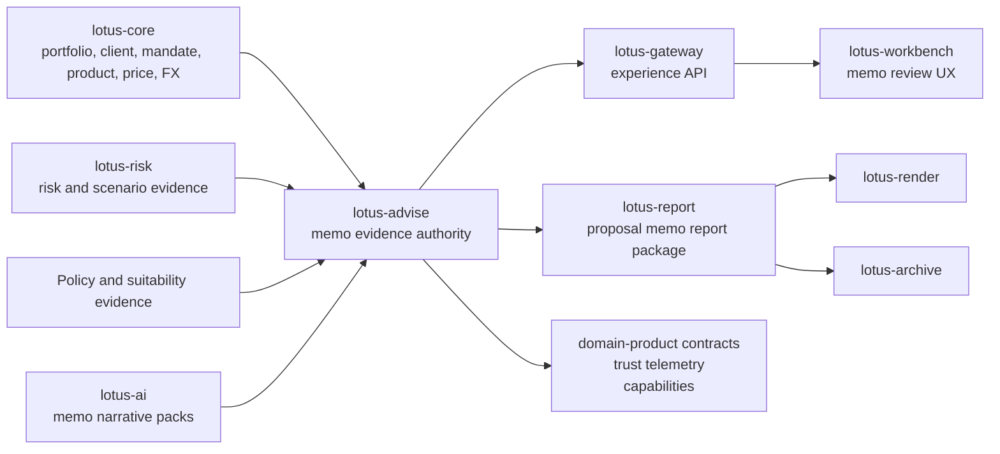

# RFC-0024: Advisor Proposal Memo and Evidence Pack

| Metadata | Details |
| --- | --- |
| **Status** | IMPLEMENTED for advisor-use proposal memo evidence; client-ready memo publication remains gated |
| **Created** | 2026-05-22 |
| **Last Tightened** | 2026-05-25 |
| **Owner** | `lotus-advise` for advisory memo authority and evidence product truth |
| **Business Sponsor Persona** | relationship manager, investment advisor, advisory desk head, compliance reviewer, investment desk reviewer, operations support, audit, sales/pre-sales |
| **Primary Business Outcome** | make every advisory proposal explainable, reviewable, replayable, documentable, and client-conversation-ready through one governed evidence product |
| **Depends On** | RFC-0006, RFC-0011, RFC-0013, RFC-0019, RFC-0020, RFC-0021, RFC-0022, RFC-0023 |
| **Cross-Repository Scope** | `lotus-advise`, `lotus-core`, `lotus-risk`, `lotus-ai`, `lotus-report`, `lotus-render`, `lotus-archive`, `lotus-gateway`, `lotus-workbench`, `lotus-platform` |
| **Compatibility Posture** | backward compatibility is not a constraint; breaking API/contract changes are allowed when they are the cleanest design, but every affected downstream consumer must be updated in this RFC before closure |
| **Tightening Branch** | `docs/rfc0024-gold-standard-tightening` |
| **Implementation Branching Rule** | implementation may continue on this branch or a follow-on RFC-0024 feature branch, but all branch names, PRs, commits, checks, and cross-repo closures must be recorded in RFC closure evidence |
| **Doc Location** | `docs/rfcs/RFC-0024-advisor-proposal-memo-and-evidence-pack.md` |

---

## Implementation Evidence Index

| Slice | Evidence | Status |
| --- | --- | --- |
| Slice 0 critical review, source map, and product-gap allocation | `docs/rfcs/RFC-0024-slice-0-critical-review-source-map-and-product-gap-allocation.md` | Implemented - source-map and scope-gate only |
| Slice 1 platform automation and scaffolding review | `docs/rfcs/RFC-0024-slice-1-platform-automation-and-scaffolding-review.md` | Implemented - reviewed; no platform change required before memo domain work |
| Slice 2 cleanup and structure | `docs/rfcs/RFC-0024-slice-2-cleanup-and-structure.md` | Implemented - report-handoff cleanup only; no memo support promoted |
| Slice 3 data product and platform hardening | `docs/rfcs/RFC-0024-slice-3-data-product-and-platform-hardening.md` | Implemented - proposed/blocked memo data product; no memo support promoted |
| Slice 4 upstream source evidence completion | `docs/rfcs/RFC-0024-slice-4-upstream-source-evidence-completion.md` | Implemented - persisted source-readiness manifest; no memo support promoted |
| Slice 5 memo domain model and pure builder | `docs/rfcs/RFC-0024-slice-5-memo-domain-model-and-pure-builder.md` | Implemented - deterministic pure memo builder; no memo API, persistence, or product support promoted |
| Slice 6 persistence, replay, idempotency, and audit | `docs/rfcs/RFC-0024-slice-6-persistence-replay-idempotency-and-audit.md` | Implemented - durable memo records, idempotency, replay metadata, and audit events; no memo API or product support promoted |
| Slice 7 certified APIs and OpenAPI | `docs/rfcs/RFC-0024-slice-7-certified-apis-and-openapi.md` | Implemented - canonical Advise memo APIs and OpenAPI; Gateway, Workbench, report/render/archive, active data-product support, and client-ready memo claims remain unpromoted |
| Slice 8 policy, fees, costs, conflicts, and disclosures | `docs/rfcs/RFC-0024-slice-8-policy-fees-costs-conflicts-and-disclosures.md` | Implemented - memo-critical suitability, product eligibility, cost/fee/tax/friction limitation, disclosure, and conflict blocker enrichment; full policy packs, report/render/archive, Gateway, Workbench, active data-product support, and client-ready memo claims remain unpromoted |
| Slice 9 report, render, and archive realization | `docs/rfcs/RFC-0024-slice-9-report-render-archive-realization.md` | Implemented - advisor-reviewed memo package handoff to `lotus-report`, deterministic render-package projection, `lotus-archive` support-safe memo metadata, and Advise memo lineage refs; Gateway, Workbench, active data-product support, AI commentary, and client-ready memo claims remain unpromoted |
| Slice 10 AI narrative and review-gated commentary | `docs/rfcs/RFC-0024-slice-10-ai-narrative-and-review-gated-commentary.md` | Implemented - review-gated advisor-use AI commentary through `proposal_memo_commentary.pack@v1`, bounded memo evidence packets, deterministic unavailable posture, and append-only AI lineage; Gateway, Workbench, active data-product support, commercial/demo claims, and client-ready memo claims remain unpromoted |
| Slice 11 Gateway and Workbench product realization | `docs/rfcs/RFC-0024-slice-11-gateway-workbench-product-realization.md` | Implemented - Gateway routes through canonical Advise memo endpoints and Workbench consumes Gateway/BFF memo posture, projection, report-package, archive-ref, AI-commentary, lineage, and replay evidence without local memo inference; active data-product support, commercial/demo claims, and client-ready memo claims remain unpromoted |
| Slice 12 commercial, demo, and RFP-support material | `docs/rfcs/RFC-0024-slice-12-commercial-demo-rfp-support.md` | Implemented - memo-specific product one-pager, demo notes, API examples, architecture flow, operator guidance, and RFP-safe wording in `docs/commercial/RFC-0024-advisor-proposal-memo-commercial-support.md`; active data-product support, full RFC-0028 bank-demo/RFP package, and client-ready memo claims remain unpromoted |
| Slice 13 implementation proof | `docs/rfcs/RFC-0024-slice-13-implementation-proof.md` | Implemented - live-suite memo proof snapshot covers Advise memo APIs, stateful source dependency path, advisor projection, review-gated report/render/archive request posture, review-gated AI commentary, lineage, replay hashes, degraded report posture, and blocked stale-hash/client-ready paths; active data-product support, full RFC-0028 bank-demo/RFP package, and client-ready memo claims remain unpromoted |
| Slice 14 data-product promotion and supportability hardening | `docs/rfcs/RFC-0024-slice-14-data-product-promotion-and-supportability-hardening.md` | Implemented - `AdvisoryProposalMemoEvidencePack:v1` active advisor-use data product, current trust telemetry, `/platform/capabilities` feature/workflow, platform SLO/access/evidence policies, and refreshed platform catalog/certification artifacts; full RFC-0028 bank-demo/RFP package and client-ready memo claims remain unpromoted |
| Slice 15 final hardening and review | `docs/rfcs/RFC-0024-slice-15-final-hardening-and-review.md` | Implemented - canonical `PB_SG_GLOBAL_BAL_001` Workbench validation now proves the advisory journey panels and memo evidence-pack panel are Gateway-backed and ready; stale gap wording and supported-feature posture refreshed; client-ready memo publication and full RFC-0028 bank-demo/RFP claims remain gated |
| Slice 16 final closure | `docs/rfcs/RFC-0024-slice-16-final-closure.md` | Implemented - README, wiki source, supported-features, RFC status, repo context, domain-product declaration, trust telemetry, and proof summaries carry closure truth; wiki publication was completed after merge; no Lotus context or skill guidance change was required |
| Slice 17 post-completion communication | `docs/rfcs/RFC-0024-slice-17-post-completion-communication.md` | Implemented - `lotus-platform` PR #357 added `LI-2026-05-25-036-a-proposal-memo-is-an-evidence-product.md` and updated the LinkedIn content ledger; the draft is employer-safe, non-confidential, non-promotional, and does not claim client-ready memo publication |

## 0. Executive Summary

RFC-0024 creates the `AdvisoryProposalMemoEvidencePack`: the governed advisory evidence product that
turns a proposal, decision summary, alternatives comparison, risk lens, suitability posture,
approval trail, advisor-use narrative evidence, report package, and downstream readiness into one
business-readable and machine-readable product.

The memo is not a prettier proposal artifact. It is the private-banking decision record that
connects:

1. advisor preparation,
2. client conversation,
3. suitability and best-interest review,
4. rejected-alternative explanation,
5. fee, cost, conflict, and disclosure posture,
6. compliance and investment desk approval,
7. report/render/archive materialization,
8. Gateway and Workbench product realization,
9. audit, replay, lineage, supportability, and data-product certification.

The implementation must deliver the complete outcome end to end. This RFC does not allow a
"backend done, UI later" closure, a "memo generated but report/archive later" closure, or a
"documentation later" closure. If a cross-repository change is required to realize the memo's
business value, it is part of this RFC's implementation program and must be merged, validated, and
documented before the RFC is marked implemented.

The memo may reuse RFC-0023 AI narrative, RFC-0025 policy-pack work, RFC-0026 cockpit work, and
RFC-0028 demo proof where those RFCs are already implemented. If those capabilities are not
implemented when RFC-0024 starts, RFC-0024 must deliver the memo-critical subset inside this RFC and
then update the adjacent RFCs to reflect what became implementation-backed. There must be no
unimplemented integration required for RFC-0024's supported feature claim.

---

## 1. Critical Review of the Previous RFC

| Area | Previous state | Gap | Tightening applied |
| --- | --- | --- | --- |
| Scope | Focused on `lotus-advise` memo aggregate and handoff packages. | Downstream product value was mostly deferred to Gateway, Workbench, report, render, archive, and AI. | Scope now includes all required upstream, downstream, platform, docs, and product-surface work inside the RFC. |
| Compatibility | Said it extends existing advisory route family. | Did not state whether breaking API cleanup is allowed. | Compatibility is now explicit: no backward-compatibility constraint, but all consumers must be migrated in the same RFC. |
| Architecture | Listed owners and a simple flow. | Did not define complete authority, data-product, report/archive, AI, Gateway, Workbench, and platform proof boundaries. | Added ownership matrix, canonical flow, cross-repo responsibilities, source authority, and data-product rules. |
| Product gap handling | Covered memo basics. | Did not map bank-buyable gaps such as client-ready narrative, policy, fees, conflicts, report pack, and commercial proof. | Added a product-gap allocation table and memo-critical inclusion rules. |
| Data mesh | Mentioned evidence refs. | Did not require new producer declaration, trust telemetry, SLO/access/evidence policy, catalog certification, or Gateway/Workbench mesh consumption. | Added a mandatory data product and platform hardening slice. |
| API design | Proposed endpoints only. | Did not require certified examples, breaking-change migration, downstream consumer updates, or endpoint retirement checks. | Added API certification, migration, consumer update, OpenAPI, and error-handling requirements. |
| Testing | Had unit, contract, integration, live proof. | Did not define cross-repo proof, source-critical figure review, report/render/archive proof, UI/browser proof, or security proof. | Added test pyramid, live proof, platform proof, critical evidence review, and acceptance gates. |
| Platform automation | Had a decision point. | Did not require improving reusable scaffolding when gaps are found. | Added explicit platform automation/scaffolding improvement slice. |
| Documentation | Mentioned README/wiki/support features. | Did not specify audience, depth, wiki publication, commercial material, or implementation-backed grounding. | Added detailed documentation-as-product requirements and final wiki publication gates. |
| Communication | Not covered. | User explicitly requires a LinkedIn post after completion. | Added post-completion communication slice using the LinkedIn thought-leadership workflow. |

Decision:

1. RFC-0024 remains the owning RFC for the advisor proposal memo and evidence pack.
2. The implementation must include every cross-repository change required to make the memo usable
   by advisors, compliance, operations, sales/pre-sales, Gateway, Workbench, report/render/archive,
   and data-product consumers.
3. Adjacent RFCs may own broader product families, but RFC-0024 cannot close while memo-critical
   dependencies remain unimplemented.

---

## 2. Problem Statement

Current `lotus-advise` proposal surfaces are strong. They support proposal simulation, deterministic
artifact generation, persisted lifecycle/versioning, approval and consent workflow, decision
summary, proposal alternatives, workspace handoff, execution-boundary evidence, capability
discovery, OpenAPI quality, vocabulary governance, runtime smoke, and production-profile guardrails.

The bank-buyable gap is not that Lotus lacks proposal data. The gap is that advisory data is still
spread across machine-oriented contracts. A private banker, compliance reviewer, investment desk
reviewer, operations team, audit team, or buyer should not need to inspect raw JSON across many
endpoints to understand:

1. what is being recommended,
2. why it is recommended,
3. which alternatives were rejected,
4. which suitability, best-interest, fee, cost, conflict, and disclosure issues exist,
5. what portfolio, risk, cash, FX, liquidity, product-eligibility, and concentration impact exists,
6. what client or household context was used,
7. what approval, consent, report, archive, and execution posture exists,
8. whether any evidence is missing, stale, degraded, or not implemented,
9. how the memo can be replayed and defended later.

RFC-0024 creates one governed evidence product to answer those questions.

## 3. Business Outcomes

RFC-0024 must deliver these outcomes:

1. **Advisor productivity**
   advisors can prepare client conversations from a memo rather than assembling evidence manually.
2. **Compliance confidence**
   suitability, best-interest, conflicts, fees/costs, approvals, disclosures, lineage, and missing
   evidence are visible in one artifact.
3. **Client conversation quality**
   client-facing draft projections use clear private-banking language while preserving review
   gates and evidence references.
4. **Rejected-alternative transparency**
   the memo explains why selected alternatives are preferred and why rejected alternatives were not
   selected.
5. **Operational handoff clarity**
   report, archive, execution, and downstream owner boundaries are visible before client-facing
   material is used.
6. **Audit and replay**
   finalized memo evidence is immutable, hash-backed, source-ref backed, and replayable.
7. **Data-product maturity**
   `lotus-advise` promotes a real governed advisory evidence product with trust telemetry,
   certification, access, SLO, and evidence policies.
8. **Commercial readiness**
   sales/pre-sales can demo and explain the memo from implementation-backed docs and proof, without
   unsupported product claims.

## 4. Scope and Non-Scope

### 4.1 In Scope

RFC-0024 includes all work required to deliver a supported advisor proposal memo outcome:

1. `lotus-advise` memo domain model, builders, persistence, replay, APIs, OpenAPI, tests, metrics,
   logs, audit, supportability, data-product declarations, trust telemetry, docs, and wiki.
2. `lotus-core` source enhancements when the memo needs richer client, household, account,
   mandate, booking-center, product-eligibility, product-complexity, price, FX, cash, holding, or
   objective/constraint evidence and the existing source contract is insufficient.
3. `lotus-risk` source enhancements when memo-critical stress, drawdown, concentration, issuer,
   country, sector, liquidity, private-asset, climate, geopolitical, or degraded-risk evidence is
   needed and the current risk lens is insufficient.
4. `lotus-ai` workflow-pack changes required for memo narrative, unsupported-claim validation,
   source-ref validation, prompt/output lineage, model-run posture, and human review.
5. `lotus-report`, `lotus-render`, and `lotus-archive` work required to generate, render, archive,
   retain, retrieve, and audit the client-ready proposal memo package.
6. `lotus-gateway` and `lotus-workbench` changes required to expose the memo review, projection,
   approval, report-package, archive, and supportability value to users.
7. `lotus-platform` automation/scaffolding improvements when reusable gaps are discovered in API
   certification, Swagger quality, observability, health, structured logging, error handling, test
   scaffolding, CI defaults, documentation scaffolding, governance hooks, security baseline, data
   mesh onboarding, or live-evidence capture.
8. README, wiki, supported-features, architecture docs, operator docs, sales/pre-sales demo
   material, commercial proof, and post-completion communication.

### 4.2 Non-Scope

RFC-0024 does not own:

1. discretionary portfolio-management campaigns or DPM execution orchestration, which remain
   `lotus-manage` ownership,
2. external OMS or broker execution as a system of record, except for memo-visible handoff and
   status boundary evidence,
3. broad advisor cockpit worklists beyond memo review and memo-derived next actions, which are
   RFC-0026 unless needed to expose memo value,
4. complete enterprise policy-pack management beyond the memo-critical subset, which is RFC-0025
   unless required to produce the memo-supported claim,
5. broad advisory AI chat/copilot beyond memo narrative and explanation support, which is RFC-0027
   unless required for memo value,
6. broad RFP pack, enterprise sales deck, and full client-demo journey beyond memo evidence, which
   is RFC-0028 unless required to explain the memo product.

Non-scope does not mean "ignore it." If a non-scope item blocks the memo from being supported,
RFC-0024 must either implement the needed subset or remove the unsupported claim.

## 5. Product Gap Allocation

The table below decides what this RFC tackles directly and what belongs in adjacent RFCs.

| Product area or gap | RFC-0024 treatment | Owning RFC or repo for broader scope |
| --- | --- | --- |
| Client-ready advisory narrative | In scope for memo sections, report package, review posture, and client-facing draft projection. | RFC-0023 owns broader grounded narrative workflow. |
| Proposal artifact generation | In scope to upgrade artifact evidence into memo evidence and document handoff. | `lotus-report`, `lotus-render`, `lotus-archive` own document lifecycle. |
| Decision summary best-interest narrative | In scope for memo summary and rejected-alternative explanation. | RFC-0025 owns full policy-pack engine. |
| Rejected-alternative explanation | In scope using existing proposal alternatives plus missing evidence posture. | RFC-0022 owns broader construction alternatives. |
| Fee, tax, and transaction-friction explanation | In scope for memo-critical evidence and explicit unavailable/degraded posture. | RFC-0016 owns broad cost/friction modeling. |
| Conflict-of-interest handling | In scope for memo-critical disclosures, conflicts section, and review blockers. | RFC-0025 owns full conflict policy packs. |
| Product eligibility and complex product review | In scope if required for client-ready memo claim. | RFC-0025 and upstream product-governance source owner own broader policy. |
| Household/account/mandate context | In scope for memo-critical source fields. | `lotus-core` owns source truth. |
| Broader risk scenarios | In scope for memo-critical risk appendix and degraded posture. | `lotus-risk` owns risk methodology. |
| Advisor meeting workflow | Memo-derived preparation section is in scope. Full cockpit/worklists are RFC-0026. | RFC-0026. |
| End-to-end Workbench experience | In scope for memo review, projection, report package, and archive visibility. | `lotus-workbench` owns UI implementation. |
| AI model-risk governance and supervisory review | In scope for memo narrative runs and memo explanation. | RFC-0027 and `lotus-ai` own broader copilot governance. |
| Execution handoff/status | In scope for memo-visible boundary evidence. External OMS integration remains outside unless needed for memo support. | RFC-0017 and downstream execution owners. |
| Capability discovery | In scope to expose memo support and dependency readiness through `/platform/capabilities`. | `lotus-gateway`/Workbench consume it. |
| Load benchmarks, SLOs, tenant/legal-entity config, DR/RTO/RPO | In scope for memo endpoints and data product production readiness. | `lotus-platform` owns reusable standards; `lotus-advise` implements repo truth. |
| Commercial packaging | In scope for memo product one-pager/demo notes and implementation-backed wiki. Full RFP pack belongs in RFC-0028 unless needed for memo closure. | RFC-0028. |

## 6. Current Baseline

Implementation-backed foundations already available:

1. `POST /advisory/proposals/simulate` with canonical proposal execution anchored to `lotus-core`,
2. `POST /advisory/proposals/artifact` with deterministic artifact evidence,
3. persisted proposal lifecycle with immutable versions and append-only workflow history,
4. approval and consent workflow history,
5. advisory workspace drafting and handoff,
6. backend-owned `proposal_decision_summary`,
7. backend-owned `proposal_alternatives`,
8. canonical allocation and risk-lens convergence,
9. execution handoff/status boundary evidence,
10. `GET /platform/capabilities` supportability posture,
11. bounded workspace rationale seam through `lotus-ai`,
12. repo-native domain-product declarations for `AdvisoryProposalLifecycleRecord` and
   `TacticalHouseViewAffectedCohort`,
13. RFC-0087 trust telemetry fixture for `AdvisoryProposalLifecycleRecord`,
14. OpenAPI, vocabulary, no-alias, domain-product, runtime-smoke, security-audit, Docker, and
   production-profile guardrail checks.

Remaining unsupported boundaries after Slice 17:

1. client-ready memo publication remains blocked until the RFC-0028 bank-demo/client-ready package
   owns and proves that claim,
2. external client communication, send-to-client workflow, and client delivery controls remain out
   of scope for the advisor-use RFC-0024 release,
3. full RFC-0028 bank-demo/RFP package claims remain gated.

## 7. Target Product Capability

The target product is `AdvisoryProposalMemoEvidencePack`.

It must contain:

1. memo identity and proposal identity,
2. proposal version, artifact, workspace, and lifecycle refs,
3. audience and projection policy,
4. memo section list with readiness state,
5. proposal decision summary snapshot,
6. recommended action and rationale,
7. rejected-alternative explanation,
8. suitability, best-interest, mandate, product-eligibility, fee, cost, conflict, and disclosure
   posture,
9. risk, allocation, cash, FX, liquidity, concentration, and scenario evidence,
10. approval, consent, maker-checker, sign-off, and escalation posture,
11. report/render/archive readiness,
12. execution handoff/status boundary evidence,
13. source-authority and lineage manifest,
14. redaction and audience-projection policy,
15. review events and decision timeline refs,
16. memo, section, projection, and source-input hashes,
17. replay metadata,
18. data-product trust metadata,
19. supportability diagnostics.

### 7.1 Memo Sections

Required memo sections:

1. `EXECUTIVE_SUMMARY`
2. `CLIENT_AND_HOUSEHOLD_CONTEXT`
3. `ADVISORY_OBJECTIVE_AND_CONSTRAINTS`
4. `RECOMMENDATION`
5. `REJECTED_ALTERNATIVES`
6. `PORTFOLIO_IMPACT`
7. `RISK_AND_SCENARIO_CONTEXT`
8. `SUITABILITY_AND_BEST_INTEREST`
9. `FEES_COSTS_TAX_AND_FRICTIONS`
10. `CONFLICTS_AND_DISCLOSURES`
11. `APPROVALS_CONSENTS_AND_MAKER_CHECKER`
12. `REPORT_ARCHIVE_AND_DELIVERY_READINESS`
13. `EXECUTION_HANDOFF_BOUNDARY`
14. `EVIDENCE_AND_LINEAGE_APPENDIX`
15. `COMPLIANCE_APPENDIX`
16. `OPERATIONS_APPENDIX`
17. `SUPPORTABILITY_APPENDIX`

Each section must expose:

1. `section_id`,
2. `title`,
3. `status` using `READY`, `PENDING_REVIEW`, or `BLOCKED`,
4. `audience_visibility`,
5. `summary`,
6. `material_claims`,
7. `claim_refs`,
8. `evidence_refs`,
9. `source_authority_refs`,
10. `missing_evidence`,
11. `degraded_evidence`,
12. `reason_codes`,
13. `review_required`,
14. `owner_role`,
15. `last_material_input_hash`,
16. `section_hash`.

### 7.2 Audience Projections

Required projections:

1. `ADVISOR_PREPARATION`
2. `CLIENT_REVIEW_DRAFT`
3. `COMPLIANCE_REVIEW`
4. `INVESTMENT_DESK_REVIEW`
5. `OPERATIONS_HANDOFF`
6. `AUDIT_EVIDENCE`
7. `SALES_DEMO_SAFE`
8. `SUPPORT_DIAGNOSTIC`

Projection rules:

1. projections can redact restricted fields but cannot alter source truth,
2. client-facing projections are draft-only until review and approval posture permits release,
3. compliance, audit, and support projections must preserve missing/degraded evidence,
4. sales-demo projections must use synthetic or approved demo data and must not hide unsupported
   capability,
5. every projection must carry projection policy version and redaction evidence.

## 8. Architecture Direction

### 8.1 Ownership Model

| Repository | RFC-0024 responsibility |
| --- | --- |
| `lotus-advise` | memo aggregate, section builders, projections, persistence, replay, idempotency, API contracts, supportability, audit, memo data product, trust telemetry, docs, wiki, supported-features truth |
| `lotus-core` | authoritative portfolio, account, household, client objective, mandate, booking-center, holding, cash, price, FX, product, eligibility, and source-readiness evidence needed by the memo |
| `lotus-risk` | authoritative risk, concentration, drawdown, stress, issuer/country/sector, liquidity, scenario, and degraded-risk evidence used by the memo |
| `lotus-ai` | memo narrative workflow packs, model/provider execution, prompt/output lineage, model-run safety, unsupported-claim checks, model-risk posture |
| `lotus-report` | proposal memo report-job contract, report package orchestration, document generation handoff, report evidence refs |
| `lotus-render` | deterministic rendering of the memo package into client-ready formats |
| `lotus-archive` | generated-document archive, retention, legal hold, access audit, retrieval, and archive refs |
| `lotus-gateway` | experience API routes that expose memo capabilities, projections, report/archive readiness, and degraded posture to Workbench |
| `lotus-workbench` | advisor/compliance/operations memo review UX, client-draft preview, report package trigger, archive visibility, browser proof |
| `lotus-platform` | reusable scaffolding, API certification, data mesh, trust telemetry, SLO/access/evidence policy, cross-repo validation, wiki publication automation, CI governance |

### 8.2 Product Flow

Rules:

1. Workbench must not reconstruct memo facts from raw proposal data.
2. Gateway must not become memo authority or product registry.
3. `lotus-report` must not infer advisory facts absent from the memo package.
4. `lotus-render` must render deterministic package content and preserve package refs.
5. `lotus-archive` owns archive lifecycle after generated document handoff.
6. `lotus-ai` may draft language, but deterministic memo evidence remains source of truth.
7. Source-authority gaps must be visible in the memo rather than hidden behind generic success
   states.

## 9. Data Product and Data Mesh Requirements

RFC-0024 must promote a new governed data product:

`lotus-advise:AdvisoryProposalMemoEvidencePack:v1`

Required work:

1. add repo-native producer declaration under `contracts/domain-data-products/`,
2. add consumer declaration updates where `lotus-report`, `lotus-gateway`, `lotus-workbench`,
   `lotus-ai`, and `lotus-archive` consume memo evidence,
3. add or update RFC-0087 trust telemetry snapshot for the memo product,
4. define freshness, completeness, reconciliation, data-quality, lineage, access, evidence, and
   lifecycle posture,
5. define SLO, access policy, and evidence policy in the platform-owned mesh contract families if
   the product joins the enterprise maturity wave,
6. update generated platform catalog and dependency graph through platform automation,
7. validate with repo-native `make domain-data-products-gate` and platform mesh certification,
8. expose memo support and dependency readiness through `GET /platform/capabilities`,
9. ensure Gateway and Workbench consume certified product posture from governed APIs rather than
   local feature flags.

Minimum trust metadata:

1. `product_name`,
2. `product_version`,
3. `memo_id`,
4. `proposal_id`,
5. `proposal_version_id`,
6. `generated_at`,
7. `correlation_id`,
8. `tenant_id` or explicit tenancy posture,
9. `legal_entity_id` or explicit legal-entity posture,
10. `evidence_hash`,
11. `lineage_bundle_id`,
12. `source_authority_refs`.

## 10. API and Contract Direction

Backward compatibility is not a design constraint. The implementation may change or retire older
artifact/report paths if that produces a cleaner canonical contract, provided every downstream
consumer is updated in the same RFC.

Compatibility and migration rules:

1. no old and new memo authority can remain active in parallel without a documented cutover reason,
2. deprecated or retired endpoints must be removed from OpenAPI or clearly marked unsupported with
   tested error behavior,
3. Gateway, Workbench, report, render, archive, AI, and platform consumers must migrate in the
   same RFC branch set before the Advise supported-feature claim is promoted,
4. any breaking contract change must include an owner-by-owner migration checklist, contract tests,
   and proof that no downstream consumer still relies on the retired contract,
5. `/platform/capabilities` must expose the active memo contract version and degraded dependency
   state so downstream consumers do not infer support from static flags.

Canonical endpoints:

1. `POST /advisory/proposals/{proposal_id}/versions/{version_id}/memos`
   create or replay an idempotent memo draft/finalization request from an immutable proposal
   version.
2. `GET /advisory/proposals/{proposal_id}/memos/{memo_id}`
   retrieve canonical memo evidence.
3. `GET /advisory/proposals/{proposal_id}/memos/{memo_id}/projections/{audience}`
   retrieve an audience projection.
4. `POST /advisory/proposals/{proposal_id}/memos/{memo_id}/reviews`
   record memo review, approval, rejection, requested changes, or sign-off.
5. `POST /advisory/proposals/{proposal_id}/memos/{memo_id}/report-packages`
   create a typed report/render/archive package request.
6. `GET /advisory/proposals/{proposal_id}/memos/{memo_id}/lineage`
   retrieve source refs, hashes, data-product trust metadata, report/archive refs, and replay
   posture.
7. `POST /advisory/proposals/{proposal_id}/memos/{memo_id}/replay`
   replay memo generation against immutable proposal, policy, evidence, and builder versions.

Required headers:

1. `X-Correlation-ID`,
2. `Idempotency-Key` for creation/report/review commands,
3. tenant/legal-entity caller context if the platform contract requires it,
4. caller role or entitlement context where required by Gateway/Workbench.

OpenAPI requirements:

1. every endpoint has summary, description, operation id, tags, response descriptions, and
   examples,
2. every request and response attribute has description, type, and example value,
3. examples cover `READY`, `PENDING_REVIEW`, `BLOCKED`, degraded source, missing policy evidence,
   AI unavailable, report unavailable, archive unavailable, and unauthorized projection,
4. Swagger text explains what the endpoint does, when it should be used, how idempotency works, and
   what downstream systems consume,
5. error responses are consistent, documented, and tested,
6. OpenAPI, vocabulary, no-alias, and endpoint certification gates are merge blockers,
7. old or misleading endpoint descriptions are removed or rewritten.

## 11. Persistence, Replay, and Lineage

Persistence must support:

1. memo drafts,
2. finalized immutable memo versions,
3. section hashes,
4. projection hashes,
5. review events,
6. report-package events,
7. archive refs,
8. AI narrative refs,
9. source refs,
10. data-product trust metadata,
11. idempotency records,
12. replay records.

Replay rules:

1. finalized memo truth is immutable,
2. replay uses the same proposal version, memo builder version, policy version, source evidence
   refs, and projection policy version,
3. regenerated drafts create a new memo version or draft, not mutation of finalized evidence,
4. missing upstream services must not change historical finalized memo truth,
5. replay must expose source refs and hash comparison result,
6. replay failures must return actionable diagnostics without leaking sensitive payloads.

## 12. Security, Compliance, and Privacy

Required controls:

1. role-aware access to memo projections,
2. tenant and legal-entity posture where supported by platform context,
3. no raw client, holding, product, prompt, or model output payloads in logs or metrics,
4. no portfolio, client, proposal, security, or memo ids as metric labels,
5. audit events for create, review, projection access, report package creation, archive handoff,
   AI narrative run, replay, and export,
6. redaction policy for client, sales-demo, support, and advisor projections,
7. legal-hold and retention handoff to archive,
8. secrets and configuration validation for cross-service dependencies,
9. dependency-health and security-audit gates,
10. documented security treatment for any vulnerability that cannot be fixed in-slice.

Forbidden behavior:

1. hiding `BLOCKED` or `PENDING_REVIEW` from compliance/audit projections,
2. defaulting missing source data to suitable, eligible, or client-ready,
3. allowing AI to change memo status or evidence,
4. emitting client-ready documents before review and approval posture permits it,
5. using decorative UI state to imply certified memo support.

## 13. Observability, Supportability, Performance, and Resilience

Metrics must be bounded and low-cardinality:

1. memo create count by status and audience,
2. section readiness count by section type and status,
3. memo build duration histogram,
4. projection retrieval duration histogram,
5. report package count by status,
6. archive handoff count by status,
7. replay success/failure count by reason family,
8. AI memo narrative availability by pack family and status,
9. source readiness gap count by source family.

Operational diagnostics must expose:

1. memo builder version,
2. proposal version,
3. policy versions,
4. projection policy version,
5. input evidence hash,
6. source refs,
7. blocked sections,
8. degraded dependency basis,
9. report/archive readiness,
10. replay eligibility,
11. data-product trust posture.

Performance and resilience requirements:

1. define p95 latency targets for memo create, memo read, projection read, and report-package
   request,
2. benchmark memo read/projection read under realistic proposal-book volume,
3. avoid N+1 proposal, section, review, and source-ref reads,
4. support pagination where lists are added,
5. define cache and invalidation policy only where needed,
6. document RTO/RPO and backup/restore posture for memo persistence,
7. include production-profile startup and guardrail evidence,
8. include Docker build validation and migration smoke where persistence changes exist.

## 14. Documentation-as-Product Requirements

Final documentation must be detailed, implementation-backed, and grounded in the actual
`lotus-advise` implementation.

Required documentation:

1. README feature section for advisor proposal memo and evidence pack,
2. wiki page or supported-features update for business, operations, sales/pre-sales, and developers,
3. architecture diagram and source-authority flow,
4. API usage guide with examples,
5. memo section and projection guide,
6. report/render/archive handoff guide,
7. AI memo narrative guide when AI is implemented,
8. data-product and mesh certification documentation,
9. operations runbook for degraded source, replay, report-package, archive, and AI-unavailable
   cases,
10. sales/pre-sales demo guidance that separates implementation-backed claims from planned
   adjacent RFCs,
11. commercial one-pager or RFP-support note for memo-specific capability if RFC-0028 has not yet
   produced the full package,
12. explicit no-wiki-change decision if a specific documentation artifact is reviewed and not
   changed.

Documentation rules:

1. do not duplicate large docs between repo and wiki,
2. repo docs carry engineering depth,
3. wiki carries concise operator/product truth and links to deeper docs,
4. supported-features wording must be implementation-backed,
5. wiki must be published after merge when wiki source changes.

## 15. Test and Evidence Strategy

Unit tests:

1. section builders,
2. source authority mapping,
3. audience projection and redaction,
4. missing/degraded evidence behavior,
5. memo hash and replay metadata,
6. idempotency,
7. policy/cost/conflict/disclosure mapping,
8. report package construction,
9. AI output cannot alter deterministic memo truth.

Contract tests:

1. OpenAPI completeness and examples,
2. request/response model descriptions,
3. error taxonomy,
4. idempotency and correlation headers,
5. vocabulary and no-alias compliance,
6. data-product contract validation,
7. trust telemetry validation.

Integration tests:

1. proposal version to memo creation,
2. memo retrieval and projection,
3. review append-only behavior,
4. replay from immutable evidence,
5. report/render/archive handoff,
6. Gateway routing,
7. Workbench BFF consumption,
8. degraded `lotus-core`, `lotus-risk`, `lotus-ai`, `lotus-report`, and `lotus-archive` behavior.

End-to-end and live proof:

1. canonical proposal memo creation,
2. canonical client draft projection,
3. compliance projection with missing/degraded evidence,
4. report/render/archive materialization,
5. Workbench memo review flow through Gateway,
6. `/platform/capabilities` memo support and dependency readiness,
7. mesh certification for `AdvisoryProposalMemoEvidencePack:v1`,
8. production-profile guardrail and Docker evidence,
9. critical review notes for every material returned figure, reason code, source ref, hash,
   lineage ref, readiness state, and degraded state.

### 15.1 Delivery Governance and Branch Hygiene

Execution must follow Lotus banking-grade delivery governance:

1. create or continue a remote RFC-0024 feature branch before implementation work,
2. use small, meaningful, well-scoped commits,
3. keep `lotus-advise` as the accountable RFC record while using owner-repo PRs for cross-repo
   implementation,
4. keep GitHub Feature Lane, PR Merge Gate, and Main Releasability Gate under active monitoring,
5. run expensive checks asynchronously when useful, but continue local non-overlapping work while
   they run,
6. fix CI failures promptly and record truthful evidence,
7. run stranded-truth reconciliation before implementation, before final closure, and before
   marking the RFC complete,
8. merge all required owner-repo PRs, publish wiki truth where changed, delete completed feature
   branches, and leave each affected repo clean.

## 16. Implementation Slices

Each slice must produce a small, meaningful commit or coordinated cross-repo PR set. CI must be
monitored while work continues. Failures must be fixed promptly and not normalized.

### Slice 0 - Critical Review, Source Map, and Product Gap Allocation

Outcome:

1. complete the pre-implementation source map for proposal, artifact, decision summary,
   alternatives, lifecycle, policy, risk, cost, fee, conflict, report, AI, Gateway, Workbench,
   archive, mesh, and supportability evidence.

Acceptance gate:

1. memo-critical source gaps are classified as implement-now, implement in owner repo, explicitly
   unavailable-with-blocked-state, or out-of-scope,
2. required upstream, downstream, platform, documentation, or product-surface work is added as an
   RFC-0024 slice, owner-repository PR, or explicit blocked/removed supported claim,
3. no broad "later", WTBD, or side-ledger dependency remains for the memo supported claim.

### Slice 1 - Platform Automation and Scaffolding Improvement

Outcome:

1. identify repeatable gaps that should be solved in `lotus-platform` rather than locally in
   `lotus-advise`,
2. improve platform automation and scaffolding when gaps are found.

Required review areas:

1. API certification pattern,
2. Swagger/OpenAPI quality,
3. observability and bounded metrics,
4. health/liveness/readiness endpoints,
5. structured logging and correlation,
6. error handling templates,
7. unit/integration/e2e/test-data scaffolding,
8. CI lane defaults,
9. documentation and wiki scaffolding,
10. governance hooks,
11. security baseline,
12. domain-data-product onboarding,
13. trust telemetry,
14. live-evidence capture.

Acceptance gate:

1. reusable platform improvements are implemented in `lotus-platform` or explicitly rejected with
   rationale,
2. future Lotus apps benefit from any scaffolding change,
3. platform changes have platform-native tests and PR evidence.

### Slice 2 - Cleanup and Structure

Outcome:

1. clean the `lotus-advise` proposal/artifact/report-related boundaries before adding memo scope.

Acceptance gate:

1. dead code, duplicate docs, stale endpoint descriptions, obsolete target-state claims, and
   artifact/memo-like duplication are removed,
2. memo code has dedicated domain, API, persistence, projection, report-handoff, AI-handoff, and
   supportability module boundaries,
3. wiki and repo docs are layered, not duplicated,
4. controllers remain thin and business logic stays out of controllers and infrastructure.

### Slice 3 - Data Product and Platform Hardening

Outcome:

1. promote the memo as a governed data product and strengthen production readiness around it.

Acceptance gate:

1. `AdvisoryProposalMemoEvidencePack:v1` producer declaration exists,
2. trust telemetry exists and validates,
3. SLO/access/evidence posture is defined or platform-required changes are implemented,
4. domain-product catalog and dependency graph are updated through automation,
5. mesh certification passes,
6. `/platform/capabilities` advertises memo support only after implementation is real,
7. dependency health, security audit, migration smoke, Docker build, and production guardrails are
   green.

### Slice 4 - Upstream Source Evidence Completion

Outcome:

1. ensure source evidence needed for the memo exists in the correct owner repositories.

Owner expectations:

1. `lotus-core` provides memo-critical household, account, mandate, objective, restriction,
   product-eligibility, product-complexity, price, FX, cash, holding, and source-readiness fields,
2. `lotus-risk` provides memo-critical risk, concentration, drawdown, stress, issuer/country/sector,
   liquidity, private-asset, climate/geopolitical, or degraded-risk evidence,
3. `lotus-advise` consumes these sources without duplicating source methodology.

Acceptance gate:

1. source-owner changes are implemented and validated where needed,
2. missing evidence results in explicit memo `PENDING_REVIEW` or `BLOCKED` posture,
3. memo does not claim source facts that source owners do not provide.

### Slice 5 - Memo Domain Model and Pure Builder

Status: implemented as deterministic pure builder work in
`docs/rfcs/RFC-0024-slice-5-memo-domain-model-and-pure-builder.md`.

Outcome:

1. implement memo models, section builders, projection policy, source-authority manifest, reason
   codes, and evidence-hash logic.

Acceptance gate:

1. pure unit tests prove deterministic assembly from stored proposal/source evidence,
2. rejected-alternative, best-interest, fee/cost/conflict, disclosure, report readiness, and
   execution-boundary sections exist,
3. every material claim has source refs or explicit missing evidence.

### Slice 6 - Persistence, Replay, Idempotency, and Audit

Status: implemented as backend persistence foundation in
`docs/rfcs/RFC-0024-slice-6-persistence-replay-idempotency-and-audit.md`.

Outcome:

1. persist memo drafts, finalized memo versions, projections, review events, report-package events,
   archive refs, AI refs, idempotency records, and replay metadata.

Acceptance gate:

1. finalized memo truth is immutable and hash-backed,
2. duplicate requests do not create duplicate finalized memos,
3. append-only review and audit events are tested,
4. replay proves same input versions and exposes hash comparison.

### Slice 7 - Certified APIs and OpenAPI

Status: implemented as canonical Advise memo API foundation in
`docs/rfcs/RFC-0024-slice-7-certified-apis-and-openapi.md`.

Outcome:

1. expose canonical memo create/read/projection/review/report-package/lineage/replay endpoints.

Acceptance gate:

1. OpenAPI gate passes with endpoint-level guidance, examples, error responses, request/response
   descriptions, and header docs,
2. endpoint certification covers behavior and every returned material field,
3. any broken or retired downstream contract is migrated in the same RFC.

### Slice 8 - Policy, Fees, Costs, Conflicts, and Disclosure Enrichment

Status: implemented as memo-critical enrichment work in
`docs/rfcs/RFC-0024-slice-8-policy-fees-costs-conflicts-and-disclosures.md`.

Outcome:

1. include memo-critical suitability, best-interest, fee, cost, tax/friction, conflict, product
   eligibility, complex-product review, and disclosure evidence.

Acceptance gate:

1. if RFC-0025/RFC-0016 capabilities are available, the memo consumes them,
2. if not available, RFC-0024 implements the minimum memo-critical subset or explicitly blocks
   client-ready projection,
3. missing evidence cannot be converted into positive suitability or best-interest wording.

### Slice 9 - Report, Render, and Archive Realization

Outcome:

1. materialize the memo as a governed report package and archiveable document.

Acceptance gate:

1. `lotus-report` consumes the typed memo package,
2. `lotus-render` renders deterministic memo documents,
3. `lotus-archive` stores archive records, retention/legal-hold posture, and access audit refs,
4. returned report/archive refs appear in memo lineage,
5. client-ready document generation is blocked unless review posture permits it.

### Slice 10 - AI Narrative and Review-Gated Commentary

Implementation evidence for this slice lives in
`docs/rfcs/RFC-0024-slice-10-ai-narrative-and-review-gated-commentary.md`.

Outcome:

1. integrate RFC-0023 memo narrative through `lotus-ai` workflow packs where AI is enabled.

Acceptance gate:

1. AI receives bounded evidence packets only,
2. unsupported-claim, forbidden-action, redaction, prompt/output lineage, and human-review
   controls are tested,
3. AI unavailability degrades deterministically,
4. AI output cannot change memo status, evidence, suitability, or approval posture.

### Slice 11 - Gateway and Workbench Product Realization

Outcome:

1. expose memo review, projections, report package, archive refs, and supportability through
   Gateway and Workbench.

Acceptance gate:

1. `lotus-gateway` routes through canonical `lotus-advise` memo endpoints,
2. Workbench consumes Gateway/BFF only,
3. browser validation proves advisor, compliance, operations, client-draft, degraded, and blocked
   states,
4. Workbench does not infer memo facts, supportability, or readiness locally.

Implementation evidence: `docs/rfcs/RFC-0024-slice-11-gateway-workbench-product-realization.md`.

### Slice 12 - Commercial, Demo, and RFP-Support Material

Outcome:

1. produce memo-specific product material grounded in implementation.

Acceptance gate:

1. wiki, demo notes, API examples, architecture diagram, operator guidance, security posture, and
   sales/pre-sales wording separate supported from planned claims,
2. no RFP/security/product claim exceeds the implementation,
3. RFC-0028 is updated if broader bank-demo or RFP packaging truth changes.

### Slice 13 - Implementation Proof

Outcome:

1. prove the complete memo journey end to end.

Acceptance gate:

1. live evidence includes Advise APIs, source dependencies, Gateway, Workbench, report/render/archive,
   AI when enabled, `/platform/capabilities`, mesh certification, health/readiness, and degraded
   scenarios,
2. evidence is captured under non-git-tracked `output/`,
3. every material figure, reason code, source ref, lineage ref, status, hash, redaction, and
   degraded state is critically reviewed,
4. discovered gaps are fixed before moving on.

### Slice 14 - Data-Product Promotion And Supportability Hardening

Status: implemented as active advisor-use memo data-product support in
`docs/rfcs/RFC-0024-slice-14-data-product-promotion-and-supportability-hardening.md`.

Outcome:

1. promote `AdvisoryProposalMemoEvidencePack:v1` only for implemented advisor-use memo evidence.

Acceptance gate:

1. producer declaration, current trust telemetry, route family, SLO/access/evidence policies,
   platform catalog/certification artifacts, and `/platform/capabilities` are aligned,
2. capability discovery degrades when report-package support is unavailable,
3. client-ready memo publication, external client communication, and full RFC-0028 bank-demo/RFP
   package claims remain blocked.

### Slice 15 - Final Hardening and Review

Status: implemented in `docs/rfcs/RFC-0024-slice-15-final-hardening-and-review.md`.

Outcome:

1. perform a proper code, contract, security, data-mesh, documentation, and operations review before
   closure.

Acceptance gate:

1. API certification pattern compliance is verified,
2. Swagger is complete, grouped correctly, and contains what/when/how guidance,
3. every request/response attribute has description, type, and example value,
4. error handling is complete and tested,
5. security vulnerabilities are fixed or formally tracked with treatment,
6. logs, metrics, traces, audit events, SLOs, RTO/RPO, and support diagnostics are reviewed,
7. no dead code, duplicate paths, stale docs, or unsupported product claims remain.

### Slice 16 - Final Closure

Status: implemented in `docs/rfcs/RFC-0024-slice-16-final-closure.md`.

Outcome:

1. close implementation truth across repos.

Acceptance gate:

1. README, wiki source, supported-features, RFC status, repo context, domain-product declarations,
   trust telemetry, and proof summaries are updated,
2. wiki was published after merge and check-only drift returned zero,
3. agent context, skills, guidance, and documentation were reviewed for future effectiveness,
4. no guidance change was required, and the closure notes record the deliberate no-change decision,
5. all required RFC-0024 repo and cross-repo PRs are merged, feature branches are deleted, and
   `main` is clean; main releasability observation is handed off per the current operating note.

### Slice 17 - Post-Completion Communication

Status: implemented in `docs/rfcs/RFC-0024-slice-17-post-completion-communication.md`.

Outcome:

1. draft a LinkedIn post after the implementation is complete.

Requirements:

1. use the `lotus-linkedin-thought-leadership` workflow,
2. read the content ledger, themes, voice/style guide, and recent drafts before drafting,
3. draft under `lotus-platform/thought-leadership/linkedin/drafts/`,
4. update `content-ledger.md`,
5. keep the post employer-safe, non-confidential, non-promotional, and grounded only in what was
   actually implemented,
6. do not imply any bank or employer uses Lotus,
7. do not make unsupported product, regulatory, investment, or AI claims.

Acceptance gate:

1. post draft exists and ledger is updated in `lotus-platform` PR #357.

## 17. Supported-Features Ledger

| Capability | RFC state before implementation | Promotion rule |
| --- | --- | --- |
| Advisor proposal memo aggregate | Proposed | Promote only after persisted memo create/read/projection/replay APIs pass unit, integration, OpenAPI, live proof, and mainline CI. |
| Advisor preparation projection | Supported for Gateway/Workbench advisor-use posture | Gateway and Workbench consume source-owned Advise memo projections without local reconstruction; client-ready release remains gated. |
| Client review draft projection | Proposed | Promote only after approval gating, disclosure, redaction, report rendering, and archive posture are proven. |
| Compliance and audit projections | Proposed | Promote only after blocked/missing/degraded evidence is preserved and tested. |
| Rejected-alternative explanation | Proposed | Promote only after alternatives evidence, reason codes, and source refs are present and tested. |
| Best-interest, fee, cost, conflict, and disclosure sections | Proposed | Promote only after source-backed evidence or explicit blocked posture is implemented and tested. |
| Report/render/archive package | Proposed | Promote only after report job, deterministic render, archive record, retention/access audit, and lineage refs are proven. |
| AI memo narrative | Gated | Promote only after `lotus-ai` workflow-pack execution, guardrails, lineage, review posture, and unavailable behavior are proven. |
| Gateway memo API | Supported for advisor-use memo posture | Gateway routes canonical Advise memo endpoints and preserves source-owned memo truth without recomputation. |
| Workbench memo review UX | Supported for advisor-use memo posture | Workbench browser proof covers advisor, compliance, operations, client-draft, degraded, and blocked states through Gateway/BFF only. |
| Advisory memo data product | Supported for advisor-use memo evidence | `AdvisoryProposalMemoEvidencePack:v1` is active only for advisor-use memo evidence after producer declaration, current trust telemetry, platform catalog/certification, SLO/access/evidence policies, and capability discovery proof. |
| Sales/demo-safe memo projection | Supported for memo-specific advisor-use walkthrough material | Claim-controlled commercial support material and canonical Workbench evidence are implementation-backed for advisor-use memo posture only; full RFC-0028 bank-demo/RFP package and client-ready claims remain gated. |

## 18. Existing WTBD Import and No-WTBD Execution Rule

RFC-0024 is the single execution source for advisor proposal memo and evidence-pack work. New WTBD
records must not be created for this RFC. If implementation discovers upstream, downstream,
platform, documentation, data-product, report/render/archive, Gateway, Workbench, AI, security, or
commercial work needed for the memo supported claim, that work must be added to RFC-0024 as a
slice, owner-repository PR, acceptance criterion, or explicit blocked/removed claim.

Existing closed WTBD lessons are imported as execution constraints only:

| Closed WTBD | Imported RFC-0024 requirement | Slice ownership |
| --- | --- | --- |
| WTBD-001 proposal service decomposition | Memo implementation must not re-expand `ProposalWorkflowService`; memo behavior needs named domain, projection, replay, persistence, report-handoff, and API boundaries. | Slice 2, Slice 5, Slice 7 |
| WTBD-002 stateful context adapter decomposition | Memo source evidence must preserve `lotus-core` source-read, route, cache, taxonomy, translation, and hydration boundaries; richer source fields are source-owned or explicit blockers. | Slice 4, Slice 5, Slice 13 |
| WTBD-003 workspace service decomposition | Memo/workspace integration must not place memo business logic in API facades or UI helpers; Gateway and Workbench consume canonical Advise contracts. | Slice 2, Slice 11, Slice 14 |
| WTBD-004 Gateway/Workbench capability alignment | Any memo capability or `/platform/capabilities` response change must migrate Gateway and Workbench in the same RFC branch set, with proof that supportability is source-backed. | Slice 3, Slice 11, Slice 14 |

Closure rule:

1. RFC-0024 must have no active WTBD dependency at closure,
2. no cross-repo requirement may be represented only in `WTBD.md`,
3. any existing WTBD lesson relevant to memo work must appear in slice evidence or closure notes,
4. branch cleanup must prove memo truth is on `main`, not stranded in an unmerged branch or side
   ledger.

## 19. Acceptance Criteria

RFC-0024 is implemented only when:

1. all required cross-repository work is merged and validated,
2. memo domain models, builders, projections, persistence, replay, idempotency, and audit are
   implemented in clear module boundaries,
3. canonical memo APIs are certified with complete OpenAPI/Swagger documentation,
4. report/render/archive flow works end to end,
5. Gateway and Workbench expose the memo value through canonical Advise endpoints,
6. source-authority gaps are either implemented by source owners or visible as memo blockers,
7. AI narrative, if enabled, is guarded, reviewed, source-backed, and non-authoritative,
8. the memo is promoted as a governed data product with trust telemetry and mesh certification,
9. unit, contract, integration, e2e, live, security, performance, migration, Docker, production
   guardrail, and PR-merge evidence are green,
10. README, wiki, supported-features, RFC status, context, and proof summaries are implementation
    backed,
11. the wiki is published,
12. the LinkedIn post-completion draft and ledger update remain Slice 17 communication work and are
    not product capability closure criteria,
13. no required follow-up RFC, second wave, WTBD dependency, unmerged branch, or stranded durable
    truth remains.

## 20. Risks and Mitigations

| Risk | Mitigation |
| --- | --- |
| Memo duplicates proposal artifact logic | Build memo as a projection over authoritative proposal evidence and remove duplicate artifact paths during cleanup. |
| Cross-repo scope becomes too broad to finish | Treat only memo-critical source and product-surface work as in scope; reject unrelated expansion during Slice 0. |
| UI reconstructs memo facts | Gateway and Workbench must consume memo endpoints; browser tests must prove no UI-side inference. |
| Client projection leaks restricted evidence | Enforce projection policies, redaction tests, and role-aware access. |
| AI appears to make advisory decisions | AI can draft language only; deterministic memo evidence, policy, suitability, and approvals remain authoritative. |
| Missing fee/conflict/eligibility evidence is hidden | Missing critical evidence creates `PENDING_REVIEW` or `BLOCKED` and prevents client-ready promotion. |
| Report/archive integration drifts from memo evidence | Typed package, hash, lineage, render, archive, and replay refs are required acceptance evidence. |
| Data product claim is decorative | Mesh producer declaration, trust telemetry, SLO/access/evidence policy, catalog, and certification are merge gates. |
| Documentation overclaims product readiness | Supported-features ledger, wiki publication, demo-safe projection, and proof review gate product claims. |
| Cross-repo work is pushed into WTBD | RFC-0024 is the execution ledger; required owner-repo work is added to the slice plan and blocks closure until merged and validated. |
| CI passes locally but fails remotely | Use GitHub Feature Lane, PR Merge Gate, and Main Releasability Gate; monitor and fix forward continuously. |

## 21. Resolved Slice 0 Questions

These questions were resolved by the implementation slices and are retained as closure audit
context:

| Question | Closure answer |
| --- | --- |
| Which fields are mandatory for a client-ready memo versus advisor-only memo? | RFC-0024 supports advisor-use memo evidence only. Client-ready memo publication remains gated to RFC-0028; advisor-use memo evidence requires proposal identity, immutable version identity, memo identity/hash, recommendation rationale, suitability and eligibility posture, cost/tax/friction limitations, disclosure/conflict evidence, approval/review posture, lineage, replay evidence, and report/render/archive references when requested. |
| Which minimum policy/cost/conflict evidence must RFC-0024 implement if RFC-0025 or RFC-0016 is not implemented first? | Slice 8 implemented the memo-critical subset: suitability, product eligibility, cost/fee/tax/friction limitation evidence, risk disclosure, product-document evidence, and conflict blocker enrichment. Broader enterprise policy packs remain RFC-0025 scope. |
| Which source owner provides product eligibility and complex-product review evidence? | RFC-0024 carries memo-critical eligibility and blocker evidence in `lotus-advise` from source-backed proposal evidence; broader product-governance source ownership remains future RFC-0025/platform policy-pack scope and cannot be claimed as client-ready publication support. |
| Which legal-entity and tenant context model should memo APIs enforce first? | First-wave support remains portfolio/proposal scoped through existing Advise authorization and evidence boundaries; no expanded legal-entity or tenant publication model is promoted for client-ready delivery. |
| Which memo projections are required for the first supported Workbench release? | Workbench supports Gateway/BFF-only advisor-use memo posture, projection, report-package, archive-reference, AI-commentary, lineage, replay, degraded, and blocked states with no UI-side memo reconstruction and no client-ready controls. |
| What is the first supported document format and render path? | The first supported path is advisor-use memo report-package handoff to `lotus-report`, deterministic render-package projection through `lotus-render`, and support-safe archive metadata through `lotus-archive`. |
| What archive retention and legal-hold posture is required for first supported claim? | RFC-0024 records support-safe memo archive metadata and lineage references for advisor-use evidence. Full retention/legal-hold client-publication posture remains outside the RFC-0024 advisor-use claim. |
| What p95 latency and load benchmark thresholds should block closure? | RFC-0024 closure relies on repo-native PR Merge Gate, production-profile smoke, Docker build, runtime validation, and canonical Workbench proof; no separate RFC-0024-specific p95/load threshold was required beyond the governed platform lanes for this advisor-use release. |
| What synthetic or approved demo dataset should be used for sales/demo-safe projection? | Canonical proof uses `PB_SG_GLOBAL_BAL_001` through the governed front-office runtime. The LinkedIn/commercial materials remain claim-controlled and do not imply bank adoption or client-ready publication. |
| Which platform scaffolding gaps should be fixed before app-specific implementation begins? | Slice 1 found no platform-scaffolding blocker before memo domain work. Later slices used existing OpenAPI, vocabulary, domain-product, trust telemetry, wiki, PR Merge Gate, and front-office runtime governance rather than adding new platform guidance. |
