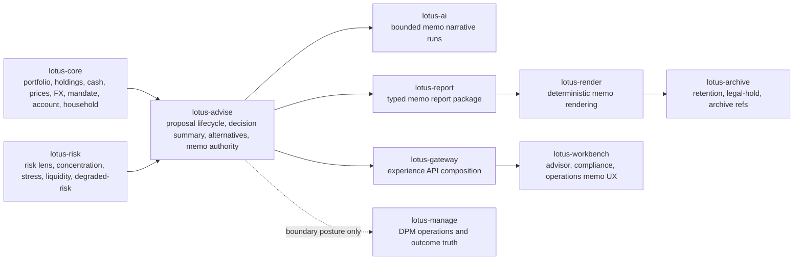

# RFC-0024 Slice 0: Critical Review, Source Map, and Product-Gap Allocation

| Metadata | Details |
| --- | --- |
| **RFC** | RFC-0024: Advisor Proposal Memo and Evidence Pack |
| **Slice** | 0 - critical review, source map, and product-gap allocation |
| **Status** | IMPLEMENTED - SOURCE-MAP AND SCOPE-GATE ONLY |
| **Implemented Date** | 2026-05-23 |
| **Owner** | `lotus-advise` |
| **Implementation Branch** | `rfc0024-slice0-source-map` |
| **Capability Posture** | This slice does not implement advisor proposal memo generation, memo APIs, memo persistence, memo report packages, or Workbench memo UX. It fixes source authority, gap classification, and non-claiming documentation posture before implementation-bearing slices. |

## Decision

RFC-0024 will begin from a bounded advisor-use memo evidence pack, not a client-ready document
claim. The first implementation-bearing work must build a deterministic memo domain model over
immutable proposal evidence and must preserve missing source facts as `PENDING_REVIEW` or `BLOCKED`
memo posture.

The current platform already proves proposal simulation, artifact generation, persisted lifecycle,
decision summaries, alternatives, reviewed RFC-0023 advisor-review narrative evidence, report
request propagation, downstream report/render/archive narrative handling, Gateway posture, and
Workbench `proposal.narrative_posture`. None of those is a first-class memo evidence product.

Client-draft, client-ready, compliance-review, investment-desk, operations, audit, report-package,
archive, Gateway, Workbench, AI, and commercial demo claims remain gated until the relevant
RFC-0024 slices implement and prove them.

## Current Implementation Truth

| Capability | Current source | Slice 0 classification |
| --- | --- | --- |
| Proposal simulation and artifact facts | `src/core/advisory/artifact.py`, proposal simulation routes, lifecycle tests | Source authority for recommended trades, before/after state, drift, suitability summary, decision summary, and alternatives evidence. |
| Persisted proposal lifecycle and immutable versions | `src/core/proposals/service.py`, `src/core/proposals/repository.py`, `src/infrastructure/proposals/` | Source authority for proposal identity, version identity, workflow history, idempotency, replay, approvals, and append-only audit events. |
| Decision summary | `proposal_decision_summary` in simulation, artifact, workspace, lifecycle, and replay surfaces | Source authority for recommendation posture, blockers, approval requirements, missing evidence, material change, risk posture, and next action. |
| Proposal alternatives | `proposal_alternatives` in simulation, artifact, workspace, lifecycle, and replay surfaces | Source authority for selected alternative, rejected candidates, ranking rationale, and construction tradeoffs. |
| Advisor-review narrative evidence | RFC-0023 `proposal_narrative`, narrative read/regeneration, review/replay, report-request package, data product, trust telemetry, Gateway, and Workbench posture | Reusable advisor-review input only. It is not compliance-review, client-draft, client-ready memo text, or memo authority. |
| Report request seam | `src/api/services/proposal_reporting_service.py`, `src/integrations/lotus_report/adapter.py`, `include_reviewed_narrative` support | Existing seam can propagate approved RFC-0023 narrative packages; RFC-0024 still needs typed memo report package contracts and lineage. |
| Execution handoff and execution status | proposal execution handoff/status routes and delivery summary projections | Boundary evidence for memo operational posture; downstream execution system remains the system of record. |
| Capability discovery | `src/api/capabilities/service.py` | Must not advertise memo support until implementation-backed memo APIs, data product, and dependency readiness exist. |
| Workbench product surface | `lotus-workbench` RFC-0023 narrative posture panel | Existing advisor-review narrative posture panel only; it does not implement memo review, projection, report package, or archive visibility. |

## Source Authority Matrix

| Memo evidence family | Authoritative source | RFC-0024 handling |
| --- | --- | --- |
| Portfolio, holdings, cash, valuation, price, FX, mandate, account, household, and booking-center facts | `lotus-core` source context and canonical simulation evidence consumed by `lotus-advise` | Consume source-owned fields only. Missing fields create explicit memo readiness gaps until `lotus-core` supplies them. |
| Risk, concentration, issuer/country/sector, liquidity, stress, drawdown, and degraded-risk posture | `lotus-risk` risk-lens evidence consumed by `lotus-advise` | Consume source-owned risk evidence. Absent risk evidence remains `PENDING_REVIEW` or `BLOCKED`; `lotus-advise` must not invent risk methodology. |
| Recommendation status, blockers, approval requirements, confidence, material change, and next action | `lotus-advise` decision summary | Memo builder may project and explain these values but must not recalculate them independently. |
| Alternative ranking and rejected-candidate rationale | `lotus-advise` alternatives projection over canonical simulation and risk evidence | Memo builder may summarize comparisons and must preserve source refs and rejected-candidate reason codes. |
| Suitability, best-interest, fee, cost, tax/friction, conflict, product eligibility, complex product review, consent, and disclosures | Existing advisory evidence where present; broader owner work remains RFC-0025, RFC-0016, RFC-0015, and source-owner scope | First memo slice must expose missing evidence as blocked posture. Positive client-ready wording is forbidden until source-backed evidence exists. |
| Advisor-review narrative | RFC-0023 `ProposalNarrativeEvidence:v1` | Reusable input for advisor-use memo sections only. It cannot make memo, suitability, approval, or client-ready decisions. |
| Report, render, archive, retention, legal-hold, and retrieval | `lotus-report`, `lotus-render`, and `lotus-archive` | RFC-0024 must introduce typed memo package handoff before claiming report/archive memo support. Existing portfolio-review narrative handling is an input precedent, not memo support. |
| Product-facing composition and UI state | `lotus-gateway` and `lotus-workbench` | Downstream surfaces must consume canonical Advise memo endpoints and must not reconstruct memo facts locally. |
| AI workflow execution, prompt/output lineage, guardrails, model supportability, and unavailable posture | `lotus-ai` | AI may draft bounded language from memo evidence only after deterministic memo truth exists. AI output must not alter memo status or source evidence. |
| DPM campaigns, execution operations, action registers, and outcome reviews | `lotus-manage` | Memo may show advisory/DPM boundary posture only when source-backed. DPM operational truth remains manage-owned. |

## Product-Gap Allocation

| Gap | Slice 0 decision | Owning implementation path |
| --- | --- | --- |
| First-class memo evidence aggregate | Implement after cleanup/platform review as a pure domain model and builder. | RFC-0024 Slice 5 in `lotus-advise`. |
| Memo API, persistence, replay, idempotency, review, and audit | Implement only after domain model and source readiness boundaries are stable. | RFC-0024 Slices 6 and 7 in `lotus-advise`. |
| Memo data product and trust telemetry | Implement before capability promotion. | RFC-0024 Slice 3 in `lotus-advise` and `lotus-platform` catalog/certification where required. |
| Household, mandate, product eligibility, complex product, price, FX, and source-readiness gaps | Implement in source owners where missing; otherwise expose blocked memo sections. | RFC-0024 Slice 4 with `lotus-core` owner work only where memo-critical. |
| Risk scenario, issuer/country/sector, liquidity, stress, drawdown, and degraded-risk gaps | Implement in source owner where missing; otherwise expose blocked memo sections. | RFC-0024 Slice 4 with `lotus-risk` owner work only where memo-critical. |
| Fee, cost, tax/friction, conflict, disclosure, suitability, and best-interest gaps | Implement minimum memo-critical blocked posture first; consume RFC-0025/RFC-0016 outputs when available. | RFC-0024 Slice 8, with adjacent RFC updates only when implementation-backed. |
| Report/render/archive memo package | Implement typed memo package and lineage instead of reusing reviewed narrative package as a memo. | RFC-0024 Slice 9 across `lotus-advise`, `lotus-report`, `lotus-render`, and `lotus-archive`. |
| AI memo narrative | Block until deterministic memo evidence exists. | RFC-0024 Slice 10 with `lotus-ai`; AI remains non-authoritative. |
| Gateway and Workbench memo review UX | Block until canonical Advise memo endpoints exist. | RFC-0024 Slice 11 in `lotus-gateway` and `lotus-workbench`. |
| Commercial/demo/RFP claims | Block until supported-feature truth and live proof exist. | RFC-0024 Slice 12 and RFC-0028 only after implementation evidence. |

## Cross-Repository Source Map

## First Supported Memo Scope

The first supported memo implementation must be deliberately narrow:

1. deterministic advisor-use memo evidence over an immutable proposal version,
2. source-authority manifest with source refs for every material section,
3. section readiness taxonomy with `READY`, `PENDING_REVIEW`, `BLOCKED`, and `NOT_AVAILABLE`,
4. blocked posture for client-ready, fee/cost/conflict, product-eligibility, and source-owner gaps
   until source-backed evidence exists,
5. no `/platform/capabilities` memo promotion before memo APIs, data product posture, and tests are
   implemented,
6. no Workbench memo UI before Gateway consumes canonical Advise memo endpoints.

## No WTBD Execution Decision

No new WTBD entries are allowed for RFC-0024. Any upstream, downstream, platform, UI, report, AI,
documentation, security, data-product, or operational work discovered during memo implementation
must be added to RFC-0024 slice evidence, implemented in the owning repository, explicitly marked
blocked with owner and reason, or removed from the supported product claim.

## Documentation and Feature-Truth Guard

README, wiki, supported-features, demos, and sales/pre-sales material may say that RFC-0024 Slice 0
is complete as a planning and source-authority gate. They must not say advisor proposal memo,
client-draft memo projection, client-ready memo publication, memo report package, or Workbench memo
review is supported until implementation-bearing slices are merged, validated, and published with
capability posture.

## Slice 0 Acceptance Evidence

| Gate | Evidence |
| --- | --- |
| Stranded-truth reconciliation | `git fetch origin --prune` and `git branch -r --no-merged origin/main` returned no unmerged remote branches before Slice 0 implementation. |
| Current-state review | Reviewed `lotus-advise` proposal, artifact, decision summary, alternatives, narrative, lifecycle, approval, report-request, execution, capability, docs, wiki, and tests. |
| Cross-repo classification | Scanned `lotus-core`, `lotus-risk`, `lotus-ai`, `lotus-report`, `lotus-render`, `lotus-archive`, `lotus-gateway`, `lotus-workbench`, `lotus-platform`, and `lotus-manage` for memo/evidence-pack ownership signals. Existing reviewed narrative and report/render/archive support is not memo support. |
| Product-gap allocation | Memo-critical source gaps are classified as implement-now, implement in owner repo, explicitly unavailable-with-blocked-state, or out-of-scope. |
| Non-claiming documentation | `wiki/Supported-Features.md` keeps RFC-0024 planned-only while Slice 0 records source-authority truth. |
| Next-slice readiness | Slice 1 can review platform automation and scaffolding against a concrete memo source map before app-specific implementation begins. |
