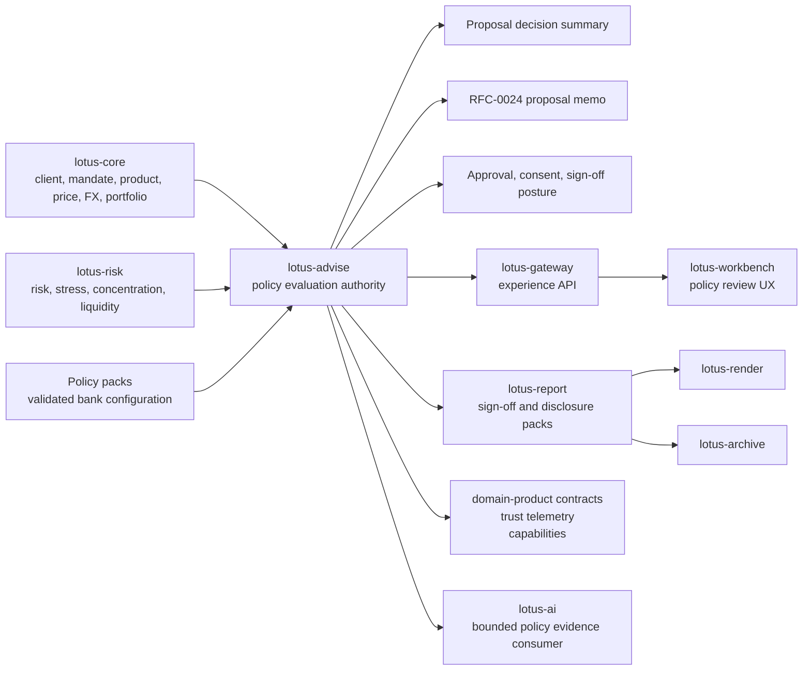

# RFC-0025: Enterprise Suitability and Best-Interest Policy Packs

| Metadata | Details |
| --- | --- |
| **Status** | DRAFT - GOLD-STANDARD IMPLEMENTATION PLAN |
| **Created** | 2026-05-22 |
| **Last Tightened** | 2026-05-26 |
| **Owner** | `lotus-advise` for advisory policy evaluation authority and evidence-product truth |
| **Business Sponsor Persona** | advisory desk head, compliance officer, product governance, relationship manager, risk control, investment desk reviewer, operations, audit, sales/pre-sales |
| **Primary Business Outcome** | make every advisory recommendation policy-evaluable, explainable, reviewable, replayable, and approval-ready under bank-configured suitability, best-interest, disclosure, conflict, and product-governance controls |
| **Depends On** | RFC-0010, RFC-0013, RFC-0015, RFC-0016, RFC-0020, RFC-0021, RFC-0022, RFC-0024 |
| **Cross-Repository Scope** | `lotus-advise`, `lotus-core`, `lotus-risk`, `lotus-report`, `lotus-render`, `lotus-archive`, `lotus-ai`, `lotus-gateway`, `lotus-workbench`, `lotus-platform` |
| **Compatibility Posture** | backward compatibility is not a constraint; breaking API/contract changes are allowed when they are the cleanest design, but every affected downstream consumer must be updated in this RFC before closure |
| **Tightening Branch** | `rfc25-gold-standard-tightening` |
| **Implementation Branching Rule** | implementation may continue on this branch or a follow-on RFC-0025 feature branch, but all branch names, PRs, commits, checks, and cross-repo closures must be recorded in RFC closure evidence |
| **Doc Location** | `docs/rfcs/RFC-0025-enterprise-suitability-and-best-interest-policy-packs.md` |

---

## 0. Executive Summary

RFC-0025 creates the `AdvisoryPolicyEvaluationRecord`: the governed advisory policy evidence product
that evaluates proposal versions against versioned suitability, best-interest, product-governance,
fee/cost, conflict, disclosure, consent, and approval controls.

The purpose is not to hard-code legal advice. The purpose is to give banks a controlled policy-pack
mechanism where:

1. policy content is versioned, explicit, validated, and bank-owned,
2. policy applicability is source-backed by client, household, mandate, booking-center, product,
   portfolio, risk, cost, and advisory context,
3. every rule outcome carries reason codes, evidence refs, source gaps, and review posture,
4. policy outcomes feed proposal decision summaries, RFC-0024 memo evidence packs, approval
   dependencies, disclosure packs, Gateway, Workbench, report/render/archive, and governed AI
   evidence packets,
5. historical outcomes are immutable and replayable against the policy version and source refs used
   at evaluation time.

The implementation must deliver the complete policy-pack outcome end to end. This RFC does not allow
a "policy engine done, product surface later" closure, a "configuration exists but source evidence is
missing" closure, or a "Gateway/Workbench/report/archive later" closure when those surfaces are
needed to realize the business value. If a cross-repository change is required for policy-pack value,
it is part of this RFC's implementation program and must be merged, validated, and documented before
the RFC is marked implemented.

RFC-0025 supersedes the broad future intent in RFC-0015 for enterprise policy packs while preserving
RFC-0015's principle: Lotus provides the configurable policy mechanism, evidence model, and audit
trail; banks own regulatory interpretation, approval thresholds, disclosure text, and final policy
sign-off.

---

## 1. Critical Review of the Previous RFC

| Area | Previous state | Gap | Tightening applied |
| --- | --- | --- | --- |
| Scope | Focused on `lotus-advise` policy-pack catalog and proposal evaluation. | Downstream realization and upstream source completion were left outside the RFC execution contract. | Scope now includes every upstream, downstream, platform, documentation, and product-surface change required for the policy-pack supported claim. |
| Compatibility | Proposed endpoints under the current advisory route family. | Did not state whether breaking cleanup was allowed. | Compatibility is now explicit: no backward-compatibility constraint, but all consumers must be migrated in the same RFC. |
| Architecture | Defined source authority and a simple policy flow. | Did not fully separate policy content ownership, source authority, evaluation authority, report/archive ownership, Gateway/Workbench product surfaces, and data-mesh certification. | Added ownership matrix, canonical flow, policy-content boundary, data-product rules, and consumer migration expectations. |
| Product gap handling | Covered suitability, best-interest, product eligibility, disclosures, approvals. | Did not map all bank-buyable gaps such as approval queues, fee/tax/friction evidence, private assets, structured products, supervisory dashboards, and commercial proof. | Added product-gap allocation and policy-critical inclusion rules. |
| Data mesh | Mentioned data-product posture only indirectly. | Did not require a new producer declaration, trust telemetry, SLO/access/evidence policy, catalog certification, or Gateway/Workbench mesh consumption. | Added a mandatory `AdvisoryPolicyEvaluationRecord:v1` data product and platform hardening slice. |
| API design | Listed policy catalog/evaluation endpoints. | Did not include review queues, sign-off/disclosure packs, downstream migration, endpoint retirement, or complete Swagger quality expectations. | Added certified APIs, migration rules, review/sign-off/report package endpoints, and OpenAPI acceptance gates. |
| Evidence | Had unit/contract/integration/live proof. | Did not require source-critical figure review, cross-repo proof, report/render/archive proof, Workbench browser proof, security proof, performance proof, or mesh certification. | Added complete test/evidence strategy and implementation proof slice. |
| Platform automation | Asked whether policy scaffolding belongs in platform. | Did not require improving reusable scaffolding when gaps are found. | Added mandatory platform automation/scaffolding improvement slice. |
| Documentation | Required docs and supported features. | Did not specify audience, wiki publication, commercial material, implementation-backed grounding, or no-duplication rules. | Added documentation-as-product requirements and final wiki publication gates. |
| Communication | Not covered. | User requires a LinkedIn post after completion. | Added post-completion communication slice using the LinkedIn thought-leadership workflow. |

Decision:

1. RFC-0025 owns enterprise advisory policy evaluation, suitability, best-interest, disclosure,
   conflict, product-governance, approval-dependency, consent, and policy sign-off evidence.
2. The implementation must include every cross-repository change required to make policy outcomes
   usable by advisors, compliance, investment desk reviewers, operations, sales/pre-sales, Gateway,
   Workbench, report/render/archive, and data-product consumers.
3. Adjacent RFCs may own broader product families, but RFC-0025 cannot close while policy-critical
   dependencies remain unimplemented.

---

## 2. Problem Statement

Current `lotus-advise` has a valuable suitability foundation:

1. RFC-0010 suitability scanner,
2. RFC-0021 enterprise suitability policy metadata,
3. a modular baseline suitability engine in `src/core/common/suitability.py`,
4. source-readiness policy context in `src/core/advisory/policy_context.py`,
5. persisted proposal lifecycle and immutable proposal versions,
6. backend-owned proposal decision summaries and proposal alternatives,
7. workflow approvals and consent posture,
8. canonical allocation and risk-lens convergence,
9. OpenAPI, vocabulary, no-alias, data-product, trust telemetry, runtime-smoke, Docker, security,
   and production-profile guardrail checks.

That foundation is not yet enough for a bank-buyable advisory control framework. A private bank
needs to answer, with evidence:

1. which policy pack and policy version applied,
2. why it applied to this client, household, mandate, booking center, jurisdiction, product, and
   proposal,
3. which suitability, best-interest, appropriateness, product-eligibility, complex-product, risk,
   liquidity, fee, tax, transaction-friction, conflict, inducement, disclosure, and consent rules
   passed or failed,
4. which evidence was missing, stale, degraded, or not implemented,
5. which approval dependencies, maker-checker reviews, supervisory reviews, client consents, and
   compliance sign-offs are required,
6. how the decision summary, memo, report pack, AI narrative, Gateway, and Workbench should consume
   the same policy truth,
7. how the outcome can be replayed years later against the original policy version and source refs.

RFC-0025 creates one governed policy evaluation product to answer those questions.

## 3. Business Outcomes

RFC-0025 must deliver these outcomes:

1. **Configurable advisory governance**
   banks can model policy controls without code forks or UI-side rule logic.
2. **Compliance confidence**
   every advisory proposal carries policy version, applicability, rule results, evidence refs,
   source gaps, approvals, disclosures, consent requirements, and replay posture.
3. **Advisor guidance**
   advisors see whether a proposal is `READY`, `PENDING_REVIEW`, or `BLOCKED` before client
   conversation and can understand the required next step.
4. **Supervisory control**
   compliance and desk heads receive policy-driven review queues, SLA aging, maker-checker
   posture, and sign-off evidence.
5. **Client-ready evidence**
   RFC-0024 memo, report/render/archive packages, and governed narrative paths can consume policy
   outcomes without reconstructing policy logic.
6. **Data-product maturity**
   `lotus-advise` promotes policy evaluation as a governed data product with trust telemetry,
   certification, access, SLO, evidence, lineage, and catalog posture.
7. **Commercial readiness**
   sales/pre-sales can demonstrate a bank-recognizable advisory control framework from
   implementation-backed docs and proof without unsupported regulatory claims.

## 4. Scope and Non-Scope

### 4.1 In Scope

RFC-0025 includes all work required to deliver a supported enterprise policy-pack outcome:

1. `lotus-advise` policy-pack catalog, versioning, configuration validation, activation posture,
   applicability, evaluation, persistence, replay, review queue, sign-off, approval-dependency,
   disclosure, consent, report-handoff, OpenAPI, tests, metrics, logs, audit, data-product
   declarations, trust telemetry, docs, wiki, and supported-features truth.
2. `lotus-core` source enhancements when policy evaluation needs richer client, household, account,
   mandate, booking-center, client classification, vulnerability/professional-client indicators,
   restrictions, objectives, time horizon, liquidity needs, product eligibility, product target
   market, product complexity, private-asset classification, structured-product features, price,
   FX, cash, holding, or source-readiness fields.
3. `lotus-risk` source enhancements when policy evaluation needs stress, drawdown, VaR, issuer,
   country, sector, liquidity, private-asset, climate, geopolitical, risk-budget, or degraded-risk
   evidence.
4. `lotus-report`, `lotus-render`, and `lotus-archive` work required to generate, render, archive,
   retain, retrieve, and audit compliance sign-off packs, disclosure packs, and policy appendices
   used by memo/proposal artifacts.
5. `lotus-ai` workflow-pack contract changes required so governed narrative or copilot paths can
   consume policy outcomes without treating AI as the policy authority.
6. `lotus-gateway` and `lotus-workbench` changes required to expose policy evaluation, rule
   results, source gaps, review queues, supervisory dashboards, maker-checker actions, disclosure
   packs, consent requirements, sign-off posture, and supportability value to users.
7. `lotus-platform` automation/scaffolding improvements when reusable gaps are discovered in API
   certification, Swagger quality, policy-schema validation, observability, health, structured
   logging, error handling, test scaffolding, CI defaults, documentation scaffolding, governance
   hooks, security baseline, data mesh onboarding, or live-evidence capture.
8. README, wiki, supported-features, architecture docs, operator docs, sales/pre-sales demo
   material, commercial proof, and post-completion communication.

### 4.2 Non-Scope

RFC-0025 does not own:

1. legal or regulatory interpretation for a real bank,
2. proprietary bank policy content beyond reference/sample packs and schema-validated examples,
3. discretionary portfolio-management campaigns, which remain `lotus-manage` ownership,
4. external OMS or broker execution as a system of record, except policy-visible eligibility and
   handoff boundaries,
5. broad advisor cockpit worklists beyond policy review queues and policy-driven next actions,
   which are RFC-0026 unless required to expose policy-pack value,
6. broad advisory AI chat/copilot beyond policy evidence consumption and review-gated narrative
   constraints, which is RFC-0027 unless required to expose policy-pack value,
7. full commercial RFP pack beyond policy-pack product evidence, which is RFC-0028 unless required
   to explain the policy product.

Non-scope does not mean "ignore it." If a non-scope item blocks the policy-pack supported claim,
RFC-0025 must either implement the needed subset or remove the unsupported claim.

## 5. Product Gap Allocation

The table below decides what this RFC tackles directly and what belongs in adjacent RFCs.

| Product area or gap | RFC-0025 treatment | Owning RFC or repo for broader scope |
| --- | --- | --- |
| Advisory proposal simulation needs richer goals, constraints, household/account context, product eligibility, and scenario comparison | In scope only where source fields are required for policy applicability or rule evaluation; policy must block or degrade when evidence is missing. | `lotus-core` owns source truth; RFC-0022 owns broader scenario/alternative construction. |
| Proposal artifact generation needs client-ready memo/PDF narrative | RFC-0025 supplies policy outcomes, disclosure requirements, consent requirements, and sign-off appendices. | RFC-0024 owns memo/report package; report/render/archive own materialization. |
| Persisted lifecycle needs approval queues, supervisory dashboards, maker-checker UX, SLA aging | In scope for policy-driven review queues, maker-checker decisions, approval dependencies, and policy SLA aging. | RFC-0026 owns broader advisor cockpit; Workbench/Gateway own product surfaces. |
| Approval and consent workflow needs jurisdiction-specific rules, consent variants, escalation rules, compliance sign-off packs | In scope for policy-pack rules, approval dependencies, consent requirements, escalation/sign-off evidence, and sign-off packs. | `lotus-report`, `lotus-render`, `lotus-archive` materialize packs. |
| Decision summary needs best-interest narrative, fee/conflict rationale, rejected-alternative explanation | In scope for policy-backed best-interest, fee/cost/conflict, disclosure, and missing-evidence rationale. | RFC-0024 consumes in memo; RFC-0022 owns alternative construction. |
| Suitability policy needs Reg BI/MiFID/MAS/HK/Singapore/private-bank packs, mandate restrictions, complex product approvals | In scope as configurable reference policy-pack families and schema-validated sample packs, not legal advice. | Banks own final policy content; `lotus-core`/product governance own source eligibility facts. |
| Proposal alternatives need cost-aware, tax-aware, liquidity-aware, risk-budget-aware, private-assets-aware strategies | In scope only as policy checks over implementation-backed alternative evidence. | RFC-0022 and RFC-0016 own construction and cost methodology. |
| Risk lens needs broader stress, VaR/drawdown, issuer/country/sector, liquidity, private assets, climate/geopolitical scenarios | In scope only where policy rules need this evidence; missing evidence must be explicit. | `lotus-risk` owns risk methodology and source product depth. |
| Advisory workspace needs full advisor cockpit | Policy-driven next actions and review queues are in scope. | RFC-0026 owns broader cockpit, collaboration, CRM handoff, meeting prep, and follow-up. |
| Workspace AI rationale needs model governance, human review, prompt/output lineage | Policy evidence may be consumed by governed AI, but AI cannot own policy truth. | RFC-0027 and `lotus-ai` own broader AI model-risk governance. |
| Execution handoff/status needs adapters, reconciliation, exception management, OMS/broker story | In scope only for policy-visible eligibility and approval prerequisites. | RFC-0017 and downstream execution owners own execution integration. |
| Report request seam needs polished proposal pack generation | In scope for policy/disclosure/sign-off packs and policy appendix packages. | RFC-0024 owns proposal memo; report/render/archive own document lifecycle. |
| Tactical house-view cohorts need productization for campaign use | In scope only if a policy pack consumes house-view cohort evidence. | `lotus-manage`, Gateway, Workbench own broader campaign productization. |
| Capability discovery needs sales/demo surfacing and operational dashboards | In scope for policy-pack supportability and dependency readiness through `/platform/capabilities`. | Gateway/Workbench consume; RFC-0028 owns broader demo. |
| Non-functional posture needs load benchmarks, SLO dashboards, tenant/legal-entity config, DR/RTO/RPO | In scope for policy endpoints and policy data product production readiness. | `lotus-platform` owns reusable standards. |
| Commercial packaging needs RFP pack, architecture deck, security pack, demo scripts, ROI story, product one-pager | In scope for policy-pack one-pager/demo notes/security posture/RFP-support excerpt. | RFC-0028 owns full bank-demo and RFP package. |

## 6. Regulatory and Product Framing

RFC-0025 uses regulatory-style vocabulary but must not encode legal advice.

Supported design principles:

1. Lotus provides the policy-pack engine, schemas, evidence model, audit trail, APIs, and proof.
2. Banks configure jurisdiction, legal-entity, client-segment, product, disclosure, approval, and
   consent content.
3. Reference packs may model control families associated with MiFID-style suitability,
   Reg BI-style best-interest review, MAS/HK/Singapore private-bank controls, internal product
   governance, complex-product approvals, and bank-specific advisory desk policies.
4. Reference packs are implementation fixtures and demo examples, not legal advice or ready-to-use
   regulatory policies.
5. Compliance/legal teams remain responsible for policy content, approval thresholds, disclosure
   wording, and production sign-off.

Policy packs may model controls associated with:

1. suitability,
2. best interest,
3. appropriateness,
4. product eligibility and target market,
5. complex products and structured products,
6. private assets,
7. concentration, risk budget, stress, drawdown, VaR, and liquidity,
8. time horizon and liquidity needs,
9. cost, fee, tax, and transaction-friction reasonableness,
10. conflicts, inducements, and disclosures,
11. consent variants and client acknowledgement,
12. ESG/sustainability preference alignment where configured,
13. vulnerable-client or professional-client segmentation where configured,
14. maker-checker, compliance, desk, and supervisory approval routing.

## 7. Domain Vocabulary

| Concept | Preferred term | Avoid |
| --- | --- | --- |
| Configured rule family | policy pack | hard-coded ruleset |
| Rule version used in evaluation | policy version | latest config |
| Evaluation artifact | policy evaluation record | pass/fail blob |
| Client objective constraints | investment objectives, risk tolerance, time horizon, liquidity needs | profile blob |
| Governed recommendation outcome | suitability outcome, best-interest outcome | pass/fail only |
| Product governance | product eligibility, target market, complexity, restrictions | product flag |
| Complex product path | complex-product review | exotic product exception |
| Advisory reviewer action | approval dependency, review route | manual escalation |
| Sign-off evidence | compliance sign-off pack | reviewer note |
| Source-backed explanation | reason code and evidence ref | text-only explanation |
| Missing prerequisite | source readiness gap | null field |
| Proposal decision state | `READY`, `PENDING_REVIEW`, `BLOCKED` | approved-ish |

## 8. Current Baseline

Implementation-backed foundations already available:

1. baseline suitability scanner from RFC-0010,
2. RFC-0021 enterprise suitability policy metadata and modular evaluator seam,
3. policy context selectors for household, mandate, jurisdiction, and benchmark,
4. policy-pack id and policy version on suitability results,
5. complex-product missing-evidence posture,
6. decision-summary propagation of suitability policy version,
7. proposal alternatives, risk lens, workflow approvals, consent posture, report-readiness boundary,
   and execution-handoff boundary evidence,
8. persisted proposal lifecycle, immutable versions, idempotency, and replay foundations,
9. repo-native data products for `AdvisoryProposalLifecycleRecord` and
   `TacticalHouseViewAffectedCohort`,
10. RFC-0087 trust telemetry fixture for `AdvisoryProposalLifecycleRecord`,
11. OpenAPI, vocabulary, no-alias, domain-product, runtime-smoke, security-audit, Docker, and
    production-profile guardrail checks.

Known gaps:

1. no first-class policy-pack catalog API,
2. no versioned policy-pack runtime selection and activation lifecycle,
3. no schema-validated reference packs for jurisdiction/client-segment/product applicability,
4. no independent persisted policy evaluation record or replay endpoint,
5. no granular rule result model for best interest, conflicts, disclosures, consent, fee/cost/tax,
   product eligibility, complex-product review, private assets, or structured products,
6. no policy-driven review queue, maker-checker, supervisory dashboard, or SLA aging evidence,
7. no report/render/archive compliance sign-off or disclosure pack materialization,
8. no Gateway/Workbench policy-review product surface,
9. no policy evaluation data product, trust telemetry, SLO/access/evidence policy, or mesh
   certification,
10. no implementation-backed wiki/sales/demo material for enterprise advisory policy packs,
11. no LinkedIn post-completion draft requirement.

## 9. Target Product Capability

The target product is `AdvisoryPolicyEvaluationRecord`.

It must contain:

1. evaluation identity,
2. proposal and proposal-version identity,
3. selected policy packs and effective policy versions,
4. applicability basis,
5. source-authority refs,
6. overall status using `READY`, `PENDING_REVIEW`, or `BLOCKED`,
7. rule results,
8. suitability outcome,
9. best-interest outcome,
10. product eligibility and complex-product outcome,
11. private-asset and structured-product outcome where source evidence exists,
12. fee, cost, tax, and friction outcome where source evidence exists,
13. conflict and inducement outcome,
14. disclosure and consent requirements,
15. approval dependencies and maker-checker route,
16. supervisory review/SLA aging posture,
17. client conversation prompts or questions to confirm with client,
18. source readiness gaps,
19. report/render/archive sign-off pack refs,
20. policy, rule, evaluation, and source-input hashes,
21. replay metadata,
22. data-product trust metadata,
23. supportability diagnostics.

### 9.1 Policy-Pack Families

Initial configurable families:

1. `SUITABILITY_CORE`
2. `BEST_INTEREST_CORE`
3. `JURISDICTION_DISCLOSURE`
4. `PRODUCT_ELIGIBILITY`
5. `COMPLEX_PRODUCT_REVIEW`
6. `PRIVATE_ASSETS_REVIEW`
7. `STRUCTURED_PRODUCTS_REVIEW`
8. `RISK_AND_CONCENTRATION`
9. `LIQUIDITY_AND_TIME_HORIZON`
10. `COST_FEE_TAX_AND_FRICTION`
11. `CONFLICT_AND_INCENTIVE`
12. `CONSENT_AND_ACKNOWLEDGEMENT`
13. `SUPERVISORY_AND_MAKER_CHECKER`
14. `SUSTAINABILITY_PREFERENCE`

Reference pack examples may include:

1. `GLOBAL_PRIVATE_BANKING_BASELINE`
2. `SG_PRIVATE_BANKING_REFERENCE`
3. `HK_PRIVATE_BANKING_REFERENCE`
4. `MAS_REFERENCE_CONTROL_SET`
5. `HK_SFC_REFERENCE_CONTROL_SET`
6. `MIFID_REFERENCE_CONTROL_SET`
7. `REG_BI_REFERENCE_CONTROL_SET`

Reference packs are examples for implementation proof and demos. They cannot be marketed as legal
coverage unless a bank has configured and approved them.

### 9.2 Policy Outcome Model

Each evaluation must return:

1. `evaluation_id`,
2. `policy_pack_id`,
3. `policy_version`,
4. `applicability_basis`,
5. `overall_status`,
6. `rule_results`,
7. `approval_dependencies`,
8. `required_disclosures`,
9. `consent_requirements`,
10. `compliance_sign_off_requirements`,
11. `client_conversation_prompts`,
12. `source_readiness_gaps`,
13. `evidence_refs`,
14. `report_package_refs`,
15. `archive_refs`,
16. `replay_context_hash`,
17. `generated_at`,
18. `correlation_id`.

Top-level statuses must use the existing Lotus vocabulary:

1. `READY`,
2. `PENDING_REVIEW`,
3. `BLOCKED`.

### 9.3 Rule Result Model

Each rule result must include:

1. `rule_id`,
2. `rule_family`,
3. `rule_version`,
4. `severity`,
5. `status`,
6. `applicability_state`,
7. `reason_codes`,
8. `evidence_refs`,
9. `source_authority_refs`,
10. `missing_evidence`,
11. `degraded_evidence`,
12. `approval_implication`,
13. `disclosure_implication`,
14. `consent_implication`,
15. `review_route`,
16. `review_sla`,
17. `rule_hash`.

## 10. Architecture Direction

### 10.1 Ownership Model

| Repository | RFC-0025 responsibility |
| --- | --- |
| `lotus-advise` | policy-pack catalog, policy versions, applicability, evaluation, rule results, persistence, replay, approval dependency mapping, disclosure/consent requirements, review queues, sign-off evidence, APIs, supportability, audit, policy data product, trust telemetry, docs, wiki, supported-features truth |
| `lotus-core` | authoritative client, household, account, mandate, booking center, client classification, restriction, objective, time horizon, liquidity need, holding, cash, price, FX, product, product eligibility, target market, product complexity, private-asset, structured-product, and source-readiness evidence needed by policy evaluation |
| `lotus-risk` | authoritative risk, concentration, stress, drawdown, VaR, issuer/country/sector, liquidity, private-asset, climate/geopolitical, risk-budget, and degraded-risk evidence used by policy evaluation |
| `lotus-report` | policy sign-off pack, disclosure pack, and policy appendix report-job contracts |
| `lotus-render` | deterministic rendering of sign-off, disclosure, and policy appendix documents |
| `lotus-archive` | generated-document archive, retention, legal hold, access audit, retrieval, and archive refs |
| `lotus-ai` | bounded consumption of policy evidence for narrative/copilot packs; prompt/provider execution, model telemetry, and AI run posture when enabled |
| `lotus-gateway` | experience APIs that expose policy capabilities, evaluation status, review queues, sign-off posture, and degraded state to Workbench |
| `lotus-workbench` | advisor/compliance/supervisory policy review UX, maker-checker actioning, disclosure/consent review, sign-off pack visibility, browser proof |
| `lotus-platform` | reusable scaffolding, API certification, policy-schema validation patterns, data mesh, trust telemetry, SLO/access/evidence policy, cross-repo validation, wiki publication automation, CI governance |

### 10.2 Product Flow

Rules:

1. policy evaluation belongs in `lotus-advise` because it is advisory-proposal-specific,
2. source data remains owned by the relevant source authority,
3. banks own policy content; Lotus owns schema, versioning, evaluation, evidence, and audit,
4. activated policy versions are immutable,
5. proposal replay uses the policy version effective at evaluation time,
6. Gateway and Workbench must consume policy outcomes and must not reimplement rule evaluation,
7. report/render/archive must materialize policy evidence from typed policy packages rather than
   reconstructing advisory facts,
8. AI may summarize policy evidence but cannot satisfy, waive, approve, hide, or reclassify policy
   outcomes.

## 11. Source Authority and Dependency Map

| Evidence | Source authority | Advise responsibility |
| --- | --- | --- |
| Client risk profile, objectives, time horizon, liquidity needs, vulnerability, professional-client status | `lotus-core` or a governed client/mandate authority if distinct from `lotus-core` during implementation | Consume source refs; do not invent profile values. |
| Household, account, booking center, legal entity, mandate, restrictions | `lotus-core` | Evaluate applicability and source gaps; do not duplicate source truth. |
| Portfolio holdings, cash, exposure, valuation, FX, prices | `lotus-core` | Use canonical proposal and simulation evidence. |
| Product eligibility, target market, complexity, private-asset, structured-product features | `lotus-core` or a governed product-authority service if distinct from `lotus-core` during implementation | Consume canonical product evidence when available; otherwise return source readiness gap. |
| Risk, concentration, stress, drawdown, VaR, liquidity, country/sector/issuer, climate/geopolitical | `lotus-risk` | Use risk lens and degraded risk posture without recalculating methodology. |
| Costs, fees, tax, transaction frictions | RFC-0016 / source owner | Use only implementation-backed cost/friction evidence; otherwise produce explicit source gaps. |
| Jurisdiction and internal policy content | Bank-configured policy pack | Version, validate, evaluate, persist, and replay outcome. |
| Approval workflow and consent posture | `lotus-advise` | Map policy outcomes to approval dependencies, maker-checker actions, consent requirements, and sign-off events. |
| Memo/narrative/report usage | RFC-0024/RFC-0023/report stack | Project policy outcomes only after evaluation; never reconstruct policy in consumers. |

## 12. Data Product and Data Mesh Requirements

RFC-0025 must promote a new governed data product:

`lotus-advise:AdvisoryPolicyEvaluationRecord:v1`

Required work:

1. add repo-native producer declaration under `contracts/domain-data-products/`,
2. add consumer declaration updates where `lotus-gateway`, `lotus-workbench`, `lotus-report`,
   `lotus-render`, `lotus-archive`, `lotus-ai`, and RFC-0024 memo flows consume policy evidence,
3. add or update RFC-0087 trust telemetry snapshot for the policy product,
4. define freshness, completeness, reconciliation, data-quality, lineage, access, evidence,
   lifecycle, and replay posture,
5. define SLO, access policy, and evidence policy in platform-owned mesh contract families if the
   product joins the enterprise maturity wave,
6. update generated platform catalog and dependency graph through platform automation,
7. validate with repo-native `make domain-data-products-gate` and platform mesh certification,
8. expose policy support, active policy versions, and dependency readiness through
   `GET /platform/capabilities`,
9. ensure Gateway and Workbench consume certified product posture from governed APIs rather than
   local feature flags.

Minimum trust metadata:

1. `product_name`,
2. `product_version`,
3. `evaluation_id`,
4. `proposal_id`,
5. `proposal_version_id`,
6. `policy_pack_id`,
7. `policy_version`,
8. `generated_at`,
9. `correlation_id`,
10. `tenant_id` or explicit tenancy posture,
11. `legal_entity_id` or explicit legal-entity posture,
12. `evidence_hash`,
13. `lineage_bundle_id`,
14. `source_authority_refs`.

## 13. API and Contract Direction

Backward compatibility is not a design constraint. The implementation may change or retire older
suitability, policy, approval, or disclosure paths if that produces a cleaner canonical contract,
provided every downstream consumer is updated in the same RFC.

Compatibility and migration rules:

1. no old and new policy authority can remain active in parallel without a documented cutover
   reason,
2. deprecated or retired endpoints must be removed from OpenAPI or clearly marked unsupported with
   tested error behavior,
3. Gateway, Workbench, memo, report, render, archive, AI, and platform consumers must migrate in
   the same RFC branch set before the policy-pack supported-feature claim is promoted,
4. any breaking contract change must include an owner-by-owner migration checklist, contract tests,
   and proof that no downstream consumer still relies on the retired contract,
5. `/platform/capabilities` must expose the active policy contract version and degraded dependency
   state so downstream consumers do not infer support from static flags.

Canonical endpoints:

1. `GET /advisory/policy-packs`
   list active, draft, superseded, and disabled policy-pack metadata visible to the caller.
2. `GET /advisory/policy-packs/{policy_pack_id}/versions/{policy_version}`
   retrieve policy-pack version metadata, applicability, rule summary, activation posture, and
   source requirements.
3. `POST /advisory/policy-packs/{policy_pack_id}/versions/{policy_version}/validate`
   validate a draft policy-pack version before activation.
4. `POST /advisory/policy-packs/{policy_pack_id}/versions/{policy_version}/activate`
   activate a policy-pack version through governed maker-checker controls where configured.
5. `POST /advisory/proposals/{proposal_id}/versions/{version_id}/policy-evaluations`
   evaluate a proposal version against selected or applicable policy packs.
6. `GET /advisory/proposals/{proposal_id}/policy-evaluations/{evaluation_id}`
   retrieve persisted policy evaluation evidence.
7. `POST /advisory/proposals/{proposal_id}/policy-evaluations/{evaluation_id}/replay`
   replay against the original policy version and source evidence refs.
8. `GET /advisory/policy-evaluations/review-queue`
   retrieve policy-driven review queue items for compliance, investment desk, maker-checker,
   supervisory, and operations users.
9. `POST /advisory/proposals/{proposal_id}/policy-evaluations/{evaluation_id}/reviews`
   record policy review, approval, rejection, waiver request, requested changes, or sign-off.
10. `POST /advisory/proposals/{proposal_id}/policy-evaluations/{evaluation_id}/sign-off-packages`
    create a typed report/render/archive package request for compliance sign-off and disclosure
    evidence.
11. `GET /advisory/proposals/{proposal_id}/policy-evaluations/{evaluation_id}/lineage`
    retrieve source refs, hashes, trust metadata, sign-off/report/archive refs, and replay posture.

Required headers:

1. `X-Correlation-ID`,
2. `Idempotency-Key` for evaluation, validation, activation, review, and sign-off commands,
3. tenant/legal-entity caller context if the platform contract requires it,
4. caller role or entitlement context where required by Gateway/Workbench.

OpenAPI requirements:

1. every endpoint has summary, description, operation id, tags, response descriptions, and
   examples,
2. every request and response attribute has description, type, and example value,
3. examples cover `READY`, `PENDING_REVIEW`, `BLOCKED`, missing product eligibility, missing cost
   evidence, complex-product review, conflict disclosure, consent required, policy validation
   failure, source degraded, unauthorized review queue, report unavailable, and archive unavailable,
4. Swagger text explains what the endpoint does, when it should be used, how idempotency works, how
   policy replay works, and what downstream systems consume,
5. error responses are consistent, documented, and tested,
6. OpenAPI, vocabulary, no-alias, and endpoint certification gates are merge blockers,
7. old or misleading endpoint descriptions are removed or rewritten.

## 14. Policy Configuration Model

Policy packs must be data-driven but constrained.

A policy pack version includes:

1. `policy_pack_id`,
2. `policy_version`,
3. `policy_family`,
4. `jurisdiction_scope`,
5. `booking_center_scope`,
6. `legal_entity_scope`,
7. `client_segment_scope`,
8. `product_scope`,
9. `effective_from`,
10. `effective_to`,
11. `activation_state`,
12. `owner_role`,
13. `maker_checker_required`,
14. `rules`,
15. `disclosure_templates`,
16. `consent_templates`,
17. `approval_routes`,
18. `sample_fixture_refs`,
19. `schema_version`,
20. `content_hash`.

A policy rule includes:

1. stable `rule_id`,
2. family,
3. version,
4. severity,
5. applicability condition,
6. required evidence fields,
7. evaluation expression or named evaluator,
8. outcome mapping,
9. approval dependency mapping,
10. disclosure mapping,
11. consent mapping,
12. source gap handling,
13. review SLA,
14. explainability text templates,
15. forbidden positive wording when evidence is missing.

Configuration rules:

1. rule ids are upper snake case,
2. rule definitions are schema-validated before activation,
3. activated versions are immutable,
4. policy pack activation requires dry-run validation against sample proposal fixtures,
5. unsupported evidence requirements cause `PENDING_REVIEW` or `BLOCKED`, not silent pass,
6. policy packs must not include raw client data,
7. disclosure templates must be versioned and must distinguish internal review text from
   client-facing text,
8. waiver and override behavior must be explicit, audited, role-gated, and unavailable by default
   unless configured.

## 15. Persistence, Replay, and Lineage

Persistence must support:

1. policy-pack versions,
2. activation events,
3. validation events,
4. evaluation records,
5. rule result records,
6. source readiness gaps,
7. approval dependencies,
8. disclosure and consent requirements,
9. review events,
10. waiver/override requests where configured,
11. sign-off package events,
12. report/archive refs,
13. source refs,
14. data-product trust metadata,
15. idempotency records,
16. replay records.

Replay rules:

1. activated policy versions are immutable,
2. persisted evaluations are immutable after finalization,
3. replay uses the same proposal version, policy version, source evidence refs, rule evaluator
   version, and applicability context,
4. a latest-policy evaluation creates a new evaluation rather than rewriting historical truth,
5. missing upstream services must not change historical finalized policy truth,
6. replay exposes source refs and hash comparison result,
7. replay failures return actionable diagnostics without leaking sensitive payloads.

## 16. Security, Compliance, and Privacy

Required controls:

1. role-aware access to policy catalog, evaluations, review queues, sign-off packs, and report
   packages,
2. tenant and legal-entity posture where supported by platform context,
3. no raw client, holding, product, prompt, model output, policy template, or proprietary policy
   payloads in logs or metrics,
4. no portfolio, client, proposal, security, rule, policy-pack, or evaluation ids as metric labels,
5. audit events for validation, activation, evaluation, review, waiver request, sign-off, report
   package creation, archive handoff, AI narrative consumption, replay, and export,
6. redaction policy for advisor, compliance, investment desk, support, sales-demo, and client
   projections,
7. legal-hold and retention handoff to archive,
8. secrets and configuration validation for cross-service dependencies,
9. dependency-health and security-audit gates,
10. documented security treatment for any vulnerability that cannot be fixed in-slice.

Forbidden behavior:

1. latest-policy replay overwriting historical policy truth,
2. defaulting missing client, mandate, product, fee, cost, risk, or conflict evidence to suitable,
   eligible, best-interest, or client-ready,
3. hiding conflict, disclosure, consent, or approval dependencies from memo/report/client-ready
   preparation,
4. allowing AI to change policy status, rule results, approvals, waivers, or disclosure posture,
5. emitting client-ready documents before review and approval posture permits it,
6. using decorative UI state to imply certified policy support,
7. logging proprietary bank policy details outside governed artifacts.

## 17. Observability, Supportability, Performance, and Resilience

Metrics must be bounded and low-cardinality:

1. policy evaluation count by status and policy family,
2. rule result count by family, status, and severity,
3. source readiness gap count by source family,
4. policy validation duration histogram,
5. policy evaluation duration histogram,
6. replay success/failure count by reason family,
7. review queue count by route and status,
8. sign-off package count by status,
9. archive handoff count by status,
10. active policy version count by family and activation state.

Operational diagnostics must expose:

1. active policy-pack versions,
2. validation schema version,
3. proposal version,
4. source refs,
5. policy and rule hashes,
6. blocked rule families,
7. degraded dependency basis,
8. pending review queue and SLA basis,
9. report/archive readiness,
10. replay eligibility,
11. data-product trust posture.

Performance and resilience requirements:

1. define p95 latency targets for policy list, policy detail, evaluation create, evaluation read,
   review queue read, and replay,
2. benchmark evaluation read/review queue under realistic advisory-book volume,
3. avoid N+1 proposal, rule result, review, and source-ref reads,
4. support pagination and stable ordering for policy lists, review queues, and evaluation lists,
5. define cache and invalidation policy for policy-pack metadata without caching mutable evaluation
   truth incorrectly,
6. document RTO/RPO and backup/restore posture for policy persistence,
7. include production-profile startup and guardrail evidence,
8. include Docker build validation and migration smoke where persistence changes exist.

## 18. Documentation-as-Product Requirements

Final documentation must be detailed, implementation-backed, and grounded in the actual
`lotus-advise` implementation.

Required documentation:

1. README feature section for enterprise suitability and best-interest policy packs,
2. wiki page or supported-features update for business, compliance, operations, sales/pre-sales,
   and developers,
3. architecture diagram and source-authority flow,
4. policy-pack configuration guide with safe sample packs,
5. API usage guide with examples,
6. policy outcome, rule result, approval dependency, disclosure, consent, and sign-off guide,
7. report/render/archive handoff guide for sign-off and disclosure packs,
8. AI policy-evidence consumption guide when AI consumers are implemented,
9. data-product and mesh certification documentation,
10. operations runbook for missing source data, degraded dependencies, replay, sign-off package,
    archive, and policy validation failures,
11. sales/pre-sales demo guidance that separates implementation-backed claims from planned
    adjacent RFCs,
12. commercial one-pager or RFP-support note for policy-pack capability if RFC-0028 has not yet
    produced the full package,
13. explicit no-wiki-change decision if a specific documentation artifact is reviewed and not
    changed.

Documentation rules:

1. do not duplicate large docs between repo and wiki,
2. repo docs carry engineering depth,
3. wiki carries concise operator/product truth and links to deeper docs,
4. supported-features wording must be implementation-backed,
5. wiki must be published after merge when wiki source changes,
6. no document can imply the sample/reference packs are legal advice or production-approved bank
   regulatory content.

## 19. Test and Evidence Strategy

Unit tests:

1. policy schema validation,
2. policy activation immutability,
3. applicability selection by jurisdiction, booking center, legal entity, client segment, mandate,
   product family, and proposal objective,
4. named evaluator behavior for each first-wave policy family,
5. missing/degraded source evidence behavior,
6. approval dependency mapping,
7. disclosure and consent requirement mapping,
8. conflict and inducement mapping,
9. policy hash and replay metadata,
10. idempotency,
11. report package construction,
12. AI output cannot alter deterministic policy truth.

Contract tests:

1. OpenAPI completeness and examples,
2. request/response model descriptions,
3. error taxonomy,
4. idempotency and correlation headers,
5. vocabulary and no-alias compliance,
6. policy-pack schema validation,
7. data-product contract validation,
8. trust telemetry validation.

Integration tests:

1. proposal version to policy evaluation,
2. policy retrieval and review queue,
3. review append-only behavior,
4. replay from immutable policy/source evidence,
5. decision-summary consumption,
6. RFC-0024 memo consumption,
7. report/render/archive handoff,
8. Gateway routing,
9. Workbench BFF consumption,
10. degraded `lotus-core`, `lotus-risk`, `lotus-ai`, `lotus-report`, and `lotus-archive` behavior.

End-to-end and live proof:

1. canonical proposal policy evaluation,
2. missing client/mandate/product evidence scenario,
3. complex-product or structured-product review scenario,
4. conflict/disclosure/consent scenario,
5. compliance review queue and sign-off path,
6. report/render/archive sign-off package materialization,
7. Workbench policy review flow through Gateway,
8. `/platform/capabilities` policy support and dependency readiness,
9. mesh certification for `AdvisoryPolicyEvaluationRecord:v1`,
10. production-profile guardrail and Docker evidence,
11. critical review notes for every material rule result, reason code, source ref, hash, lineage
    ref, approval dependency, disclosure, consent, redaction, and degraded state.

### 19.1 Delivery Governance and Branch Hygiene

Execution must follow Lotus banking-grade delivery governance:

1. create or continue a remote RFC-0025 feature branch before implementation work,
2. use small, meaningful, well-scoped commits,
3. keep `lotus-advise` as the accountable RFC record while using owner-repo PRs for cross-repo
   implementation,
4. keep GitHub Feature Lane, PR Merge Gate, and Main Releasability Gate under active monitoring,
5. run expensive checks asynchronously when useful, but continue local non-overlapping work while
   they run,
6. fix CI failures promptly and record truthful evidence,
7. run stranded-truth reconciliation before implementation, before final closure, and before
   marking the RFC complete,
8. merge all required owner-repo PRs, publish wiki truth where changed, delete completed feature
   branches, and leave each affected repo clean.

## 20. Implementation Slices

Each slice must produce a small, meaningful commit or coordinated cross-repo PR set. CI must be
monitored while work continues. Failures must be fixed promptly and not normalized.

### Slice 0 - Critical Review, Source Map, and Product Gap Allocation

Outcome:

1. complete the pre-implementation source map for suitability, best-interest, product eligibility,
   complex products, private assets, structured products, fees/costs/tax/frictions, conflicts,
   disclosures, consent, approval dependencies, report/archive, AI, Gateway, Workbench, mesh, and
   supportability evidence.

Acceptance gate:

1. policy-critical source gaps are classified as implement-now, implement in owner repo,
   explicitly unavailable-with-blocked-state, or out-of-scope,
2. every required upstream, downstream, platform, documentation, or product-surface item is
   represented in an RFC-0025 slice or owner-repo PR plan,
3. the open questions in Section 25 are converted into explicit implementation decisions,
4. wiki and RFC-index source truth reflects that RFC-0024 is implemented and RFC-0025 is the next
   planned policy-pack roadmap,
5. documentation contract tests pin the pre-implementation decisions and prevent unsupported
   policy-pack support claims,
6. no broad "later", WTBD, or side-ledger dependency remains for the policy-pack supported claim.

### Slice 1 - Platform Automation and Scaffolding Improvement

Outcome:

1. identify repeatable gaps that should be solved in `lotus-platform` rather than locally in
   `lotus-advise`,
2. improve platform automation and scaffolding when gaps are found.

Required review areas:

1. API certification pattern,
2. Swagger/OpenAPI quality,
3. policy-pack schema validation scaffolding,
4. policy sample fixture scaffolding,
5. observability and bounded metrics,
6. health/liveness/readiness endpoints,
7. structured logging and correlation,
8. error handling templates,
9. unit/integration/e2e/test-data scaffolding,
10. CI lane defaults,
11. documentation and wiki scaffolding,
12. governance hooks,
13. security baseline,
14. domain-data-product onboarding,
15. trust telemetry,
16. live-evidence capture.

Acceptance gate:

1. reusable platform improvements are implemented in `lotus-platform` or explicitly rejected with
   rationale,
2. future Lotus apps benefit from any scaffolding change,
3. platform changes have platform-native tests and PR evidence.

Implementation evidence:

1. `docs/rfcs/RFC-0025-slice-1-platform-automation-and-scaffolding-review.md`

### Slice 2 - Cleanup and Structure

Outcome:

1. clean the `lotus-advise` suitability/policy/approval/disclosure boundaries before adding policy
   pack scope.

Acceptance gate:

1. dead code, duplicate docs, stale endpoint descriptions, obsolete target-state claims, and
   suitability/policy-like duplication are removed,
2. policy code has dedicated domain, configuration, validation, evaluation, persistence, replay,
   API, review-queue, sign-off-package, AI-handoff, report-handoff, and supportability module
   boundaries,
3. wiki and repo docs are layered, not duplicated,
4. controllers remain thin and business logic stays out of controllers and infrastructure.

Implementation evidence:

1. `docs/rfcs/RFC-0025-slice-2-cleanup-and-structure-review.md`

### Slice 3 - Data Product and Platform Hardening

Outcome:

1. promote policy evaluation as a governed data product and strengthen production readiness around
   it.

Acceptance gate:

1. `AdvisoryPolicyEvaluationRecord:v1` producer declaration exists,
2. trust telemetry exists and validates,
3. SLO/access/evidence posture is defined or platform-required changes are implemented,
4. domain-product catalog and dependency graph are updated through automation,
5. mesh certification passes,
6. `/platform/capabilities` advertises policy support only after implementation is real,
7. dependency health, security audit, migration smoke, Docker build, and production guardrails are
   green.

### Slice 4 - Upstream Source Evidence Completion

Outcome:

1. ensure source evidence needed for policy evaluation exists in the correct owner repositories.

Owner expectations:

1. `lotus-core` provides policy-critical client, household, account, mandate, booking center,
   client classification, objectives, restrictions, time horizon, liquidity need, product
   eligibility, target market, product complexity, private-asset, structured-product, price, FX,
   cash, holding, and source-readiness fields,
2. `lotus-risk` provides policy-critical risk, concentration, drawdown, VaR, stress,
   issuer/country/sector, liquidity, private-asset, climate/geopolitical, or degraded-risk
   evidence,
3. `lotus-advise` consumes these sources without duplicating source methodology.

Acceptance gate:

1. source-owner changes are implemented and validated where needed,
2. missing evidence results in explicit policy `PENDING_REVIEW` or `BLOCKED` posture,
3. policy evaluation does not claim source facts that source owners do not provide.

### Slice 5 - Policy-Pack Catalog, Schema, and Activation Lifecycle

Outcome:

1. implement policy-pack catalog, schema validation, reference packs, validation events,
   activation events, immutability, and maker-checker activation where configured.

Acceptance gate:

1. invalid packs fail fast with useful diagnostics,
2. activated versions are immutable and hash-backed,
3. reference packs are clearly marked as examples, not legal advice,
4. policy activation audit events and tests exist.

### Slice 6 - Policy Applicability and Evaluation Engine

Outcome:

1. implement applicability selection and rule evaluation across first-wave policy families.

Acceptance gate:

1. unit tests prove ready, pending review, blocked, missing-source, degraded-source,
   jurisdiction-specific, client-segment, mandate, product, complex-product, conflict, disclosure,
   consent, and best-interest paths,
2. every material rule result has source refs or explicit missing evidence,
3. no generic pass/fail-only enterprise claim remains.

### Slice 7 - Persistence, Replay, Idempotency, and Audit

Outcome:

1. persist evaluations, rule results, source gaps, approval dependencies, disclosures, consents,
   review events, sign-off events, report/archive refs, idempotency records, and replay metadata.

Acceptance gate:

1. finalized policy evaluation truth is immutable and hash-backed,
2. duplicate requests do not create duplicate finalized evaluations,
3. append-only review and audit events are tested,
4. replay proves same policy version and source refs and exposes hash comparison.

### Slice 8 - Certified APIs and OpenAPI

Outcome:

1. expose canonical policy catalog, validation, activation, evaluation, retrieval, replay, review
   queue, review/sign-off, sign-off-package, and lineage endpoints.

Acceptance gate:

1. OpenAPI gate passes with endpoint-level guidance, examples, error responses, request/response
   descriptions, and header docs,
2. endpoint certification covers behavior and every returned material field,
3. any broken or retired downstream contract is migrated in the same RFC.

### Slice 9 - Approval, Consent, Disclosure, Conflict, and Sign-Off Pack Realization

Outcome:

1. connect policy outcomes to approval dependencies, maker-checker actions, consent variants,
   disclosure requirements, conflict handling, supervisory review, SLA aging, and sign-off packs.

Acceptance gate:

1. policy outcomes drive lifecycle approval dependencies without UI inference,
2. consent and disclosure requirements remain visible in memo/report/client-draft preparation,
3. conflicts and missing evidence cannot be converted into positive best-interest wording,
4. compliance sign-off pack request, render, archive, and lineage refs are proven where supported.

### Slice 10 - Report, Render, and Archive Realization

Outcome:

1. materialize policy evaluation, sign-off, disclosure, and consent evidence as governed report and
   archive packages.

Acceptance gate:

1. `lotus-report` consumes typed policy packages,
2. `lotus-render` renders deterministic policy/sign-off documents,
3. `lotus-archive` stores archive records, retention/legal-hold posture, and access audit refs,
4. returned report/archive refs appear in policy lineage,
5. client-ready document generation is blocked unless policy and review posture permits it.

### Slice 11 - AI Policy-Evidence Consumption Boundary

Outcome:

1. integrate policy outcomes into RFC-0023/RFC-0027 `lotus-ai` workflow packs only as bounded
   evidence where AI is enabled.

Acceptance gate:

1. AI receives bounded policy evidence packets only,
2. unsupported-claim, forbidden-action, redaction, prompt/output lineage, and human-review controls
   are tested,
3. AI unavailability degrades deterministically,
4. AI output cannot change policy status, rule results, approvals, waivers, disclosures, or consent
   posture.

### Slice 12 - Gateway and Workbench Product Realization

Outcome:

1. expose policy evaluation, review queues, maker-checker actions, supervisory dashboards,
   disclosure/consent requirements, sign-off packs, and supportability through Gateway and
   Workbench.

Acceptance gate:

1. `lotus-gateway` routes through canonical `lotus-advise` policy endpoints,
2. Workbench consumes Gateway/BFF only,
3. browser validation proves advisor, compliance, investment desk, operations, supervisory,
   client-draft, degraded, and blocked states,
4. Workbench does not infer policy facts, supportability, or readiness locally.

### Slice 13 - Commercial, Demo, and RFP-Support Material

Outcome:

1. produce policy-pack-specific product material grounded in implementation.

Acceptance gate:

1. wiki, demo notes, API examples, architecture diagram, operator guidance, security posture, and
   sales/pre-sales wording separate supported from planned claims,
2. no RFP/security/product/regulatory claim exceeds the implementation,
3. RFC-0028 is updated if broader bank-demo or RFP packaging truth changes.

### Slice 14 - Implementation Proof

Outcome:

1. prove the complete policy-pack journey end to end.

Acceptance gate:

1. live evidence includes Advise APIs, source dependencies, Gateway, Workbench, report/render/archive,
   AI when enabled, `/platform/capabilities`, mesh certification, health/readiness, and degraded
   scenarios,
2. evidence is captured under non-git-tracked `output/`,
3. every material rule result, reason code, source ref, lineage ref, status, hash, redaction,
   approval dependency, disclosure, consent, SLA state, and degraded state is critically reviewed,
4. discovered gaps are fixed before moving on.

### Slice 15 - Second-Last Hardening and Review

Outcome:

1. perform a proper code, contract, security, data-mesh, documentation, and operations review before
   closure.

Acceptance gate:

1. API certification pattern compliance is verified,
2. Swagger is complete, grouped correctly, and contains what/when/how guidance,
3. every request/response attribute has description, type, and example value,
4. error handling is complete and tested,
5. security vulnerabilities are fixed or formally tracked with treatment,
6. logs, metrics, traces, audit events, SLOs, RTO/RPO, and support diagnostics are reviewed,
7. policy semantics are reviewed for legal-content overclaiming,
8. no dead code, duplicate paths, stale docs, or unsupported product claims remain.

### Slice 16 - Final Closure

Outcome:

1. close implementation truth across repos.

Acceptance gate:

1. README, wiki source, supported-features, RFC status, repo context, API inventory,
   domain-product declarations, trust telemetry, and proof summaries are updated,
2. wiki is published after merge,
3. agent context, skills, guidance, and documentation are consciously reviewed for future
   effectiveness,
4. if guidance changes are needed, they are implemented; if not, the RFC closure notes record the
   deliberate no-change decision,
5. all repo and cross-repo PRs are merged, CI is green, feature branches are deleted, and `main` is
   clean.

### Slice 17 - Post-Completion Communication

Outcome:

1. draft a LinkedIn post after the implementation is complete.

Requirements:

1. use the `lotus-linkedin-thought-leadership` workflow,
2. read the content ledger, themes, voice/style guide, and recent drafts before drafting,
3. draft under `lotus-platform/thought-leadership/linkedin/drafts/`,
4. update `content-ledger.md`,
5. keep the post employer-safe, non-confidential, non-promotional, and grounded only in what was
   actually implemented,
6. do not imply any bank or employer uses Lotus,
7. do not make unsupported product, regulatory, investment, or AI claims.

Acceptance gate:

1. post draft exists and ledger is updated, or the closure notes record a deliberate no-post
   decision with rationale approved by the user.

## 21. Supported-Features Ledger

| Capability | RFC state before implementation | Promotion rule |
| --- | --- | --- |
| Policy-pack catalog | Proposed | Promote only after schema validation, activation posture, catalog APIs, OpenAPI examples, and mainline CI pass. |
| Policy-pack version activation | Proposed | Promote only after immutable activation events, maker-checker controls where configured, and replay tests pass. |
| Suitability and best-interest evaluation | Proposed | Promote only after rule families are implemented with proposal integration, persistence, replay, and live proof. |
| Product eligibility and complex-product review | Proposed | Promote only when source-backed product governance evidence is available or missing-source posture is explicit. |
| Private-assets and structured-products review | Proposed | Promote only after source-backed product/risk evidence exists or explicit `PENDING_REVIEW`/`BLOCKED` posture is proven. |
| Fee, cost, tax, and transaction-friction policy checks | Proposed | Promote only after implementation-backed cost/friction evidence exists or missing-source posture blocks positive wording. |
| Conflict and inducement handling | Proposed | Promote only after policy outcomes map conflicts to disclosures, approvals, and memo/report posture. |
| Disclosure and consent requirement mapping | Proposed | Promote only after policy-pack configuration maps disclosures/consents into memo, report, and review flows. |
| Approval dependency and maker-checker mapping | Proposed | Promote only after lifecycle approval integration and review actioning are tested. |
| Policy review queue and supervisory dashboard | Proposed | Promote only after Gateway/Workbench consume canonical Advise policy endpoints and browser proof exists. |
| Compliance sign-off and disclosure packs | Proposed | Promote only after report job, deterministic render, archive record, retention/access audit, and lineage refs are proven. |
| Policy evidence for AI narrative/copilot | Gated | Promote only after `lotus-ai` workflow-pack consumption, guardrails, lineage, review posture, and unavailable behavior are proven. |
| Advisory policy data product | Proposed | Promote only after producer declaration, trust telemetry, mesh certification, SLO/access/evidence policy, and catalog publication are complete. |
| Sales/demo-safe policy-pack material | Proposed | Promote only after synthetic/approved demo data, supported-claim taxonomy, and wiki/demo material are implementation-backed. |

## 22. Existing WTBD Import and No-WTBD Execution Rule

RFC-0025 is the single execution source for enterprise policy-pack work. New WTBD records must not
be created for this RFC. If implementation discovers upstream, downstream, platform, documentation,
or product-surface work needed for the policy-pack supported claim, that work must be added to the
RFC-0025 slice plan, implemented in the owning repository, validated, and referenced in closure
evidence. If a need is not implemented, the corresponding supported-feature claim must be removed
or blocked. It must not be parked in a separate WTBD ledger.

Existing `docs/rfcs/WTBD.md` was reviewed during RFC tightening. All recorded Advise WTBD items are
closed, but their durable lessons are imported into RFC-0025 as execution requirements:

| Closed WTBD | Imported RFC-0025 requirement | Slice ownership |
| --- | --- | --- |
| WTBD-001 proposal service decomposition | Policy implementation must not re-expand `ProposalWorkflowService`; policy behavior needs named domain, command, projection, replay, persistence, and API boundaries with import-boundary tests where useful. | Slice 2, Slice 7, Slice 8 |
| WTBD-002 stateful context adapter decomposition | Policy source evidence must preserve the source-read, route, cache, taxonomy, translation, and hydration boundaries around `lotus-core`; richer policy fields must be source-owned or explicitly blocked inside the policy outcome. | Slice 4, Slice 6, Slice 14 |
| WTBD-003 workspace service decomposition | Policy-driven workspace/cockpit integration must not place policy rules in API facades or UI helpers; Workbench/Gateway consume policy outcomes and source gaps from canonical Advise contracts. | Slice 2, Slice 12, Slice 15 |
| WTBD-004 Gateway/Workbench capability alignment | Any policy capability or `/platform/capabilities` response change must migrate Gateway and Workbench in the same RFC branch set, with proof that supportability is consumed from source-backed contracts rather than local feature flags. | Slice 3, Slice 12, Slice 14 |

Closure rule:

1. RFC-0025 must have no active WTBD dependency at closure,
2. no cross-repo requirement may be represented only in `WTBD.md`,
3. any existing WTBD lesson relevant to policy packs must appear in the slice evidence or closure
   notes,
4. branch cleanup must include confirmation that policy-pack truth is on `main`, not stranded in
   an unmerged branch or side ledger.

## 23. Acceptance Criteria

RFC-0025 is implemented only when:

1. all required cross-repository work is merged and validated,
2. policy-pack catalog, versioning, validation, activation, applicability, evaluation, persistence,
   replay, idempotency, review queues, sign-off packages, and audit are implemented in clear module
   boundaries,
3. canonical policy APIs are certified with complete OpenAPI/Swagger documentation,
4. source-authority gaps are either implemented by source owners or visible as policy blockers,
5. rule outcomes map to proposal decision summary, RFC-0024 memo, approval, consent, disclosure,
   report, archive, and AI evidence posture where applicable,
6. Gateway and Workbench expose the policy value through canonical Advise endpoints,
7. report/render/archive sign-off and disclosure flow works end to end where policy-supported,
8. AI policy-evidence consumption, if enabled, is guarded, reviewed, source-backed, and
   non-authoritative,
9. policy evaluation is promoted as a governed data product with trust telemetry and mesh
   certification,
10. unit, contract, integration, e2e, live, security, performance, migration, Docker, production
    guardrail, and mainline CI evidence are green,
11. README, wiki, supported-features, RFC status, context, and proof summaries are
    implementation-backed,
12. the wiki is published,
13. the LinkedIn post-completion draft and ledger update are complete or deliberately waived,
14. no required follow-up RFC, second wave, WTBD dependency, unmerged branch, or stranded durable
    truth remains.

## 24. Risks and Mitigations

| Risk | Mitigation |
| --- | --- |
| Policy engine becomes legal-content hard-coding | Keep policy content configurable, versioned, bank-owned, and clearly separated from Lotus reference examples. |
| Sample packs are mistaken for legal/regulatory coverage | Mark reference packs and docs as examples; prohibit unsupported regulatory claims in README/wiki/sales material. |
| Missing source data is treated as eligible or suitable | Source gaps must create `PENDING_REVIEW` or `BLOCKED` outcomes and prevent positive client-ready wording. |
| Rule language becomes generic and non-bankable | Use private-banking vocabulary and business-readable explanations with evidence refs and reason codes. |
| UI duplicates rule logic | Expose backend-owned policy outcomes and prove Gateway/Workbench do not evaluate policy locally. |
| Product-governance source owner is not ready | Implement required source-owner changes or keep product rules blocked with explicit source-readiness gaps. |
| Fee/tax/friction methodology is unavailable | Consume RFC-0016 evidence where implemented; otherwise block positive cost reasonableness claims. |
| AI appears to approve or waive policy | AI can summarize policy evidence only; deterministic policy evaluation, reviews, waivers, approvals, and disclosures remain authoritative. |
| Policy data product claim is decorative | Mesh producer declaration, trust telemetry, SLO/access/evidence policy, catalog, and certification are merge gates. |
| Documentation overclaims regulatory readiness | Supported-features ledger, wiki publication, demo-safe projection, and proof review gate product claims. |
| CI passes locally but fails remotely | Use GitHub Feature Lane, PR Merge Gate, and Main Releasability Gate; monitor and fix forward continuously. |
| Cross-repo work is pushed into WTBD instead of completed | RFC-0025 is the execution ledger; required owner-repo work is added to the slice plan and blocks closure until merged and validated. |

## 25. Slice 0 Pre-Implementation Decisions

The questions below are resolved before product implementation begins. Later slices may tighten
details with evidence, but they must not reopen the supported-claim boundary without updating this
RFC, tests, wiki truth, and affected owner-repo plans.

| Decision area | Slice 0 decision | Implementation consequence |
| --- | --- | --- |
| First supported reference packs | First supported proof targets `GLOBAL_PRIVATE_BANKING_BASELINE` and `SG_PRIVATE_BANKING_REFERENCE` because the governed front-office portfolio is `PB_SG_GLOBAL_BAL_001`. MAS/HK/MiFID/Reg BI-style packs may appear only as schema examples or planned families until source-backed and reviewed. | Slice 5 must implement and validate the two first-wave packs. Wider reference packs remain non-claiming examples unless separately implemented and proved. |
| Advisor-use versus client-ready posture | RFC-0025 may support advisor/compliance policy evaluation, review queues, sign-off evidence, and policy appendices. It does not by itself authorize external client communication or client-ready publication. | Client-ready publication stays blocked until policy evidence, memo/report/render/archive review, disclosure, consent, and RFC-0028 demo-claim governance are all implemented and proved. |
| Mandatory advisor-use source fields | Advisor-use evaluation requires proposal version, policy version, applicability basis, source refs, rule results, status, source gaps, approval dependencies, disclosures, consent requirements, hashes, and replay metadata. | Missing mandatory advisor-use fields produce `PENDING_REVIEW` or `BLOCKED`; they cannot be defaulted to suitable, eligible, or best-interest. |
| Mandatory client-ready source fields | Client-ready posture additionally requires complete product eligibility, target market, product complexity, fee/cost/tax/friction evidence where claimed, conflict and inducement posture, disclosure package refs, consent status, approval/sign-off events, report/render/archive refs, and final review posture. | If any client-ready field is missing, the implementation must return blocked posture and avoid client-ready wording in APIs, memo, report, Workbench, wiki, and sales material. |
| Product-governance source owner | `lotus-core` is the first-wave source authority for product eligibility, target market, product complexity, private-asset classification, structured-product features, price, FX, holdings, cash, and source-readiness fields unless a later governed product-authority service is explicitly introduced. | Slice 4 must implement needed `lotus-core` changes or keep product-governance rules blocked with source gaps. `lotus-advise` must not invent these facts. |
| Risk source owner | `lotus-risk` is the source authority for stress, drawdown, VaR, concentration, issuer/country/sector, liquidity-risk, private-asset risk, climate/geopolitical risk, risk-budget, and degraded-risk evidence. | Slice 4 must implement needed `lotus-risk` changes or expose degraded/missing-risk policy outcomes. |
| Fee, cost, tax, and friction evidence | RFC-0025 consumes only implementation-backed RFC-0016 or owner-repo evidence. If RFC-0016 depth is not implemented first, the policy record must mark cost reasonableness as unavailable, pending review, or blocked rather than positive. | Slice 6 and Slice 9 may include blocker logic before a full cost engine exists, but supported best-interest claims cannot rely on missing cost evidence. |
| Tenant and legal-entity context | First-wave APIs must carry correlation, caller role/entitlement posture, and explicit legal-entity/booking-center applicability basis. Tenant isolation is enforced to the extent supported by current platform contracts and must be represented as explicit posture when not fully implemented. | API and Gateway contracts must expose this posture rather than hiding tenancy/legal-entity gaps. |
| First Workbench review queues | First supported Workbench surface covers advisor next action, compliance review, investment desk/product-governance review, supervisory maker-checker review, operations sign-off readiness, and blocked/degraded states. | Broader cockpit workload management remains RFC-0026, but policy-driven review queues required to understand and action a policy result are RFC-0025 scope. |
| First sign-off/disclosure document | First supported document is an advisor/compliance-use policy evaluation appendix and sign-off package, rendered deterministically through `lotus-report` and `lotus-render` and archived through `lotus-archive` when supported. | Client-facing disclosure packs are gated unless the document package, review posture, disclosure text, consent, archive refs, and RFC-0028 claim controls are implemented and proved. |
| Archive retention and legal hold | RFC-0025 consumes `lotus-archive` retention, legal-hold, retrieval, and access-audit posture as source-owned archive evidence. If archive support is incomplete, the policy package returns an explicit archive readiness gap. | Advise lineage may record archive refs only when returned by Archive; it must not fabricate retention or legal-hold claims. |
| Performance thresholds | Initial blocking targets are p95 `<=250ms` for catalog/detail reads, `<=1500ms` for evaluation create, `<=500ms` for evaluation read/replay reads, and `<=750ms` for first-page review queue reads under representative seeded data. | Slice 14 must benchmark or revise these thresholds with evidence before closure; unsupported performance claims stay out of README/wiki/sales material. |
| Demo dataset | Canonical live proof uses `PB_SG_GLOBAL_BAL_001` and the governed front-office runtime. Additional synthetic policy fixtures may be used for edge cases but must be clearly labeled as fixtures. | Demo-ready screenshots or policy-pack claims require canonical validation first; pre-validation captures are diagnostic only. |
| Platform scaffolding | No local-only policy scaffold may be introduced before Slice 1 reviews platform reuse. Slice 1 either implements platform improvements or records a deliberate no-platform-change decision. | App-specific implementation starts only after the platform/scaffolding decision is merged and indexed. |

Documentation commitment:

1. README remains command-accurate and concise.
2. Wiki source must become the multi-audience current-state product surface for developers,
   business users, compliance, operations, sales/pre-sales, and demo preparation.
3. RFC documents carry architecture, sequencing, acceptance criteria, owner-repo dependencies,
   evidence standards, and no-claim boundaries.
4. Supported-features wording changes only after implementation-backed support exists.
5. Every wiki/source-document change must be checked with
   `lotus-platform/automation/Sync-RepoWikis.ps1 -CheckOnly -Repository lotus-advise` before merge
   and published after merge.
