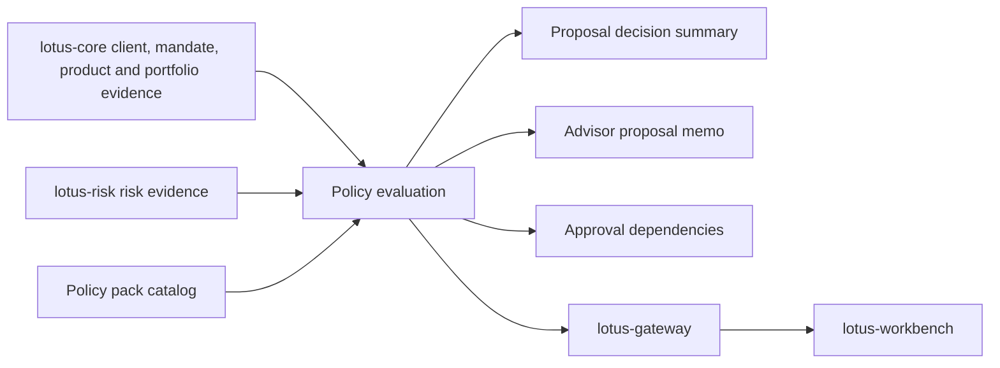

# RFC-0025: Enterprise Suitability and Best-Interest Policy Packs

| Metadata | Details |
| --- | --- |
| **Status** | DRAFT |
| **Created** | 2026-05-22 |
| **Owner** | `lotus-advise` |
| **Business Sponsor Persona** | advisory desk head, compliance officer, product governance, relationship manager, risk control, audit, sales/pre-sales |
| **Depends On** | RFC-0010, RFC-0013, RFC-0015, RFC-0020, RFC-0021, RFC-0022, RFC-0024 |
| **Related Source Authorities** | `lotus-core` for client, mandate, portfolio, product, booking-center, and eligibility context; `lotus-risk` for risk evidence; future product-governance source owner where applicable |
| **Doc Location** | `docs/rfcs/RFC-0025-enterprise-suitability-and-best-interest-policy-packs.md` |

---

## 0. Executive Summary

RFC-0025 defines enterprise suitability and best-interest policy packs for `lotus-advise`.

The current advisory backend has a meaningful suitability foundation through RFC-0010 and RFC-0021,
but a bank-buyable advisory product needs configurable policy packs that can express jurisdiction,
client segment, mandate, product, risk, cost, conflict, disclosure, and approval obligations.

This RFC turns suitability from a bounded scanner into a governed policy capability:

1. policy packs are versioned,
2. rules are source-backed and explainable,
3. outcomes carry reason codes and evidence refs,
4. approvals and disclosures are derived from policy,
5. degraded or missing source evidence is explicit,
6. every suitability decision is replayable against the policy version used at the time.

This RFC does not encode legal advice or hard-code a bank's proprietary policy. It creates the
governed mechanism for bank-configured policy packs that can support regimes such as MiFID
suitability, SEC Reg BI-style best-interest review, MAS/HK private-banking controls, internal
product governance, and bank-specific advisory desk policies without pretending those regimes are
identical.

---

## 1. Problem Statement

Private banks do not buy generic recommendation software. They need advisory controls that prove a
recommendation is aligned with:

1. client profile and risk tolerance,
2. investment objectives and time horizon,
3. liquidity needs and concentration posture,
4. mandate, restrictions, and booking-center obligations,
5. product eligibility and complexity,
6. cost, fee, and transaction-friction visibility,
7. conflicts and disclosure requirements,
8. jurisdiction-specific review and approval obligations.

The existing suitability posture is useful but not enough for enterprise adoption because it lacks:

1. configurable policy-pack identity,
2. jurisdiction and client-segment applicability,
3. product governance and complexity rules,
4. best-interest and conflict controls,
5. approval workflow integration at policy-rule granularity,
6. policy version replay,
7. operational diagnostics for missing upstream source data.

## 2. Business Outcomes

RFC-0025 targets these outcomes:

1. **Make advisory governance configurable**
   banks can express their policy controls without code forks.
2. **Increase regulatory and compliance confidence**
   every advisory proposal carries policy version, rule results, evidence refs, and review posture.
3. **Improve advisor guidance**
   advisors can see why a proposal is blocked, pending review, or ready before reaching client
   conversation.
4. **Reduce manual review effort**
   routine compliant proposals can proceed faster, while complex or conflicted proposals are routed
   to the right approval path.
5. **Differentiate Lotus commercially**
   demonstrate a control framework that buyers recognize as bank-grade rather than prototype-grade.
6. **Enable future client-ready materials**
   RFC-0024 memo and RFC-0023 narrative can reuse policy outcomes and disclosure requirements.

## 3. Current Baseline

Implementation-backed foundations:

1. RFC-0010 suitability scanner,
2. RFC-0021 enterprise suitability policy foundations,
3. backend-owned proposal decision summary,
4. proposal alternatives and ranking,
5. lifecycle approvals and consent posture,
6. canonical risk lens and allocation convergence,
7. execution and report-readiness boundary evidence,
8. data-product and trust telemetry posture.

Gaps:

1. no first-class policy-pack catalog,
2. no versioned policy-pack runtime selection,
3. no policy applicability model by jurisdiction, booking center, client segment, product, or
   mandate,
4. no granular best-interest, conflict, product-complexity, and disclosure rule families,
5. no policy outcome persistence independent of proposal version,
6. no rule-level replay against policy version,
7. no clear upstream source-readiness map for client, mandate, and product governance fields.

## 4. Regulatory and Product Framing

This RFC uses regulatory-style vocabulary but must not hard-code legal interpretation.

Supported design principle:

1. Lotus provides a configurable policy-pack engine, evidence model, and audit trail.
2. Banks configure jurisdiction and internal policy content.
3. `lotus-advise` records what policy version evaluated a proposal and what evidence was used.
4. Compliance/legal teams remain responsible for policy content and approval thresholds.

Policy packs may model controls associated with:

1. suitability,
2. best interest,
3. appropriateness,
4. product eligibility,
5. complex product review,
6. concentration and risk budget,
7. liquidity and time horizon,
8. cost and fee reasonableness,
9. conflict and inducement disclosure,
10. ESG/sustainability preference alignment where configured,
11. vulnerable-client or professional-client segmentation where configured.

## 5. Domain Vocabulary

| Concept | Preferred Term | Avoid |
| --- | --- | --- |
| Configured rule family | policy pack | hard-coded ruleset |
| Rule version used in evaluation | policy version | latest config |
| Client objective constraints | investment objectives, risk tolerance, time horizon, liquidity needs | profile blob |
| Governed recommendation outcome | suitability outcome, best-interest outcome | pass/fail only |
| Product governance | product eligibility, target market, complexity, restrictions | product flag |
| Advisory reviewer action | approval dependency, review route | manual escalation |
| Source-backed explanation | reason code and evidence ref | text-only explanation |
| Missing prerequisite | source readiness gap | null field |
| Proposal decision state | READY, PENDING_REVIEW, BLOCKED | approved-ish |

## 6. Target Capability

The target capability introduces:

1. `PolicyPackCatalog`
2. `PolicyPackVersion`
3. `PolicyApplicability`
4. `PolicyRule`
5. `PolicyEvaluationRequest`
6. `PolicyEvaluationResult`
7. `PolicyRuleResult`
8. `ApprovalDependency`
9. `DisclosureRequirement`
10. `SourceReadinessGap`
11. `PolicyReplayContext`

### 6.1 Policy-Pack Families

Initial families:

1. `SUITABILITY_CORE`
2. `BEST_INTEREST_CORE`
3. `JURISDICTION_DISCLOSURE`
4. `PRODUCT_ELIGIBILITY`
5. `COMPLEX_PRODUCT_REVIEW`
6. `RISK_AND_CONCENTRATION`
7. `LIQUIDITY_AND_TIME_HORIZON`
8. `COST_AND_FEE_REASONABLENESS`
9. `CONFLICT_AND_INCENTIVE`
10. `SUSTAINABILITY_PREFERENCE`

### 6.2 Policy Outcome Model

Each evaluation must return:

1. `policy_pack_id`,
2. `policy_version`,
3. `applicability_basis`,
4. `overall_status`,
5. `rule_results`,
6. `approval_dependencies`,
7. `required_disclosures`,
8. `client_conversation_prompts`,
9. `source_readiness_gaps`,
10. `evidence_refs`,
11. `replay_context_hash`,
12. `generated_at`.

Top-level statuses must use existing status vocabulary:

1. `READY`
2. `PENDING_REVIEW`
3. `BLOCKED`

## 7. Source Authority and Dependency Map

| Evidence | Source authority | Advise responsibility |
| --- | --- | --- |
| Client risk profile, objectives, time horizon, liquidity needs | `lotus-core` or future client/mandate authority | Consume source refs; do not invent profile values. |
| Portfolio holdings, cash, exposure, valuation | `lotus-core` | Use canonical proposal and simulation evidence. |
| Product eligibility, complexity, restrictions | `lotus-core` or product-governance authority | Consume canonical eligibility evidence when available; otherwise return source readiness gap. |
| Risk, concentration, stress evidence | `lotus-risk` | Use risk lens and degraded risk posture without recalculating methodology. |
| Costs, fees, transaction frictions | RFC-0016 / source owner | Use only implementation-backed cost evidence. |
| Jurisdiction policy content | Bank-configured policy pack | Version, validate, evaluate, and persist outcome. |
| Approval workflow | `lotus-advise` | Map policy outcomes to advisory approval dependencies. |
| Memo/narrative disclosure usage | RFC-0024/RFC-0023 | Project policy outcomes into memo and narrative only after evaluation. |

## 8. Architecture Direction

Rules:

1. policy evaluation belongs in `lotus-advise` because it is advisory-proposal-specific,
2. source data remains owned by the relevant source authority,
3. policy packs are versioned and immutable after activation,
4. proposal replay uses the policy version effective at evaluation time,
5. UI must consume policy outcomes; it must not reimplement rule evaluation.

## 9. Proposed API Direction

Proposed endpoints under the current advisory route family:

1. `GET /advisory/policy-packs`
   list active and draft policy-pack metadata.
2. `GET /advisory/policy-packs/{policy_pack_id}/versions/{version}`
   retrieve policy-pack version metadata and rule summary.
3. `POST /advisory/proposals/{proposal_id}/versions/{version_id}/policy-evaluations`
   evaluate a proposal version against selected or applicable policy packs.
4. `GET /advisory/proposals/{proposal_id}/policy-evaluations/{evaluation_id}`
   retrieve persisted evaluation evidence.
5. `POST /advisory/proposals/{proposal_id}/policy-evaluations/{evaluation_id}/replay`
   replay against the original policy version and source evidence refs.

OpenAPI requirements:

1. examples for `READY`, `PENDING_REVIEW`, and `BLOCKED`,
2. explicit descriptions for policy version, applicability, rule results, and source gaps,
3. examples showing missing product eligibility and missing cost evidence,
4. correlation and idempotency header documentation,
5. business-readable descriptions suitable for Swagger users.

## 10. Policy Configuration Model

Policy packs should be data-driven but constrained.

A policy rule includes:

1. stable rule id,
2. family,
3. version,
4. severity,
5. applicability condition,
6. required evidence fields,
7. evaluation expression or named evaluator,
8. outcome mapping,
9. approval dependency mapping,
10. disclosure mapping,
11. source gap handling,
12. explainability text templates.

Configuration rules:

1. rule ids are upper snake case,
2. rule definitions are schema-validated before activation,
3. activated versions are immutable,
4. policy pack activation requires dry-run validation against sample proposal fixtures,
5. unsupported evidence requirements cause `PENDING_REVIEW` or `BLOCKED`, not silent pass.

## 11. Security, Compliance, and Audit

Required controls:

1. policy-pack version activation audit event,
2. proposal evaluation audit event,
3. replay audit event,
4. immutable policy version used in proposal decision,
5. source-readiness gaps retained in compliance/audit projections,
6. no sensitive client identifiers in metrics labels,
7. no raw product or client policy payloads in logs,
8. tenant and role checks for policy catalog access where applicable.

Forbidden behavior:

1. latest-policy replay overwriting historical policy truth,
2. defaulting missing profile/product evidence to eligible,
3. hiding conflict or disclosure dependencies from client-ready memo preparation,
4. client-facing projection without policy and approval posture,
5. local duplication of risk or product methodology owned upstream.

## 12. Observability and Operations

Metrics:

1. policy evaluations by overall status and policy family,
2. rule result counts by family, status, and severity,
3. source readiness gaps by source family,
4. policy evaluation duration,
5. replay success/failure counts by reason code,
6. policy-pack activation count by status.

Diagnostics:

1. active policy-pack versions,
2. unavailable source authorities,
3. top blocked rule families,
4. proposals pending compliance review by reason family,
5. policy version drift between draft and active environments.

## 13. Test Strategy

Unit tests:

1. rule evaluator behavior for each first-wave policy family,
2. applicability selection by jurisdiction, client segment, mandate, and product family,
3. missing source evidence handling,
4. approval dependency mapping,
5. disclosure requirement mapping,
6. policy version immutability.

Contract tests:

1. OpenAPI completeness for policy catalog and evaluation endpoints,
2. stable status vocabulary,
3. examples include blocked and pending-review policy results,
4. schema validation for policy-pack configuration.

Integration tests:

1. proposal version to policy evaluation,
2. persisted evaluation retrieval,
3. proposal decision summary consumes policy outcome,
4. advisor memo consumes policy outcome,
5. replay against original policy version.

Live proof:

1. canonical proposal evaluates to a known policy posture,
2. missing source scenario produces explicit source-readiness gaps,
3. compliance/audit projection preserves rule outcomes and evidence refs.

## 14. Implementation Slices

### Slice 0 - Current-State Source Map and Regulatory Boundary Review

Outcome:

1. map existing suitability fields, source gaps, and compliance claims.

Acceptance gate:

1. no legal/regulatory content is hard-coded without configuration ownership,
2. upstream source gaps are recorded in `docs/rfcs/WTBD.md`.

### Slice 1 - Platform Automation and Policy-Pack Scaffolding

Outcome:

1. decide whether reusable policy-pack schema validation and docs templates belong in
   `lotus-platform`.

Acceptance gate:

1. either implement reusable validation scaffolding or record a no-platform-change decision.

### Slice 2 - Cleanup and Module Boundary

Outcome:

1. move suitability-related logic behind a clear policy module boundary.

Acceptance gate:

1. controller and infrastructure layers do not own rule decisions.

### Slice 3 - Policy-Pack Catalog and Configuration Validation

Outcome:

1. implement schema-validated policy packs, versions, activation posture, and fixtures.

Acceptance gate:

1. invalid pack definitions fail fast with useful diagnostics.

### Slice 4 - Evaluation Engine and Rule Families

Outcome:

1. implement first-wave suitability, best-interest, product-eligibility, disclosure, risk, liquidity,
   cost, and conflict rule families.

Acceptance gate:

1. meaningful unit tests cover ready, pending review, blocked, and missing-source cases.

### Slice 5 - Proposal Integration and Persistence

Outcome:

1. persist evaluations against proposal versions and integrate policy outcomes into decision
   summary and memo preparation.

Acceptance gate:

1. replay proves original policy version and source refs are preserved.

### Slice 6 - Certified APIs and OpenAPI

Outcome:

1. expose policy catalog, evaluation, retrieval, and replay endpoints.

Acceptance gate:

1. OpenAPI/vocabulary/no-alias gates pass with examples and error contracts.

### Slice 7 - Gateway, Workbench, and Product-Governance WTBDs

Outcome:

1. document downstream product-surface and upstream product-governance changes.

Acceptance gate:

1. `docs/rfcs/WTBD.md` records each owner, expected contract, and completion evidence.

### Slice 8 - Implementation Proof

Outcome:

1. capture canonical and degraded policy evaluation evidence.

Acceptance gate:

1. evidence includes policy version, rule results, source gaps, and replay output.

### Slice 9 - Second-Last Hardening and Review

Outcome:

1. review policy semantics, naming, source authority, privacy, logs, metrics, and tests.

Acceptance gate:

1. no superficial pass/fail-only suitability logic remains for enterprise claims.

### Slice 10 - Final Closure

Outcome:

1. update README, wiki, supported features, RFC status, context, and CI evidence.

Acceptance gate:

1. implementation and docs are merged to `main`, required CI is green, and wiki source is
   publishable.

## 15. Supported-Features Ledger

| Capability | Initial RFC state | Promotion rule |
| --- | --- | --- |
| Policy-pack catalog | Proposed | Promote only after schema validation, catalog APIs, and OpenAPI examples pass. |
| Suitability and best-interest evaluation | Proposed | Promote only after rule families are implemented with proposal integration and replay. |
| Product eligibility and complexity review | Proposed | Promote only when source-backed product governance evidence is available or missing-source posture is explicit. |
| Disclosure requirement mapping | Proposed | Promote only after policy-pack configuration maps disclosures into memo/narrative paths. |
| Approval dependency mapping | Proposed | Promote only after lifecycle approval integration is tested. |
| Jurisdiction-specific packs | Configurable future | Promote only per implemented pack version with bank-approved policy content and evidence. |

## 16. Acceptance Criteria

RFC-0025 is implemented only when:

1. policy-pack catalog and version model are implemented,
2. policy-pack definitions are schema-validated and immutable after activation,
3. proposal policy evaluation is persisted and replayable,
4. source-readiness gaps are visible and not defaulted away,
5. rule outcomes map to proposal decision summary, memo, approval, and disclosure posture,
6. OpenAPI and vocabulary gates pass,
7. meaningful unit, contract, integration, and live evidence exists,
8. downstream Gateway/Workbench and upstream source-owner WTBDs are complete or explicitly
   deferred,
9. documentation and supported-feature claims reflect implementation-backed truth.

## 17. Risks and Trade-Offs

| Risk | Mitigation |
| --- | --- |
| Policy engine becomes legal-content hard-coding | Keep policy content configurable, versioned, and bank-owned. |
| Missing source data is treated as eligible | Source gaps must create `PENDING_REVIEW` or `BLOCKED` outcomes. |
| Rule language becomes generic and non-bankable | Use private-banking vocabulary and business-readable explanations. |
| UI duplicates rule logic | Expose backend-owned policy outcomes and prohibit UI evaluation. |
| Product-governance source owner is not ready | Record explicit WTBD and keep product rules pending rather than inventing evidence. |

## 18. Open Questions Before Implementation

1. What first-wave jurisdictions should be modeled as sample policy packs?
2. Which product-governance authority owns product eligibility and complexity source data?
3. Should policy-pack activation be API-driven, file-driven, or operational-admin driven for the
   first implementation?
4. Which approval dependencies should block proposal lifecycle transitions versus create review
   tasks only?
5. What bank-specific disclosure templates are required before client-facing projections can be
   promoted?
