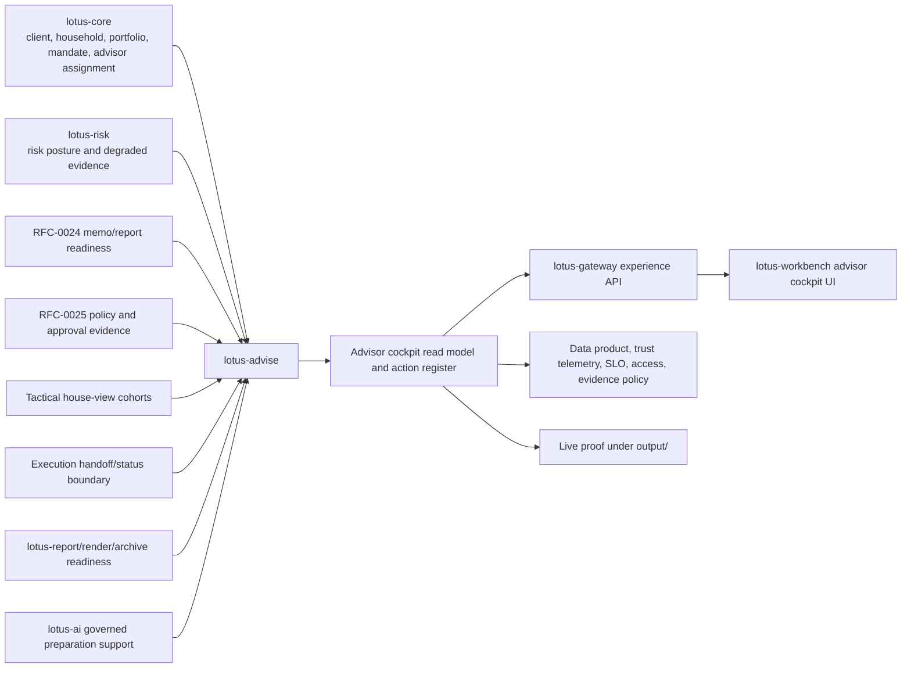

# RFC-0026: Advisor Cockpit Operating Workflow

| Metadata | Details |
| --- | --- |
| **Status** | IMPLEMENTED for source-owned first-wave advisor cockpit operating workflow |
| **Created** | 2026-05-22 |
| **Last Tightened** | 2026-05-27 |
| **Owner** | `lotus-advise` for advisor-cockpit workflow authority, action semantics, and evidence-product truth |
| **Business Sponsor Persona** | relationship manager, investment advisor, desk head, advisory support, compliance reviewer, operations, sales/pre-sales, client-demo lead |
| **Primary Business Outcome** | make advisory work operable from one backend-owned cockpit that tells advisors what needs attention, why it matters, what evidence exists, what is blocked, and what next action is allowed |
| **Depends On** | RFC-0004, RFC-0013, RFC-0017, RFC-0018, RFC-0019, RFC-0021, RFC-0022, RFC-0024, RFC-0025 |
| **Cross-Repository Scope** | `lotus-advise`, `lotus-core`, `lotus-risk`, `lotus-report`, `lotus-render`, `lotus-archive`, `lotus-ai`, `lotus-gateway`, `lotus-workbench`, `lotus-manage`, `lotus-platform` |
| **Compatibility Posture** | backward compatibility is not a constraint; breaking API/contract changes are allowed when they are the cleanest design, but every affected upstream or downstream consumer must be updated in this RFC before closure |
| **Tightening Branch** | `rfc0026-advisor-cockpit-gold-standard` |
| **Implementation Branching Rule** | implementation may continue on this branch or a follow-on RFC-0026 feature branch, but all branch names, PRs, commits, checks, and cross-repo closures must be recorded in RFC closure evidence |
| **Doc Location** | `docs/rfcs/RFC-0026-advisor-cockpit-operating-workflow.md` |

---

## 0. Executive Summary

RFC-0026 creates the `AdvisorCockpitOperatingSnapshot`: the governed advisory operating product that
turns proposal lifecycle, workspace, policy, memo, approval, consent, house-view, report, execution,
source-readiness, supportability, and client-meeting context into one advisor-facing operating
workflow.

The cockpit is not a generic task board and not a UI-only dashboard. It is the private-banking
operating surface that answers:

1. which client, household, portfolio, or proposal needs attention,
2. why it needs attention,
3. what evidence supports the priority,
4. what is ready for advisor action,
5. what is blocked by source data, policy, approval, memo, report, execution, or dependency posture,
6. who owns the next step,
7. when the action is due or aging,
8. what meeting-preparation or follow-up material can be used,
9. how Gateway, Workbench, operations, audit, and sales/pre-sales can consume the same backend truth.

The implementation must deliver the complete cockpit outcome end to end. This RFC does not allow a
"backend read model done, UI later" closure, a "downstream work recorded elsewhere" closure, or a
"worklist exists but unsupported by evidence" closure. If a cross-repository change is required to
realize the cockpit's business value, it is part of this RFC's implementation program and must be
merged, validated, documented, and reflected in supported-features material before RFC-0026 is
marked implemented.

RFC-0026 must keep `lotus-advise` as the advisory workflow authority. `lotus-gateway` and
`lotus-workbench` expose the cockpit product experience. `lotus-core`, `lotus-risk`,
`lotus-report`, `lotus-render`, `lotus-archive`, `lotus-ai`, and `lotus-manage` remain owners of
their own source domains and must be changed inside this RFC only where cockpit value requires a
contract, evidence, or integration update.

---

## 1. Critical Review of the Previous RFC

| Area | Previous state | Gap | Tightening applied |
| --- | --- | --- | --- |
| Scope | Focused on an advisor cockpit read model, action items, meeting preparation, and downstream UI realization. | Cross-repo dependencies were not execution-blocking, and downstream work was pointed to WTBD rather than included in the RFC. | Scope now includes all upstream, downstream, platform, documentation, supported-features, and product-surface work required for the cockpit supported claim. |
| Compatibility | Proposed new advisory route family without a clear migration posture. | Did not state whether breaking cleanup and consumer migration are allowed. | Compatibility is explicit: backward compatibility is not a constraint, but every affected consumer must be migrated in this RFC. |
| Architecture | Correctly said `lotus-advise` owns action semantics while Gateway/Workbench own composition/UI. | Did not fully define source authority, cockpit data product, entitlement boundary, acknowledgement ownership, CRM/calendar boundaries, or downstream execution/report ownership. | Added source authority matrix, canonical flow, ownership rules, entitlement projection, and downstream consumer obligations. |
| Product gap handling | Covered worklists, preparation packets, priorities, approval/evidence items, and supportability. | Did not allocate broader bank-buyable gaps such as advisor cockpit, maker-checker UX, SLA aging, CRM handoff, collaboration, house-view actioning, AI preparation, commercial packaging, and operational dashboards. | Added product-gap allocation that decides what RFC-0026 owns directly and what it consumes from RFC-0024, RFC-0025, RFC-0027, and RFC-0028. |
| Data mesh | Not present beyond existing proposal lifecycle declarations. | Did not require a cockpit data product, trust telemetry, SLO/access/evidence policy, certification, or Gateway/Workbench mesh consumption. | Added `AdvisorCockpitOperatingSnapshot:v1` and `AdvisoryActionItemRegister:v1` as governed data-product outcomes. |
| API design | Listed basic cockpit endpoints. | Did not cover versioned contracts, cursor pagination, stable sort, acknowledgement idempotency, batch retrieval, meeting packet variants, CRM/export seam, dashboard support, or complete Swagger examples. | Added a certified API/contract direction with error handling, idempotency, correlation IDs, OpenAPI quality, and consumer migration requirements. |
| Evidence and testing | Included unit, contract, integration, and live proof. | Did not require source-critical review, cross-repo Gateway/Workbench proof, browser proof, security proof, performance proof, data-mesh proof, or no-unsupported-claim review. | Added complete test/evidence strategy, implementation proof slice, and second-last hardening slice. |
| Platform automation | Had only a decision point for scaffolding. | Did not require reusable platform improvements when repeatable gaps are found. | Added mandatory platform automation and scaffolding improvement slice. |
| Documentation | Required README/wiki/supported-features updates. | Did not specify audience, implementation-backed grounding, no-duplication rules, wiki publication, or demo/sales usefulness. | Added documentation-as-product requirements across developer, business, operations, sales, pre-sales, demo, and client-pitch audiences. |
| Communication | Not covered. | User requires a LinkedIn post after completion. | Added post-completion communication slice using the LinkedIn thought-leadership workflow. |

Decision:

1. RFC-0026 owns the full advisor cockpit operating workflow.
2. No implementation work should start until this RFC is strong enough to execute with minimal
   ambiguity.
3. No WTBD entry may be used as an execution substitute. Any required upstream or downstream work
   must appear as an RFC-0026 slice, acceptance criterion, and closure evidence item.

### 1.1 2026-05-27 Implementation Readiness Decision

RFC-0026 is ready to enter implementation after this tightening. The decision is based on the
current `lotus-advise` mainline state after RFC-0023, RFC-0024, and RFC-0025 closure:

1. RFC-0023 is implemented for advisor-review proposal narrative evidence. Compliance-review,
   client-draft, client-ready publication, and external client communication remain gated.
2. RFC-0024 is implemented for advisor-use proposal memo evidence. Client-ready memo publication,
   external client communication, and full bank-demo/RFP claims remain gated.
3. RFC-0025 is implemented for advisor/compliance policy evaluation evidence, active
   `AdvisoryPolicyEvaluationRecord:v1`, Gateway/Workbench policy posture, and canonical
   `PB_SG_GLOBAL_BAL_001` live validation. Completed approval/waiver authority, completed
   sign-off authority, client-ready policy publication, external client communication, and full
   RFC-0028 bank-demo/RFP claims remain gated.
4. RFC-0026 may consume those evidence products, but it must not promote them into broader claims.
   The cockpit can show policy posture, memo readiness, and narrative readiness; it cannot claim
   client-ready signoff or external client communication.
5. The first implementation slice must start from clean `main`, with stranded-truth
   reconciliation completed and recorded in slice evidence.
6. Each implementation slice must be finished, tested, reviewed, committed, and in a solid CI
   posture before the next slice starts.

---

## 2. Problem Statement

`lotus-advise` already has a strong advisory backbone:

1. advisory proposal simulation through `POST /advisory/proposals/simulate`,
2. deterministic proposal artifact generation through `POST /advisory/proposals/artifact`,
3. persisted proposal lifecycle with immutable versions and append-only workflow events,
4. approvals and consent capture,
5. proposal decision summaries,
6. proposal alternatives,
7. advisory workspaces with save, resume, compare, evaluate, replay, and lifecycle handoff,
8. execution handoff/status boundary evidence,
9. report-request posture,
10. tactical house-view affected-cohort evaluation,
11. `/platform/capabilities` supportability evidence,
12. OpenAPI, vocabulary, no-alias, data-product, trust telemetry, runtime-smoke, Docker, dependency,
    security, and production-profile guardrail checks.

Those are strong building blocks, but they do not yet give an advisor an operating workflow. A
relationship manager or investment advisor should not need to search proposal-by-proposal, run
manual queries, or depend on UI-local inference to know:

1. which clients need advisory attention today,
2. which proposals are ready for client discussion,
3. which proposals are blocked by source data, policy, memo, report, approval, consent, or
   downstream readiness,
4. which approvals or maker-checker reviews are aging,
5. which meetings need preparation,
6. which house-view or tactical instruction affected the book,
7. which follow-ups must be sent to the client, compliance, investment desk, operations, or CRM,
8. which dependency degradation affects advisory work,
9. which actions are advisory-owned versus owned by CRM, report, archive, execution, DPM, or other
   systems.

Without a backend-owned cockpit product, downstream surfaces will rebuild worklists from partial
data. That creates duplicate logic, entitlement risk, inconsistent priorities, unsupported demo
claims, and a product that feels less bank-buyable than the underlying services deserve.

---

## 3. Business Outcomes

RFC-0026 must deliver these outcomes:

1. **Advisor scale**
   advisors can manage a larger book through prioritized, evidence-backed action lists.
2. **Client-service quality**
   meeting preparation, client follow-up, proposal readiness, and approval posture are visible
   before client interaction.
3. **Operational control**
   blocked proposals, aging approvals, source gaps, report readiness, execution handoff issues, and
   degraded dependencies surface early.
4. **Governance confidence**
   next actions are derived from lifecycle, policy, memo, approval, source-readiness, and
   supportability evidence owned by the backend.
5. **Maker-checker support**
   advisory, compliance, investment-desk, and operations handoffs have clear owner roles, due
   posture, reason codes, acknowledgement state, and audit lineage.
6. **Workbench product value**
   Workbench displays a true advisor cockpit through Gateway/BFF instead of constructing local
   workflow state.
7. **Data-product maturity**
   cockpit snapshots and action-item registers become governed data products with trust telemetry,
   certification, access, SLO, evidence, lineage, and catalog posture.
8. **Commercial readiness**
   sales/pre-sales can demonstrate a realistic advisor day-in-the-life flow using
   implementation-backed docs and proof.

---

## 4. Scope and Non-Scope

### 4.1 In Scope

RFC-0026 includes all work required to deliver a supported advisor cockpit outcome:

1. `lotus-advise` cockpit domain model, action-item register, snapshot builder, priority engine,
   next-action engine, acknowledgement/audit behavior, meeting-preparation packet, follow-up model,
   SLA aging model, source-readiness projection, supportability projection, persistence/read-model
   strategy, APIs, OpenAPI, tests, metrics, logs, audit, lineage, data-product declarations, trust
   telemetry, docs, wiki, and supported-features truth.
2. `lotus-core` source enhancements when the cockpit needs richer client, household, account,
   mandate, coverage-team, advisor-assignment, relationship tier, booking-center, portfolio,
   objective, restriction, suitability-classification, meeting, or client-follow-up source refs.
3. `lotus-risk` source enhancements when cockpit priority or readiness needs risk-review,
   concentration, stress, drawdown, liquidity, issuer, country, sector, private-asset, or degraded
   risk evidence.
4. `lotus-report`, `lotus-render`, and `lotus-archive` changes required so proposal memo/report
   package readiness, render/archive status, retention posture, retrieval refs, and report blockers
   can be surfaced in cockpit action items.
5. `lotus-ai` workflow-pack changes required only for governed meeting-preparation or follow-up
   drafting support that is explicitly review-gated and evidence-bound. AI must not own action
   priority or workflow decisions.
6. `lotus-gateway` and `lotus-workbench` changes required to expose the cockpit snapshot,
   action-list, preparation packet, approval/SLA queues, acknowledgement flow, CRM handoff seam,
   supportability state, and browser-validated advisor experience.
7. `lotus-manage` changes required only where the cockpit must surface DPM or campaign handoff
   boundaries for tactical house-view actioning, without moving discretionary management ownership
   into `lotus-advise`.
8. `lotus-platform` automation/scaffolding improvements when reusable gaps are discovered in API
   certification, Swagger quality, cursor-pagination patterns, action-item read-model scaffolding,
   observability, health/readiness, structured logging, error handling, test scaffolding, CI
   defaults, data-mesh onboarding, documentation scaffolding, governance hooks, security baseline,
   or live-evidence capture.
9. README, wiki, supported-features, architecture docs, operator docs, sales/pre-sales demo
   material, commercial proof, and post-completion communication.

### 4.2 Non-Scope

RFC-0026 does not own:

1. full CRM ownership, customer master, calendar scheduling, or external meeting systems,
2. discretionary portfolio-management campaigns or trade-approval workflows, except cockpit-visible
   handoff posture,
3. external OMS or broker execution as a system of record, except cockpit-visible execution
   readiness and status ownership boundaries,
4. full proposal memo generation, which is RFC-0024, except cockpit-critical memo-readiness and
   meeting packet consumption,
5. full enterprise policy-pack management, which is RFC-0025, except cockpit-critical policy
   readiness, approval dependencies, and source gaps,
6. broad advisory AI copilot, which is RFC-0027, except cockpit-critical governed preparation or
   follow-up drafting support,
7. full bank demo and RFP package, which is RFC-0028, except cockpit-specific proof and
   supported-claim material,
8. legal or regulatory advice.

Non-scope does not mean "defer integration." If a non-scope item blocks the cockpit supported
claim, RFC-0026 must implement the cockpit-critical subset or remove the unsupported claim.

---

## 5. Product Gap Allocation

| Product area or gap | RFC-0026 treatment | Owning RFC or repo for broader scope |
| --- | --- | --- |
| Advisory proposal simulation needs richer goals, constraints, household/account context, product eligibility, and scenario comparison | In scope when cockpit priority, meeting prep, source readiness, or next action needs those refs. | `lotus-core` owns source truth; RFC-0022 owns alternative construction. |
| Proposal artifact generation needs client-ready memo/PDF narrative | Cockpit consumes memo/report readiness and exposes blockers; it does not own full memo generation. | RFC-0024, `lotus-report`, `lotus-render`, `lotus-archive`. |
| Persisted lifecycle needs business-facing approval queues, supervisory dashboards, maker-checker UX, SLA aging | Directly in scope as approval work queues, maker-checker action items, desk/compliance views, SLA aging, acknowledgement audit, and supervisory cockpit surfaces. | `lotus-advise`, Gateway, Workbench. |
| Approval and consent workflow needs jurisdiction-specific approval rules, consent variants, escalation rules, compliance sign-off packs | Cockpit surfaces required approvals, consent gaps, escalation posture, and sign-off-pack readiness. It consumes RFC-0025 policy truth when available. | RFC-0025 owns policy packs and sign-off rules. |
| Decision summary needs best-interest narrative, fee/conflict rationale, rejected-alternative explanation | Cockpit surfaces decision summary readiness and reason families; it does not author the narrative. | RFC-0024 and RFC-0025. |
| Suitability policy needs regulatory policy packs and complex product approvals | Cockpit exposes policy-driven action items and blocked/pending review posture. | RFC-0025. |
| Proposal alternatives need cost-aware, tax-aware, liquidity-aware, risk-budget-aware, private-assets-aware strategies | Cockpit shows alternative-selection blockers, rejected-alternative review posture, and source gaps only when evidence exists. | RFC-0022, RFC-0016, `lotus-risk`, `lotus-core`. |
| Risk lens needs broader stress, VaR/drawdown, issuer/country/sector, liquidity, private assets, climate/geopolitical scenarios | Cockpit surfaces risk-review work items and degraded risk posture; missing risk evidence must be explicit. | `lotus-risk`. |
| Advisory workspace needs full advisor cockpit | Directly in scope. RFC-0026 is the cockpit owner: meeting prep, action items, follow-ups, queues, collaboration boundaries, CRM handoff seam, supportability, Gateway/Workbench realization. | `lotus-advise`, Gateway, Workbench. |
| Workspace AI rationale needs grounded client-ready commentary, model governance, human review, prompt/output lineage | Cockpit may invoke or surface governed preparation/follow-up drafts only through `lotus-ai` and review state. | RFC-0027 and `lotus-ai`. |
| Execution handoff/status needs adapters, order lifecycle reconciliation, exception management, OMS/broker story | Cockpit exposes readiness, handoff status, exception posture, and ownership boundary; it does not become execution SOR. | RFC-0017 and downstream execution owners. |
| Report request seam needs polished proposal pack generation | Cockpit exposes memo/report/render/archive readiness and blockers. | RFC-0024, `lotus-report`, `lotus-render`, `lotus-archive`. |
| Tactical house-view cohorts need Workbench/Gateway/Manage productization | Cockpit surfaces affected advisory cohorts, advisor actioning, and evidence trail; DPM campaign ownership remains in `lotus-manage`. | `lotus-manage`, Gateway, Workbench for broader campaign flow. |
| Capability discovery needs sales/demo surfacing and operational dashboards | Cockpit supportability is in scope through capabilities, metrics, and operational diagnostics. | Gateway/Workbench consume; RFC-0028 owns broader demo packaging. |
| Non-functional posture needs load benchmarks, SLO dashboards, tenant/legal-entity configuration, DR/RTO/RPO evidence | In scope for cockpit APIs and cockpit data products. | `lotus-platform` owns reusable standards. |
| Commercial packaging needs RFP pack, architecture deck, security pack, demo scripts, ROI story, product one-pager | In scope for cockpit-specific one-pager/demo notes/security posture/RFP-support excerpt. | RFC-0028 owns full bank-demo and RFP package. |

---

## 6. Domain Vocabulary

| Concept | Preferred Term | Avoid |
| --- | --- | --- |
| Advisor daily operating surface | advisor cockpit | dashboard |
| Work item | advisory action item | generic task card |
| Required next step | next required action | UI-generated CTA |
| Client or household focus | client focus | lead |
| Proposal state for advisor use | proposal readiness | raw status badge |
| Client preparation | meeting preparation packet | notes blob |
| Evidence issue | source readiness gap | missing field |
| Approval dependency | approval dependency | escalation flag |
| Aging approval | SLA aging | overdue badge without basis |
| Relationship-manager follow-up | client follow-up | todo |
| Compliance/investment desk handoff | supervisory review item | back-office ticket |
| Book impact | affected advisory cohort | affected users |
| Downstream boundary | ownership boundary | integration note |
| Supportability posture | dependency readiness | server problem |

---

## 7. Current Implementation Baseline

Implementation-backed foundations as of 2026-05-27:

1. proposal simulation and artifact routes exist,
2. proposal lifecycle, versions, workflow transitions, approvals, report requests, delivery summary,
   delivery events, execution handoff, execution updates, execution status, and async operation
   routes exist under `/advisory/proposals/*`,
3. proposal lifecycle persistence is modularized across command, read-model, persistence,
   projection, idempotency, async, materialization, and workflow-rule modules,
4. workspace routes exist for creation, draft actions, evaluation, save/resume, compare,
   reevaluation, saved-version replay, AI rationale, and lifecycle handoff,
5. proposal decision summary and proposal alternatives are backend-owned and appear across
   simulation, artifact, workspace, replay, and lifecycle surfaces,
6. tactical house-view affected-cohort evaluation exists for source-backed candidates,
7. `/platform/capabilities` exposes advisory supportability and bounded readiness/dependency
   posture,
8. `contracts/domain-data-products/lotus-advise-products.v1.json` currently declares active
   advisory workflow products for `AdvisoryProposalLifecycleRecord:v1`,
   `ProposalNarrativeEvidence:v1`, `AdvisoryProposalMemoEvidencePack:v1`, and
   `AdvisoryPolicyEvaluationRecord:v1`,
9. `contracts/trust-telemetry/` contains trust telemetry for proposal narrative, proposal memo,
   and policy evaluation evidence products,
10. RFC-0023, RFC-0024, and RFC-0025 are closed as bounded implementation-backed evidence
    capabilities and remain prerequisites for RFC-0026 cockpit evidence consumption,
11. `wiki/Supported-Features.md` correctly lists RFC-0026 as a planned runtime capability with no
    supported cockpit claim.

Current gaps:

1. no backend-owned advisor book-level worklist,
2. no cockpit data product,
3. no advisor-context entitlement projection,
4. no deterministic cockpit priority model,
5. no meeting-preparation packet contract,
6. no client follow-up or supervisory review queue contract,
7. no SLA aging or maker-checker dashboard semantics,
8. no cockpit acknowledgement/idempotency/audit behavior,
9. no Gateway/Workbench cockpit integration,
10. no load/performance proof for large advisor books,
11. no RFC-0026 canonical front-office automation module,
12. no supported-feature claim for advisor cockpit.

---

## 8. Target Capability

RFC-0026 introduces the following target capabilities:

1. `AdvisorCockpitOperatingSnapshot`
   book-level operating snapshot for an advisor, desk, coverage team, or supervisory role.
2. `AdvisoryActionItemRegister`
   paginated, filterable, evidence-backed action item register.
3. `AdvisorClientFocus`
   client or household focus summary with relevant portfolio/proposal/readiness context.
4. `ProposalReadinessSummary`
   proposal readiness projection that avoids raw lifecycle leakage into UI.
5. `MeetingPreparationPacket`
   source-backed preparation packet for a client, household, portfolio, proposal, or meeting
   context.
6. `ClientFollowUpItem`
   advisor-owned or externally owned follow-up item with clear ownership boundary.
7. `ApprovalWorkItem`
   policy/lifecycle/maker-checker review item with owner role, due posture, and SLA aging.
8. `EvidenceGapWorkItem`
   missing, stale, degraded, or not-yet-supported source evidence item.
9. `DownstreamReadinessWorkItem`
   report/render/archive/execution readiness item with owner boundary.
10. `HouseViewImpactWorkItem`
    action item derived from tactical house-view cohort impact.
11. `CockpitSupportabilitySummary`
    bounded operational posture for dependencies, freshness, degradation, and unsupported
    capabilities.
12. `CockpitAcknowledgementRecord`
    append-only acknowledgement audit for advisory-owned action items.

---

## 9. Architecture Direction

Rules:

1. `lotus-advise` owns cockpit action semantics, priorities, next required actions,
   acknowledgement audit, and advisory supportability posture.
2. Gateway may compose, filter, and adapt the cockpit contract for authenticated users, but it must
   not invent action priorities, owner roles, approval posture, source gaps, or readiness state.
3. Workbench consumes Gateway/BFF only. It must not infer workflow state from raw service endpoints.
4. `lotus-core` owns client, household, portfolio, account, mandate, booking-center, relationship,
   advisor assignment, and source profile truth.
5. `lotus-risk` owns risk methodology and degraded risk posture.
6. `lotus-report`, `lotus-render`, and `lotus-archive` own report, rendering, archive, retention,
   and retrieval truth.
7. `lotus-ai` owns workflow-pack execution and model telemetry. It cannot decide priorities,
   approvals, recommendations, or next actions.
8. `lotus-manage` owns DPM campaigns and portfolio-management operations. The cockpit may show
   handoff posture only when source-backed.
9. All action item reason codes must map to evidence refs, source refs, or explicit unsupported
   capability refs.
10. Source-degraded posture must be shown as source readiness, not hidden empty state.

---

## 10. Source Authority and Ownership

| Area | Source authority | Cockpit rule |
| --- | --- | --- |
| Proposal lifecycle, versions, workflow events | `lotus-advise` | Read from persisted proposal state and immutable version evidence. |
| Proposal decision summary and alternatives | `lotus-advise` | Surface readiness, material drivers, selection/rejection review posture, and missing evidence. |
| Workspace drafts and handoff | `lotus-advise` | Surface draft readiness, stale draft posture, handoff needs, and saved-version replay posture. |
| Policy, suitability, best-interest, approvals, disclosures | `lotus-advise` through RFC-0025 | Surface approval dependencies, sign-off needs, consent gaps, and policy blockers. |
| Memo/report package readiness | `lotus-advise`, `lotus-report`, `lotus-render`, `lotus-archive` | Surface memo-ready/report-ready/rendered/archived/blocker posture without taking over report/archive ownership. |
| Client, household, advisor assignment, mandate, portfolio, account | `lotus-core` | Show refs and source readiness; do not invent missing client facts. |
| Risk review and risk degradation | `lotus-risk` | Show risk action items and readiness/degraded posture; do not recalculate risk locally. |
| Execution handoff/status | `lotus-advise` for advisory posture; downstream provider for execution SOR | Preserve ownership-boundary evidence. |
| DPM campaigns and portfolio-management operations | `lotus-manage` | Surface advisory handoff or house-view actioning only where source-backed. |
| Product UI | `lotus-workbench` | Render cockpit through Gateway, including empty, degraded, blocked, and permission states. |
| Experience API | `lotus-gateway` | Publish authenticated cockpit contract and preserve source semantics. |
| Platform governance | `lotus-platform` | Provide reusable certification, scaffolding, data-mesh, CI, and evidence automation where gaps are repeatable. |

---

## 11. Data Product and Data Mesh Requirements

RFC-0026 must strengthen `lotus-advise` as a true data product producer.

### 11.1 Required Data Products

1. `lotus-advise:AdvisorCockpitOperatingSnapshot:v1`
   aggregate advisor/desk/coverage-team cockpit snapshot for operational consumption.
2. `lotus-advise:AdvisoryActionItemRegister:v1`
   paginated evidence-backed action-item register and acknowledgement/audit posture.

### 11.2 Producer Declaration Requirements

`contracts/domain-data-products/lotus-advise-products.v1.json` must be updated only when
implementation exists. The declaration must include:

1. product identity and version,
2. authoritative domain `advisory_workflow`,
3. request scope and supported bulk posture,
4. temporal semantics and freshness basis,
5. identifier refs such as `advisor_id`, `desk_id`, `client_ref`, `household_ref`, `portfolio_id`,
   `proposal_id`, `action_item_id`, and `correlation_id` where applicable,
6. trust metadata requirements,
7. current routes,
8. freshness and completeness policy,
9. lineage and evidence-access policy,
10. security profile,
11. approved consumers, including Gateway,
12. deprecation policy.

### 11.3 Trust, SLO, Access, and Evidence

Implementation must include:

1. repo-native trust telemetry snapshots for cockpit products,
2. platform catalog/certification updates when the platform contract requires them,
3. SLO policy for snapshot freshness, action-item completeness, source readiness, and dependency
   degradation,
4. access policy for advisor, desk head, compliance reviewer, operations, and demo roles,
5. evidence policy defining public customer, restricted customer, operator-only, and internal-only
   fields,
6. Gateway/Workbench discovery or trust-surfacing updates if product value requires them,
7. tests that keep declarations and trust telemetry aligned with platform validators.

---

## 12. API and Contract Direction

API design must be clean, version-aware, documented, and consumer-complete. Backward compatibility
is not required if a breaking design is cleaner, but all consumers must be updated inside this RFC.

### 12.1 Final `lotus-advise` Endpoints

The implemented endpoint set deliberately uses one action-item contract for advisor, desk-head,
supervisory, approval, readiness, and downstream-owner queues. That avoids duplicate route-specific
semantics and keeps Gateway and Workbench dependent on the Advise-owned projection rather than
reconstructing policy, memo, approval, report, execution, or house-view meaning locally.

1. `GET /advisory/cockpit/snapshot`
   returns the current advisor, desk, or coverage-team snapshot with projected action counts,
   top-priority actions, meeting-preparation packets, unsupported capabilities, and
   supportability posture.
2. `GET /advisory/cockpit/actions`
   returns paginated action items with stable filters, owner-role projection, cursor pagination,
   sort order, reason codes, evidence, lineage, dependency posture, and supportability boundaries.
3. `GET /advisory/cockpit/actions/{action_item_id}`
   returns one visible action item with evidence, owner boundary, lineage, acknowledgement posture,
   and current freshness. Caller-role projection is enforced before lookup.
4. `GET /advisory/cockpit/preparation-packets`
   returns paginated source-backed meeting-preparation packets for the bounded cockpit scope.
5. `GET /advisory/cockpit/supportability`
   returns source-readiness, dependency degradation, unsupported capability, and operational
   diagnostics summary.
6. `POST /advisory/cockpit/actions/{action_item_id}/acknowledgements`
   records an idempotent advisory-owned acknowledgement. The acknowledgement does not clear
   policy, memo, approval, source-readiness, downstream-owner, or supportability blockers.

Proposal readiness, supervisory approval queues, client follow-up, report/archive readiness,
execution handoff/status attention, tactical house-view review, and unsupported capability posture
are expressed as `AdvisoryActionItem` families and snapshot/supportability fields rather than
parallel endpoint-specific semantics. No RFC-0026 endpoint claims CRM system-of-record behavior,
calendar scheduling, external client communication, OMS order lifecycle, completed policy approval
authority, completed policy sign-off authority, or full RFC-0028 demo/RFP packaging.

### 12.2 Contract Requirements

All endpoints must include:

1. correlation ID propagation,
2. caller-context and entitlement expectations,
3. idempotency key for write/acknowledgement/handoff operations,
4. cursor pagination for lists,
5. bounded filters,
6. stable sort keys,
7. deterministic reason codes,
8. evidence refs and lineage refs,
9. source-readiness posture,
10. owner role and ownership-boundary fields,
11. safe error envelopes with machine-readable error codes,
12. OpenAPI descriptions and examples for every field.

### 12.3 Pagination and Sorting

Action-list APIs must support:

1. keyset or cursor pagination,
2. stable ordering by priority, due time, SLA age, status, materiality, and action identity,
3. deterministic tie-breakers,
4. bounded page size,
5. documented default filters,
6. tests for empty page, next cursor, invalid cursor, stable ordering, and entitlement projection.

### 12.4 Error Handling

The API must fail explicitly for:

1. unauthorized or unauthenticated caller context,
2. caller not entitled to advisor/desk/client/action scope,
3. invalid cursor or filter,
4. unknown action item,
5. stale action item version for acknowledgement,
6. unsupported action ownership,
7. degraded source dependency,
8. missing source evidence,
9. idempotency conflict,
10. unsupported capability not yet implemented.

---

## 13. Cockpit Domain Model

### 13.1 Snapshot

`AdvisorCockpitOperatingSnapshot` must include:

1. snapshot id,
2. advisor, desk, coverage-team, and role context,
3. as-of timestamp,
4. source-freshness and dependency-readiness summary,
5. book summary,
6. client-focus summary,
7. action item counts by category, priority, status, owner role, and SLA aging band,
8. top priority action items,
9. proposal readiness summary,
10. approval and maker-checker queue summary,
11. meeting-preparation summary,
12. client follow-up summary,
13. memo/report/render/archive readiness summary,
14. execution handoff/status summary,
15. house-view impact summary,
16. degraded dependency summary,
17. unsupported capability summary,
18. lineage and correlation refs.

### 13.2 Action Item

`AdvisoryActionItem` must include:

1. `action_item_id`,
2. `action_item_version`,
3. `action_type`,
4. `priority`,
5. `status`,
6. `owner_role`,
7. `owning_system`,
8. `client_ref`,
9. `household_ref`,
10. `portfolio_ref`,
11. `proposal_ref`,
12. `workspace_ref`,
13. `memo_ref`,
14. `policy_evaluation_ref`,
15. `report_ref`,
16. `execution_ref`,
17. `due_at`,
18. `sla_age_band`,
19. `materiality`,
20. `reason_codes`,
21. `next_required_action`,
22. `evidence_refs`,
23. `source_readiness_gaps`,
24. `dependency_readiness`,
25. `lineage_refs`,
26. `acknowledgement_state`,
27. `correlation_ref`.

### 13.3 Status and Priority Vocabulary

Top-level action statuses:

1. `READY`
2. `PENDING_REVIEW`
3. `BLOCKED`
4. `ACKNOWLEDGED`
5. `HANDOFF_REQUESTED`
6. `COMPLETED`
7. `SUPERSEDED`

Priority values:

1. `CRITICAL`
2. `HIGH`
3. `MEDIUM`
4. `LOW`
5. `INFORMATIONAL`

Priority must be deterministic and explainable. It must not be a UI-side score.

### 13.4 Action Families

First-wave action families:

1. `CLIENT_MEETING_PREPARATION`
2. `PROPOSAL_READY_FOR_REVIEW`
3. `PROPOSAL_BLOCKED_BY_SOURCE_GAP`
4. `POLICY_REVIEW_REQUIRED`
5. `APPROVAL_DEPENDENCY_AGING`
6. `CLIENT_CONSENT_REQUIRED`
7. `MEMO_PACKAGE_BLOCKED`
8. `REPORT_RENDER_ARCHIVE_BLOCKED`
9. `EXECUTION_HANDOFF_READY`
10. `EXECUTION_STATUS_ATTENTION`
11. `HOUSE_VIEW_IMPACT_REVIEW`
12. `WORKSPACE_DRAFT_STALE`
13. `CLIENT_FOLLOW_UP_REQUIRED`
14. `SUPPORTABILITY_DEGRADED`
15. `UNSUPPORTED_CAPABILITY`

Implementation may add or rename values only if OpenAPI, tests, vocabulary inventory, docs,
Gateway, Workbench, supported-features, and proof are updated in the same RFC.

---

## 14. Priority and Next-Action Semantics

Priority inputs:

1. client meeting due soon,
2. proposal blocked near review date,
3. compliance or investment desk approval overdue,
4. client consent pending,
5. material portfolio or concentration impact,
6. material tactical house-view impact,
7. rejected-alternative or best-interest review required,
8. memo/report/archive readiness blocked,
9. execution handoff or execution status attention needed,
10. source evidence missing, stale, degraded, or unsupported,
11. dependency degraded or unavailable,
12. SLA aging band.

Rules:

1. priority must include reason codes,
2. tie-breakers must be stable,
3. unsupported inputs must not create invented urgency,
4. advisor acknowledgement cannot override compliance, approval, policy, consent, or downstream
   owner state,
5. action items must expire, complete, or supersede deterministically when source state changes,
6. priority engine tests must cover all action families and tie-breakers,
7. source-readiness gaps must be visible and actionable.

---

## 15. Security, Privacy, and Entitlements

Security is part of the cockpit product, not an implementation detail.

Controls:

1. caller context determines advisor, desk, coverage-team, client, portfolio, proposal, and action
   visibility,
2. entitlement filtering must happen server-side in `lotus-advise` and/or Gateway, never only in
   Workbench,
3. action items must not leak clients outside the caller's permitted scope,
4. metrics must use bounded labels only,
5. logs must avoid raw client, holding, memo, policy, or proposal payloads,
6. acknowledgement and handoff writes must be idempotent and audited,
7. correlation ID and trace context must propagate through cockpit calls,
8. sensitive memo, policy, AI, report, and archive fields must be projection-aware,
9. supportability endpoints must not reveal restricted payloads or internal storage paths,
10. demo data and screenshots must be labeled and separated from customer-like sensitive evidence.

Forbidden behavior:

1. broad unauthenticated book-wide cockpit access,
2. UI-side filtering as entitlement enforcement,
3. client identifiers in high-cardinality metrics labels,
4. hidden compliance, approval, consent, or source blockers,
5. next-action generation without evidence refs,
6. AI-generated priorities or workflow transitions,
7. cockpit claims that bypass downstream owner boundaries.

---

## 16. Observability, Performance, and Operations

### 16.1 Metrics

Metrics must use bounded labels:

1. cockpit snapshot request count by status,
2. cockpit snapshot build duration,
3. action-item list request count by status,
4. action-item list duration,
5. action-item count by action family, priority, status, and owner role,
6. blocked action count by reason family,
7. SLA aging band count,
8. degraded dependency count by source family,
9. acknowledgement write count by outcome,
10. supportability degradation count by reason family.

### 16.2 Diagnostics

Diagnostics must expose safe operator insight:

1. top blocked reason families,
2. proposal lifecycle lag,
3. approval queue aging bands,
4. memo/report/archive readiness distribution,
5. source-readiness posture,
6. dependency-readiness posture,
7. unsupported capability count,
8. data-product trust posture,
9. latest successful cockpit materialization timestamp where applicable.

### 16.3 Performance

Implementation must:

1. use cursor pagination for action items,
2. avoid N+1 proposal, version, approval, memo, report, execution, and source-readiness reads,
3. use repository-native list/read-model methods or add them where needed,
4. precompute or cache only with explicit invalidation and freshness semantics,
5. keep snapshot payloads bounded,
6. define load benchmarks for large advisor books,
7. document latency targets and SLO posture,
8. keep degraded dependency handling bounded and predictable.

### 16.4 Resilience

Cockpit behavior under degraded dependencies must be explicit:

1. partial snapshot with degraded source-readiness when safe,
2. fail-closed when entitlement, policy, or critical source authority cannot be established,
3. visible unsupported-capability action items where a roadmap dependency is not implemented,
4. no silent empty states for missing dependencies,
5. no stale data masquerading as current evidence.

---

## 17. Documentation as Product

Final documentation must be detailed, implementation-backed, and grounded in the actual
`lotus-advise` implementation after RFC-0026 closes.

Required documentation outputs:

1. RFC status and closure evidence,
2. README updates where cockpit capability changes the product entry point,
3. wiki updates for advisor cockpit overview, API usage, operations, supportability, architecture,
   and supported features,
4. supported-features update separating implemented cockpit features from planned RFCs,
5. API usage examples and complete Swagger examples,
6. architecture diagrams,
7. advisory business flow diagrams,
8. upstream/downstream integration diagrams,
9. operations and troubleshooting notes,
10. security and entitlement notes,
11. data-product documentation and certification evidence,
12. demo/sales/pre-sales material for the cockpit only,
13. implementation proof index pointing to non-sensitive evidence artifacts,
14. deliberate agent-context/skills/guidance review.

Audience requirements:

1. developers understand APIs, contracts, source authority, tests, and module boundaries,
2. business users understand advisor workflows and supervisory queues,
3. operations teams understand diagnostics, metrics, degraded states, and supportability,
4. sales and pre-sales understand implementation-backed product value,
5. client-demo teams understand what can truthfully be shown,
6. audit/compliance understand evidence, lineage, approvals, and owner boundaries.

No documentation may claim cockpit support until implementation, tests, live proof, Gateway,
Workbench, data-product declarations, capabilities, wiki, and supported-features updates are
complete.

---

## 18. Required Evidence and Test Strategy

### 18.1 Unit Tests

Unit tests must cover:

1. action item generation from proposal lifecycle states,
2. action item generation from workspace, approval, memo, policy, report, execution, house-view,
   and supportability posture,
3. priority calculation and reason codes,
4. deterministic tie-breakers,
5. next-required-action mapping,
6. entitlement projection filtering,
7. source-readiness gap behavior,
8. acknowledgement idempotency and stale-version handling,
9. SLA aging bands,
10. no high-cardinality metrics labels,
11. no raw sensitive payload in log events.

### 18.2 Contract Tests

Contract tests must cover:

1. OpenAPI route groups, summaries, descriptions, examples, request/response schemas, and error
   responses,
2. every attribute description, type, and example,
3. pagination/filter/sort schema,
4. status and priority vocabulary,
5. idempotency and correlation headers,
6. caller-context and entitlement fields,
7. no-alias and vocabulary gates,
8. Gateway consumer contract alignment.

### 18.3 Integration Tests

Integration tests must cover:

1. persisted proposals creating expected cockpit work items,
2. approvals and consent records appearing in cockpit queues,
3. memo readiness appearing after RFC-0024 implementation or cockpit-critical memo subset,
4. policy outcomes appearing after RFC-0025 implementation or cockpit-critical policy subset,
5. report/render/archive readiness and blockers,
6. execution handoff/status attention items,
7. tactical house-view impact items,
8. acknowledgement audit events and replay,
9. degraded source dependencies,
10. Gateway and Workbench consumption paths.

### 18.4 End-to-End and Live Proof

Live proof must include:

1. canonical advisor snapshot with at least one `READY`, one `PENDING_REVIEW`, and one `BLOCKED`
   action,
2. supervisory approval queue with SLA aging,
3. meeting-preparation packet,
4. client follow-up item,
5. report/render/archive readiness item,
6. execution handoff/status item,
7. tactical house-view impact item,
8. degraded dependency snapshot,
9. paginated action-list evidence with stable sorting,
10. supportability evidence,
11. Gateway API evidence,
12. Workbench browser evidence after backend and Gateway validation pass,
13. `/platform/capabilities` evidence showing cockpit support only after implementation.

Proof artifacts must live under non-git-tracked `output/` during execution. Curated summaries may
be committed only when they contain no sensitive payloads and are useful long-lived documentation.

### 18.5 Canonical Front-Office Automation Expansion

RFC-0026 requires a canonical front-office automation expansion after backend, Gateway, and
Workbench slices exist. The existing RFC-0023 through RFC-0025 live validation is necessary but not
sufficient for cockpit closure because it proves proposal narrative, memo, and policy evidence, not
advisor operating workflow behavior.

Canonical scenario:

1. scenario id: `RFC26_ADVISOR_COCKPIT_POLICY_ACTION_CANONICAL`,
2. canonical portfolio: `PB_SG_GLOBAL_BAL_001`,
3. prerequisite scenario: `RFC23_25_ADVISORY_PROPOSAL_POLICY_CANONICAL`,
4. prerequisite policy pack: `SG_PRIVATE_BANKING_REFERENCE`,
5. prerequisite policy posture: `PENDING_REVIEW`,
6. prerequisite client-ready posture: `BLOCKED`,
7. expected evidence marker: `ADVISOR_COCKPIT_CANONICAL_VALIDATED`.

The implementation must extend canonical seed/contract data only when the relevant runtime
behavior exists. Required post-implementation seed and validation coverage:

1. one `READY` advisor-owned meeting-preparation or proposal-review action,
2. one `PENDING_REVIEW` policy or supervisory action sourced from RFC-0025 evidence,
3. one `BLOCKED` memo, report, archive, source-readiness, or supportability action,
4. one approval or supervisory queue item with SLA aging,
5. one client follow-up item with explicit owner boundary,
6. one degraded dependency/supportability posture,
7. paginated action-list proof with deterministic ordering,
8. acknowledgement idempotency proof for an advisory-owned action item,
9. Gateway proof that source-owned priorities, reason codes, owner roles, pagination, and errors are
   preserved,
10. Workbench browser proof that the cockpit is Gateway-first and does not infer workflow state
    locally.

Required automation changes after the relevant implementation slices:

1. extend `lotus-platform/context/contracts/canonical-front-office-demo-data-contract.json` and
   `lotus-platform/context/contracts/canonical-front-office-demo-data-invariants.json` with the
   RFC-0026 cockpit scenario only when implementation-backed,
2. add a Workbench live validation module, expected as
   `scripts/live/validation/advisor-cockpit-proof.mjs`, that reuses the existing payload utilities
   instead of duplicating Gateway/API semantics,
3. add the RFC-0026 proof to `npm run live:validate` so `npm run live:stack:up:validate` remains
   the repeatable front-office closure command,
4. ensure any live validation defect is captured by the lowest useful automated test layer before
   closure, not only by the live validator,
5. keep screenshot capture gated behind successful canonical API and panel validation.

This RFC must not claim the advisor cockpit is supported until this canonical automation passes on
main and the evidence is reviewed for every returned count, status, priority, reason code, owner
role, source gap, lineage ref, and degraded state.

---

## 19. Implementation Slices

The implementation sequence below is mandatory. Slices may be split into smaller PRs, but closure
cannot skip any acceptance gate. A slice is not complete until implementation, tests,
documentation truth, diff review, and relevant local or GitHub validation are solid. Do not move to
the next slice while the current slice has unresolved defects, failing targeted tests, ambiguous
source authority, or unreviewed live-validation gaps.

| User-required slice | Execution slice |
| --- | --- |
| Platform automation and scaffolding improvement slice | Slice 1 |
| Cleanup and structure slice | Slice 2 |
| Data product and platform hardening slice | Slice 3 |
| Implementation proof slice | Slice 15 |
| Second-last hardening and review slice | Slice 16 |
| Final closure slice | Slice 17 |
| Post-completion communication slice | Slice 18 |

### Slice 0 - Current-State Critical Review and Source Map

Outcome:

1. verify mainline truth before implementation,
2. map proposal lifecycle, workspace, approval, memo, policy, execution, report, archive,
   house-view, capability, Gateway, Workbench, and platform evidence into cockpit action families,
3. classify any missing upstream/downstream fields as RFC-0026 slices, not WTBD,
4. confirm canonical RFC-0026 front-office automation needs before implementation begins.

Acceptance gate:

1. source-authority map is committed,
2. no WTBD or side-ledger dependency remains,
3. implementation starts from clean current `main` after stranded-truth reconciliation,
4. RFC-0026 canonical automation expansion is documented,
5. documentation contract tests protect the implementation-readiness decisions.

### Slice 1 - Platform Automation and Scaffolding Improvement

Outcome:

1. identify gaps in `lotus-platform` automation that should already be scaffolded for new apps,
2. improve platform automation for repeatable cockpit/read-model concerns where applicable,
3. identify cross-cutting concerns that should be scaffolded by default for new applications.

Required assessment areas:

1. API certification pattern,
2. Swagger quality,
3. cursor-pagination scaffolding,
4. read-model/action-item pattern,
5. observability,
6. health and readiness endpoints,
7. structured logging,
8. error handling,
9. test scaffolding,
10. CI defaults,
11. documentation scaffolding,
12. governance hooks,
13. security baseline,
14. data-product onboarding,
15. live-evidence capture.

Acceptance gate:

1. reusable platform gaps are fixed in `lotus-platform` or a deliberate no-change decision is
   recorded with evidence,
2. any platform changes are tested, merged, and referenced in RFC-0026 closure evidence,
3. future apps benefit from the improvement rather than repeating cockpit-specific local code.

Slice 1 evidence:

1. `docs/rfcs/RFC-0026-slice-1-platform-automation-and-scaffolding-review.md`

### Slice 2 - Cleanup and Structure

Outcome:

1. remove dead code and stale cockpit placeholders,
2. improve repository/module structure where needed,
3. reduce duplicate DTO, mapper, validator, and test logic,
4. keep controllers thin,
5. move long-lived material to wiki where appropriate,
6. avoid duplicate documentation across repo and wiki.

Acceptance gate:

1. cockpit domain/read-model modules are named and isolated,
2. no UI-oriented priority or workflow logic is scattered in proposal or workspace controllers,
3. docs layering is clean,
4. wiki source is updated only where long-lived operator/product truth changed.

Slice 2 evidence:

1. `docs/rfcs/RFC-0026-slice-2-cleanup-and-structure.md`

### Slice 3 - Data Product and Platform Hardening

Outcome:

1. promote cockpit products only after implementation exists,
2. strengthen data mesh declarations, trust telemetry, SLO/access/evidence policy, catalog
   discoverability, API posture, contract clarity, dependency hygiene, security, and production
   readiness.

Acceptance gate:

1. `AdvisorCockpitOperatingSnapshot:v1` and `AdvisoryActionItemRegister:v1` declarations are
   present only when backed by implementation,
2. repo-native data-product gates pass,
3. platform mesh/certification gates pass where applicable,
4. CI, dependency, security, and production guardrails are green,
5. data-product docs explain source authority, freshness, completeness, lineage, and access.

Slice 3 evidence:

1. `docs/rfcs/RFC-0026-slice-3-data-product-and-platform-hardening.md`

### Slice 4 - Cockpit Domain Model and Vocabulary

Outcome:

1. implement or define cockpit DTO/domain models, action families, priority values, statuses,
   reason codes, owner roles, due/SLA posture, source readiness, evidence refs, lineage refs, and
   acknowledgement state.

Acceptance gate:

1. deterministic unit tests cover all first-wave action families,
2. vocabulary inventory and no-alias gates pass,
3. private-banking terminology is consistent across code, API, tests, docs, and wiki.

Slice 4 evidence:

1. `docs/rfcs/RFC-0026-slice-4-cockpit-domain-model-and-vocabulary.md`

### Slice 5 - Source Read Models and Performance-Safe Aggregation

Outcome:

1. create performance-safe read-model loaders for proposal, workspace, approval, memo, policy,
   report, execution, house-view, and supportability sources,
2. avoid N+1 read patterns,
3. define bounded snapshot construction and pagination strategy.

Acceptance gate:

1. repository read paths are explicit,
2. list/read methods are tested,
3. load tests or benchmarks cover realistic advisor-book sizes,
4. degraded source behavior is explicit and tested.

Slice 5 evidence:

1. `docs/rfcs/RFC-0026-slice-5-source-read-model-and-aggregation.md`

### Slice 6 - Priority, Next Action, and SLA Aging Engine

Outcome:

1. implement deterministic priority and next-action mapping with reason codes,
2. implement SLA aging bands and maker-checker review semantics,
3. keep unsupported capabilities visible rather than hidden.

Acceptance gate:

1. priority tests cover all action families and tie-breakers,
2. reason codes are stable and documented,
3. acknowledgement cannot suppress owner-blocking posture,
4. unsupported capability behavior is explicit.

Slice 6 evidence:

1. `docs/rfcs/RFC-0026-slice-6-priority-sla-acknowledgement-rules.md`

### Slice 7 - Snapshot and Action-Item APIs

Outcome:

1. expose certified cockpit snapshot, action-list, action-detail, and supportability endpoints,
2. implement cursor pagination, bounded filters, stable sorting, caller context, and safe errors.

Acceptance gate:

1. OpenAPI, vocabulary, no-alias, unit, contract, integration, and error-handling tests pass,
2. Swagger includes grouped endpoints, what/when/how guidance, full examples, and every attribute
   description/type/example,
3. `/platform/capabilities` remains truthful.

Slice 7 evidence:

1. `docs/rfcs/RFC-0026-slice-7-certified-advise-apis.md`

### Slice 8 - Meeting Preparation, Client Follow-Up, and Advisor Actioning

Outcome:

1. implement meeting-preparation packet,
2. implement client follow-up items,
3. implement advisory-owned acknowledgements,
4. define CRM/calendar/export handoff seams without turning `lotus-advise` into a CRM.

Acceptance gate:

1. preparation packet evidence is source-backed,
2. follow-up items have owner boundaries,
3. acknowledgement is idempotent, audited, and replayable,
4. external-owner handoffs are explicit and safe.

Slice 8 evidence:

1. `docs/rfcs/RFC-0026-slice-8-meeting-preparation-client-follow-up.md`

### Slice 9 - Supervisory, Approval, and Compliance Work Queues

Outcome:

1. implement or surface compliance, desk, investment-review, maker-checker, consent, and policy
   approval queues,
2. include SLA aging, owner role, reason codes, evidence refs, and acknowledgement posture.

Acceptance gate:

1. review queues are entitlement-projected,
2. blocked/pending/completed posture is deterministic,
3. tests cover supervisor and advisor views,
4. Workbench can render queues without reinterpreting lifecycle events.

Slice 9 evidence:

1. `docs/rfcs/RFC-0026-slice-9-supervisory-approval-compliance-queues.md`

### Slice 10 - Report, Archive, Execution, and House-View Readiness

Outcome:

1. surface report/render/archive readiness and blockers,
2. surface execution handoff/status attention while preserving downstream SOR boundaries,
3. surface tactical house-view impact and advisory actioning,
4. include any required report/render/archive/manage contract changes.

Acceptance gate:

1. downstream owner boundaries are visible in payloads and docs,
2. report/render/archive/manage changes, if required, are merged and validated,
3. no cockpit claim depends on an unimplemented downstream surface.

Slice 10 evidence:

1. `docs/rfcs/RFC-0026-slice-10-readiness-execution-house-view.md`

### Slice 11 - Gateway Integration

Outcome:

1. update `lotus-gateway` to expose authenticated cockpit endpoints,
2. preserve advisor/desk caller context,
3. preserve source semantics, pagination, correlation IDs, errors, and degraded posture.

Acceptance gate:

1. Gateway tests pass,
2. Gateway does not invent action priorities or workflow state,
3. contract examples match `lotus-advise`,
4. cross-repo evidence is captured.

### Slice 12 - Workbench Advisor Cockpit Experience

Outcome:

1. implement the Workbench advisor cockpit experience through Gateway/BFF only,
2. include snapshot, action-list, review queues, meeting preparation, follow-up, acknowledgements,
   degraded/empty/error states, and supportability posture.

Acceptance gate:

1. Workbench browser validation passes,
2. UI claims are backend-backed,
3. no direct service reads or UI-local workflow inference,
4. screenshots are captured only after canonical validation passes.

### Slice 13 - Data Product, Capability, and Supportability Promotion

Outcome:

1. promote `AdvisorCockpitOperatingSnapshot:v1` and `AdvisoryActionItemRegister:v1` only after
   Advise, Gateway, Workbench, and canonical proof exist,
2. add trust telemetry and `/platform/capabilities` posture for the supported first-wave cockpit
   scope,
3. update Advise supportability to report Gateway support, Workbench canonical proof, active
   data-product posture, and canonical `PB_SG_GLOBAL_BAL_001` validation.

Acceptance gate:

1. data-product declarations and trust telemetry validate,
2. `/platform/capabilities` advertises `advisory.advisor_cockpit` and
   `advisor_cockpit_operating_workflow`,
3. client-ready publication, external client communication, CRM system-of-record behavior, OMS
   order lifecycle, completed policy approval authority, and full RFC-0028 demo/RFP claims remain
   gated.

Slice 13 evidence:

1. `docs/rfcs/RFC-0026-slice-13-data-product-capability-promotion.md`

### Slice 14 - Documentation, Commercial, and Supported-Feature Material During Build

Outcome:

1. maintain implementation-backed documentation as slices complete,
2. update supported-features only when behavior is implemented,
3. prepare cockpit-specific product material for demos and sales/pre-sales without aspirational
   claims.

Acceptance gate:

1. docs remain aligned with code,
2. wiki source is useful and not duplicative,
3. unsupported claims remain marked as planned or absent.

### Slice 15 - Security, Production, and CI Hardening

Outcome:

1. review entitlement, sensitive-data handling, auditability, dependency hygiene, security
   vulnerabilities, metrics labels, logging, config, performance, load benchmarks, SLO posture, and
   production readiness.

Acceptance gate:

1. security vulnerabilities are fixed or formally tracked with treatment,
2. dependency health is green,
3. production guardrails are green,
4. load/performance evidence exists for cockpit endpoints,
5. no high-cardinality or sensitive metrics/logging remain.

### Slice 16 - Implementation Proof

Outcome:

1. prove the implementation end to end against this RFC,
2. capture live and canonical evidence,
3. critically review evidence rather than treating any response as success,
4. iterate until the implementation is genuinely gold standard.

Acceptance gate:

1. live evidence covers canonical, degraded, empty, blocked, pending-review, ready, supervisor,
   acknowledgement, pagination, Gateway, Workbench, and supportability paths,
2. every returned figure, count, priority, reason code, owner role, lineage ref, source gap,
   readiness state, and degraded state is reviewed,
3. gaps are fixed inside this RFC.

Slice 16 evidence:

1. `docs/rfcs/RFC-0026-slice-16-implementation-proof.md`
2. `lotus-workbench/output/playwright/live-canonical/live-validation-summary.json`
3. `ADVISOR_COCKPIT_ACTION_ACKNOWLEDGED`
4. `paginationCursor`
5. `roleProjectionValidated`
6. `houseViewCohortId`
7. `clientReadyPublication: BLOCKED`
8. `supportabilityPosture: ADVISE_GATEWAY_WORKBENCH_CANONICAL_PROOF_SUPPORTED`

Live validation defects found during Slice 16 were fixed at the owning layer and pinned by lower
automated tests before rerun: stale Gateway image rebuild coverage in Workbench, portfolio-scoped
preparation created by automation actor in Advise, memo/report action portfolio scope in Advise,
and source-backed cockpit lineage refs for house-view, execution-status, and default
source-backed actions in Advise.

### Slice 17 - Second-Last Hardening and Review

Outcome:

1. perform a proper code review of the full implementation,
2. tighten loose ends,
3. verify API certification pattern compliance,
4. verify platform governance and enterprise data mesh standards,
5. ensure all APIs are properly certified,
6. ensure Swagger is complete and high quality,
7. ensure error handling is complete, correct, and tested,
8. ensure security vulnerabilities are addressed or formally tracked,
9. make final quality improvements before closure.

Acceptance gate:

1. no dead code, stale endpoints, duplicate logic, or misleading docs remain,
2. OpenAPI examples cover request/response/error/degraded cases,
3. every attribute has description, type, and example value,
4. all repo-native and affected cross-repo CI gates are green.

### Slice 18 - Final Closure

Outcome:

1. update README, docs, wiki, supported-features, RFC status, architecture diagrams, operations
   runbooks, data-product docs, source maps, proof indexes, and repository context where needed,
2. publish wiki after merge when wiki source changed,
3. run branch hygiene and stranded-truth reconciliation,
4. ensure closure truth is on `main`,
5. consciously review skills, guidance, documentation, and agent context.

Acceptance gate:

1. no closure truth is stranded on a branch,
2. branch is merged and deleted,
3. Main Releasability Gate is green,
4. wiki source is publishable and published if changed,
5. supported-features material is implementation-backed,
6. agent-context/skills/guidance changes are added if needed, or an explicit no-change decision is
   recorded.

### Slice 19 - Post-Completion Communication

Outcome:

1. draft a LinkedIn post based only on what was actually implemented,
2. follow the Lotus LinkedIn thought-leadership workflow,
3. keep the post employer-safe, practitioner-led, non-confidential, and grounded in
   implementation-backed outcomes.

Acceptance gate:

1. post is drafted after implementation proof, not before,
2. post does not claim unsupported Lotus capability,
3. post is saved in the appropriate thought-leadership draft location and ledger is updated if the
   workflow requires it.

---

## 20. Supported-Features Ledger

| Capability | Initial RFC state | Promotion rule |
| --- | --- | --- |
| Advisor cockpit snapshot | Proposed | Promote only after backend snapshot API, OpenAPI, tests, data-product posture, live proof, Gateway, Workbench, docs, and capabilities are complete. |
| Advisory action item register | Proposed | Promote only after deterministic priority, reason-code, pagination, entitlement, acknowledgement, and evidence tests cover core families. |
| Meeting preparation packet | Proposed | Promote only after source-backed client/proposal/memo/policy/workspace evidence is integrated and documented. |
| Client follow-up items | Proposed | Promote only after owner boundaries, acknowledgement, CRM/handoff posture, and audit behavior are implemented. |
| Approval and supervisory queues | Proposed | Promote only after maker-checker, SLA aging, entitlement, evidence refs, and Workbench rendering are implementation-backed. |
| Evidence-gap worklist | Proposed | Promote only after missing/stale/degraded/unsupported source states are explicit and tested. |
| Report/render/archive readiness items | Proposed | Promote only after downstream owner evidence is integrated and no unsupported report/archive claim remains. |
| Execution handoff/status attention items | Proposed | Promote only after advisory/downstream SOR boundaries are visible and tested. |
| Tactical house-view impact items | Proposed | Promote only after source-backed cohort evidence is rendered through Gateway/Workbench with Manage boundary preserved. |
| Cockpit data products | Proposed | Promote only after declarations, trust telemetry, SLO/access/evidence policy, certification, docs, and tests are complete. |
| Gateway/Workbench advisor cockpit | Proposed | Promote only after downstream implementation and browser/product validation are complete. |

---

## 21. Acceptance Criteria

RFC-0026 is implemented only when:

1. cockpit models and read builders exist in dedicated modules,
2. action items are evidence-backed, deterministic, entitlement-projected, and auditable,
3. snapshot, action-list, action-detail, preparation, acknowledgement, supervisory queue, and
   supportability endpoints are documented, paginated where applicable, and tested,
4. priority, next-action, SLA aging, and owner-role semantics have reason codes and evidence refs,
5. meeting-preparation and follow-up flows are source-backed,
6. approval, consent, policy, memo, report, archive, execution, house-view, and supportability
   posture is visible without UI-local inference,
7. Gateway and Workbench are updated in the same RFC where needed to realize product value,
8. data-product declarations and trust telemetry reflect implemented cockpit products,
9. `/platform/capabilities` promotes cockpit support only after implementation,
10. OpenAPI, vocabulary, no-alias, dependency, security, migration smoke, Docker, production
    guardrails, unit, integration, e2e, coverage, and affected cross-repo gates are green,
11. live proof covers canonical and degraded paths,
12. README, wiki, supported-features, architecture, operations, and commercial material are
    implementation-backed,
13. no WTBD, side ledger, or follow-up RFC is needed to realize the RFC-0026 business value,
14. branch hygiene is complete and closure truth is merged to `main`.

---

## 22. Risks and Mitigations

| Risk | Mitigation |
| --- | --- |
| Cockpit becomes a generic task tracker | Keep action families tied to advisory proposal, policy, memo, source-readiness, and private-banking workflow evidence. |
| UI duplicates priority logic | Expose backend priority, reason codes, next actions, SLA aging, and owner roles; Workbench renders but does not infer. |
| Entitlement leakage exposes client workload | Enforce caller-context projection server-side, test advisor/desk/supervisor permissions, and avoid UI-only filtering. |
| Snapshot performance degrades with book size | Require pagination, bounded filters, repository-native list reads, load benchmarks, no N+1 patterns, and explicit freshness/caching semantics. |
| Action priorities become opaque | Require reason codes, evidence refs, deterministic rules, and Swagger examples for every action family. |
| Acknowledgement hides real blockers | Acknowledgement state must not override policy, compliance, consent, source-readiness, execution, report, or downstream owner posture. |
| Cross-repo work is pushed into WTBD | WTBD is not an execution mechanism for this RFC; owner-repo changes must be explicit RFC-0026 slices and block closure. |
| AI is treated as action authority | AI may draft preparation/follow-up text only through governed workflow packs; `lotus-advise` remains action authority. |
| Report/archive/execution ownership is blurred | Payloads and docs must show owner boundaries and source refs; cockpit cannot become report/archive/execution SOR. |
| Supported-feature claims outrun implementation | Supported-features updates are gated by implementation, tests, live proof, Gateway/Workbench proof, and capabilities updates. |
| Documentation becomes generic | Final docs must cite actual endpoints, modules, payload fields, proof artifacts, constraints, and supported capabilities. |

---

## 23. No-WTBD Execution Rule

RFC-0026 is the single source of execution for the advisor cockpit outcome.

Rules:

1. Do not create new WTBD entries for RFC-0026 implementation work.
2. Do not defer Gateway, Workbench, platform, source-authority, report/render/archive, AI,
   `lotus-manage`, data-product, documentation, or supported-features work to WTBD.
3. If a dependency is required to realize cockpit business value, add it as an RFC-0026 slice,
   acceptance criterion, cross-repo PR, or explicit non-scope removal of the unsupported claim.
4. Existing closed WTBD lessons may be used as context only:
   - WTBD-001 reinforces modular proposal read-model and no N+1 expectations.
   - WTBD-002 reinforces source-readiness and stateful context decomposition.
   - WTBD-003 reinforces workspace service boundaries and lifecycle handoff separation.
   - WTBD-004 reinforces Gateway/Workbench capability alignment.
5. Closure requires proof that no active cockpit requirement exists only in WTBD or another side
   ledger.

---

## 24. Delivery Governance and CI

Implementation must use GitHub effectively:

1. create or continue the active RFC-0026 feature branch,
2. keep commits small, meaningful, and truthful,
3. run repository-native local checks before pushing,
4. push early enough for GitHub checks to run asynchronously,
5. monitor Feature Lane, PR Merge Gate, and affected cross-repo gates,
6. fix failures promptly,
7. keep branch quality and CI health under control,
8. run stranded-truth reconciliation before implementation start, before final closure, and before
   moving to the next RFC,
9. merge all required owner-repo changes to `main`,
10. delete completed feature branches,
11. verify Main Releasability Gate after merge.

Heartbeat rule:

1. use heartbeat-style progress tracking for long-running live validation, cross-repo CI, or
   background automation where it improves visibility and control,
2. record durable identifiers such as repository, branch, PR number, commit SHA, check name,
   command, evidence path, scenario id, and task status,
3. do not create heartbeat noise for short local checks that already finish synchronously,
4. never treat a heartbeat as proof; the relevant tests, live validation, CI checks, and reviewed
   evidence remain the proof.

Expected local proof for `lotus-advise`:

1. `make check`
2. `make ci` when implementation affects runtime, persistence, migration, Docker, or production
   guardrails
3. `make domain-data-products-gate` when data-product declarations or telemetry change
4. targeted live/runtime proof when cockpit behavior or downstream product value changes

Affected repositories must use their repo-native gates and GitHub lanes.

---

## 25. Slice 0 Implementation Decisions

These decisions close the pre-implementation questions for Slice 0. Later slices may refine field
names or endpoint shape when code evidence shows a simpler design, but they must not reopen these
boundaries without updating this RFC, tests, docs, and downstream contracts.

| Question | Decision before implementation |
| --- | --- |
| First-wave caller context | Support advisor, desk head, compliance reviewer, operations reviewer, and demo/read-only contexts. Coverage-team scope may be represented as desk scope until `lotus-core` exposes a stronger assignment source. |
| Client, household, and advisor-assignment source fields | Consume existing portfolio/proposal identity, advisor/context refs, and `PB_SG_GLOBAL_BAL_001` canonical portfolio evidence first. Any missing household, meeting, booking-center, or coverage-team fields must appear as explicit `SOURCE_READINESS_GAP` action items or a source-enhancement slice; do not invent them in `lotus-advise`. |
| Meeting-preparation packet variants | First wave supports portfolio and proposal contexts, plus client/household refs only when source-backed. Meeting-id scheduling remains out of scope until an implementation-backed calendar/CRM source exists. |
| Action families required before Workbench promotion | Workbench promotion requires at least `CLIENT_MEETING_PREPARATION`, `PROPOSAL_READY_FOR_REVIEW`, `POLICY_REVIEW_REQUIRED`, `APPROVAL_DEPENDENCY_AGING`, `MEMO_PACKAGE_BLOCKED`, `REPORT_RENDER_ARCHIVE_BLOCKED`, `CLIENT_FOLLOW_UP_REQUIRED`, `SUPPORTABILITY_DEGRADED`, and `UNSUPPORTED_CAPABILITY`, plus any source-backed execution or house-view family claimed in the UI. |
| Cursor pagination defaults | Default page size is 25, maximum page size is 100, and stable ordering is priority rank, due time, SLA aging rank, materiality rank, status rank, action family, source timestamp, then `action_item_id`. Invalid or stale cursors return safe machine-readable errors. |
| Acknowledgement ownership | `lotus-advise` owns acknowledgement only for advisory-owned action items. CRM, compliance, report, archive, execution, DPM, and external workflow handoffs must remain explicit ownership boundaries and cannot be completed by advisory acknowledgement. |
| Evidence access classes | Cockpit fields must be classified as customer-consumable summary, restricted customer evidence, operator-only supportability, or internal-only diagnostics. Customer-facing projections must not include raw memo, policy, AI, report, archive, execution, or storage payloads. |
| First-wave load benchmark | Minimum benchmark is an advisor book with at least 100 portfolios, 250 proposals or proposal-like work items, 500 action items, mixed statuses, mixed owner roles, and degraded-source cases. The benchmark must verify deterministic pagination and bounded snapshot payloads. |
| RFC-0026 versus RFC-0028 claims | RFC-0026 owns implementation-backed cockpit capability, APIs, Gateway/Workbench product surface, cockpit-specific docs, and cockpit-specific proof. RFC-0028 owns full bank-demo/RFP packaging, demo journey orchestration, and broader commercial claims. |

Open implementation defects found during live validation must be covered by the lowest useful
automated test layer before closure. Live-only fixes without unit, contract, integration, browser,
or canonical validation coverage are not acceptable for RFC-0026 completion.
