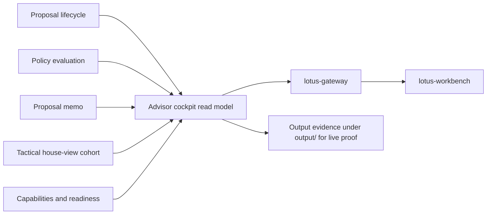

# RFC-0026: Advisor Cockpit Operating Workflow

| Metadata | Details |
| --- | --- |
| **Status** | DRAFT |
| **Created** | 2026-05-22 |
| **Owner** | `lotus-advise` |
| **Business Sponsor Persona** | relationship manager, investment advisor, desk head, advisory support, sales/pre-sales, operations |
| **Depends On** | RFC-0004, RFC-0013, RFC-0017, RFC-0018, RFC-0019, RFC-0021, RFC-0022, RFC-0024, RFC-0025 |
| **Downstream Realization Depends On** | `lotus-gateway` experience API composition and `lotus-workbench` advisor cockpit UI |
| **Doc Location** | `docs/rfcs/RFC-0026-advisor-cockpit-operating-workflow.md` |

---

## 0. Executive Summary

RFC-0026 defines the `AdvisorCockpit`: a backend-owned advisory operating workflow that gives an
advisor a prioritized view of client advisory work, proposal state, approvals, evidence gaps,
meeting preparation, follow-ups, and downstream readiness.

The cockpit is not a decorative dashboard. It is an operating surface for private-banking advisory
work:

1. what needs attention,
2. why it matters,
3. which client or portfolio is affected,
4. what proposal or memo evidence exists,
5. what is blocked or pending review,
6. what the advisor can do next,
7. what needs compliance, investment desk, client, report, or execution follow-up.

`lotus-advise` owns the advisory workflow read models and action semantics. `lotus-gateway` and
`lotus-workbench` own product composition and UI. The UI must not infer proposal priorities,
approval states, or evidence gaps locally.

---

## 1. Problem Statement

Current `lotus-advise` capabilities can simulate proposals, persist lifecycle state, expose decision
summaries, compare alternatives, handle workspaces, and record approvals. These are strong building
blocks, but advisors still need an operating workflow.

A banker should not have to search proposal-by-proposal to know:

1. which clients need advisory attention,
2. which proposals are ready for conversation,
3. which proposals are blocked by missing evidence or policy review,
4. which approvals are overdue,
5. which client meetings need preparation,
6. which house-view or tactical instruction affected the book,
7. which report, execution, or follow-up actions are waiting.

Without a backend-owned cockpit read model, product surfaces risk building local worklists from
partial endpoint data. That weakens governance, creates duplication, and makes the advisory product
feel unfinished.

## 2. Business Outcomes

RFC-0026 targets these outcomes:

1. **Increase advisor scale**
   advisors can manage a larger book through prioritized worklists instead of manual proposal
   tracking.
2. **Improve client-service quality**
   meeting preparation, proposal readiness, and follow-up posture become visible before client
   interaction.
3. **Reduce operational leakage**
   blocked proposals, approvals, and downstream readiness issues are surfaced early.
4. **Strengthen governance**
   next actions are derived from backend-owned lifecycle, policy, memo, and supportability evidence.
5. **Create a premium product demo**
   show a realistic advisor day-in-the-life flow, not only standalone APIs.
6. **Reduce UI complexity**
   Workbench consumes an advisory read model instead of reconstructing workflow semantics.

## 3. Current Baseline

Foundations:

1. advisory workspaces,
2. persisted proposals and versions,
3. proposal lifecycle transitions,
4. approvals and consent posture,
5. proposal decision summary,
6. proposal alternatives,
7. tactical house-view affected-cohort evaluation,
8. execution handoff/status boundary evidence,
9. platform capabilities and supportability diagnostics.

Gaps:

1. no advisor book-level worklist,
2. no meeting-preparation packet,
3. no next-best-action or next-required-action contract,
4. no backend-owned advisory priority model,
5. no aggregated approval, memo, report, execution, and evidence-gap view,
6. no contract for Gateway/Workbench cockpit realization,
7. no supported claim for advisor operating workflow.

## 4. Product Vision

One-sentence vision:

`lotus-advise` tells an advisor what advisory work needs attention, why it matters, and what
evidence-backed next action is available.

Product promises:

1. **Actionable:** every item has a next action or a reason it is blocked.
2. **Evidence-backed:** priorities and states are derived from proposal, policy, memo, lifecycle,
   and supportability evidence.
3. **Advisor-centric:** the cockpit uses private-banking workflow language, not generic tasks.
4. **Safe boundaries:** `lotus-advise` records advisory posture; CRM, calendar, document rendering,
   and execution systems remain owner-specific integrations.
5. **Composable:** Gateway and Workbench can create a rich experience without duplicating business
   logic.

Non-promises:

1. `lotus-advise` does not become a CRM.
2. `lotus-advise` does not own calendar integration.
3. `lotus-advise` does not own external order management or trade execution.
4. `lotus-advise` does not own global portfolio monitoring outside advisory workflows.
5. `lotus-advise` does not generate UI-only priorities.

## 5. Domain Vocabulary

| Concept | Preferred Term | Avoid |
| --- | --- | --- |
| Advisor daily surface | advisor cockpit | dashboard |
| Work item | advisory action item | task card |
| Required next step | next required action | CTA generated in UI |
| Proposal state | proposal readiness | status badge only |
| Client preparation | meeting preparation packet | notes blob |
| Evidence issue | source readiness gap | missing field |
| Book impact | affected advisory cohort | affected users |
| Review needed | approval dependency | escalation flag |
| Follow-up | client follow-up, compliance follow-up, operations follow-up | todo |

## 6. Target Capability

The target capability introduces:

1. `AdvisorCockpitSnapshot`
2. `AdvisoryActionItem`
3. `AdvisorClientFocus`
4. `ProposalReadinessSummary`
5. `MeetingPreparationPacket`
6. `ClientFollowUpItem`
7. `ApprovalWorkItem`
8. `EvidenceGapWorkItem`
9. `DownstreamReadinessWorkItem`
10. `HouseViewImpactWorkItem`

### 6.1 Cockpit Snapshot

The snapshot must include:

1. advisor id or role context,
2. as-of timestamp,
3. book summary,
4. action item counts by category and status,
5. top priority action items,
6. proposals awaiting advisor action,
7. proposals awaiting compliance or desk approval,
8. proposals blocked by source evidence,
9. client meeting preparation packets,
10. house-view affected advisory cohorts,
11. downstream report/execution readiness items,
12. supportability and degraded dependency summary.

### 6.2 Action Item Contract

Each action item must include:

1. `action_item_id`,
2. `action_type`,
3. `priority`,
4. `status`,
5. `client_ref`,
6. `portfolio_ref`,
7. `proposal_ref`,
8. `memo_ref`,
9. `reason_codes`,
10. `evidence_refs`,
11. `next_required_action`,
12. `owner_role`,
13. `due_at` when available,
14. `source_readiness_gaps`,
15. `correlation_ref`.

Valid top-level statuses remain:

1. `READY`
2. `PENDING_REVIEW`
3. `BLOCKED`

## 7. Source Authority and Ownership

| Area | Owner | Rule |
| --- | --- | --- |
| Proposal lifecycle | `lotus-advise` | Cockpit reads persisted proposal state. |
| Proposal decision and alternatives | `lotus-advise` | Cockpit consumes backend-owned summary and alternatives. |
| Policy, approvals, disclosures | `lotus-advise` | Cockpit consumes RFC-0025 and lifecycle approval posture. |
| Memo readiness | `lotus-advise` | Cockpit consumes RFC-0024 memo state. |
| Client, mandate, portfolio data | `lotus-core` or relevant source | Cockpit shows refs and source readiness; it does not invent profile data. |
| Risk posture | `lotus-risk` | Cockpit consumes risk lens and degraded risk evidence. |
| DPM campaigns | `lotus-manage` | Cockpit may reference advisory handoff posture but does not own DPM execution. |
| UI experience | `lotus-workbench` | Workbench renders cockpit through Gateway/BFF. |
| Experience API | `lotus-gateway` | Gateway composes user/session-aware product contract. |

## 8. Architecture Direction

Rules:

1. cockpit read models are generated by `lotus-advise`,
2. Gateway can filter/compose by authenticated advisor context but must not invent domain state,
3. Workbench consumes Gateway/BFF only,
4. action item reasons must map to evidence refs and reason codes,
5. source-degraded posture must be shown as source readiness, not hidden empty states.

## 9. Proposed API Direction

Proposed endpoints:

1. `GET /advisory/cockpit/snapshot`
   return an advisor-context cockpit summary.
2. `GET /advisory/cockpit/action-items`
   return paginated action items with filters.
3. `GET /advisory/cockpit/clients/{client_ref}/preparation`
   return meeting preparation packet for a client or household context.
4. `POST /advisory/cockpit/action-items/{action_item_id}/acknowledge`
   record advisory acknowledgement where the action is `lotus-advise` owned.
5. `GET /advisory/cockpit/supportability`
   return cockpit source-readiness and degradation summary.

Pagination:

1. action-item list must be paginated,
2. filters must be bounded and documented,
3. sort keys must be stable and domain-aware, such as priority, due time, status, and proposal
   materiality.

OpenAPI:

1. every endpoint includes complete examples,
2. examples cover empty book, ready action, blocked action, and degraded dependency,
3. field descriptions explain owner boundaries and evidence refs,
4. headers document correlation id and caller context expectations.

## 10. Priority and Next-Action Semantics

Priority should be deterministic and explainable.

Priority inputs:

1. client meeting due soon,
2. proposal blocked near client review,
3. compliance or desk approval overdue,
4. material portfolio impact,
5. house-view impact severity,
6. client consent pending,
7. downstream execution/report readiness blocked,
8. source evidence stale or missing.

Priority outputs:

1. `CRITICAL`
2. `HIGH`
3. `MEDIUM`
4. `LOW`

Priority rules:

1. priority must include reason codes,
2. tie-breakers must be stable,
3. unsupported inputs must not create invented urgency,
4. advisor acknowledgements do not override compliance or approval state.

## 11. Security, Privacy, and Entitlements

Controls:

1. caller context determines book and action visibility,
2. action items must not leak clients outside advisor entitlement,
3. metrics use bounded labels only,
4. logs avoid raw client, holding, or proposal payloads,
5. action acknowledgement is audited,
6. correlation id propagates through cockpit calls,
7. sensitive memo and policy sections are projection-aware.

Forbidden behavior:

1. broad unauthenticated book-wide cockpit access,
2. UI-side filtering used as entitlement enforcement,
3. client identifiers in metrics labels,
4. hidden compliance or approval blockers in advisor-facing summary,
5. next-action generation without evidence refs.

## 12. Observability and Operations

Metrics:

1. cockpit snapshot count by status,
2. action-item count by action type, priority, and status,
3. cockpit build duration,
4. paginated action-list duration,
5. blocked action count by reason family,
6. degraded dependency count by source family.

Diagnostics:

1. top reason families for blocked actions,
2. proposal lifecycle lag,
3. approval queue age bands,
4. memo readiness distribution,
5. source-readiness posture for cockpit dependencies.

Performance:

1. use pagination for action items,
2. avoid N+1 proposal and memo lookups,
3. precompute or cache read models only when consistency and invalidation are explicit,
4. keep response payloads projection-specific and bounded.

## 13. Test Strategy

Unit tests:

1. action item generation from proposal lifecycle states,
2. priority calculation and reason codes,
3. next-action mapping,
4. entitlement projection filtering,
5. source-readiness gap behavior.

Contract tests:

1. OpenAPI examples and descriptions,
2. pagination/filter/sort schema,
3. status vocabulary,
4. correlation and caller-context headers.

Integration tests:

1. persisted proposals create expected cockpit work items,
2. approval dependencies appear in cockpit snapshot,
3. memo readiness appears after RFC-0024 implementation,
4. policy outcomes appear after RFC-0025 implementation,
5. acknowledgement audit events are append-only.

Live proof:

1. canonical advisor snapshot with at least one ready, pending-review, and blocked action,
2. degraded dependency snapshot,
3. paginated action-list evidence with stable sorting,
4. `/platform/capabilities` only promotes cockpit support after implementation.

## 14. Implementation Slices

### Slice 0 - Current-State Workflow Map

Outcome:

1. map proposal lifecycle, workspace, approval, memo, policy, execution, and house-view evidence
   into cockpit action families.

Acceptance gate:

1. source gaps and downstream Gateway/Workbench WTBDs are recorded.

### Slice 1 - Platform Automation and Scaffolding Decision

Outcome:

1. decide whether reusable paginated read-model and cockpit OpenAPI examples belong in platform
   scaffolding.

Acceptance gate:

1. implement reusable improvements or record no-change decision.

### Slice 2 - Cleanup and Read-Model Boundary

Outcome:

1. create a cockpit domain/read-model module and keep controllers thin.

Acceptance gate:

1. no UI-oriented logic is scattered in existing proposal services.

### Slice 3 - Action Item Domain Model and Priority Engine

Outcome:

1. implement action item, priority, reason-code, next-action, and source-gap models.

Acceptance gate:

1. deterministic unit tests cover all action families.

### Slice 4 - Snapshot, Pagination, and Meeting Preparation

Outcome:

1. implement snapshot, action list, and preparation packet builders.

Acceptance gate:

1. pagination is stable and no N+1 patterns are introduced.

### Slice 5 - Certified APIs and OpenAPI

Outcome:

1. expose cockpit snapshot, action-list, preparation, acknowledge, and supportability endpoints.

Acceptance gate:

1. OpenAPI/vocabulary/no-alias gates pass.

### Slice 6 - Gateway and Workbench WTBD Contract

Outcome:

1. document exact downstream product-surface requirements.

Acceptance gate:

1. WTBD entries define Gateway API, Workbench screen, evidence, and owner expectations.

### Slice 7 - Implementation Proof

Outcome:

1. capture canonical and degraded cockpit evidence.

Acceptance gate:

1. proof includes priority explanation, pagination, action counts, and supportability posture.

### Slice 8 - Second-Last Hardening and Review

Outcome:

1. review performance, privacy, entitlement, logging, metrics, and action semantics.

Acceptance gate:

1. no client-data leakage, high-cardinality metrics, or UI-inferred workflow claims remain.

### Slice 9 - Final Closure

Outcome:

1. update README, wiki, supported features, RFC status, context, and branch hygiene.

Acceptance gate:

1. all closure truth is merged to `main`, CI is green, and wiki source is publishable.

## 15. Supported-Features Ledger

| Capability | Initial RFC state | Promotion rule |
| --- | --- | --- |
| Advisor cockpit snapshot | Proposed | Promote only after backend snapshot API, OpenAPI, tests, and live proof exist. |
| Advisory action items | Proposed | Promote only after deterministic priority and next-action tests cover core families. |
| Meeting preparation packet | Proposed | Promote only after source-backed client/proposal/memo evidence is integrated. |
| Approval and evidence-gap worklists | Proposed | Promote only after policy/memo/lifecycle integration is implementation-backed. |
| Gateway/Workbench cockpit UI | Downstream WTBD | Promote only after downstream implementation and browser/product validation. |

## 16. Acceptance Criteria

RFC-0026 is implemented only when:

1. cockpit models and read builders exist in a dedicated module,
2. action items are evidence-backed and deterministic,
3. snapshot and action-list endpoints are paginated, documented, and tested,
4. priority and next-action semantics have reason codes,
5. entitlements and projection boundaries are defined,
6. no UI-side workflow inference is required,
7. Gateway/Workbench WTBDs are complete or explicitly deferred,
8. README, wiki, supported-features, and `/platform/capabilities` reflect only implemented truth.

## 17. Risks and Trade-Offs

| Risk | Mitigation |
| --- | --- |
| Cockpit becomes a generic task tracker | Keep action families tied to advisory proposal evidence and private-banking workflow. |
| UI duplicates priority logic | Expose backend priority and reason codes. |
| Snapshot performance degrades with book size | Require pagination, bounded filters, and no N+1 access before promotion. |
| Entitlement leaks client workload | Enforce caller-context projection server-side. |
| Downstream UI claims exceed backend support | Record WTBDs and keep supported-feature claims backend-only until implemented. |

## 18. Open Questions Before Implementation

1. What first-wave advisor context should be supported: one advisor id, desk role, or household
   coverage team?
2. Should meeting preparation require calendar/CRM integration or start with proposal-driven
   preparation packets only?
3. Which action families must be supported before Workbench cockpit work can begin?
4. What response-size limits and pagination defaults should be applied for large advisor books?
5. Which acknowledgements should be advisory-owned versus delegated to CRM or workflow systems?
