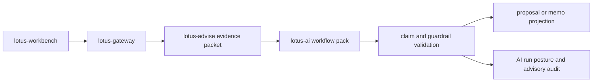

# RFC-0027: Governed Advisory AI Copilot

| Metadata | Details |
| --- | --- |
| **Status** | DRAFT |
| **Created** | 2026-05-22 |
| **Owner** | `lotus-advise` for advisory evidence and workflow authority; `lotus-ai` for AI workflow-pack execution |
| **Business Sponsor Persona** | relationship manager, investment advisor, advisory desk head, compliance reviewer, operations support, sales/pre-sales |
| **Depends On** | RFC-0021, RFC-0022, RFC-0023, RFC-0024, RFC-0025, RFC-0026 |
| **Downstream Realization Depends On** | `lotus-gateway` and `lotus-workbench` for product invocation surfaces; `lotus-ai` for workflow-pack ownership |
| **Doc Location** | `docs/rfcs/RFC-0027-governed-advisory-ai-copilot.md` |

---

## 0. Executive Summary

RFC-0027 defines a governed advisory AI copilot for `lotus-advise`.

RFC-0023 covers grounded advisory narrative and client-ready proposal commentary. RFC-0027 extends
that foundation into a broader advisor assistant that can help with evidence explanation,
preparation, review, and follow-up while never owning investment truth or workflow decisions.

The copilot is allowed to:

1. explain a proposal using approved evidence,
2. summarize memo sections,
3. answer questions over a bounded evidence packet,
4. identify missing evidence or blockers,
5. draft advisor preparation notes,
6. draft compliance review summaries,
7. draft follow-up questions for the advisor to ask the client,
8. prepare operations or report handoff notes from existing evidence.

The copilot is forbidden from:

1. choosing recommendations,
2. generating trades,
3. calculating risk or performance,
4. approving suitability,
5. hiding blockers,
6. inventing client facts,
7. bypassing human review,
8. directly calling model providers from `lotus-advise`.

All AI execution must route through `lotus-ai` workflow packs. `lotus-advise` owns evidence packet
construction, advisory use-case rules, and response validation. `lotus-ai` owns prompt/provider
execution, safety, model telemetry, and workflow-pack governance.

---

## 1. Problem Statement

Private bankers need faster access to the meaning of advisory evidence. Current and planned
proposal capabilities create rich evidence, but dense evidence still requires interpretation.

The risk is two-sided:

1. without AI assistance, advisors spend too much time reading proposal evidence and writing
   summaries,
2. with uncontrolled AI, the product risks hallucinated recommendations, hidden blockers, data
   leakage, and unreviewed client communication.

The product needs a governed copilot that can make evidence easier to use without becoming an
investment decision maker.

## 2. Business Outcomes

RFC-0027 targets these outcomes:

1. **Increase advisor productivity**
   reduce time spent summarizing proposals, memos, evidence gaps, and client follow-ups.
2. **Improve consistency**
   use approved workflow packs and policy-controlled outputs instead of ad hoc prompting.
3. **Differentiate Lotus demos**
   show AI that is grounded, audited, bounded, and useful in a real private-banking workflow.
4. **Reduce compliance risk**
   enforce forbidden-action, unsupported-claim, source-ref, and human-review guardrails.
5. **Strengthen ecosystem architecture**
   route AI through `lotus-ai` rather than embedding provider logic in advisory services.
6. **Improve evidence usability**
   turn proposal, policy, memo, and cockpit evidence into business-readable assistance.

## 3. Relationship to RFC-0023

RFC-0023 remains the authority for grounded advisory narrative and client-ready proposal commentary.

RFC-0027 adds:

1. interactive or task-oriented assistant actions,
2. evidence question answering,
3. missing-evidence and blocker explanation,
4. advisor preparation workflows,
5. compliance and operations summaries,
6. copilot invocation, safety, and review telemetry,
7. Workbench/Gateway realization requirements for advisor-assistant product surfaces.

RFC-0027 must not reimplement RFC-0023 narrative section generation. It should reuse the same
grounding packet, claim validation, disclosure policy, and human-review posture where possible.

## 4. Current Baseline

Foundations:

1. workspace AI rationale seam through `lotus-ai`,
2. proposal decision summary,
3. proposal alternatives,
4. persisted lifecycle and replay,
5. planned RFC-0023 narrative grounding,
6. planned RFC-0024 memo evidence pack,
7. planned RFC-0025 policy-pack outcomes,
8. planned RFC-0026 cockpit action items.

Gaps:

1. no explicit advisory copilot use-case catalog,
2. no advisory workflow-pack family registry,
3. no evidence Q&A guardrail,
4. no forbidden-action contract for advisory assistant outputs,
5. no copilot audit and review state across proposal workflows,
6. no unsupported-claim validation for assistant answers,
7. no product-surface contract for Workbench invocation.

## 5. Allowed Copilot Use Cases

### 5.1 Proposal Explanation

Input:

1. proposal version,
2. decision summary,
3. alternatives,
4. risk and suitability evidence,
5. memo section evidence.

Output:

1. concise explanation,
2. material drivers,
3. trade-offs,
4. evidence refs,
5. missing evidence and blockers.

### 5.2 Advisor Meeting Preparation

Input:

1. client or household context refs,
2. proposal memo,
3. policy evaluation,
4. cockpit action items,
5. recent advisory workflow history.

Output:

1. preparation brief,
2. suggested questions,
3. required disclosures,
4. items to confirm with client,
5. follow-up checklist.

### 5.3 Evidence Q&A

Input:

1. bounded evidence packet,
2. allowed question category,
3. requester role,
4. projection policy.

Output:

1. answer grounded in evidence refs,
2. unsupported question response where evidence is missing,
3. citations,
4. guardrail results.

### 5.4 Compliance Review Summary

Input:

1. policy-pack evaluation,
2. approval dependencies,
3. memo compliance appendix,
4. disclosure requirements.

Output:

1. review summary,
2. blocked/pending-review rule families,
3. source readiness gaps,
4. proposed review checklist.

### 5.5 Operations and Report Handoff Notes

Input:

1. proposal memo,
2. report package metadata,
3. execution handoff/status evidence,
4. source readiness and supportability posture.

Output:

1. handoff summary,
2. operational blockers,
3. report readiness notes,
4. downstream owner boundaries.

## 6. Forbidden AI Behaviors

The copilot must never:

1. choose or rank proposal alternatives,
2. generate new trades or cash flows,
3. calculate risk, performance, cost, or suitability,
4. approve, reject, or transition proposal lifecycle state,
5. mark policy rules as satisfied,
6. hide or soften blocked status,
7. invent client objectives, risk tolerance, holdings, pricing, or product eligibility,
8. produce final client advice without review posture,
9. call external providers directly from `lotus-advise`,
10. log raw prompts, raw model output, or raw portfolio payloads,
11. expose restricted evidence in a projection that does not allow it.

Tests must enforce these guardrails.

## 7. Workflow-Pack Families

Initial `lotus-ai` workflow-pack families:

1. `advisory_proposal_explanation.pack`
2. `advisory_meeting_preparation.pack`
3. `advisory_evidence_qa.pack`
4. `advisory_compliance_review_summary.pack`
5. `advisory_operations_handoff_summary.pack`
6. `advisory_client_followup_draft.pack`

Each pack registration must include:

1. owner app: `lotus-advise`,
2. workflow surface,
3. input schema ref,
4. output schema ref,
5. allowed audience,
6. forbidden actions,
7. source-ref requirement,
8. unsupported-claim policy,
9. review posture,
10. retention policy,
11. degraded/unavailable behavior.

## 8. Evidence Packet Model

Copilot inputs must be deterministic evidence packets, not raw database dumps.

Evidence packet fields:

1. `evidence_packet_id`,
2. `proposal_id`,
3. `proposal_version_id`,
4. `memo_id` when available,
5. `policy_evaluation_id` when available,
6. `cockpit_action_item_ids` when relevant,
7. `audience`,
8. `allowed_sections`,
9. `redaction_policy`,
10. `source_refs`,
11. `missing_evidence`,
12. `forbidden_fields`,
13. `input_hash`,
14. `pack_family`,
15. `created_at`.

Rules:

1. evidence packets are stored or reproducible for audit,
2. evidence packets must not contain unnecessary raw holdings or client data,
3. source refs must be enough to trace material claims,
4. redaction is applied before `lotus-ai` receives the packet,
5. AI output is validated against the packet before response.

## 9. Architecture Direction

Rules:

1. `lotus-advise` constructs evidence and validates returned output,
2. `lotus-ai` owns prompt/provider execution and model telemetry,
3. Gateway and Workbench invoke only supported advisory copilot actions,
4. every returned answer includes source refs or an unsupported-evidence response,
5. unavailable AI returns deterministic degraded posture, not generic failure.

## 10. Proposed API Direction

Proposed endpoints:

1. `POST /advisory/proposals/{proposal_id}/versions/{version_id}/copilot/explain`
2. `POST /advisory/proposals/{proposal_id}/versions/{version_id}/copilot/questions`
3. `POST /advisory/proposals/{proposal_id}/memos/{memo_id}/copilot/preparation`
4. `POST /advisory/proposals/{proposal_id}/policy-evaluations/{evaluation_id}/copilot/compliance-summary`
5. `GET /advisory/copilot/runs/{run_id}`

API rules:

1. endpoints are action-specific, not free-form prompt endpoints,
2. request schemas must list allowed audience and question category,
3. responses must include guardrail results, source refs, run posture, and review status,
4. unsupported questions return a controlled unsupported-evidence response,
5. idempotency applies where requests create durable copilot runs.

OpenAPI:

1. examples for supported and unsupported questions,
2. examples for unavailable `lotus-ai`,
3. field descriptions for evidence packet, guardrail, review posture, and source refs,
4. no examples containing raw sensitive payloads.

## 11. Review, Audit, and Retention

Each copilot run must record:

1. `run_id`,
2. `pack_family`,
3. `pack_version`,
4. `proposal_id`,
5. `proposal_version_id`,
6. `evidence_packet_id`,
7. `input_hash`,
8. `output_hash`,
9. `guardrail_results`,
10. `review_status`,
11. `created_by`,
12. `created_at`,
13. `correlation_id`,
14. `lotus_ai_run_ref`,
15. `retention_class`.

Review statuses:

1. `DRAFT`
2. `REVIEW_REQUIRED`
3. `APPROVED_FOR_ADVISOR_USE`
4. `REJECTED`
5. `SUPERSEDED`

These review statuses are copilot-output statuses, not top-level proposal run statuses.

## 12. Security and AI Safety

Required controls:

1. prompt injection controls for evidence Q&A,
2. no raw prompts in logs,
3. no raw model output in metrics or logs,
4. no sensitive ids in metric labels,
5. role-aware redaction before AI call,
6. unsupported-claim validation after AI response,
7. forbidden-action validation after AI response,
8. source-ref validation for material claims,
9. deterministic fallback when AI is unavailable,
10. configurable kill switch by workflow-pack family.

## 13. Observability and Operations

Metrics:

1. copilot run count by pack family, status, and review posture,
2. guardrail rejection count by reason family,
3. unsupported question count by category,
4. AI unavailable count by pack family,
5. evidence packet build duration,
6. end-to-end copilot run duration.

Diagnostics:

1. active pack versions,
2. disabled pack families,
3. top guardrail rejection reason families,
4. stale or missing source evidence counts,
5. advisory-to-AI correlation ids.

## 14. Test Strategy

Unit tests:

1. evidence packet construction,
2. redaction policy,
3. forbidden-action validation,
4. unsupported-claim validation,
5. source-ref requirement,
6. unavailable AI fallback.

Contract tests:

1. OpenAPI completeness,
2. no free-form prompt endpoints,
3. bounded request enums,
4. response examples with guardrails and evidence refs.

Integration tests:

1. `lotus-ai` adapter invocation seam,
2. run persistence and retrieval,
3. review state transitions,
4. proposal/memo/policy evidence integration,
5. degraded `lotus-ai` path.

Evaluation tests:

1. forbidden action prompts are rejected,
2. unsupported questions do not produce invented answers,
3. restricted fields are not present in redacted evidence packets,
4. client-ready draft requires review posture.

Live proof:

1. canonical explain run,
2. canonical evidence Q&A run,
3. unsupported-evidence response,
4. `lotus-ai` unavailable response,
5. `/platform/capabilities` promotion only after implementation.

## 15. Implementation Slices

### Slice 0 - Copilot Boundary and Use-Case Catalog

Outcome:

1. finalize allowed and forbidden advisory copilot actions.

Acceptance gate:

1. overlap with RFC-0023 is removed and `lotus-ai` ownership is explicit.

### Slice 1 - Platform and Workflow-Pack Scaffolding

Outcome:

1. decide whether new workflow-pack validation belongs in `lotus-platform` or `lotus-ai`.

Acceptance gate:

1. reusable gaps are implemented or recorded as no-change decisions.

### Slice 2 - Cleanup and Evidence Packet Boundary

Outcome:

1. create a dedicated copilot/evidence-packet module in `lotus-advise`.

Acceptance gate:

1. provider/prompt logic is absent from `lotus-advise`.

### Slice 3 - Evidence Packet, Redaction, and Guardrails

Outcome:

1. implement deterministic packet construction, redaction, and validation.

Acceptance gate:

1. unit tests prove restricted fields and unsupported claims are controlled.

### Slice 4 - lotus-ai Workflow-Pack Adapter

Outcome:

1. route supported actions through `lotus-ai` workflow-pack execution.

Acceptance gate:

1. degraded and unavailable AI behavior is deterministic and tested.

### Slice 5 - Copilot Run Persistence and Review

Outcome:

1. persist run posture, hashes, guardrail results, and review state.

Acceptance gate:

1. audit/replay evidence exists without raw prompt or raw output leakage.

### Slice 6 - Certified APIs and OpenAPI

Outcome:

1. expose action-specific copilot APIs and run retrieval.

Acceptance gate:

1. OpenAPI, vocabulary, and no-alias gates pass.

### Slice 7 - Gateway and Workbench Product WTBDs

Outcome:

1. define downstream invocation surfaces and product-state expectations.

Acceptance gate:

1. WTBD entries list exact Gateway/Workbench work and proof expectations.

### Slice 8 - Implementation Proof and AI Evaluation

Outcome:

1. capture canonical, unsupported, forbidden, and unavailable AI evidence.

Acceptance gate:

1. proof includes request/response artifacts, guardrail results, and critical review notes.

### Slice 9 - Second-Last Hardening and Review

Outcome:

1. review AI safety, data handling, observability, tests, and supportability.

Acceptance gate:

1. no free-form prompt path, raw sensitive logging, or unreviewed client-ready output remains.

### Slice 10 - Final Closure

Outcome:

1. update README, wiki, supported features, RFC status, context, and branch hygiene.

Acceptance gate:

1. implementation and documentation are merged to `main`, CI is green, and wiki source is
   publishable.

## 16. Supported-Features Ledger

| Capability | Initial RFC state | Promotion rule |
| --- | --- | --- |
| Advisory proposal explanation | Proposed | Promote only after workflow-pack adapter, guardrails, API, and live proof exist. |
| Advisory evidence Q&A | Proposed | Promote only after unsupported-question and source-ref validation is proven. |
| Advisor meeting preparation | Proposed | Promote only after memo/cockpit evidence integration and review posture exist. |
| Compliance review summary | Proposed | Promote only after RFC-0025 policy outcomes are implemented and integrated. |
| Operations/report handoff summary | Proposed | Promote only after downstream-readiness evidence and owner boundaries are present. |
| Workbench copilot UI | Downstream WTBD | Promote only after Gateway/Workbench implementation-backed evidence exists. |

## 17. Acceptance Criteria

RFC-0027 is implemented only when:

1. all AI actions are action-specific and not free-form prompt endpoints,
2. evidence packets are deterministic, redacted, source-backed, and replayable,
3. `lotus-ai` owns workflow-pack execution,
4. forbidden actions and unsupported claims are tested,
5. copilot runs are persisted with hashes and guardrail posture,
6. unavailable AI behavior is deterministic,
7. OpenAPI and vocabulary gates pass,
8. Gateway/Workbench WTBDs are complete or explicitly deferred,
9. supported-feature claims are implementation-backed.

## 18. Risks and Trade-Offs

| Risk | Mitigation |
| --- | --- |
| Copilot becomes an autonomous advisor | Action-specific endpoints, forbidden-action tests, and human-review posture. |
| Duplicates RFC-0023 narrative work | RFC-0027 reuses RFC-0023 grounding and focuses on assistant workflows. |
| Sensitive data leaks to provider or logs | Redaction before AI call and no raw prompt/output logs. |
| Unsupported Q&A invents answers | Enforce unsupported-evidence responses and source-ref validation. |
| Product demo overclaims AI readiness | Supported-features ledger and `/platform/capabilities` promotion rules. |

## 19. Open Questions Before Implementation

1. Which first-wave copilot action should ship first: proposal explanation, evidence Q&A, or
   meeting preparation?
2. Which workflow-pack registry endpoints in `lotus-ai` are stable enough for first-wave use?
3. What role model is required for advisor versus compliance versus operations projections?
4. Should evidence packets be persisted as first-class records or deterministically rebuilt from
   proposal/memo versions?
5. What evaluation corpus should be maintained for prompt-injection, unsupported-claim, and
   client-ready safety tests?
