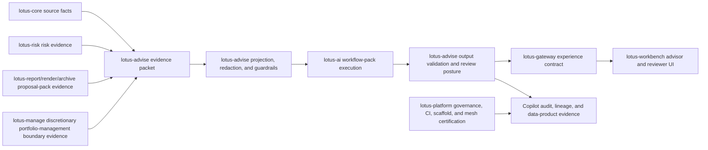

# RFC-0027: Governed Advisory AI Copilot

| Metadata | Details |
| --- | --- |
| **Status** | IMPLEMENTED for governed internal advisor/reviewer copilot interactions; client-ready and execution authority remain gated |
| **Created** | 2026-05-22 |
| **Last Tightened** | 2026-05-31 |
| **Owner** | `lotus-advise` for advisory evidence, copilot use-case authority, validation, audit, and product truth; `lotus-ai` for workflow-pack execution, provider orchestration, model telemetry, and AI safety controls |
| **Business Sponsor Persona** | relationship manager, investment advisor, advisory desk head, compliance reviewer, model-risk reviewer, operations support, sales/pre-sales, client-demo lead |
| **Primary Business Outcome** | give advisors a governed AI assistant that can explain source-backed advisory evidence, prepare meetings, answer bounded evidence questions, and support review workflows without becoming an investment decision maker |
| **Depends On** | RFC-0006, RFC-0013, RFC-0019, RFC-0020, RFC-0021, RFC-0022, RFC-0023, RFC-0024, RFC-0025, RFC-0026 |
| **Cross-Repository Scope** | `lotus-advise`, `lotus-ai`, `lotus-gateway`, `lotus-workbench`, `lotus-core`, `lotus-risk`, `lotus-report`, `lotus-render`, `lotus-archive`, `lotus-manage`, `lotus-platform` |
| **Compatibility Posture** | backward compatibility is not a constraint; breaking API or contract changes are allowed when they are the cleanest design, but every affected upstream or downstream consumer must be updated in this RFC before closure |
| **Tightening Branch** | `rfc0027-governed-advisory-ai-copilot` |
| **Implementation Branching Rule** | implementation continues slice by slice on the RFC-0027 feature branch or smaller follow-on RFC-0027 branches when a repo split is cleaner; all branch names, PRs, commits, checks, and cross-repo closures must be recorded in RFC closure evidence |
| **Doc Location** | `docs/rfcs/RFC-0027-governed-advisory-ai-copilot.md` |

---

## 0. Executive Summary

RFC-0027 delivers a governed advisory AI copilot for private-banking advisory workflows. It turns
proposal evidence, memo evidence, policy outcomes, advisor-cockpit actions, approvals, supportability
state, and source-readiness posture into bounded assistant actions that help advisors and reviewers
work faster without letting AI own investment truth.

The copilot is not a chatbot, not a model-provider proxy, not a generic prompt endpoint, and not an
autonomous advisor. It is an evidence-assistance layer over `lotus-advise` workflow truth and
`lotus-ai` workflow-pack execution.

The copilot may:

1. explain an advisory proposal using approved evidence,
2. answer bounded questions over an evidence packet,
3. draft advisor meeting preparation notes,
4. summarize missing evidence, blockers, policy outcomes, approval dependencies, and source gaps,
5. draft compliance review summaries and operations/report handoff notes,
6. draft client follow-up questions for advisor review,
7. surface source refs, unsupported-evidence responses, guardrail results, review posture, and
   lineage.

The copilot must never:

1. choose or rank recommendations,
2. generate trades or cash flows,
3. calculate risk, performance, cost, tax, suitability, or product eligibility,
4. approve, reject, or transition proposal lifecycle state,
5. mark policy rules satisfied,
6. hide blockers, source gaps, conflicts, or approval requirements,
7. invent client facts, holdings, objectives, preferences, fees, performance, or risk figures,
8. produce final client advice without explicit human review state,
9. call model providers directly from `lotus-advise`,
10. expose restricted evidence outside its allowed projection.

This RFC must deliver the full governed copilot outcome end to end. There is no "backend done, UI
later" closure, no WTBD handoff, no deferred follow-up bucket, and no unsupported demo claim. Any required
upstream, downstream, platform, data-product, security, observability, documentation, supported
features, or sales/pre-sales evidence work belongs inside this RFC as a slice and closure gate.

---

## 1. Critical Review of the Previous RFC

| Area | Previous state | Gap | Tightening applied |
| --- | --- | --- | --- |
| Scope | Defined useful copilot actions and `lotus-ai` ownership. | Cross-repo implementation work was not closure-blocking and one slice still sent Gateway/Workbench to WTBD. | Scope now includes every owner repository required to realize the copilot product value; WTBD is explicitly prohibited as an execution mechanism. |
| Architecture | Correctly separated `lotus-advise` evidence from `lotus-ai` execution. | Did not fully define trust boundaries, source authority, evidence-packet lifecycle, model-risk ownership, Gateway/Workbench consumption, or platform scaffold obligations. | Added architecture, ownership matrix, source-authority map, trust boundaries, model-risk posture, and platform automation requirements. |
| AI safety | Listed forbidden behaviors. | Guardrails were not tied to testable contracts, review state, unsupported-claim handling, prompt/output lineage, or audit retention. | Added guardrail contracts, model-risk controls, review workflow, redaction, claim validation, retention, and evaluation evidence expectations. |
| API direction | Proposed action-specific endpoints. | Did not include complete versioning, idempotency, run retrieval, review actions, supportability, error posture, examples, or downstream migration. | Added API and contract direction with certified Swagger, error handling, correlation IDs, idempotency, examples, and consumer migration gates. |
| Data mesh | Not materially covered. | Copilot output, evidence packets, and AI run posture were not treated as governed data products or evidence records. | Added candidate data products, trust telemetry, SLO/access/evidence policy, lineage, catalog, and promotion rules. |
| Product gap allocation | Covered workspace AI rationale in broad terms. | Did not clearly allocate client-ready narrative, advisor meeting workflow, policy packs, AI governance, Workbench experience, and commercial packaging across RFC-0027 and RFC-0028. | Added product-gap allocation table and explicit integration with RFC-0023 through RFC-0028. |
| Testing and evidence | Included unit, contract, integration, evaluation, and live proof. | Did not require hostile prompts, unsupported-evidence proof, redaction proof, model-risk audit proof, cross-repo proof, or evidence critical review. | Added a full test and evidence strategy, implementation proof slice, second-last hardening slice, and closure proof requirements. |
| Documentation | Required docs generally. | Did not require implementation-backed wiki, supported-features, commercial proof, model-risk docs, or LinkedIn post workflow. | Added documentation-as-product and post-completion communication slices. |

Decision:

1. RFC-0027 owns the full governed advisory AI copilot outcome.
2. No implementation should start until this RFC is sufficiently clear to execute with minimal
   clarification.
3. No WTBD entry may be used as an execution substitute. Required upstream or downstream changes
   must appear as RFC-0027 slices, acceptance criteria, owner-repository PRs, and closure evidence.

---

## 2. Problem Statement

`lotus-advise` already produces valuable advisory evidence: simulations, artifacts, persisted
lifecycle records, approvals, consent posture, decision summaries, alternatives, workspace
evaluations, execution/report handoff evidence, tactical house-view cohorts, and capability
supportability. The crown-jewel roadmap adds proposal memos, policy packs, and advisor cockpit
operating workflows.

That evidence is valuable, but dense. Advisors, desk heads, compliance reviewers, operations teams,
and sales/pre-sales teams need help understanding it quickly.

The risk is two-sided:

1. without governed AI assistance, advisors spend too much time reading and rewriting evidence into
   explanations, meeting notes, review summaries, and follow-ups,
2. with uncontrolled AI assistance, the product risks hallucinated recommendations, hidden blockers,
   prompt injection, sensitive-data leakage, unreviewed client communication, and model-risk gaps.

RFC-0027 solves this by making AI useful only as a governed assistant over deterministic evidence.
`lotus-advise` remains the advisory workflow and evidence authority. `lotus-ai` remains the AI
workflow-pack and provider-execution authority. Gateway and Workbench expose only supported,
certified, role-aware copilot actions.

---

## 3. Business Outcomes

RFC-0027 must deliver these outcomes:

1. **Advisor productivity**
   advisors can ask bounded evidence questions, produce meeting-preparation drafts, and understand
   blockers faster.
2. **Advisory consistency**
   assistant outputs use approved workflow packs, evidence packets, vocabulary, projection rules,
   and review states rather than ad hoc prompting.
3. **Compliance and model-risk confidence**
   every copilot answer has source refs, unsupported-evidence handling, forbidden-action validation,
   prompt/output lineage, audit posture, and human-review status.
4. **Client-service quality**
   advisors can prepare clearer client conversations while preserving best-interest, suitability,
   disclosure, fee/conflict, and approval boundaries.
5. **Operational supportability**
   operators can diagnose unavailable AI, guardrail rejection, stale evidence, policy gaps,
   degraded dependencies, and downstream handoff posture without raw prompt or payload exposure.
6. **Bank-buyable AI posture**
   sales, pre-sales, risk, compliance, and technology buyers can see AI as controlled enterprise
   workflow infrastructure, not a decorative demo feature.
7. **Data-product maturity**
   copilot interactions, evidence packets, and review records become governed data products or
   auditable records with lineage, freshness, access, SLO, and evidence-policy posture.

---

## 4. Scope and Non-Scope

### 4.1 In Scope

RFC-0027 includes all work required to deliver a supported governed advisory AI copilot:

1. `lotus-advise` copilot use-case catalog, evidence-packet builder, redaction policy, projection
   policy, guardrail validation, unsupported-evidence response handling, source-ref validation,
   run persistence, review state, idempotency, APIs, OpenAPI, tests, metrics, logs, audit, lineage,
   data-product posture, docs, wiki, supported-features material, and closure proof.
2. `lotus-ai` workflow-pack registrations, pack schemas, pack versioning, provider execution,
   safety checks, prompt lineage, output lineage, model telemetry, pack disablement, model-risk
   metadata, retention posture, unavailable/degraded behavior, and integration tests required for
   the copilot.
3. `lotus-gateway` contracts and routes required to expose copilot actions, run retrieval, review
   state, supportability posture, correlation IDs, role/caller context, and safe error handling to
   product consumers.
4. `lotus-workbench` advisor, compliance, desk-head, and operations surfaces required to invoke
   supported copilot actions through Gateway/BFF only, show evidence refs and guardrail posture,
   collect review decisions, and prevent client-ready output from appearing as approved advice
   before review.
5. `lotus-core` source changes required when copilot evidence needs richer client, household,
   account, mandate, booking-center, relationship-team, objectives, restrictions, product
   eligibility, fee/tax/friction, or conflict-of-interest source refs.
6. `lotus-risk` source changes required when copilot answers depend on stress, drawdown, issuer,
   country, sector, liquidity, private-asset, climate, geopolitical, or degraded-risk evidence.
7. `lotus-report`, `lotus-render`, and `lotus-archive` changes required when proposal pack,
   rendered memo, archive, retention, or retrieval evidence is included in copilot handoff or
   explanation outputs.
8. `lotus-manage` changes required only where the copilot must explain advisory-to-discretionary
   portfolio-management ownership boundaries for tactical house-view cohorts, campaign handoffs,
   or discretionary management status. The copilot must not move management ownership into
   `lotus-advise`.
9. `lotus-platform` automation/scaffolding changes for repeatable AI workflow-pack governance,
   API certification, Swagger quality, observability, structured logging, problem details,
   security baseline, docs scaffolding, data-product onboarding, evidence capture, and CI defaults.
10. README, wiki, supported-features, architecture, operator, security, model-risk, sales/pre-sales,
    demo, and LinkedIn post artifacts, all grounded in implementation truth.

### 4.2 Non-Scope

RFC-0027 does not own:

1. investment recommendation authority,
2. risk, performance, tax, fee, cost, or suitability calculation methodologies,
3. product eligibility determination,
4. proposal alternative construction or ranking,
5. proposal lifecycle approvals or transitions,
6. CRM ownership, calendar scheduling, OMS/broker execution, or discretionary management campaign
   ownership,
7. public investment, regulatory, or legal advice,
8. a generic chat interface or unmanaged prompt endpoint,
9. full bank demo/RFP packaging beyond copilot-specific proof and content, which is RFC-0028.

Non-scope does not mean "defer integration." If a non-scope area blocks the copilot supported
claim, RFC-0027 must either implement the copilot-critical source/projection subset or remove the
unsupported claim before closure.

---

## 5. Product Gap Allocation

| Product area or gap | RFC-0027 treatment | Owning RFC or repo for broader scope |
| --- | --- | --- |
| Advisory proposal simulation needs richer goals, constraints, household/account context, product eligibility, and scenario comparison | Copilot may explain only implemented, source-backed simulation context. Missing goals, constraints, eligibility, or household data must return unsupported-evidence responses or become source slices in this RFC when required for a supported copilot action. | `lotus-core`, RFC-0022, RFC-0024, RFC-0025 |
| Proposal artifact generation needs client-ready proposal memo/PDF narrative | Copilot can summarize and explain implemented memo/proposal-pack evidence, but cannot invent memo sections. If proposal-pack evidence is required for a copilot claim, the required report/render/archive integration is an RFC-0027 slice. | RFC-0024, `lotus-report`, `lotus-render`, `lotus-archive` |
| Persisted lifecycle needs approval queues, supervisory dashboards, maker-checker UX, SLA aging | Copilot can explain lifecycle, approval, SLA, and supervisory evidence from RFC-0026, but cannot create workflow state. It must preserve review state separately from proposal lifecycle state. | RFC-0026 |
| Approval and consent workflow needs jurisdiction-specific approval rules, consent variants, escalation rules, compliance sign-off packs | Copilot can summarize policy and sign-off posture only from implemented RFC-0025 evidence. Missing policy packs block or degrade the output. | RFC-0025 |
| Decision summary needs best-interest narrative, fee/conflict rationale, rejected-alternative explanation | Copilot may explain decision summary, best-interest rationale, fee/conflict rationale, and rejected alternatives only from source-backed evidence and approved narrative components. | RFC-0023, RFC-0024, RFC-0025 |
| Suitability policy needs Reg BI, MiFID, MAS, HK, Singapore private-bank rules, mandate restrictions, and complex product approvals | Copilot consumes policy-pack outputs and explains them; it does not evaluate suitability itself. | RFC-0025 |
| Proposal alternatives need cost-aware, tax-aware, liquidity-aware, risk-budget-aware, private-assets-aware strategies | Copilot explains alternatives only when implementation-backed comparison evidence exists. It must not construct, rank, optimize, or select alternatives. | RFC-0022, RFC-0016, `lotus-core`, `lotus-risk` |
| Risk lens needs stress, VaR/drawdown, issuer/country/sector, liquidity, private assets, climate/geopolitical scenarios | Copilot can explain implemented `lotus-risk` evidence and degraded posture. Missing risk lenses produce unsupported-evidence responses. | `lotus-risk` |
| Advisory workspace needs full advisor cockpit | Copilot consumes cockpit actions and meeting-preparation evidence; it does not own action priority or workflow state. | RFC-0026 |
| Workspace AI rationale needs grounded client-ready commentary, model governance, human review, prompt/output lineage | Directly in scope. RFC-0027 upgrades the existing workspace rationale integration boundary into a governed copilot operating model with workflow-pack governance, human review, and prompt/output lineage. | `lotus-advise`, `lotus-ai`, Gateway, Workbench |
| Execution handoff/status needs adapters, order lifecycle reconciliation, exception management, OMS/broker story | Copilot explains handoff and status evidence while preserving downstream system-of-record boundaries. It must not claim execution authority. | RFC-0017 and downstream execution owners |
| Report request integration boundary needs polished proposal pack generation | Copilot explains report/readiness/handoff evidence only when implemented; required report/render/archive changes are included as RFC-0027 slices if needed. | RFC-0024, RFC-0028 |
| Tactical house-view cohorts need productization | Copilot may explain advisory impact, source refs, and Manage boundary when evidence exists. | `lotus-manage`, Gateway, Workbench |
| Capability discovery needs sales/demo surfacing and operational dashboards | Copilot supportability and enabled pack posture must appear through capabilities and operations diagnostics; broader demo surfacing belongs to RFC-0028. | RFC-0028, Gateway, Workbench |
| Non-functional posture needs load benchmarks, SLO dashboards, tenant/legal-entity configuration, DR/RTO/RPO evidence | In scope for copilot APIs, run persistence, evidence packets, workflow-pack calls, model telemetry, and data products. | `lotus-platform` for reusable standards |
| Commercial packaging needs RFP pack, architecture deck, security pack, demo scripts, ROI story, product one-pager | Copilot-specific security/model-risk/RFP excerpts and implementation-backed proof are in scope; full packaging is RFC-0028. | RFC-0028 |

---

## 6. Domain Vocabulary

| Concept | Preferred term | Avoid |
| --- | --- | --- |
| Governed assistant action | copilot action | prompt |
| Input to AI | evidence packet | prompt data |
| Bounded answer over evidence | evidence answer | AI response |
| Missing source support | unsupported evidence | hallucination in API contracts |
| Material evidence pointer | source ref | citation alone |
| Validation result | guardrail result | safety flag |
| Human control state | review posture | approval flag |
| Model execution trace | workflow-pack lineage | provider log |
| AI owner boundary | workflow-pack execution authority | AI service owns advice |
| Advisory authority | advisory evidence authority | model authority |

Reason codes must use stable upper snake case and domain-specific names.

---

## 7. Current Implementation Baseline

Implementation-backed foundations as of the 2026-05-28 tightening:

1. proposal simulation is supported through `POST /advisory/proposals/simulate`,
2. proposal artifacts are deterministic advisory evidence,
3. proposal lifecycle records are persisted with immutable versions and append-only workflow
   history,
4. approval and consent workflow posture is supported,
5. workspaces can draft, evaluate, compare, replay, save, and hand off to proposal lifecycle,
6. workspace AI rationale already uses a governed `lotus-ai` workflow-pack integration boundary for
   `workspace_rationale.pack`,
7. workspace AI rationale review actions preserve bounded workflow-pack posture and Lotus AI
   lineage truth,
8. proposal decision summaries and alternatives are backend-owned,
9. tactical house-view affected cohorts are supported for supplied source-backed candidate
   portfolios,
10. `/platform/capabilities` publishes feature, workflow, dependency-readiness, and supportability
    posture,
11. OpenAPI, vocabulary, no-alias, dependency, security, data-product, trust-telemetry,
    production-guardrail, Docker, migration, and runtime-smoke gates are part of the repo posture,
12. RFC-0026 advisor cockpit operating workflow is implemented for the source-owned
    Advise/Gateway/Workbench scope, with canonical `PB_SG_GLOBAL_BAL_001` proof, active
    `AdvisorCockpitOperatingSnapshot:v1` and `AdvisoryActionItemRegister:v1` data products, trust
    telemetry, `/platform/capabilities` promotion, and hardened live proof for action detail,
    pagination, role projection, preparation packets, house-view impact, acknowledgement
    idempotency, supportability, and lineage,
13. WTBD is a closed historical ledger and is not a future execution mechanism.

Baseline gaps RFC-0027 closed or explicitly classified:

1. no complete copilot use-case catalog and action registry,
2. no first-class copilot evidence-packet lifecycle,
3. no proposal-level evidence Q&A or meeting-preparation copilot APIs,
4. no full forbidden-action and unsupported-claim validation contract for copilot outputs,
5. no persisted copilot run/review/audit model across proposal workflows,
6. no copilot data-product/trust-telemetry posture,
7. no complete Gateway/Workbench product surfaces for copilot actions,
8. no model-risk documentation, evaluation pack, or implementation-backed sales/pre-sales material.

---

## 8. Architecture Direction

Architecture rules:

1. `lotus-advise` constructs the evidence packet, applies redaction, calls `lotus-ai` only through
   workflow-pack execution, validates returned output, persists run posture, and projects safe
   responses.
2. `lotus-ai` owns pack execution, prompt/provider orchestration, model telemetry, safety controls,
   pack registration, pack versioning, and workflow-pack lineage.
3. Gateway and Workbench invoke only supported copilot actions exposed by `lotus-advise`; neither
   may call `lotus-ai` directly for advisory copilot behavior.
4. Copilot endpoints are action-specific and schema-bound. Free-form prompt endpoints are
   prohibited.
5. Every material statement returned to a caller must have source refs or a controlled
   unsupported-evidence response.
6. The copilot review state is distinct from proposal lifecycle approval state.
7. AI unavailability, disabled pack families, missing source evidence, guardrail failure, and
   entitlement denial must be deterministic and observable.

---

## 9. Source Authority and Dependency Map

| Source or concern | Authority | Copilot rule |
| --- | --- | --- |
| Portfolio, holdings, cash, prices, FX, accounts, mandates, household/client source refs | `lotus-core` | Copilot may only explain facts present in the evidence packet and must not infer missing client context. |
| Simulation, allocation deltas, proposal economics | `lotus-core` through `lotus-advise` simulation orchestration | Copilot must not calculate or restate figures not returned by source-backed proposal evidence. |
| Risk metrics, concentration, stress, drawdown, liquidity, issuer/country/sector evidence | `lotus-risk` | Copilot may explain implemented risk evidence and degraded posture only. |
| Proposal lifecycle, versions, approval posture, consent, decision summary, alternatives, report/execution handoff posture | `lotus-advise` | Copilot can summarize and explain, but cannot transition state or approve decisions. |
| Suitability and best-interest policy packs | `lotus-advise` under RFC-0025 | Copilot consumes policy outputs and sign-off packs; it never determines policy pass/fail. |
| Proposal memo and evidence pack | `lotus-advise`, `lotus-report`, `lotus-render`, `lotus-archive` under RFC-0024 | Copilot can summarize implemented memo/report evidence and blockers. |
| Advisor cockpit actions, queues, SLA aging, meeting-preparation packets | `lotus-advise` under RFC-0026 | Copilot can explain or draft from cockpit evidence, not own action priority. |
| AI workflow-pack execution, prompt/provider management, model telemetry | `lotus-ai` | Copilot integration must use approved workflow-pack interfaces only. |
| Experience API and caller context | `lotus-gateway` | Gateway preserves caller context, correlation IDs, entitlements, and source semantics. |
| Advisor/reviewer user experience | `lotus-workbench` | Workbench renders backend truth and review posture without UI-local AI inference. |
| Platform governance, mesh, CI, scaffolding, evidence automation | `lotus-platform` | Reusable gaps discovered in this RFC must be fixed at platform level where appropriate. |

---

## 10. Target Copilot Capability

Supported copilot action families:

1. **Proposal explanation**
   explain a proposal version, drivers, trade-offs, blockers, and source refs.
2. **Evidence Q&A**
   answer bounded questions over a deterministic evidence packet and return unsupported-evidence
   responses when evidence is absent.
3. **Advisor meeting preparation**
   draft preparation notes, suggested client questions, disclosure reminders, and items to confirm
   with the client.
4. **Compliance review summary**
   summarize policy outcomes, approval dependencies, sign-off blockers, and source-readiness gaps.
5. **Operations and report handoff summary**
   summarize report/render/archive readiness, execution-handoff posture, owner boundaries, and
   operational blockers.
6. **Client follow-up draft**
   draft advisor-reviewed client follow-up questions or next-step notes without final advice
   status.

Every action family must define:

1. allowed audiences,
2. allowed evidence sections,
3. required source refs,
4. forbidden actions,
5. unsupported-evidence policy,
6. redaction policy,
7. review posture,
8. retention class,
9. metrics labels,
10. unavailable/degraded behavior,
11. OpenAPI examples,
12. test scenarios and live proof requirements.

---

## 11. Evidence Packet Model

Copilot inputs must be deterministic evidence packets. They are not raw database dumps and not
advisory prompts assembled by the UI.

Required fields:

1. `evidence_packet_id`,
2. `evidence_packet_version`,
3. `proposal_id`,
4. `proposal_version_id`,
5. `workspace_id` when relevant,
6. `memo_id` when relevant,
7. `policy_evaluation_id` when relevant,
8. `cockpit_snapshot_id` or `action_item_ids` when relevant,
9. `audience`,
10. `caller_context_ref`,
11. `jurisdiction`,
12. `booking_center`,
13. `allowed_sections`,
14. `redaction_policy`,
15. `projection_policy`,
16. `source_refs`,
17. `missing_evidence`,
18. `forbidden_fields`,
19. `unsupported_question_categories`,
20. `input_hash`,
21. `pack_family`,
22. `pack_version_constraint`,
23. `created_at`,
24. `correlation_id`.

Evidence packet rules:

1. packets must be persisted or deterministically rebuildable for audit,
2. packets must exclude unnecessary raw holdings, client identifiers, prompt text, provider
   internals, and restricted fields,
3. every material claim must map back to packet source refs,
4. redaction and projection happen before `lotus-ai` receives the packet,
5. source gaps remain visible instead of being filled by model inference,
6. packet hashes and output hashes must support replay and tamper evidence,
7. packet storage and projection must respect evidence-policy access classes.

---

## 12. Guardrails, Model Risk, and Human Review

### 12.1 Guardrail Contract

Every copilot output must be validated for:

1. forbidden action attempts,
2. unsupported claims,
3. missing source refs,
4. missing disclosures or approval caveats,
5. hidden blockers or softened blocked posture,
6. unsupported fee, tax, cost, performance, risk, suitability, or product-eligibility statements,
7. prompt-injection attempts,
8. restricted-field leakage,
9. unsafe client-ready wording,
10. provider or model failure posture.

Guardrail failures must return stable reason codes and safe remediation guidance. Failed output must
not be projected as approved content.

### 12.2 Model-Risk Controls

RFC-0027 must provide:

1. model/use-case register for advisory copilot action families,
2. pack family and pack version allowlist,
3. prompt template and output schema version lineage in `lotus-ai`,
4. bounded test/evaluation corpus for unsupported questions, prompt injection, forbidden actions,
   stale evidence, missing policy, and unavailable AI,
5. model telemetry that avoids sensitive and high-cardinality labels,
6. kill switch by pack family and environment,
7. production-readiness checklist for AI provider configuration, timeout, retry, fallback, audit,
   retention, and incident diagnostics,
8. documentation for compliance, model-risk reviewers, operations, and engineering.

### 12.3 Human Review

Review statuses:

1. `REVIEW_REQUIRED`,
2. `APPROVED_FOR_INTERNAL_USE`,
3. `REJECTED`,
4. `SUPERSEDED`,
5. `EXPIRED`,
6. `UNSUPPORTED`,
7. `GUARDRAIL_REJECTED`,
8. `UNAVAILABLE`.

Rules:

1. client-ready or client-draft output must never be presented as approved advice without review
   posture,
2. review status is copilot-output state, not proposal approval state,
3. review actions must be idempotent, audited, and correlated,
4. regenerated output creates new lineage and supersedes prior draft output where applicable,
5. rejected output remains auditable without exposing raw unsafe content to unauthorized callers.

---

## 13. API and Contract Direction

The supported API shape is selected by Slice 0. It may be refined for naming clarity during Slice 9,
but the implementation must keep the action-specific, no-free-form-prompt posture.

Selected supported Advise endpoints:

1. `POST /advisory/copilot/evidence-packets`
2. `GET /advisory/copilot/evidence-packets/{evidence_packet_id}`
3. `POST /advisory/copilot/actions`
4. `GET /advisory/copilot/actions/{run_id}`
5. `POST /advisory/copilot/actions/{run_id}/reviews`
6. `GET /advisory/copilot/supportability`
7. `GET /advisory/proposals/{proposal_id}/versions/{version_id}/copilot-runs`

The proposal-version run-history endpoint must use bounded newest-first keyset pagination and
return an opaque `next_cursor`; invalid cursors fail closed as validation errors.

Gateway must publish the same surface under `/api/v1/advisory-copilot/*` after Advise API
certification. Workbench must consume it only through the Gateway/BFF boundary.

API rules:

1. endpoints must be versioned or route-stable according to repository convention,
2. action requests must use enumerated action families rather than arbitrary prompts,
3. requests must include caller context, audience, question category where relevant, idempotency
   key where a durable run is created, and correlation ID propagation,
4. responses must include `run_id`, `evidence_packet_id`, `pack_family`, `pack_version`,
   `review_status`, `guardrail_results`, `source_refs`, `unsupported_evidence`, `lineage`,
   `supportability`, and safe errors,
5. unsupported questions must return controlled `UNSUPPORTED_EVIDENCE` posture rather than
   generated guesses,
6. unavailable `lotus-ai` must return deterministic degraded posture,
7. all error responses must use product-safe problem details,
8. `/platform/capabilities` must promote copilot support only after implementation and proof exist.

Swagger/OpenAPI requirements:

1. group copilot endpoints under clear advisory copilot tags,
2. provide what/when/how guidance for every endpoint,
3. include full request, success, unsupported-evidence, guardrail-rejected, review-rejected,
   unavailable-AI, entitlement-denied, validation-error, and idempotency-conflict examples,
4. describe every attribute with type, example, audience, sensitivity, and lineage meaning,
5. avoid raw prompt, raw model output, secrets, real client identifiers, or sensitive payloads in
   examples,
6. pass OpenAPI, vocabulary, no-alias, and API certification gates.

---

## 14. Data Product and Data Mesh Requirements

RFC-0027 must strengthen `lotus-advise` as a data product owner.

Candidate governed products or auditable records:

1. `AdvisoryCopilotInteractionRecord:v1`
2. `AdvisoryCopilotEvidencePacket:v1`
3. `AdvisoryCopilotReviewRecord:v1`

Promotion rules:

1. declare products only after implementation exists,
2. each product must have source authority, temporal semantics, retention class, access policy,
   evidence policy, SLO/freshness/completeness posture, lineage bundle, trust telemetry, and
   certification evidence,
3. `lotus-ai` lineage refs must be preserved without making `lotus-ai` the advisory product
   authority,
4. Gateway and Workbench may consume and surface catalog/certification evidence, but must not become
   product authorities,
5. trust telemetry must distinguish static fixture evidence from runtime telemetry,
6. public/customer evidence packs must omit restricted telemetry paths, raw prompts, raw model
   output, provider internals, and sensitive source payloads.

Data mesh closure requires repo-native data-product gates and applicable platform mesh gates to pass.

---

## 15. Security, Privacy, and Production Readiness

Required controls:

1. no raw prompts, raw model output, raw portfolio payloads, secrets, tokens, provider responses, or
   sensitive identifiers in logs, metrics, traces, committed evidence, wiki, or screenshots,
2. role-aware evidence projection before model calls,
3. caller-context and entitlement enforcement in `lotus-advise`, Gateway, and Workbench,
4. metric labels bounded to low-cardinality, non-sensitive values,
5. correlation ID and trace propagation across Workbench, Gateway, `lotus-advise`, and `lotus-ai`,
6. timeout, retry, circuit breaker, and kill-switch behavior by pack family,
7. deterministic degraded posture for disabled or unavailable AI,
8. dependency vulnerability review and formal treatment for residual vulnerabilities,
9. tenant and legal-entity configuration posture where copilot evidence is tenant-scoped,
10. DR/RTO/RPO, backup, and retention posture for durable copilot records where persistence is
    introduced,
11. incident diagnostics that help operators without exposing restricted content.

---

## 16. Observability and Operations

Metrics must cover:

1. copilot runs by pack family, status, and review posture,
2. guardrail rejections by reason family,
3. unsupported-evidence responses by question category,
4. evidence packet build duration,
5. `lotus-ai` call duration and unavailable count,
6. review actions by status,
7. pack disabled or degraded counts,
8. supportability posture by bounded reason family.

Logs and traces must cover:

1. request correlation across Workbench, Gateway, `lotus-advise`, and `lotus-ai`,
2. source-readiness and evidence-packet build posture,
3. guardrail result families,
4. review action state changes,
5. provider-unavailable and pack-disabled reasons,
6. safe operator diagnostics without raw restricted content.

Operational diagnostics must expose:

1. enabled pack families and active pack versions,
2. disabled pack families and reason families,
3. latest supportability posture,
4. guardrail rejection trends,
5. stale or missing evidence counts,
6. model-risk and evaluation evidence status.

---

## 17. Documentation as Product

Final documentation must be detailed, implementation-backed, and fully aligned to the actual
`lotus-advise` design, behavior, APIs, constraints, and supported capabilities after implementation.

Required documentation:

1. README updates only for concise current-state and command truth,
2. wiki pages for business users, developers, operations, sales/pre-sales, demo leads, compliance,
   and model-risk reviewers,
3. API usage examples and OpenAPI guidance,
4. architecture diagrams for trust boundaries, source authority, workflow-pack execution, review,
   and lineage,
5. operations runbook for supportability, unavailable AI, pack disablement, guardrail rejection,
   and incident diagnostics,
6. model-risk and AI governance guide,
7. supported-features matrix with implementation-backed claims only,
8. commercial material for copilot-specific buyer value, security posture, and RFP support, without
   overclaiming RFC-0028 full demo packaging,
9. final evidence summary with commands, CI, live proof, and cross-repo PRs.

Docs layering rules:

1. RFC carries architecture, slices, acceptance criteria, risks, dependencies, and evidence
   standards,
2. wiki carries current feature behavior and audience-specific operating material,
3. supported-features carries implementation-backed product truth,
4. README remains concise and command-accurate,
5. no duplicated or contradictory supported-feature truth.

---

## 18. Test and Evidence Strategy

Unit tests:

1. use-case registry and action-family validation,
2. evidence-packet construction,
3. redaction and projection policies,
4. unsupported-evidence decisions,
5. forbidden-action validation,
6. source-ref validation,
7. review-state transitions,
8. idempotency and run hashing,
9. metric label bounds,
10. no-sensitive logging helpers.

Contract tests:

1. OpenAPI completeness,
2. no free-form prompt endpoints,
3. request enum bounds,
4. response examples for success, unsupported evidence, guardrail rejection, unavailable AI,
   entitlement denial, review rejection, and idempotency conflict,
5. Gateway contract parity,
6. Workbench BFF-only consumption.

Integration tests:

1. `lotus-ai` workflow-pack adapter invocation,
2. run persistence and retrieval,
3. evidence packet replay or rebuild,
4. review action idempotency,
5. proposal/memo/policy/cockpit evidence integration,
6. unavailable `lotus-ai` path,
7. correlation ID propagation.

Evaluation tests:

1. prompt-injection attempts,
2. forbidden action requests,
3. unsupported questions,
4. stale source evidence,
5. restricted fields in evidence packets,
6. missing policy or disclosure evidence,
7. unsafe client-ready wording,
8. provider timeout and fallback.

Live/canonical proof:

1. canonical proposal explanation,
2. canonical evidence Q&A,
3. advisor meeting preparation,
4. compliance review summary,
5. unsupported-evidence response,
6. guardrail-rejected response,
7. `lotus-ai` unavailable response,
8. review approve/reject path,
9. Gateway proof,
10. Workbench browser proof,
11. supportability and metrics proof,
12. data-product and trust telemetry proof where products are promoted.

Canonical front-office automation must be expanded before RFC-0027 product promotion. The platform
canonical contract must add `RFC27_ADVISORY_COPILOT_CANONICAL` for `PB_SG_GLOBAL_BAL_001`, reusing
the RFC-0023 through RFC-0026 seeded proposal, memo, policy, and cockpit evidence where possible.
If this scenario needs richer seeded evidence, seed and automation changes are RFC-0027 scope, not
deferred work. The Workbench live validator must prove:

1. all six copilot action families return source-backed or explicitly unsupported posture,
2. proposal explanation, evidence Q&A, meeting preparation, compliance summary, operations handoff,
   and client follow-up draft are Gateway-backed and action-specific,
3. unsupported evidence, guardrail rejection, disabled or unavailable `lotus-ai`, review action,
   idempotency replay, supportability, and bounded metric/log posture are captured,
4. output remains `REVIEW_REQUIRED` or equivalent reviewer-controlled posture and
   `client_ready_publication` remains `BLOCKED`,
5. no Workbench component reconstructs evidence, guardrails, review state, AI lineage, or advisory
   semantics locally,
6. every live defect found during validation is pinned by the lowest useful unit, contract,
   integration, or browser test before the live validator is rerun.

Proof must be critically reviewed. Every returned statement, source ref, unsupported-evidence
reason, guardrail result, review state, lineage ref, metric label, degraded state, and error
response must be checked for truthfulness and safety.

---

## 19. Implementation Slices

### Slice 0 - Boundary Review, Source-Authority Map, Use-Case Catalog, and Canonical Proof Plan

Outcome:

1. resolve the exact supported action families, endpoints, source dependencies, audiences,
   canonical proof scenario, and owner repositories,
2. map current code, tests, docs, contracts, OpenAPI, `lotus-ai` workflow-pack integration
   boundaries, Gateway,
   Workbench, and platform evidence,
3. classify any missing upstream/downstream fields as RFC-0027 slices, not WTBD.

Acceptance gate:

1. use-case catalog, source-authority map, pre-implementation decisions, and canonical proof plan
   are committed,
2. RFC-0023 through RFC-0028 overlap is resolved,
3. no WTBD or side-ledger dependency remains,
4. implementation starts from clean current `main` after stranded-truth reconciliation,
5. RFC-0026 closure truth is current in RFC, wiki, and supported-feature navigation before RFC-0027
   implementation begins.

### Slice 1 - Platform Automation and Scaffolding Improvement

Outcome:

1. identify gaps in `lotus-platform` automation that should already be scaffolded for new apps,
2. improve platform automation for repeatable AI workflow-pack, evidence-packet, API
   certification, Swagger, observability, logging, error, test, CI, docs, governance, security,
   data-mesh, and live-evidence concerns where applicable,
3. make improvements reusable for future Lotus apps rather than local to `lotus-advise`.

Acceptance gate:

1. reusable platform gaps are fixed in `lotus-platform` or a deliberate no-change decision is
   recorded with evidence,
2. platform changes are tested, merged, and referenced in RFC-0027 closure evidence,
3. reusable Lotus application scaffolding benefits from the improvement.

Slice 1 evidence:

1. `docs/rfcs/RFC-0027-slice-1-platform-automation-and-scaffolding-review.md`

### Slice 2 - Cleanup and Structure

Outcome:

1. remove dead copilot/rationale placeholders and stale AI paths,
2. create clear `lotus-advise` module boundaries for copilot catalog, evidence packets, guardrails,
   workflow-pack adapter, run persistence, review state, projections, and API services,
3. improve document structure and reduce sprawl,
4. move long-lived material to wiki where appropriate without duplicating RFC mechanics.

Acceptance gate:

1. no provider/prompt logic exists outside the governed adapter,
2. controllers are thin,
3. business rules are outside controllers and infrastructure layers,
4. docs layering is clean and wiki source changes are intentional.

Slice 2 evidence:

1. `docs/rfcs/RFC-0027-slice-2-cleanup-and-structure.md`

### Slice 3 - Data Product and Platform Hardening

Outcome:

1. assess and strengthen copilot records as governed data products or auditable records,
2. implement data mesh declarations, trust telemetry, SLO/access/evidence policy, catalog
   discoverability, contract clarity, dependency hygiene, security, and production readiness where
   backed by implementation.

Acceptance gate:

1. candidate products are declared only after implementation exists,
2. repo-native data-product gates pass,
3. applicable platform mesh/certification gates pass,
4. CI, dependency, security, and production guardrails are green,
5. data-product docs explain source authority, lineage, freshness, completeness, access, retention,
   and evidence classes.

Slice 3 evidence:

1. `docs/rfcs/RFC-0027-slice-3-data-product-and-platform-hardening.md`

### Slice 4 - Copilot Domain Model, Vocabulary, and Review State

Outcome:

1. implement or define action families, audiences, evidence packet shape, guardrail reason codes,
   unsupported-evidence posture, review statuses, retention classes, and lineage refs.

Acceptance gate:

1. deterministic unit tests cover supported action families,
2. vocabulary inventory and no-alias gates pass,
3. private-banking terminology is consistent across code, API, tests, docs, and wiki.

Slice 4 evidence:

1. `docs/rfcs/RFC-0027-slice-4-domain-model-vocabulary-review-state.md`

### Slice 5 - Evidence Packet, Redaction, and Projection Policies

Outcome:

1. build deterministic source-backed evidence packets,
2. apply role-aware redaction and projection before model invocation,
3. preserve hashes, source refs, missing evidence, and correlation IDs.

Acceptance gate:

1. tests prove restricted fields are excluded,
2. missing evidence is explicit,
3. source refs are sufficient for audit,
4. evidence packet replay or rebuild works without raw prompt reconstruction.

Slice 5 evidence:

1. `docs/rfcs/RFC-0027-slice-5-evidence-packet-redaction-projection.md`

### Slice 6 - Guardrail and Unsupported-Evidence Engine

Outcome:

1. implement forbidden-action validation, unsupported-claim validation, source-ref validation,
   prompt-injection controls, and unsafe client-ready wording checks.

Acceptance gate:

1. hostile prompts and forbidden actions are rejected,
2. unsupported questions return controlled unsupported-evidence posture,
3. blocked or degraded states cannot be hidden or softened,
4. guardrail reason codes are stable and documented.

Slice 6 evidence:

1. `docs/rfcs/RFC-0027-slice-6-guardrail-unsupported-evidence-engine.md`

### Slice 7 - lotus-ai Workflow-Pack Integration and Model-Risk Controls

Outcome:

1. register and consume approved `lotus-ai` workflow-pack families,
2. preserve pack version, prompt template lineage, output schema lineage, model telemetry, timeout,
   retry, fallback, and pack disablement posture,
3. create the model-risk evidence and evaluation pack.

Acceptance gate:

1. `lotus-advise` never calls model providers directly,
2. adapter tests prove only evidence packets and approved instructions are sent,
3. unavailable and disabled AI behavior is deterministic,
4. model-risk docs and evaluation evidence are implementation-backed.

Slice 7 evidence:

1. `docs/rfcs/RFC-0027-slice-7-lotus-ai-workflow-pack-model-risk-controls.md`

### Slice 8 - Copilot Run Persistence, Review, Audit, and Retention

Outcome:

1. persist or rebuild copilot runs, hashes, guardrail results, review state, creator/caller
   context, `lotus-ai` run refs, retention class, and correlation IDs,
2. implement review actions for approve, reject, supersede, and expire where applicable.

Acceptance gate:

1. run retrieval and replay are tested,
2. review actions are idempotent and audited,
3. raw prompt and raw unsafe output are not exposed through logs, metrics, or unauthorized APIs,
4. retention and legal-hold posture is documented.

Slice 8 evidence:

1. `docs/rfcs/RFC-0027-slice-8-copilot-run-review-audit-retention.md`

### Slice 9 - Certified APIs and OpenAPI

Outcome:

1. expose action-specific copilot APIs, run retrieval, review APIs, and supportability projection,
2. implement idempotency, pagination where needed, problem details, correlation IDs, caller context,
   and safe degraded responses.

Acceptance gate:

1. OpenAPI, vocabulary, no-alias, unit, contract, integration, and error-handling tests pass,
2. Swagger is grouped correctly and includes full examples,
3. every attribute has description, type, example value, and sensitivity/lineage guidance where
   relevant,
4. `/platform/capabilities` remains truthful.

Slice 9 evidence:

1. `docs/rfcs/RFC-0027-slice-9-certified-advise-apis-openapi.md`

### Slice 10 - Gateway Integration

Outcome:

1. update `lotus-gateway` to expose authenticated copilot endpoints,
2. preserve caller context, entitlements, correlation IDs, source semantics, errors, and degraded
   posture,
3. prevent Gateway from inventing AI, evidence, review, or advisory state.

Acceptance gate:

1. Gateway tests pass,
2. contract examples match `lotus-advise`,
3. Gateway does not call `lotus-ai` directly for advisory copilot behavior,
4. cross-repo evidence is captured.

### Slice 11 - Workbench Advisor and Reviewer Experience

Outcome:

1. implement Workbench surfaces through Gateway/BFF only for supported copilot actions, evidence
   refs, guardrail results, unsupported-evidence responses, review posture, and supportability,
2. include advisor, compliance, desk-head, and operations states where implementation-backed.

Acceptance gate:

1. browser validation passes,
2. UI claims are backend-backed,
3. no direct service reads, UI-local AI calls, or UI-local review-state invention exist,
4. diagnostic and demo screenshots follow canonical Workbench runtime governance.

### Slice 12 - Canonical Seed, Automation, and Live Validation Expansion

Outcome:

1. add any canonical contract, invariant, seed-data, Workbench live-validator, screenshot, and
   platform QA changes needed to prove `RFC27_ADVISORY_COPILOT_CANONICAL` repeatably,
2. seed realistic proposal, memo, policy, cockpit, evidence-question, unsupported-evidence,
   guardrail, unavailable-AI, review, supportability, metric, and lineage conditions,
3. make the automation reusable and deterministic rather than tied to one local run.

Acceptance gate:

1. no RFC-0027 product claim depends on manually created data or a non-repeatable local state,
2. new seed data is implementation-backed and does not invent unsupported client-ready, policy
   approval, external communication, CRM, OMS, fill, settlement, or demo/RFP claims,
3. every live validation issue discovered in this slice is fixed at the owning layer and pinned by
   the lowest useful test before rerunning live proof,
4. the canonical proof output names scenario id, portfolio id, action families, review posture,
   supportability posture, guardrail posture, unsupported-evidence posture, lineage refs, and
   client-ready block posture.

### Slice 13 - Documentation, Commercial, and Supported-Feature Material During Build

Outcome:

1. maintain implementation-backed docs as slices complete,
2. update supported-features only when behavior is implemented and proved,
3. prepare copilot-specific business, security, model-risk, RFP-support, and demo material without
   aspirational claims,
4. keep business-user UI, report, wiki, and commercial wording clean, private-banking-oriented, and
   free of workflow-pack/provider/internal implementation jargon unless the audience is explicitly
   engineering, operations, or model-risk.

Acceptance gate:

1. docs remain aligned with code,
2. wiki source is useful and non-duplicative,
3. unsupported claims remain marked as planned or absent,
4. commercial material is truthful and implementation-backed,
5. business-facing docs and UI/report copy explain advisor value, evidence posture, review
   posture, blockers, and next actions without leaking raw prompts, provider details, internal run
   mechanics, correlation IDs, trace IDs, or sensitive identifiers.

### Slice 14 - Security, Production, Performance, and CI Hardening

Outcome:

1. review entitlement, sensitive-data handling, dependency hygiene, vulnerabilities, metric labels,
   logging, traces, config, load, latency, tenant/legal-entity posture, DR/RTO/RPO, retention, and
   production readiness,
2. remove dead code and unused paths, break monolithic copilot code into clear domain modules,
   reduce duplication across services, DTOs, mappers, validators, and tests, keep business logic
   out of controllers and infrastructure layers, and improve batching, pagination, caching, and
   database access where needed.

Acceptance gate:

1. security vulnerabilities are fixed or formally tracked with treatment,
2. dependency health is green,
3. production guardrails are green,
4. load/latency evidence exists for copilot endpoints and workflow-pack calls,
5. no high-cardinality or sensitive metrics/logging remain,
6. API design, versioning, idempotency, correlation IDs, auditability, lineage, error handling,
   Swagger/OpenAPI examples, logging, metrics, tracing, operational diagnostics, and tests meet
   Lotus enterprise governance before implementation proof.
7. Evidence-section models and copilot structured-payload persistence reject raw prompt, provider
   response, trace/correlation, run-ledger, and raw-payload wording at the lowest boundary so UI,
   API, persistence, and replay paths cannot bypass business-copy redaction.

### Slice 15 - Implementation Proof

Outcome:

1. prove implementation end to end against this RFC,
2. capture live and canonical evidence,
3. verify evidence critically rather than treating any response as success,
4. iterate until implementation is genuinely gold standard.

Acceptance gate:

1. live evidence covers canonical, unsupported, guardrail-rejected, unavailable-AI, review,
   Gateway, Workbench, supportability, metrics, and data-product paths,
2. every returned statement, reason code, source ref, lineage ref, review state, unsupported
   posture, and degraded state is reviewed,
3. gaps are fixed inside this RFC.

### Slice 16 - Second-Last Hardening and Review

Outcome:

1. perform a proper code review of the full implementation,
2. tighten loose ends,
3. verify API certification pattern compliance,
4. verify platform governance and enterprise data mesh standards,
5. ensure all APIs are properly certified,
6. ensure Swagger is complete and high quality,
7. ensure error handling is complete, correct, and tested,
8. ensure security vulnerabilities are addressed or formally tracked,
9. make final quality improvements before closure.

Acceptance gate:

1. no dead code, stale endpoints, duplicate logic, prompt leakage, raw output leakage, misleading
   docs, or unsupported feature claims remain,
2. OpenAPI examples cover request, response, error, degraded, unsupported, guardrail, and review
   cases,
3. all repo-native and affected cross-repo CI gates are green,
4. the codebase is cleaner, more modular, more readable, more testable, and easier to extend than
   it was before RFC-0027.

### Slice 17 - Final Closure

Outcome:

1. update README, docs, wiki, supported features, RFC status, architecture diagrams, operations
   runbooks, data-product docs, model-risk docs, source maps, proof indexes, and repository context
   where needed,
2. publish wiki after merge when wiki source changed,
3. run branch hygiene and stranded-truth reconciliation,
4. ensure closure truth is on `main`,
5. consciously review skills, guidance, documentation, and agent context.

Acceptance gate:

1. no closure truth is stranded on a branch,
2. branch is merged and deleted,
3. Main Releasability Gate is green,
4. wiki source is publishable and published if changed,
5. supported-features material is implementation-backed,
6. agent-context, skills, or guidance changes are added if needed, or an explicit no-change
   decision is recorded.

### Slice 18 - Post-Completion Communication

Outcome:

1. draft a LinkedIn post based only on what was actually implemented,
2. follow the Lotus LinkedIn thought-leadership workflow,
3. keep the post employer-safe, practitioner-led, non-confidential, and grounded in actual
   implementation-backed outcomes.

Acceptance gate:

1. post is drafted after implementation proof, not before,
2. post does not claim unsupported Lotus capability,
3. post is saved in the appropriate thought-leadership draft location and ledger is updated if the
   workflow requires it.

---

## 20. Supported-Features Ledger

| Capability | Current support posture | Closure evidence and boundary |
| --- | --- | --- |
| Governed advisory copilot action catalog | Supported for supported internal advisor/reviewer actions | Action families, forbidden behaviors, audiences, review posture, Gateway/Workbench consumption, docs, and tests are implemented. No free-form prompt endpoint is supported. |
| Copilot evidence packet | Supported | Deterministic packet build, redaction, source refs, lineage, replay/rebuild posture, and proof are implemented. Raw prompts, unrestricted source payloads, and provider responses remain outside supported projections. |
| Advisory proposal explanation | Supported for internal advisor/reviewer use | Proven through Advise APIs, governed workflow-pack execution, Gateway/Workbench rendering, internal review, and canonical live evidence. |
| Advisory evidence Q&A | Supported for internal advisor/reviewer use | Source refs, unsupported-evidence posture, prompt-injection controls, and guardrail tests are implemented. |
| Advisor meeting preparation draft | Supported for internal advisor/reviewer use | Source-backed proposal-version evidence, review posture, and canonical proof are implemented. |
| Compliance review summary | Supported for internal reviewer use | RFC-0025 policy evidence is consumed as source-backed evidence where present; missing evidence stays explicit. |
| Operations/report handoff summary | Supported for internal operations support | Report/operations ownership boundaries are preserved and no execution authority is claimed. |
| Client follow-up draft | Supported only as advisor-reviewed internal draft | Human review, unsupported-evidence posture, and blocked client-ready publication are proven. |
| Copilot run/review audit | Supported | Persistence/replay, hashes, review actions, retention, and audit lineage are implemented. |
| Copilot data products | Supported for `AdvisoryCopilotInteractionRecord:v1` | Evidence packets and review events remain audit records inside the interaction product boundary, not standalone promoted data products. |
| Gateway/Workbench copilot experience | Supported | Gateway and Workbench implementation is proven by canonical browser/product validation. |
| Copilot model-risk and supportability pack | Supported for implemented scope | Workflow-pack lineage, guardrails, unavailable posture, supportability, and trust telemetry are implementation-backed. |

---

## 21. Implementation Closure

RFC-0027 is implemented for the governed advisory copilot scope. Closure evidence lives
in `docs/rfcs/RFC-0027-slice-10-14-product-realization-proof-closure.md`.

Implemented:

1. all six supported action families are action-specific and no free-form prompt endpoint exists,
2. Advise builds and persists source-backed proposal-version evidence packets,
3. governed `lotus-ai` workflow-pack execution is used through the approved adapter,
4. run and review records preserve hashes, lineage, guardrail posture, review posture, correlation
   IDs, and idempotency,
5. Gateway exposes `/api/v1/advisory-copilot/*` without direct `lotus-ai` calls,
6. Workbench consumes Gateway/BFF only at `/recommendations?mode=copilot`,
7. canonical `PB_SG_GLOBAL_BAL_001` validation records
   `ADVISORY_COPILOT_CANONICAL_PROOF_CREATED` and captures `advisory-advisory-copilot-live.png`,
8. `AdvisoryCopilotInteractionRecord:v1` is an active data product with trust telemetry.

Still gated outside RFC-0027 support:

1. client-ready publication,
2. external client communication delivery,
3. completed policy approval or sign-off authority,
4. OMS order lifecycle, fills, settlement, and execution,
5. bank-demo/RFP proof, which is governed separately by RFC-0028 supported claims.

## 22. Acceptance Criteria

RFC-0027 is implemented only when:

1. all copilot actions are action-specific and no free-form prompt endpoints exist,
2. evidence packets are deterministic, redacted, source-backed, bounded, auditable, and replayable or
   rebuildable,
3. `lotus-ai` owns workflow-pack execution and provider orchestration,
4. `lotus-advise` owns advisory evidence, guardrails, output validation, run persistence, review
   state, and projection,
5. forbidden actions, unsupported claims, prompt injection, restricted-field leakage, missing
   source refs, missing disclosure/policy evidence, and unavailable AI are tested,
6. copilot runs are persisted or reproducibly rebuilt with hashes, lineage, guardrail posture,
   review state, and correlation IDs,
7. Gateway and Workbench are updated in the same RFC where required to realize product value,
8. data-product declarations and trust telemetry reflect implemented copilot products only,
9. `/platform/capabilities` promotes copilot support only after implementation and proof,
10. OpenAPI, vocabulary, no-alias, dependency, security, migration smoke, Docker, production
    guardrails, unit, integration, e2e, coverage, and affected cross-repo gates are green,
11. live proof covers canonical, unsupported, guardrail, degraded, review, Gateway, Workbench, and
    supportability paths,
12. README, wiki, supported-features, architecture, operations, model-risk, and commercial material
    are implementation-backed,
13. no WTBD, side ledger, or follow-up RFC is needed to realize the RFC-0027 business value,
14. branch hygiene is complete and closure truth is merged to `main`.

---

## 23. Risks and Mitigations

| Risk | Mitigation |
| --- | --- |
| Copilot becomes an autonomous advisor | Action-specific endpoints, forbidden-action tests, review posture, and clear ownership boundaries. |
| AI invents advisory facts | Evidence packets, source refs, unsupported-evidence responses, and output validation. |
| Sensitive data leaks to provider, logs, metrics, docs, or screenshots | Redaction before AI call, no raw prompts/output logs, bounded metric labels, and evidence-policy tests. |
| UI or Gateway bypasses governed AI controls | Gateway/Workbench consume only `lotus-advise` copilot endpoints; no direct `lotus-ai` calls for advisory behavior. |
| RFC-0027 duplicates RFC-0023 narrative generation | RFC-0027 consumes grounded narrative components and owns assistant workflows; overlapping scope is resolved in Slice 0. |
| Policy, memo, or cockpit dependencies are missing | Missing evidence returns controlled unsupported posture or the copilot-critical subset is implemented inside this RFC. |
| Unsupported Q&A produces confident guesses | Guardrail engine requires source refs and unsupported-evidence responses. |
| Model-risk posture is too weak for bank buyers | Workflow-pack registry, evaluation corpus, lineage, model telemetry, kill switches, documentation, and review evidence are required. |
| Performance degrades due model calls | Timeouts, circuit breakers, caching/replay where safe, asynchronous runs where needed, latency budgets, and load evidence. |
| Product demo overclaims AI readiness | Supported-features ledger, `/platform/capabilities` promotion gates, RFC-0028 claim taxonomy, and final proof review. |
| Documentation becomes generic | Final docs must reference actual endpoints, modules, payload fields, proof artifacts, constraints, and supported capabilities. |

---

## 24. No-WTBD Execution Rule

RFC-0027 is the single source of execution for the governed advisory AI copilot outcome.

Rules:

1. Do not create new WTBD entries for RFC-0027 implementation work.
2. Do not defer Gateway, Workbench, `lotus-ai`, platform, source-authority, report/render/archive,
   `lotus-manage`, data-product, documentation, model-risk, or supported-features work to WTBD.
3. If a dependency is required to realize copilot business value, add it as an RFC-0027 slice,
   acceptance criterion, cross-repo PR, or explicit non-scope removal of the unsupported claim.
4. Existing closed WTBD lessons may be used as context only:
   - WTBD-001 reinforces modular proposal read-model and no N+1 expectations.
   - WTBD-002 reinforces source-readiness and stateful context decomposition.
   - WTBD-003 reinforces workspace service boundaries and lifecycle handoff separation.
   - WTBD-004 reinforces Gateway/Workbench capability alignment.
5. Closure requires proof that no active copilot requirement exists only in WTBD or another side
   ledger.

---

## 25. Delivery Governance and CI

Implementation must use GitHub effectively:

1. create or continue the active RFC-0027 feature branch,
2. keep commits small, meaningful, and truthful,
3. run repository-native local checks before pushing,
4. push early enough for GitHub checks to run asynchronously,
5. monitor Feature Lane, PR Merge Gate, and affected cross-repo gates,
6. fix failures promptly,
7. keep branch quality and CI health under control,
8. run stranded-truth reconciliation before implementation start, before final closure, and before
   moving to the next RFC,
9. merge all required owner-repo changes to `main`,
10. delete completed feature branches,
11. verify Main Releasability Gate after merge.

Expected local proof for `lotus-advise`:

1. `make check`,
2. `make ci` when implementation affects runtime, persistence, migration, Docker, or production
   guardrails,
3. `make domain-data-products-gate` when data-product declarations or telemetry change,
4. targeted live/runtime proof when copilot behavior or downstream product value changes.

Affected repositories must use their repo-native gates and GitHub lanes.

---

## 26. Slice 0 Pre-Implementation Decisions

These decisions replace the earlier open-question list and are closure gates for implementation:

1. Supported action families are all six listed in Section 10: proposal explanation, evidence
   Q&A, advisor meeting preparation, compliance review summary, operations/report handoff summary,
   and client follow-up draft. An action family is not supported until its Advise API, Gateway
   route, Workbench surface, tests, live proof, and documentation are complete.
2. RFC-0027 consumes implementation-backed RFC-0023 advisor-review narrative, RFC-0024 memo
   evidence, RFC-0025 policy evidence, and RFC-0026 cockpit evidence. It does not implement or
   claim client-ready narrative, client-ready memo publication, completed policy approval,
   external client communication, CRM system-of-record behavior, OMS activity, fill/settlement
   lifecycle, or RFC-0028 bank-demo/RFP proof authority.
3. `lotus-ai` integration uses governed workflow-pack execution and run/review posture only. Any
   missing `lotus-ai` workflow-pack registry, schema, model-risk, disabled-pack, or unavailable
   behavior required by the copilot is implemented inside RFC-0027 before promotion.
4. Supported audiences are advisor, desk head, compliance reviewer, operations support, and model
   risk/operator. Sales/pre-sales receives implementation-backed explanatory material only after
   proof; it is not a runtime caller context.
5. Evidence packet metadata, hashes, source refs, allowed evidence sections, missing evidence,
   redaction/projection version, guardrail result, `lotus-ai` run refs, review posture, and audit
   refs are persisted. Raw prompt text, unrestricted source payloads, raw provider responses, and
   unsafe output are not persisted or exposed.
6. `AdvisoryCopilotInteractionRecord:v1` is the candidate governed product for completed,
   reviewed, source-backed copilot runs. Evidence packets and rejected/unsupported runs are
   auditable internal records until implementation proves they meet data-product promotion
   criteria.
7. Supported jurisdiction and booking-center behavior is bounded to source evidence already
   present in RFC-0024 and RFC-0025 records, including Singapore private-banking policy evidence
   for the canonical scenario. Missing jurisdiction, fee/conflict, disclosure, eligibility, or
   client-ready evidence returns unsupported-evidence posture rather than positive claims.
8. Supported performance posture must include bounded request timeouts, deterministic disabled or
   unavailable pack behavior, idempotent replay, no high-cardinality metric labels, and local plus
   GitHub gate evidence. Load or latency evidence is required before final support promotion.
9. Gateway must expose `/api/v1/advisory-copilot/*` without calling `lotus-ai` directly. Workbench
   must add an advisory copilot surface under the existing advisory route family, consume Gateway
   only, display review-required and unsupported/guardrail/degraded states, and participate in
   canonical `PB_SG_GLOBAL_BAL_001` live validation.
10. If `RFC27_ADVISORY_COPILOT_CANONICAL` needs additional portfolio, proposal, memo, policy,
    cockpit, report, operations, model-risk, or supportability data, that seed and automation work
    is an RFC-0027 slice and must merge before product promotion. There is no deferred follow-up bucket for data needed to prove the supported copilot.
11. RFC-0027 documentation owns copilot API, workflow, model-risk, security, operations, support,
    and implementation-backed business material. RFC-0028 owns broader bank-demo/RFP packaging and
    cannot promote copilot claims until RFC-0027 proof exists.
12. Business-facing UI, report, wiki, and commercial material must use clean private-banking
    language. Internal workflow-pack, provider, prompt, correlation, trace, and run-ledger mechanics
    belong in engineering, operations, or model-risk documentation, not in advisor-facing product
    copy.

No open question may remain at final closure.
