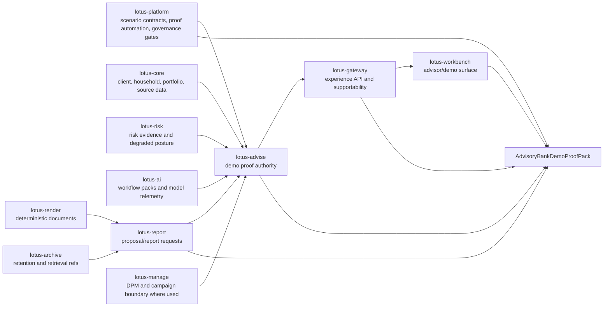

# RFC-0028: Bank Demo Journey and Client-Ready Proof

| Metadata | Details |
| --- | --- |
| **Status** | DRAFT - GOLD-STANDARD IMPLEMENTATION PLAN |
| **Created** | 2026-05-22 |
| **Last Tightened** | 2026-05-28 |
| **Owner** | `lotus-advise` for advisory journey proof, supported-claim authority, and demo evidence truth; `lotus-platform` for reusable scenario/proof automation and scaffolding where applicable |
| **Business Sponsor Persona** | sales, pre-sales, client demo lead, advisory desk head, relationship manager, compliance reviewer, model-risk reviewer, operations, security/RFP reviewer, engineering, product marketing |
| **Primary Business Outcome** | make `lotus-advise` demonstrably bank-buyable by delivering a repeatable, truthful, implementation-backed advisory demo journey, proof pack, supported-claim register, and enterprise sales/RFP package across the required Lotus repositories |
| **Depends On** | RFC-0013, RFC-0019, RFC-0020, RFC-0021, RFC-0022, RFC-0023, RFC-0024, RFC-0025, RFC-0026, RFC-0027 |
| **Cross-Repository Scope** | `lotus-advise`, `lotus-core`, `lotus-risk`, `lotus-ai`, `lotus-report`, `lotus-render`, `lotus-archive`, `lotus-gateway`, `lotus-workbench`, `lotus-manage`, `lotus-platform` |
| **Compatibility Posture** | backward compatibility is not a constraint; breaking API or contract changes are allowed when they are the cleanest design, but every affected upstream or downstream consumer must be updated in this RFC before closure |
| **Tightening Branch** | `rfc0028-gold-standard-implementation` |
| **Implementation Branching Rule** | implementation may continue on this branch or a follow-on RFC-0028 feature branch, but all branch names, PRs, commits, checks, and cross-repo closures must be recorded in RFC closure evidence |
| **Doc Location** | `docs/rfcs/RFC-0028-bank-demo-journey-and-client-ready-proof.md` |

---

## 0. Executive Summary

RFC-0028 creates the bank demo journey and client-ready proof system for `lotus-advise`.

The goal is not a scripted marketing walkthrough disconnected from implementation truth. The goal
is to make `lotus-advise` credible to a private bank buyer by proving a realistic advisory journey
end to end, using live or canonical evidence, source refs, supportability posture, documented
boundaries, and enterprise-grade sales/RFP material.

RFC-0028 owns the complete commercial proof outcome:

1. canonical advisory demo scenario contract,
2. supported-claim register,
3. advisory proof-pack manifest,
4. backend proof capture in `lotus-advise`,
5. Gateway and Workbench product-surface proof,
6. report/render/archive proof for proposal packs and client-ready artifacts where in scope,
7. AI/model-risk proof where governed AI is shown,
8. operations, security, RFP, architecture, ROI, one-pager, demo-script, and wiki material,
9. no unsupported sales, demo, wiki, or product claims,
10. no WTBD or side-ledger dependency.

RFC-0028 consumes the product capabilities delivered by RFC-0024 through RFC-0027, but it does not
defer proof to them. If a bank-demo claim depends on a capability that is not implemented at
RFC-0028 execution time, RFC-0028 must do one of three things:

1. implement the demo-critical subset in the correct owning repository as an RFC-0028 slice,
2. classify the claim as planned or unsupported and remove it from client-ready material,
3. replace the journey step with an implementation-backed alternative.

There must be no "backend ready, demo later" closure, no "sales pack later" closure, no
"Workbench screenshots later" closure for a claimed product journey, and no cross-repository work
parked in WTBD.

---

## 1. Critical Review of the Previous RFC

| Area | Previous state | Gap | Tightening applied |
| --- | --- | --- | --- |
| Scope | Focused on a demo journey and proof pack for `lotus-advise`. | It did not define a complete commercial/RFP outcome and left cross-app work as WTBD. | Scope now includes all required owner repositories, product surfaces, platform automation, supported claims, docs, sales/RFP assets, and closure proof. |
| Compatibility | Suggested optional endpoints and scripts. | Did not say whether breaking API cleanup was allowed or how downstream consumers would migrate. | Compatibility is explicit: breaking changes are allowed if clean, but every affected consumer must be updated in this RFC. |
| Architecture | Had a simple proof flow from platform to Advise, Gateway, and Workbench. | Did not define source authority, proof-pack data product posture, commercial package boundaries, report/archive path, AI/model-risk path, or supported-claim governance. | Added source authority, cross-repo ownership, scenario/proof contracts, data mesh, security, RFP, and product-surface architecture. |
| Slice sequencing | Had useful starting slices. | Mandatory platform, cleanup, data-product, proof, hardening, closure, and LinkedIn slices were incomplete or weaker than RFC-0024 through RFC-0027. | Rebuilt the slice plan into an execution-grade sequence with acceptance gates and cross-repo closure. |
| WTBD posture | Included a "Cross-App WTBDs" slice. | User direction is no more WTBDs; RFCs must be the single execution source. | Removed WTBD execution. Existing WTBD lessons are imported as closure rules and slice constraints only. |
| Product gap handling | Covered demo journey only. | Did not map the bank-buyable gaps: RFP pack, architecture deck, security pack, demo scripts, ROI story, product one-pager, Workbench journey, and proof-based claims. | Added product-gap allocation and an RFC-0028 ownership decision for every listed bank-buyable gap. |
| Data mesh | Mentioned proof artifacts. | Did not require proof records, supported-claim registers, data-product posture, trust telemetry, access, SLO, evidence policy, or catalog discoverability. | Added data product and data mesh requirements for scenario contracts, proof packs, and supported-claim registers. |
| API and automation | Proposed optional APIs. | Did not define decision criteria, certification requirements, examples, error posture, or consumer migration. | Added API/automation decision rules, certified OpenAPI requirements if endpoints are implemented, and script-only acceptance if simpler. |
| Testing and evidence | Listed proof expectations. | Did not require critical evidence review, cross-repo product proof, browser validation, RFP/security proof, load/SLO/DR evidence, or mainline closure. | Added unit, contract, integration, live, canonical Workbench, security, data mesh, performance, and RFP proof expectations. |
| Documentation | Required product docs. | Did not specify exact audience-specific assets or implementation-backed publishing rules. | Added documentation-as-product requirements for developers, business users, operations, sales, pre-sales, demos, RFP/security reviewers, and client pitches. |
| Communication | Not sufficiently operational. | User explicitly requires a LinkedIn post after completion using existing content workflow and skills. | Added post-completion communication slice with employer-safe and implementation-backed constraints. |

Decision:

1. RFC-0028 owns the complete bank demo, commercial proof, and client-ready evidence package.
2. RFC-0028 must not implement advisory features as marketing fiction; it must either prove them,
   implement the demo-critical subset, or mark them planned/unsupported.
3. No cross-repository requirement may be represented only in WTBD. Required work must be a slice,
   acceptance criterion, owner-repository PR, and closure-evidence item in this RFC.

---

## 2. Problem Statement

`lotus-advise` has a strong implementation-backed core:

1. proposal simulation through `POST /advisory/proposals/simulate`,
2. deterministic proposal artifact generation,
3. persisted proposal lifecycle with immutable versions and append-only workflow history,
4. approval and consent posture,
5. advisory workspace drafting and lifecycle handoff,
6. backend-owned proposal decision summaries,
7. backend-owned proposal alternatives,
8. tactical house-view affected-cohort evaluation,
9. execution handoff/status and report-request seams,
10. bounded workspace AI rationale through `lotus-ai`,
11. `/platform/capabilities` supportability posture,
12. OpenAPI, vocabulary, no-alias, domain-product, trust telemetry, Docker, dependency, security,
    runtime-smoke, and production guardrails.

That is not enough for a bank buyer. Banks do not buy endpoint lists. They buy confidence that the
advisory platform can support a front-office journey under private-banking governance.

The buyer needs to see:

1. what the advisor does first,
2. what client, household, mandate, proposal, policy, memo, risk, report, AI, and approval evidence
   exists,
3. which capabilities are supported today and which are planned,
4. how the UI is backed by Gateway and `lotus-advise`,
5. how source ownership and degraded dependencies are explained,
6. whether the evidence can be replayed and defended,
7. whether the product has a credible security, operations, RFP, and deployment posture,
8. whether claims are implementation-backed rather than aspirational.

If the demo story is manually assembled from disconnected outputs, it will not feel bank-buyable.
If the demo hides missing features, it creates delivery risk and sales risk. RFC-0028 makes the
demo journey a product-quality evidence system.

---

## 3. Business Outcomes

RFC-0028 must deliver these outcomes:

1. **Buyer confidence**
   prove a realistic private-banking advisory journey with source refs, readiness, lineage,
   supportability, and evidence.
2. **Sales and pre-sales readiness**
   produce a repeatable demo script, one-pager, RFP pack, security pack, architecture deck, ROI
   story, and proof-pack interpretation guide.
3. **Truthful product positioning**
   prevent demo, wiki, README, screenshot, and sales claims from drifting ahead of supported
   capability.
4. **End-to-end product coherence**
   show `lotus-advise`, Gateway, Workbench, Core, Risk, AI, Report, Render, Archive, Manage, and
   Platform working together only where implementation-backed.
5. **Operational credibility**
   prove health, readiness, dependency posture, correlation IDs, degraded behavior, diagnostics,
   logs, metrics, SLO posture, and support runbooks.
6. **Data-product maturity**
   treat scenario contracts, proof packs, and supported-claim registers as governed evidence with
   lineage, access, freshness, completeness, trust telemetry, and catalog posture where applicable.
7. **Commercial discipline**
   make every pitch-ready asset grounded in actual implementation, not roadmap aspiration.

---

## 4. Scope and Non-Scope

### 4.1 In Scope

RFC-0028 includes all work required to deliver the supported bank-demo and client-ready proof
outcome:

1. `lotus-advise` scenario contract, proof-pack model, supported-claim register, claim gates,
   proof-capture automation, optional proof APIs, OpenAPI, tests, metrics, logs, audit, data-product
   posture, documentation, wiki, supported-features material, and closure proof.
2. `lotus-core` changes needed if the canonical scenario requires source fields for client,
   household, account, mandate, booking center, product eligibility, prices, FX, cash, holdings,
   goals, constraints, or source-readiness evidence that do not exist.
3. `lotus-risk` changes needed if the canonical scenario claims stress, drawdown, VaR, issuer,
   country, sector, liquidity, private-asset, climate, geopolitical, or degraded-risk evidence.
4. `lotus-ai` changes needed if the demo shows governed advisory copilot, model-risk, prompt/output
   lineage, human review, unsupported-evidence handling, or AI unavailable behavior.
5. `lotus-report`, `lotus-render`, and `lotus-archive` changes needed if the demo claims
   client-ready proposal memo/PDF, sign-off pack, archive, retention, legal-hold, retrieval, or
   evidence package materialization.
6. `lotus-gateway` changes needed to expose demo journey endpoints, proof-backed capabilities,
   supportability, correlation IDs, errors, and product-facing contracts.
7. `lotus-workbench` changes needed to expose the end-to-end advisor/demo journey, cockpit,
   proposal pack, policy posture, AI review posture, supportability, and screenshots through
   Gateway/BFF only.
8. `lotus-manage` changes only when the demo includes tactical house-view campaign or DPM handoff
   actioning; Manage remains owner of discretionary management and campaign operations.
9. `lotus-platform` automation/scaffolding improvements when reusable gaps are discovered in
   scenario contracts, proof capture, API certification, Swagger, observability, health/readiness,
   structured logging, error handling, test scaffolding, CI defaults, documentation scaffolding,
   governance hooks, security baseline, data-mesh onboarding, live evidence, wiki publication, or
   supported-claim checks.
10. README, wiki, supported-features, demo runbook, RFP pack, security pack, architecture deck, ROI
    story, product one-pager, implementation-backed diagrams, operator guidance, and LinkedIn
    post-completion draft.

### 4.2 Non-Scope

RFC-0028 does not own:

1. legal or regulatory advice,
2. real client data preparation,
3. bank-specific policy content beyond reference/demo examples,
4. external OMS/broker execution as system of record,
5. CRM, calendar, client master, or document-management systems outside explicit handoff seams,
6. broad methodology implementation in `lotus-risk`, `lotus-core`, or `lotus-performance` unless
   needed for a claimed demo journey,
7. marketing claims that are not implementation-backed.

Non-scope does not mean "defer integration." If a non-scope item blocks a claimed RFC-0028
business outcome, the implementation must either deliver the demo-critical subset in the owning
repository, change the claim classification, or remove the claim from client-ready material.

---

## 5. Product Gap Allocation

RFC-0028 is the final commercial proof and demo-packaging RFC in the current crown-jewel sequence.
The table below decides what this RFC owns directly and what it consumes or gates from earlier RFCs.

| Product area | Bank-buyable gap | RFC-0028 treatment |
| --- | --- | --- |
| Advisory proposal simulation | Needs richer goals, constraints, household/account context, product eligibility, and scenario comparison. | Include in demo only when source-backed. If canonical scenario needs missing source fields, add owner-repo slices or classify the claim as planned/unsupported. |
| Proposal artifact generation | Needs client-ready proposal memo/PDF narrative, not just machine-readable evidence. | Demonstrate through RFC-0024/report/render/archive only when implemented; otherwise show deterministic artifact support and mark memo/PDF as planned. |
| Persisted lifecycle/versioning | Needs business-facing approval queues, supervisory dashboards, maker-checker UX, and SLA aging. | Demonstrate through RFC-0026 only when implemented; otherwise keep lifecycle proof backend-focused and do not claim cockpit queues. |
| Approval and consent workflow | Needs jurisdiction-specific approval rules, consent capture variants, escalation rules, and compliance sign-off packs. | Demonstrate RFC-0025 policy/sign-off capability only when implemented; otherwise show existing approval/consent posture and mark advanced variants planned. |
| Decision summary | Needs clearer best-interest narrative, fee/conflict rationale, and rejected-alternative explanation. | Consume RFC-0024/RFC-0025 when available; otherwise classify current decision summary support separately from client-ready rationale. |
| Suitability policy | Needs policy packs for Reg BI/MiFID/MAS/HK/Singapore private-bank rules, mandate restrictions, complex product approvals. | Demonstrate only as configurable reference policy packs once RFC-0025 is implemented; do not present sample packs as legal advice. |
| Proposal alternatives | Needs cost-aware, tax-aware, liquidity-aware, risk-budget-aware, private-assets-aware strategies. | Demonstrate current alternatives as implemented; richer construction strategies remain planned unless delivered before or inside RFC-0028. |
| Risk lens | Needs stress, VaR/drawdown, issuer/country/sector, liquidity, private assets, climate/geopolitical scenarios. | Demonstrate only implemented `lotus-risk` evidence and degraded posture. Missing lenses must be called out in supported-claim material. |
| Advisory workspace | Needs full advisor cockpit: meeting prep, talking points, tasks, collaboration, CRM handoff, follow-up. | RFC-0028 owns Workbench demo proof for RFC-0026 outputs; if RFC-0026 is missing, do not claim full cockpit. |
| Workspace AI rationale | Needs grounded client-ready commentary, model governance, human review, prompt/output lineage. | RFC-0028 owns AI demo proof and model-risk package only after RFC-0027 or demo-critical subset is implemented. |
| Execution handoff/status | Needs downstream adapters, order lifecycle reconciliation, exception management, OMS/broker integration story. | Demonstrate advisory handoff/status boundary. Do not claim OMS/broker SOR integration unless implemented by downstream owner. |
| Report request seam | Needs polished proposal pack generation through report/render/archive stack. | Directly in RFC-0028 demo proof if the demo includes client-ready artifacts. Required report/render/archive work is an RFC-0028 slice, not WTBD. |
| Tactical house-view cohorts | Needs Workbench/Gateway/Manage productization for campaign use, advisor actioning, and evidence trail. | Include only if it strengthens the canonical demo journey. Any required Gateway/Workbench/Manage changes are explicit RFC-0028 slices. |
| Capability discovery | Needs sales/demo surfacing and operational dashboards. | Directly in scope through supported-claim register, proof pack, Gateway/Workbench surfacing, and operator dashboards where implemented. |
| Non-functional posture | Needs load benchmarks, SLO dashboards, tenant/legal-entity configuration, DR/RTO/RPO evidence. | Directly in scope for demo/RFP proof. Missing evidence must be marked as planned or risk-treated, not hidden. |
| Commercial packaging | Needs RFP pack, architecture deck, security pack, demo scripts, ROI story, product one-pager. | Directly owned by RFC-0028. These assets must be implementation-backed and updated only after proof exists. |

Additional explicit allocation:

| Gap | RFC-0028 decision |
| --- | --- |
| Client-ready advisory narrative | Show only if RFC-0024/RFC-0027 narrative evidence is implemented and reviewed. |
| Advisor meeting workflow | Show only if RFC-0026 meeting-preparation/cockpit evidence is implemented. |
| Full regulatory policy packs | Show only as reference policy-pack examples after RFC-0025 implementation and legal-advice disclaimer. |
| Fee/tax/friction modeling | Show only source-backed or explicitly blocked/degraded. |
| Private assets and structured products | Show only source-backed or explicitly blocked/degraded. |
| Conflict-of-interest handling | Show only if RFC-0025/RFC-0024 conflict evidence exists. |
| End-to-end Workbench experience | Directly in scope as proof surface; must use Gateway/BFF and canonical validation. |
| AI model-risk governance and supervisory review | Directly in scope for demo proof when AI is shown; consumes RFC-0027 or implements demo-critical proof subset. |
| Enterprise deployment/security/RFP package | Directly in scope and cannot be deferred. |

---

## 6. Current Baseline

Implementation-backed foundations available before RFC-0028 implementation:

1. proposal simulation,
2. proposal artifact generation,
3. proposal lifecycle persistence and workflow history,
4. approval and consent posture,
5. workspace drafting and lifecycle handoff,
6. workspace AI rationale through a governed seam,
7. proposal decision summary,
8. proposal alternatives,
9. tactical house-view affected cohorts,
10. delivery, report-request, execution handoff, and execution-status posture,
11. `/platform/capabilities`,
12. health/readiness posture,
13. OpenAPI, vocabulary, no-alias, data-product, trust telemetry, Docker, dependency, security,
    runtime-smoke, and production-profile guardrails.

Current gaps RFC-0028 must close or classify:

1. no canonical bank demo journey contract,
2. no machine-readable supported-claim register,
3. no proof-pack manifest tying code, APIs, UI, docs, screenshots, reports, and RFP claims
   together,
4. no automated check that prevents unsupported demo claims from reaching wiki or sales material,
5. no single implementation-backed demo runbook for engineering, pre-sales, operations, and client
   demos,
6. no full commercial package: product one-pager, architecture deck, security/RFP pack, ROI story,
   and proof interpretation guide,
7. no repeatable evidence capture that spans Advise, Gateway, Workbench, Report/Render/Archive, AI,
   Platform, and source services,
8. no bank-demo data-product posture for proof records and supported claims.

---

## 7. Target Product Capability

RFC-0028 creates the `AdvisoryBankDemoProofPack`.

The proof pack is the governed evidence product used to prove a bank-demo journey. It must answer:

1. which scenario was run,
2. which repository SHAs and service versions were used,
3. which claims are supported, planned, unsupported, or degraded,
4. which endpoints, UI screens, reports, AI actions, and operational checks back each claim,
5. which dependencies were ready or degraded,
6. which evidence is safe for client demos,
7. which evidence stays under local `output/` and must not be committed,
8. which documentation, wiki, RFP, security, and sales assets are allowed to make each claim.

### 7.1 Canonical Demo Journey

The target first supported journey should show, where implementation-backed:

1. advisor opens Workbench and sees a priority advisory action or scenario entry point,
2. advisor reviews client, household, mandate, portfolio, source-readiness, and supportability
   context,
3. advisor opens or creates a proposal workspace,
4. proposal simulation runs from canonical source evidence,
5. decision summary and alternatives are generated,
6. policy/suitability/best-interest posture is shown,
7. memo/proposal pack is created or requested,
8. governed AI drafts explanation or meeting-preparation content only if enabled and reviewed,
9. approval, consent, maker-checker, and sign-off posture is visible,
10. report/render/archive readiness and client-ready artifact status are visible,
11. execution handoff/status boundary is visible without claiming OMS/broker SOR,
12. operations can inspect health, readiness, capabilities, metrics, logs, correlation IDs, and
    degraded dependency posture,
13. proof pack is generated and mapped to demo, RFP, security, and supported-feature claims.

If any step is not implemented, the step must be marked planned/unsupported or removed from the
client-ready journey.

### 7.2 Scenario Contract

The `AdvisoryDemoScenarioContract:v1` should define:

1. `scenario_id`,
2. `scenario_name`,
3. `business_journey`,
4. `portfolio_id`,
5. `client_ref` or `household_ref`,
6. `advisor_persona`,
7. `jurisdiction`,
8. `booking_center`,
9. `legal_entity`,
10. `tenant_id`,
11. `proposal_objective`,
12. `goals_and_constraints`,
13. `source_data_prerequisites`,
14. `expected_advisory_actions`,
15. `expected_proposal_status`,
16. `expected_policy_posture`,
17. `expected_alternatives_count`,
18. `expected_memo_or_report_sections`,
19. `expected_ai_actions`,
20. `expected_approval_and_consent_posture`,
21. `expected_gateway_routes`,
22. `expected_workbench_routes`,
23. `expected_degraded_case`,
24. `expected_supported_claims`,
25. `evidence_retention_class`,
26. `safe_for_demo_flag`,
27. `proof_artifact_locations`.

The governed front-office portfolio `PB_SG_GLOBAL_BAL_001` should be used when it fits the
canonical front-office validation contract. If advisory proof requires a different synthetic
portfolio, RFC-0028 must define why, how it is seeded, which repo owns the seed, and how it remains
aligned with platform demo-data contracts.

### 7.3 Supported-Claim Register

The `AdvisorySupportedClaimRegister:v1` must classify product claims:

| Classification | Meaning | Allowed in client demo material |
| --- | --- | --- |
| `IMPLEMENTATION_BACKED` | Code, tests, contract, docs, and live or canonical proof exist. | Yes. |
| `CLIENT_READY_APPROVED` | Implementation-backed and reviewed for privacy, wording, screenshots, evidence, and sales/RFP use. | Yes, preferred for client-facing material. |
| `BACKEND_BACKED_UI_PENDING` | Backend exists, but Gateway/Workbench proof is missing. | Engineering/pre-sales internal only; not as a full product journey. |
| `DEGRADED_SUPPORTED` | Behavior is implemented and can explain missing/degraded dependencies safely. | Yes, only with explicit degraded explanation. |
| `PLANNED_RFC` | Documented target-state work but not implemented. | No, except roadmap sections clearly marked planned. |
| `UNSUPPORTED` | Not implemented or not allowed. | No. |
| `REMOVED_OR_SUPERSEDED` | Older claim or route retired by better design. | No, except migration notes. |

No README, wiki, supported-features page, demo script, screenshot caption, RFP answer, security
pack, architecture deck, or LinkedIn post may present `PLANNED_RFC`,
`BACKEND_BACKED_UI_PENDING`, `UNSUPPORTED`, or `REMOVED_OR_SUPERSEDED` as supported product truth.

---

## 8. Architecture Direction

Ownership rules:

1. `lotus-advise` owns advisory journey proof, supported-claim classification, and advisory proof
   semantics.
2. `lotus-platform` owns reusable scaffolding and automation when the pattern should benefit future
   Lotus apps.
3. Source services own their source facts and degraded-source behavior.
4. Gateway owns product-facing route composition and must not invent advisory truth.
5. Workbench owns UI behavior and must consume Gateway/BFF only.
6. Report/Render/Archive own document lifecycle and retention where client-ready artifacts are
   claimed.
7. AI proof must preserve `lotus-ai` workflow-pack ownership and `lotus-advise` advisory evidence
   ownership.
8. Manage remains DPM/campaign owner and participates only when the scenario includes tactical
   house-view or discretionary-management handoff proof.

---

## 9. Source Authority and Dependency Map

| Capability | Source authority | RFC-0028 obligation |
| --- | --- | --- |
| Client, household, mandate, booking center, product data | `lotus-core` | Use source-backed refs or classify missing fields as blocked/planned. |
| Proposal simulation, lifecycle, approvals, consent, decision summary, alternatives | `lotus-advise` | Capture proof and supported claims directly. |
| Risk, concentration, stress, liquidity, private-asset, climate/geopolitical risk | `lotus-risk` | Include only implemented risk evidence; preserve degraded risk posture. |
| Memo/evidence pack | RFC-0024 and `lotus-advise` | Prove if implemented; otherwise mark planned. |
| Policy packs and sign-off posture | RFC-0025 and `lotus-advise` | Prove if implemented; otherwise mark planned and avoid regulatory overclaiming. |
| Advisor cockpit and meeting workflow | RFC-0026, Gateway, Workbench | Prove through canonical UI/browser validation if claimed. |
| Governed AI copilot | RFC-0027, `lotus-ai`, `lotus-advise` | Prove guardrails, lineage, review posture, and unavailable behavior if shown. |
| Report/render/archive | `lotus-report`, `lotus-render`, `lotus-archive` | Prove deterministic artifact, archive refs, retention, and retrieval if claimed. |
| Gateway contracts | `lotus-gateway` | Route and preserve Advise truth; do not reconstruct supportability or advisory state. |
| Workbench surfaces | `lotus-workbench` | Use Gateway/BFF only and validate browser states before screenshots are demo-ready. |
| DPM/campaign boundary | `lotus-manage` | Participate only for tactical house-view/campaign handoff proof. |
| Automation, CI, docs scaffolding, canonical validation | `lotus-platform` | Reuse or improve platform automation when the gap is repeatable. |

---

## 10. API and Automation Direction

RFC-0028 must make a Slice 0 decision between script-first proof capture and product API support.

Script-first is acceptable when:

1. proof capture is primarily engineering/pre-sales evidence,
2. no runtime user needs to list or retrieve proof runs,
3. a script produces deterministic manifests under non-git-tracked `output/`,
4. supported-claim gates can still be tested.

Product APIs are required when:

1. Gateway or Workbench needs scenario discovery or proof-run status,
2. operations needs runtime proof manifest retrieval,
3. proof packs become supported product artifacts,
4. sales/demo proof must be generated on demand through a service boundary.

Potential API family, if implemented:

1. `GET /advisory/demo-scenarios`
   list implementation-backed advisory demo scenarios and claim classifications.
2. `GET /advisory/demo-scenarios/{scenario_id}`
   return scenario contract, expected evidence, journey steps, and supported-claim taxonomy.
3. `POST /advisory/demo-scenarios/{scenario_id}/proof-runs`
   start or register a proof capture with idempotency and correlation IDs.
4. `GET /advisory/demo-scenarios/{scenario_id}/proof-runs/{proof_run_id}`
   retrieve proof manifest, statuses, degraded posture, and evidence pointers.
5. `GET /advisory/supported-claims`
   expose current supported, planned, degraded, and unsupported advisory claims where product value
   justifies runtime discovery.

API requirements if endpoints are implemented:

1. versioned contracts or stable endpoint family,
2. idempotency for proof-run creation,
3. correlation ID propagation,
4. caller context and tenant/legal-entity posture,
5. problem-details errors,
6. complete OpenAPI with descriptions, examples, what/when/how endpoint guidance, and every field
   documented with type and example value,
7. unit, contract, integration, and endpoint-certification tests,
8. downstream Gateway/Workbench migration in the same RFC.

If endpoints are skipped, RFC-0028 closure must record the no-API decision and prove that
script-first automation satisfies the business and operational outcome.

---

## 11. Data Product and Data Mesh Requirements

RFC-0028 must assess whether these records should be governed data products, internal evidence
records, or documentation-only artifacts:

1. `AdvisoryDemoScenarioContract:v1`,
2. `AdvisoryBankDemoProofPack:v1`,
3. `AdvisorySupportedClaimRegister:v1`,
4. `AdvisoryCommercialProofAssetIndex:v1`.

If promoted as data products, each must define:

1. producer repository,
2. consumer repositories,
3. data owner,
4. source authority,
5. schema and version,
6. lineage refs,
7. freshness policy,
8. completeness policy,
9. access and sensitivity classification,
10. evidence and retention policy,
11. SLO posture,
12. trust telemetry,
13. catalog entry,
14. mesh certification evidence,
15. deprecation and backward-compatibility posture.

If a record remains an internal evidence artifact, RFC-0028 must still document:

1. why it is not a data product,
2. where it is stored,
3. who consumes it,
4. how it is validated,
5. how sensitive data is excluded,
6. how it is referenced in docs and RFP material.

Data mesh closure requires that no data-product claim is decorative. Producer declarations,
trust telemetry, catalog posture, evidence policy, access policy, and certification must be real or
the claim must not be promoted.

---

## 12. Security, Privacy, and Demo Hygiene

Controls:

1. demo data must be synthetic or explicitly approved for demonstration,
2. proof packs must not commit raw runtime payloads that contain secrets, credentials, personal
   data, proprietary model prompts, restricted client data, or sensitive provider output,
3. screenshots must not expose secrets, real client identifiers, access tokens, raw prompts, or
   internal infrastructure details,
4. AI proof must not commit raw prompts or unsafe outputs,
5. generated evidence must include repo SHAs, service versions, environment markers, and
   correlation IDs,
6. degraded or blocked posture must be preserved rather than hidden,
7. client-ready material must be reviewed against supported-claim classifications,
8. RFP/security material must avoid unsupported certification or compliance claims,
9. public or LinkedIn material must not imply a bank or employer uses Lotus,
10. no investment, legal, or regulatory advice may be represented as product output.

Security proof must include:

1. dependency/security audit status,
2. sensitive-data logging and metric-label review,
3. evidence-retention decision,
4. access-control and caller-context assumptions,
5. tenant/legal-entity posture,
6. secrets and configuration hygiene,
7. incident/diagnostic runbook posture,
8. vulnerability treatment or formal tracking.

---

## 13. Observability, Operations, and Production Readiness

The demo journey must validate:

1. `/health/live`,
2. `/health/ready`,
3. `/platform/capabilities`,
4. OpenAPI availability,
5. correlation ID propagation,
6. dependency readiness basis,
7. degraded dependency responses,
8. structured logs without sensitive payloads,
9. bounded metrics and labels,
10. trace/correlation posture where available,
11. supportability counters,
12. source-readiness and missing-evidence explanations,
13. Docker/runtime smoke,
14. production-profile guardrails,
15. SLO/load benchmark posture,
16. DR/RTO/RPO evidence or explicit risk treatment,
17. tenant/legal-entity configuration posture,
18. operator next-step guidance.

Operational proof must explain:

1. what failed,
2. whether the failure is configuration, dependency, source-readiness, policy, unsupported
   feature, authorization, or code behavior,
3. what the operator should do next,
4. whether the demo claim remains valid,
5. whether the evidence can be used externally or must remain internal.

---

## 14. Documentation-as-Product Scope

RFC-0028 documentation is a first-class product deliverable. It must be detailed,
implementation-backed, and aligned to actual `lotus-advise` behavior after implementation.

Required documentation outputs:

1. README updates only where setup, validation, or product truth changes,
2. wiki pages for supported features, advisory demo journey, business flows, architecture,
   operations, integrations, and demo preparation,
3. supported-features updates for every promoted capability,
4. demo runbook for engineering, pre-sales, operations, and client-demo leads,
5. proof-pack interpretation guide,
6. API usage guide and examples for any new proof/scenario endpoints,
7. architecture diagrams that show source authority and cross-repo flow,
8. security/RFP pack,
9. architecture deck or deck-ready architecture outline,
10. product one-pager,
11. ROI story grounded in operational/advisor productivity themes without unsupported numeric
    claims,
12. demo script and talk track,
13. client-demo and internal-demo boundaries,
14. release/closure evidence summary,
15. agent context or guidance updates when implementation teaches a repeatable lesson.

Documentation layering:

1. RFC carries execution details, risks, slice sequencing, and acceptance gates.
2. Repo docs carry engineering and operator depth.
3. Wiki carries durable product/operator truth and links to deeper repo docs.
4. Supported-features material carries implementation-backed product claims.
5. Commercial material carries demo-safe and RFP-safe summaries only after proof.

No documentation may duplicate large content across repo and wiki. If wiki source changes, it must
be checked before merge and published after merge.

---

## 15. Test and Evidence Strategy

Unit tests:

1. scenario contract validation,
2. proof-pack manifest validation,
3. supported-claim classification,
4. claim-to-evidence mapping,
5. unsupported-claim rejection,
6. privacy/sensitivity classification,
7. proof asset indexing,
8. no planned claim in client-ready material.

Contract tests:

1. OpenAPI completeness if endpoints are implemented,
2. proof manifest schema,
3. supported-claim register schema,
4. no supported claim without evidence pointer,
5. error taxonomy and problem details,
6. idempotency and correlation headers,
7. vocabulary and no-alias compliance.

Integration tests:

1. canonical proposal journey evidence capture,
2. degraded dependency capture,
3. Gateway contract proof,
4. Workbench proof through Gateway/BFF,
5. report/render/archive proof where claimed,
6. AI/model-risk proof where claimed,
7. platform scenario/proof automation,
8. supported-features update validation.

End-to-end and live proof:

1. canonical journey run,
2. degraded or blocked journey run,
3. capabilities and readiness proof,
4. Workbench browser validation before demo screenshots,
5. proof pack generated under non-git-tracked `output/`,
6. critical review notes for every material figure, reason code, readiness state, source ref,
   lineage ref, UI claim, screenshot, document artifact, and RFP/security claim.

Commercial proof:

1. RFP/security pack reviewed against implementation,
2. architecture deck reviewed against source authority,
3. product one-pager reviewed against supported-claim register,
4. demo script reviewed against live evidence,
5. ROI story reviewed to avoid unsupported numeric claims,
6. LinkedIn post drafted only after implementation proof.

---

## 16. Implementation Slices

Each slice must produce small, meaningful commits or coordinated owner-repository PRs. CI must be
monitored while work continues. Failures must be fixed promptly. No slice may create or depend on a
new WTBD entry.

### Slice 0 - Critical Review, Claim Audit, and Scenario Boundary

Outcome:

1. audit current README, wiki, supported features, docs, demo payloads, decks/notes if present, and
   existing RFC-0024 through RFC-0027 plans,
2. decide first supported bank-demo journey,
3. decide which claims are implementation-backed, planned, degraded, backend-only, unsupported, or
   removed,
4. decide whether proof capture is script-first or API-backed,
5. import closed WTBD lessons as RFC constraints only.

Acceptance gate:

1. source-authority and claim-audit map is committed,
2. no active demo requirement exists only in WTBD or another side ledger,
3. implementation starts from clean current `main` after stranded-truth reconciliation,
4. open questions needed for implementation are answered or converted into Slice 0 decisions.

### Slice 1 - Platform Automation and Scaffolding Improvement

Outcome:

1. identify gaps in `lotus-platform` automation that should already have been scaffolded for new
   applications,
2. improve platform automation and scaffolding where the pattern is repeatable,
3. identify cross-cutting concerns that future apps should receive by default.

Required assessment areas:

1. API certification pattern,
2. Swagger/OpenAPI quality,
3. scenario/proof-pack contract scaffolding,
4. supported-claim register scaffolding,
5. observability,
6. health and readiness endpoints,
7. structured logging and correlation IDs,
8. error handling and problem details,
9. unit/integration/e2e/test-data scaffolding,
10. CI lane defaults,
11. documentation and wiki scaffolding,
12. governance hooks,
13. security baseline,
14. data-product onboarding,
15. trust telemetry,
16. live-evidence capture,
17. wiki publication checks.

Acceptance gate:

1. reusable platform gaps are fixed in `lotus-platform` or a deliberate no-change decision is
   recorded with evidence,
2. platform changes are tested, merged, and referenced in RFC-0028 closure evidence,
3. future Lotus apps benefit from any scaffolding improvement.

Slice 1 implementation decision and evidence:

1. A reusable platform gap exists: Lotus had front-office contracts and DPM proof-pack vocabulary,
   but no platform-owned supported-claim register contract or validator that could prevent demo,
   wiki, screenshot, RFP, security, and one-pager claims from outrunning implementation evidence.
2. The reusable platform fix was merged through `lotus-platform` PR #366 at merge commit
   `1f46cd764b1e8437091c6d5e567403053b899313`. The implementation commit
   `ea6e8151d253f5d738dfb5902d8193238b946bba` adds:
   1. `platform-contracts/supported-claims/supported-claim-register.schema.json`,
   2. `platform-contracts/supported-claims/README.md`,
   3. `platform-contracts/supported-claims/examples/rfc0028-advisory-bank-demo-supported-claims.valid.json`,
   4. `automation/validate_supported_claim_register.py`,
   5. `tests/unit/test_supported_claim_register_contract.py`.
3. Validation evidence:
   1. `python -m ruff check automation\validate_supported_claim_register.py tests\unit\test_supported_claim_register_contract.py` passed,
   2. `python -m pytest tests\unit\test_supported_claim_register_contract.py -q` passed with `4 passed`,
   3. `python automation\validate_supported_claim_register.py --path platform-contracts\supported-claims\examples\rfc0028-advisory-bank-demo-supported-claims.valid.json` passed,
   4. PR #366 Feature Lane, PR Merge Gate, Cross-App Vocabulary Gate, API Vocabulary Governance,
      and Main Releasability Gate all passed. Main releasability run `26554797152` passed.
4. RFC-0028 Advise implementation must consume this platform contract for the first supported
   claim register. No Advise-local claim taxonomy may diverge from the platform validator.

### Slice 2 - Cleanup and Structure

Outcome:

1. remove dead demo/proof placeholders,
2. improve repository and document structure where needed,
3. reduce duplicate docs and stale target-state claims,
4. move long-lived material to wiki where appropriate,
5. keep RFC, docs, wiki, supported-features, and commercial material layered rather than
   duplicated.

Acceptance gate:

1. no stale demo or commercial claim remains,
2. proof and claim code has clear module boundaries if implemented,
3. controllers remain thin and business logic stays outside controllers and infrastructure,
4. wiki source is updated only for durable product/operator truth.

Slice 2 implementation decision and evidence:

1. The first cleanup gap was durable documentation drift after Slice 1: `docs/rfcs/README.md`,
   `wiki/RFC-Index.md`, and `wiki/Supported-Features.md` still described RFC-0028 as only
   `DRAFT - SLICE 0 DECISIONS LOCKED`.
2. The durable indexes now report `DRAFT - SLICES 0-1 COMPLETE`, reference `lotus-platform`
   PR #366 and main releasability run `26554797152`, and still state that no bank-demo/RFP or
   client-ready publication claim is promoted.
3. No Advise runtime code, controller, infrastructure module, or commercial asset was created in
   this slice; the cleanup is limited to correcting durable product/operator truth before proof and
   claim models are implemented.
4. Wiki source changed because supported-feature and RFC-index truth changed. The wiki publication
   gate must run before merge, and publication must happen after merge to `main`.

### Slice 3 - Data Product and Platform Hardening

Outcome:

1. assess and strengthen `lotus-advise` as a proper data product around demo proof and supported
   claims,
2. implement data mesh requirements for proof records only when backed by code and tests,
3. improve API posture, metadata quality, discoverability, contract clarity, dependency hygiene,
   security, and production readiness.

Acceptance gate:

1. proof/scenario/claim records are declared as data products only if implemented,
2. trust telemetry, SLO/access/evidence policy, and catalog posture exist where required,
3. domain-product and mesh gates pass where applicable,
4. dependency health, security audit, migration smoke, Docker build, runtime smoke, and production
   guardrails are green,
5. `/platform/capabilities` advertises demo/proof support only after implementation is real.

Slice 3 implementation decision and evidence:

1. RFC-0028 proof-pack and supported-claim records remain internal/proposed at this point because
   the Advise-owned proof API, proof-pack model, scenario contract, and supported-claim API are
   implemented in later RFC-0028 slices, not in Slice 3.
2. No `AdvisoryBankDemoProofPack`, `AdvisorySupportedClaimRegister`, or
   `AdvisoryDemoScenarioContract` active data product declaration, trust-telemetry snapshot, or
   `/platform/capabilities` feature is allowed before those records are backed by real contracts,
   APIs, proof evidence, and canonical validation.
3. Existing active Advise evidence products are the source products for the eventual RFC-0028 proof
   pack: `ProposalNarrativeEvidence`, `AdvisoryProposalMemoEvidencePack`,
   `AdvisoryPolicyEvaluationRecord`, `AdvisorCockpitOperatingSnapshot`,
   `AdvisoryActionItemRegister`, and `AdvisoryCopilotInteractionRecord`.
4. `/platform/capabilities` must not advertise bank-demo proof or supported-claim support until
   Slice 5 and the later Gateway/Workbench proof slices promote the capability with evidence.
5. No `contracts/domain-data-products/`, `contracts/trust-telemetry/`, or capabilities code change
   is made in Slice 3 because the correct hardening is a regression guard against premature
   promotion.
6. No wiki source change is required for Slice 3 because no product capability, operator flow,
   supported feature, or client-facing posture changed.

### Slice 4 - Scenario Contract, Supported-Claim Register, and Proof-Pack Model

Outcome:

1. define `AdvisoryDemoScenarioContract:v1`,
2. define `AdvisorySupportedClaimRegister:v1`,
3. define `AdvisoryBankDemoProofPack:v1`,
4. define proof asset index and retention/sensitivity rules.

Acceptance gate:

1. schemas or documented structures are testable,
2. every supported claim requires evidence,
3. every planned/unsupported/degraded claim has explicit wording rules,
4. proof pack can represent backend, Gateway, Workbench, report, AI, platform, security, and RFP
   evidence.

### Slice 5 - Backend Proof Capture in `lotus-advise`

Outcome:

1. implement repo-native proof capture for advisory APIs, health/readiness, capabilities, proposal
   simulation, lifecycle, approvals, decision summary, alternatives, workspace, tactical
   house-view, report seam, execution handoff/status, and degraded cases as applicable.

Acceptance gate:

1. canonical and degraded outputs are captured under non-git-tracked `output/`,
2. every material response field used in a demo claim is critically reviewed,
3. evidence contains commit SHA, service version, environment, correlation IDs, and runtime
   posture,
4. no raw sensitive payload is committed.

### Slice 6 - Client-Ready Artifact, Report, Render, and Archive Proof

Outcome:

1. prove report/render/archive support if client-ready proposal packs, memo PDFs, sign-off packs,
   archive refs, retention, retrieval, or legal-hold posture are claimed,
2. implement required owner-repository changes inside RFC-0028 if not already delivered by
   RFC-0024 or RFC-0025.

Acceptance gate:

1. report/render/archive PRs are merged and validated where required,
2. proof pack includes document request, render status, archive refs, retention/access posture, and
   degraded document behavior,
3. client-ready document claims are blocked unless review and supported-claim gates pass.

### Slice 7 - Gateway Experience Contract and Capability Publication

Outcome:

1. update `lotus-gateway` to expose supported demo/proof/capability routes if needed,
2. preserve caller context, tenant/legal-entity posture, correlation IDs, supportability,
   problem-details errors, and source-backed claim classifications.

Acceptance gate:

1. Gateway tests pass,
2. Gateway consumes canonical `lotus-advise` endpoints,
3. Gateway does not invent advisory workflow, supportability, or supported-claim state,
4. cross-repo evidence is captured in the proof pack.

### Slice 8 - Workbench End-to-End Demo Experience

Outcome:

1. implement or align Workbench surfaces required for the bank-demo journey,
2. use Gateway/BFF only,
3. prove advisor, compliance, operations, demo, empty, degraded, and blocked states where claimed.

Acceptance gate:

1. Workbench browser validation passes through the governed front-office runtime path,
2. screenshots are captured only after backend, Gateway, and Workbench validation pass,
3. screenshots are labeled demo-ready only when supported-claim and privacy gates pass,
4. no UI-local advisory truth or supportability inference exists.

### Slice 9 - AI, Model-Risk, Policy, and Cockpit Proof Integration

Outcome:

1. integrate RFC-0024, RFC-0025, RFC-0026, and RFC-0027 outputs into the demo proof where
   implemented,
2. prove AI/model-risk, policy-pack, cockpit, meeting-preparation, approval, and memo claims only
   when supported.

Acceptance gate:

1. missing RFC-0024 through RFC-0027 features are classified as planned/unsupported or implemented
   as demo-critical slices,
2. AI proof includes guardrails, unsupported-evidence posture, prompt/output lineage refs, human
   review posture, unavailable behavior, and no raw prompt leakage where AI is shown,
3. policy proof avoids regulatory/legal overclaiming,
4. cockpit proof avoids UI-local workflow logic.

### Slice 10 - Commercial, RFP, Security, Architecture, ROI, and Demo Package

Outcome:

1. produce enterprise sales and client-demo assets grounded in proof.

Required outputs:

1. product one-pager,
2. RFP response pack,
3. security posture pack,
4. architecture deck or deck-ready architecture outline,
5. demo script and talk track,
6. proof-pack interpretation guide,
7. ROI story,
8. supported versus planned feature matrix,
9. client-demo boundaries,
10. operator/demo lead checklist.

Acceptance gate:

1. every asset maps claims to `AdvisorySupportedClaimRegister:v1`,
2. no unsupported regulatory, security, AI, execution, report, or UI claim remains,
3. assets are useful for business users, developers, operations, sales, pre-sales, marketing,
   client demos, and client pitches,
4. sensitive implementation details and raw payloads are excluded.

### Slice 11 - Security, Production, Performance, and CI Hardening

Outcome:

1. review and harden entitlement assumptions, sensitive-data handling, dependency hygiene, security
   vulnerabilities, metrics labels, logging, traces, configuration, tenant/legal-entity posture,
   load/latency, SLOs, DR/RTO/RPO, Docker, production profile, and CI posture.

Acceptance gate:

1. security vulnerabilities are fixed or formally tracked with treatment,
2. dependency health is green,
3. production guardrails are green,
4. load/latency evidence exists for proof/scenario endpoints or proof scripts where relevant,
5. no high-cardinality or sensitive logs/metrics remain,
6. RFP/security pack reflects actual evidence.

### Slice 12 - Documentation During Build

Outcome:

1. update README, docs, wiki source, supported features, architecture diagrams, demo runbooks,
   proof guides, and commercial material as implementation becomes real.

Acceptance gate:

1. docs are implementation-backed and not generic,
2. wiki source is useful and non-duplicative,
3. supported-features wording is promoted only after proof,
4. explicit no-wiki-change decisions are recorded for reviewed docs that do not change.

### Slice 13 - Implementation Proof

Outcome:

1. prove the implementation end to end against this RFC,
2. capture live and canonical evidence,
3. verify evidence critically rather than treating any response as success,
4. iterate until the implementation is genuinely gold standard.

Acceptance gate:

1. live evidence covers canonical and degraded Advise paths,
2. Gateway and Workbench proof exists for every claimed product surface,
3. report/render/archive proof exists for every claimed client-ready artifact,
4. AI/model-risk proof exists for every claimed AI capability,
5. capabilities, health, readiness, metrics, logs, data-product posture, and security proof are
   included,
6. every returned figure, count, reason code, readiness state, lineage ref, source ref, document
   ref, AI review state, UI label, screenshot, and RFP claim is critically reviewed,
7. discovered gaps are fixed inside this RFC.

### Slice 14 - Second-Last Hardening and Review

Outcome:

1. perform a proper code, contract, security, documentation, commercial-claim, data-mesh,
   operations, and product-surface review before closure,
2. tighten loose ends,
3. verify API certification pattern compliance,
4. verify platform governance and enterprise data mesh standards,
5. ensure all APIs are properly certified where implemented,
6. ensure Swagger is complete and high quality,
7. ensure error handling is complete, correct, and tested,
8. ensure security vulnerabilities are addressed or formally tracked.

Acceptance gate:

1. no dead code, stale endpoints, duplicate docs, misleading demo material, unsupported product
   claims, or WTBD dependencies remain,
2. OpenAPI examples cover request, response, error, degraded, unsupported, and proof-run cases if
   APIs are implemented,
3. every request/response attribute has description, type, and example value,
4. all repo-native and affected cross-repo CI gates are green,
5. RFP/security/product material passes supported-claim review.

### Slice 15 - Final Closure

Outcome:

1. update README, docs, wiki source, supported features, RFC status, architecture diagrams,
   operations runbooks, data-product docs, proof summaries, commercial assets, source maps, and
   repository context where needed,
2. publish wiki after merge when wiki source changed,
3. run branch hygiene and stranded-truth reconciliation,
4. ensure closure truth is on `main`,
5. consciously review skills, guidance, documentation, and agent context.

Acceptance gate:

1. no closure truth is stranded on a branch,
2. all required owner-repository PRs are merged,
3. branches are deleted,
4. Main Releasability Gate is green for affected repositories,
5. wiki source is publishable and published if changed,
6. supported-features material is implementation-backed,
7. agent-context, skills, or guidance changes are added if needed, or an explicit no-change
   decision is recorded,
8. no follow-up RFC, second wave, WTBD, or side ledger is required to realize the RFC-0028 business
   value.

### Slice 16 - Post-Completion Communication

Outcome:

1. draft a LinkedIn post based only on what was actually implemented,
2. follow the Lotus LinkedIn thought-leadership workflow,
3. keep the post employer-safe, practitioner-led, non-confidential, non-promotional, and grounded
   in implementation-backed outcomes.

Requirements:

1. read `lotus-platform/thought-leadership/linkedin/content-ledger.md`,
2. read `themes.md`,
3. read `voice-and-style-guide.md`,
4. review recent drafts, reviewed posts, and posted posts,
5. draft under `lotus-platform/thought-leadership/linkedin/drafts/`,
6. update the content ledger,
7. avoid unsupported Lotus capability, investment, legal, regulatory, AI, employer, or client
   claims,
8. do not imply any bank or employer uses Lotus.

Acceptance gate:

1. post is drafted only after implementation proof,
2. post does not claim unsupported product capability,
3. post path and ledger update are referenced in closure evidence, or closure records a deliberate
   user-approved no-post decision.

---

## 17. Supported-Features Ledger

| Capability | Initial RFC state | Promotion rule |
| --- | --- | --- |
| Canonical advisory demo scenario | Proposed | Promote only after scenario contract, source prerequisites, proof expectations, and canonical/degraded evidence are implemented and validated. |
| Advisory bank demo proof pack | Proposed | Promote only after proof manifest captures backend, Gateway, Workbench, platform, report, AI, security, and commercial evidence as applicable. |
| Supported-claim register | Proposed | Promote only after README, wiki, supported-features, demo scripts, and commercial assets use the taxonomy consistently. |
| Demo proof capture automation | Proposed | Promote only after a non-author can run the documented commands and interpret the output. |
| Demo scenario APIs | Optional | Promote only if implemented with certified OpenAPI, tests, idempotency, errors, and Gateway/Workbench consumers where needed. |
| Gateway demo/proof integration | Proposed | Promote only after Gateway consumes canonical Advise contracts and preserves supportability and correlation evidence. |
| Workbench end-to-end demo journey | Proposed | Promote only after browser validation through Gateway/BFF and screenshot privacy/supported-claim review. |
| Client-ready proposal pack proof | Gated | Promote only after RFC-0024/report/render/archive evidence is implemented and reviewed. |
| Enterprise policy-pack demo proof | Gated | Promote only after RFC-0025 evidence is implemented, reviewed, and framed as configurable policy support rather than legal advice. |
| Advisor cockpit demo proof | Gated | Promote only after RFC-0026 Gateway/Workbench evidence is implemented and browser validated. |
| Governed AI copilot demo proof | Gated | Promote only after RFC-0027 guardrails, lineage, review posture, unavailable behavior, and model-risk evidence are implemented. |
| RFP/security pack | Proposed | Promote only after security, dependency, config, tenant/legal-entity, supportability, vulnerability treatment, and implementation evidence are reviewed. |
| Architecture deck or deck-ready outline | Proposed | Promote only after diagrams align to actual source authority, APIs, and proof evidence. |
| Product one-pager | Proposed | Promote only after supported claims are client-ready approved or clearly marked planned. |
| ROI story | Proposed | Promote only after wording is grounded in implemented workflow value and avoids unsupported numeric claims. |
| LinkedIn post-completion draft | Proposed | Promote only after implementation is complete and the draft follows the thought-leadership workflow. |

---

## 18. Existing WTBD Import and No-WTBD Execution Rule

RFC-0028 is the single source of execution for bank-demo, client-ready proof, commercial packaging,
and supported-claim governance.

Rules:

1. Do not create new WTBD entries for RFC-0028 implementation work.
2. Do not defer Gateway, Workbench, report/render/archive, AI, platform, source-authority,
   `lotus-manage`, data-product, documentation, commercial, RFP, security, supported-features, or
   wiki work to WTBD.
3. If a dependency is required to realize RFC-0028 business value, add it as an RFC-0028 slice,
   acceptance criterion, owner-repository PR, or explicit removal/declassification of the
   unsupported claim.
4. Existing closed WTBD lessons may be used as context only.
5. Closure requires proof that no active demo/proof/commercial requirement exists only in WTBD or
   another side ledger.

Closed WTBD lessons imported into RFC-0028:

| Closed WTBD | Imported RFC-0028 requirement | Slice ownership |
| --- | --- | --- |
| WTBD-001 proposal service decomposition | Demo/proof work must not re-expand `ProposalWorkflowService`; proof capture should use named command/read-model/projection boundaries and avoid duplicating proposal business rules. | Slice 2, Slice 5, Slice 14 |
| WTBD-002 stateful context adapter decomposition | Scenario source evidence must preserve source-read, route, cache, taxonomy, translation, and hydration boundaries; missing richer source fields are source-owner slices or blocked claims. | Slice 0, Slice 5, Slice 13 |
| WTBD-003 workspace service decomposition | Workbench and workspace proof must not place advisory workflow rules in API facades or UI helpers; product surfaces consume canonical Advise/Gateway contracts. | Slice 2, Slice 8, Slice 14 |
| WTBD-004 Gateway/Workbench capability alignment | Any capability or supportability claim change must keep Gateway and Workbench aligned with Advise source-backed contracts rather than local feature flags. | Slice 7, Slice 8, Slice 13 |

---

## 19. Acceptance Criteria

RFC-0028 is implemented only when:

1. current-state demo and supported-claim audit is complete,
2. canonical scenario contract is implemented or documented in a testable structure,
3. supported-claim register governs README, wiki, supported features, demo scripts, screenshots,
   commercial material, and RFP/security content,
4. proof-pack manifest captures canonical and degraded evidence,
5. backend proof capture is repeatable,
6. Gateway and Workbench are updated in the same RFC where required to realize product value,
7. report/render/archive, AI, policy, memo, cockpit, and Manage handoff claims are only promoted
   when owner-repo implementation and proof exist,
8. data-product and data-mesh posture is real where claimed,
9. OpenAPI, vocabulary, no-alias, dependency, security, migration smoke, Docker, production
   guardrails, unit, integration, e2e, coverage, performance, and affected cross-repo gates are
   green as applicable,
10. canonical front-office browser validation passes before demo-ready screenshots are used,
11. RFP pack, security pack, architecture deck/outline, product one-pager, ROI story, demo script,
    and proof interpretation guide are implementation-backed,
12. README, docs, wiki source, supported-features, architecture, operations, commercial material,
    and proof summaries are aligned,
13. wiki is published after merge when wiki source changes,
14. LinkedIn post-completion draft and ledger update are complete or deliberately user-waived,
15. no required follow-up RFC, second wave, WTBD dependency, unmerged branch, or stranded durable
    truth remains.

---

## 20. Risks and Mitigations

| Risk | Mitigation |
| --- | --- |
| Demo becomes marketing fiction | Supported-claim register, proof manifest, and commercial asset review gate every claim. |
| RFC-0028 duplicates feature RFCs | RFC-0028 owns proof and packaging; it implements only demo-critical subsets or classifies missing claims. |
| Cross-repo work is pushed to WTBD | WTBD is prohibited as an execution mechanism; owner-repo changes are RFC-0028 slices and closure gates. |
| Workbench screenshots overstate support | Screenshots require backend, Gateway, Workbench, privacy, and supported-claim validation first. |
| RFP/security pack overclaims certification | Every security/RFP statement must map to actual checks, docs, or explicit risk treatment. |
| AI appears uncontrolled or advisory-authoritative | AI proof requires RFC-0027-style guardrails, lineage, review state, and clear non-authority wording. |
| Policy demos appear as legal/regulatory advice | Policy-pack examples are configurable reference controls, not legal advice; supported claims must say so. |
| Client data or secrets leak into proof artifacts | Synthetic/approved data, retention rules, no raw prompts, no secrets, and screenshot review. |
| Proof automation becomes too heavy | Slice 0 chooses script-first or API-backed proof based on product value; platform automation handles repeatable patterns. |
| Data product claim is decorative | Data-product promotion requires producer declaration, trust telemetry, access/SLO/evidence policy, catalog, and certification. |
| ROI story uses unsupported numbers | Use qualitative implementation-backed productivity and control themes unless fresh, approved metrics exist. |
| CI passes locally but fails remotely | Use GitHub Feature Lane, PR Merge Gate, Main Releasability Gate, and fix-forward monitoring. |

---

## 21. Delivery Governance and CI

Implementation must use GitHub effectively:

1. create or continue the active RFC-0028 feature branch,
2. keep commits small, meaningful, and truthful,
3. run repository-native local checks before pushing,
4. push early enough for GitHub checks to run asynchronously,
5. monitor Feature Lane, PR Merge Gate, Main Releasability Gate, and affected cross-repo gates,
6. fix failures promptly,
7. keep branch quality and CI health under control,
8. run stranded-truth reconciliation before implementation start, before final closure, and before
   moving to any next RFC,
9. merge all required owner-repository changes to `main`,
10. delete completed feature branches,
11. verify final repo state is clean.

Expected local proof for `lotus-advise`:

1. `make check`,
2. `make ci` when runtime, persistence, migration, Docker, production guardrails, or broad
   implementation behavior changes,
3. `make domain-data-products-gate` when data-product declarations or trust telemetry change,
4. targeted live/runtime proof for scenario/proof behavior,
5. `lotus-platform/automation/Sync-RepoWikis.ps1 -CheckOnly -Repository lotus-advise` when wiki
   source changes.

Affected repositories must use their repo-native gates and GitHub lanes.

---

## 22. Slice 0 Pre-Implementation Decisions

Slice 0 decisions are locked before implementation starts. They are based on current `main` after
RFC-0027 merge `1dda5a2619a5f8dab367f393c972a30c251b1543`, clean stranded-truth reconciliation,
and the RFC-0024 through RFC-0027 canonical evidence already merged to `main`.

| Question | Decision | Implementation consequence |
| --- | --- | --- |
| Proof capture style | Hybrid. `lotus-advise` must implement an Advise-owned proof-pack and supported-claim API because Gateway and Workbench need product-facing truth. `lotus-platform` automation must orchestrate repeatable canonical proof capture and write machine-readable evidence under `output/`. | Slice 4 and Slice 5 implement proof models/APIs in Advise; Slice 7 and Slice 8 consume through Gateway/Workbench; platform automation is expanded where the pattern is reusable. Script-only proof is insufficient for RFC-0028 because it cannot back product surfaces or supported-claim governance. |
| Canonical dataset | Primary dataset is `PB_SG_GLOBAL_BAL_001` with governed scenario id `RFC28_BANK_DEMO_CLIENT_READY_PROOF_CANONICAL`. No new synthetic portfolio is introduced unless Slice 0/Slice 5 proves a source-field gap that cannot be truthfully represented by the governed portfolio. | Seed or automation expansion is RFC-0028 scope, not follow-up work. Any additional data must be added to the owning repository and platform canonical front-office contracts before Workbench screenshots or commercial material use it. |
| First supported demo journey | First supported journey is the combined private-banking advisory scenario: advisor cockpit entry point, proposal simulation/artifact, advisor-use memo evidence, policy evaluation posture, governed AI copilot, report/readiness/archive evidence where implemented, supported-claim register, and Workbench proof. | Single-feature demos are allowed only as drill-downs inside the combined proof pack. A capability is not promoted as client-demo ready until backend, Gateway, Workbench, documentation, and proof evidence agree. |
| Workbench proof requirement | Every product-journey claim, screenshot, demo script step, and sales/RFP statement that describes advisor workflow or client-ready evidence requires Workbench proof through Gateway/BFF. Backend-only claims are limited to APIs, data products, supportability, and operational proof explicitly labeled internal. | Workbench must stay Gateway-first. No Workbench component may reconstruct advisory suitability, memo, narrative, policy, claim, proof, or AI semantics locally. |
| Client-ready artifact boundary | RFC-0028 must prove a client-ready evidence package can be assembled and reviewed, but it must not claim external client delivery, legal approval, or regulatory sign-off unless the owning workflow implements those controls. The first proof package may carry `CLIENT_READY_REVIEW_REQUIRED` or `CLIENT_READY_PUBLICATION_BLOCKED` when that is the truthful posture. | Report/render/archive work is required if the demo includes proposal-pack materialization. If final publication controls are incomplete, commercial material must say "client-ready evidence review" or "proposal-pack proof" rather than "approved client communication." |
| RFP/security evidence | Formal evidence is required for dependency/security audit posture, OpenAPI quality, no-alias governance, data-product/trust telemetry, Docker build, production profile, health/readiness, correlation IDs, audit/lineage, synthetic data handling, and screenshot/privacy controls. External certifications, bank-specific control attestations, SOC/ISO status, DR commitments, or regulator-specific approval claims require either actual evidence or explicit unsupported/planned wording. | RFP/security pack content must map each statement to a check, repo artifact, live evidence, or supported-claim classification. Unsupported certifications are not implemented as text-only claims. |
| Non-functional blockers | Closure is blocked by red repository-native gates, red PR Merge Gate, red main releasability, failed canonical front-office validation, missing proof for promoted UI claims, missing synthetic-data/privacy review, missing supported-claim register validation, or untriaged security/dependency findings. Load, latency, SLO, DR/RTO/RPO, tenant, and legal-entity claims block closure only when they are promoted as supported claims; otherwise they must be risk-treated or marked planned/unsupported. | Performance and operational evidence must be generated for any promoted non-functional claim. The demo may not hide degraded or blocked dependency posture. |
| Durable versus runtime artifacts | Commit stable scenario contracts, proof-pack schemas/models, supported-claim rules, sanitized proof summaries, docs, wiki source, commercial markdown, and tests. Keep raw runtime payloads, screenshots before validation, trace logs, provider payloads, secrets, tokens, and environment-specific proof under non-git-tracked `output/`. | Proof automation must write a sanitized summary suitable for docs and a richer local evidence bundle for audit. Committed summaries must include repo SHAs, scenario id, evidence markers, and unsupported-claim posture without sensitive payloads. |
| Platform scaffolding | Slice 1 must assess and, where reusable, add platform support for scenario/proof contract validation, supported-claim register checks, canonical evidence summary validation, front-office proof markers, screenshot privacy posture, and wiki publication checks. | If platform already has sufficient support, Slice 1 records a no-change decision. If not, platform changes are implemented and merged before app-specific closure depends on them. |
| Commercial assets | Produce markdown source now for demo script, proof interpretation guide, RFP/security pack, architecture narrative/diagrams, product one-pager, ROI story, and supported-versus-planned feature matrix. Deck-ready outlines are allowed in markdown; generated PowerPoint is not required unless requested separately after implementation proof. | Commercial content is product documentation, not decorative collateral. It must be implementation-backed, business-facing, and free of raw technical leakage. |

Front-office canonical automation decision:

1. RFC-0028 must expand canonical front-office automation when the existing RFC-0024 through
   RFC-0027 validation does not prove the end-to-end bank-demo journey.
2. The canonical proof marker is `BANK_DEMO_PROOF_PACK_CREATED`.
3. The canonical scenario id is `RFC28_BANK_DEMO_CLIENT_READY_PROOF_CANONICAL`.
4. The primary portfolio remains `PB_SG_GLOBAL_BAL_001`.
5. Workbench evidence is not demo-ready until `npm run live:validate` and the governed platform
   front-office QA path prove the RFC-0028 panel/journey through Gateway-backed data.
6. Any live validation defect discovered during RFC-0028 must be covered by the lowest useful test:
   unit for pure domain rules, contract/API test for schema and route behavior, integration test for
   cross-service contracts, or front-office/live validation for product-surface regressions.

No open implementation question remains for RFC-0028 Slice 1. New facts discovered during
implementation must be recorded as slice decisions, not parked in WTBD, "day 2", or "wave 2"
language.
