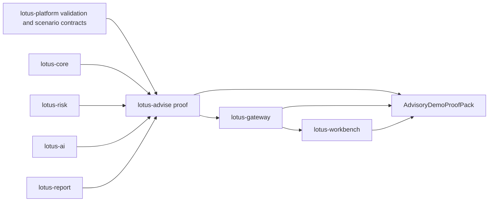

# RFC-0028: Bank Demo Journey and Client-Ready Proof

| Metadata | Details |
| --- | --- |
| **Status** | DRAFT |
| **Created** | 2026-05-22 |
| **Owner** | `lotus-advise` for advisory backend proof and journey evidence; `lotus-platform` for cross-repo validation patterns where applicable |
| **Business Sponsor Persona** | sales, pre-sales, client demo lead, advisory desk head, operations, engineering, product marketing |
| **Depends On** | RFC-0013, RFC-0019, RFC-0020, RFC-0021, RFC-0022, RFC-0023, RFC-0024, RFC-0025, RFC-0026, RFC-0027 |
| **Cross-App Dependencies** | `lotus-core`, `lotus-risk`, `lotus-ai`, `lotus-report`, `lotus-gateway`, `lotus-workbench`, `lotus-platform` |
| **Doc Location** | `docs/rfcs/RFC-0028-bank-demo-journey-and-client-ready-proof.md` |

---

## 0. Executive Summary

RFC-0028 defines the bank demo journey and client-ready proof system for `lotus-advise`.

The purpose is not to create a scripted marketing demo disconnected from implementation truth. The
purpose is to make `lotus-advise` demonstrably bank-buyable by proving a realistic private-banking
advisory journey end to end:

1. advisor identifies client need,
2. proposal is simulated from canonical source evidence,
3. alternatives and decision summary are generated,
4. suitability and best-interest policy posture is evaluated,
5. proposal memo and evidence pack are prepared,
6. governed AI assists with explanation and meeting preparation where enabled,
7. approval, consent, report, and execution-readiness boundaries are visible,
8. Workbench/Gateway product surfaces display backend-backed truth,
9. proof artifacts are captured for sales, pre-sales, operations, engineering, and audit.

This RFC treats demos as product evidence. A demo claim is only allowed when the backing API,
contract, test, and live validation evidence exists.

---

## 1. Problem Statement

Lotus has strong service-level capability, but enterprise buyers evaluate full journeys. They ask:

1. can the advisor see a coherent workflow,
2. are recommendations explainable,
3. is suitability governed,
4. is evidence replayable,
5. are AI features controlled,
6. can operations diagnose issues,
7. are UI claims backed by APIs,
8. can the platform survive realistic degraded dependency states?

If the demo story is assembled manually from disconnected outputs, it will not feel bank-buyable.
If the demo hides missing features, it creates delivery risk and sales risk.

RFC-0028 makes the demo journey implementation-backed and repeatable.

## 2. Business Outcomes

RFC-0028 targets these outcomes:

1. **Increase buyer confidence**
   demonstrate a complete advisory journey with source refs, evidence, and operational proof.
2. **Improve sales and pre-sales quality**
   give teams a reliable, repeatable, truthful demo script and evidence pack.
3. **Align product and engineering truth**
   prevent UI/demo claims from drifting ahead of supported backend capability.
4. **Accelerate client feedback**
   use a realistic end-to-end journey to surface product gaps buyers actually care about.
5. **Strengthen operational readiness**
   validate not only happy-path behavior but also degraded source and readiness explanations.
6. **Make Lotus commercially coherent**
   show how `lotus-advise`, `lotus-core`, `lotus-risk`, `lotus-ai`, `lotus-report`, Gateway,
   Workbench, and platform governance work together.

## 3. Current Baseline

Implementation-backed foundations:

1. proposal simulation,
2. proposal artifact,
3. persisted proposal lifecycle,
4. approval and consent posture,
5. workspace drafting and AI rationale seam,
6. proposal decision summary,
7. proposal alternatives,
8. tactical house-view affected cohorts,
9. integration capability discovery,
10. OpenAPI, vocabulary, no-alias, data-product, trust telemetry, and runtime smoke gates.

Future feature dependencies:

1. RFC-0023 grounded narrative,
2. RFC-0024 proposal memo,
3. RFC-0025 policy packs,
4. RFC-0026 advisor cockpit,
5. RFC-0027 governed advisory copilot.

Gaps:

1. no canonical advisory demo journey definition,
2. no machine-readable demo scenario contract,
3. no single proof-pack manifest for a sales/demo run,
4. no readiness gate that prevents unsupported demo claims,
5. no standard evidence capture structure for advisory demos,
6. no published business/user/operations documentation for the full journey.

## 4. Demo Principles

1. **Truth first:** no slide, wiki, screenshot, or pitch claim should exceed implementation-backed
   support.
2. **Backend-backed UI:** Workbench surfaces must be backed by Gateway and advisory APIs.
3. **Source-backed evidence:** every material figure or status must trace to source authority or
   explicit degraded posture.
4. **No hidden happy path:** the journey must include at least one degraded or blocked case to show
   supportability.
5. **Repeatable:** the demo can be rerun by engineering and pre-sales from documented commands.
6. **Audience-aware:** documentation serves developers, business users, operations, sales,
   pre-sales, client demos, and client pitches.

## 5. Target Demo Journey

### 5.1 Journey Narrative

The first-wave advisory demo should show:

1. advisor opens cockpit and sees a high-priority client advisory action,
2. advisor reviews client and portfolio context,
3. advisor creates or opens a proposal workspace,
4. proposal simulation runs with canonical source evidence,
5. proposal alternatives and decision summary are generated,
6. policy pack evaluation explains suitability and approval posture,
7. proposal memo packages the evidence,
8. governed AI drafts advisor preparation or explanation where enabled,
9. proposal moves through approval/consent posture,
10. report and execution handoff readiness are shown with ownership boundaries,
11. platform capabilities and readiness endpoints prove operational supportability.

### 5.2 Canonical Scenario Contract

The demo scenario contract should define:

1. scenario id,
2. portfolio id,
3. client or household ref,
4. advisor persona,
5. jurisdiction and booking center,
6. proposal objective,
7. source data prerequisites,
8. expected proposal status,
9. expected alternatives count,
10. expected policy posture,
11. expected memo sections,
12. expected AI pack availability,
13. expected degraded case,
14. expected Gateway/Workbench routes,
15. proof artifact locations.

The governed front-office portfolio `PB_SG_GLOBAL_BAL_001` should be used where it is the platform
canonical seeded portfolio for front-office validation, unless the scenario explicitly requires a
different dataset and records why.

## 6. Evidence Pack Model

The `AdvisoryDemoProofPack` should include:

1. scenario metadata,
2. repository and commit SHAs,
3. service URLs and environment summary,
4. `/health/live` and `/health/ready` evidence,
5. `/platform/capabilities` evidence,
6. proposal simulation request/response,
7. proposal lifecycle create/version/transition evidence,
8. decision summary evidence,
9. alternatives evidence,
10. policy evaluation evidence when RFC-0025 is implemented,
11. memo evidence when RFC-0024 is implemented,
12. copilot evidence when RFC-0027 is implemented,
13. Gateway response captures,
14. Workbench screenshot references only after canonical validation passes,
15. degraded dependency evidence,
16. supportability metrics snapshot where available,
17. critical review notes,
18. unsupported-claim checklist.

Proof artifacts should live under non-git-tracked `output/` during execution. Curated summaries may
be committed only when they are durable documentation and contain no sensitive runtime payloads.

## 7. Architecture Direction

Ownership:

1. `lotus-advise` owns advisory backend proof, scenario expectations, and backend claim gating,
2. `lotus-platform` may own reusable validation automation and canonical demo-data contracts,
3. `lotus-gateway` owns experience API proof,
4. `lotus-workbench` owns browser and screenshot proof,
5. source services own their domain evidence and degraded-state behavior.

## 8. Supported Claim Taxonomy

Demo material must classify claims as:

1. `IMPLEMENTATION_BACKED`
   supported by current code, tests, API contract, and live or canonical proof.
2. `BACKEND_BACKED_UI_PENDING`
   backend support exists, but Gateway/Workbench product surface is not complete.
3. `PLANNED_RFC`
   documented RFC target, not implemented.
4. `UNSUPPORTED`
   should not be used in sales/client material.
5. `DEGRADED_SUPPORTED`
   implemented behavior exists but currently requires degraded explanation because a dependency is
   unavailable or source evidence is incomplete.

No demo or wiki claim may present `PLANNED_RFC` or `BACKEND_BACKED_UI_PENDING` as fully supported.

## 9. Proposed API and Automation Direction

Potential backend support endpoints:

1. `GET /advisory/demo-scenarios`
   list implementation-backed advisory demo scenarios.
2. `GET /advisory/demo-scenarios/{scenario_id}`
   return scenario contract, expected evidence, and supported-claim taxonomy.
3. `POST /advisory/demo-scenarios/{scenario_id}/proof-runs`
   run or register a proof capture for the scenario where appropriate.
4. `GET /advisory/demo-scenarios/{scenario_id}/proof-runs/{run_id}`
   retrieve proof manifest and status.

Automation:

1. a repo-native script may capture advisory API proof into `output/`,
2. platform automation may coordinate Gateway/Workbench/browser proof,
3. screenshot capture must follow front-office runtime governance and must not be labeled
   demo-ready before backend validation passes.

This API direction is optional. If a script-only approach is simpler and more truthful for
first-wave implementation, the RFC implementation should record that decision.

## 10. Documentation-as-Product Scope

RFC-0028 should create or update documentation for:

1. developer setup and validation,
2. business journey explanation,
3. sales/pre-sales talk track,
4. operations readiness and degraded-state explanation,
5. supported versus planned feature matrix,
6. architecture diagrams,
7. API usage examples,
8. demo runbook,
9. proof artifact interpretation,
10. exact boundaries across Advise, Gateway, Workbench, Core, Risk, Report, AI, and Platform.

Documentation must be implementation-backed. Screenshots and diagrams must not imply unsupported
product capability.

## 11. Security, Privacy, and Client Demo Hygiene

Controls:

1. demo data must be synthetic or explicitly approved for demonstration,
2. proof packs must not commit sensitive runtime payloads,
3. screenshots must not expose secrets or real client identifiers,
4. generated evidence must include commit SHAs and environment markers,
5. demo claims must preserve degraded or blocked posture,
6. access and entitlement assumptions must be documented,
7. no raw AI prompts or model outputs in public demo artifacts.

## 12. Observability and Operations

The demo journey should validate:

1. health and readiness,
2. platform capabilities,
3. correlation id propagation,
4. dependency readiness basis,
5. degraded dependency responses,
6. supportability metrics,
7. OpenAPI availability,
8. runtime smoke posture,
9. evidence capture completeness.

Operational proof must explain:

1. what failed,
2. whether the failure is configuration, dependency, source-readiness, or code behavior,
3. what the operator should do next,
4. whether the demo claim remains valid.

## 13. Test and Validation Strategy

Unit tests:

1. scenario contract validation,
2. supported-claim classification,
3. proof-pack manifest schema,
4. unsupported-claim checklist.

Contract tests:

1. demo scenario API OpenAPI documentation if endpoints are implemented,
2. proof manifest schema,
3. no supported claim without evidence pointer.

Integration tests:

1. canonical proposal run evidence matches scenario expectations,
2. degraded source scenario is captured and classified correctly,
3. policy/memo/copilot features are included only when implemented.

Platform/product validation:

1. Gateway proof after backend contract is stable,
2. Workbench proof only through Gateway/BFF,
3. canonical front-office validation before demo-ready screenshots,
4. screenshot evidence stored separately from diagnostic captures.

## 14. Implementation Slices

### Slice 0 - Current-State Demo Claim Audit

Outcome:

1. audit README, wiki, supported features, and sales/demo wording for current supported versus
   planned claims.

Acceptance gate:

1. unsupported or ambiguous claims are corrected or recorded as gaps.

### Slice 1 - Platform Automation and Scenario Contract Decision

Outcome:

1. decide whether scenario contracts and proof capture belong in `lotus-platform`, `lotus-advise`,
   or both.

Acceptance gate:

1. reusable automation gaps are implemented or deliberately deferred.

### Slice 2 - Cleanup and Documentation Structure

Outcome:

1. organize advisory demo, proof, and supported-feature documentation into clear layers.

Acceptance gate:

1. README, wiki, and docs do not duplicate contradictory supported-feature truth.

### Slice 3 - Scenario Contract and Proof Manifest

Outcome:

1. define the canonical advisory demo scenario and `AdvisoryDemoProofPack` manifest.

Acceptance gate:

1. schema or documented structure captures all evidence needed for sales, engineering, and
   operations.

### Slice 4 - Backend Proof Capture

Outcome:

1. implement repo-native capture for advisory APIs and readiness endpoints.

Acceptance gate:

1. canonical and degraded outputs are captured under `output/` and critically reviewed.

### Slice 5 - Optional Demo Scenario APIs

Outcome:

1. implement scenario/proof APIs only if they provide real product or operational value.

Acceptance gate:

1. if skipped, record the no-API decision and keep proof automation script-backed.

### Slice 6 - Cross-App WTBDs for Gateway, Workbench, Report, AI, and Platform

Outcome:

1. record downstream and upstream changes needed for the full journey.

Acceptance gate:

1. WTBD entries identify owner repo, exact required capability, evidence, and demo claim unlocked.

### Slice 7 - Product Documentation and Demo Runbook

Outcome:

1. produce business, sales/pre-sales, operations, and developer documentation.

Acceptance gate:

1. docs classify every claim as implementation-backed, planned, or unsupported.

### Slice 8 - Implementation Proof

Outcome:

1. run canonical proof and degraded proof.

Acceptance gate:

1. proof manifest includes health, capabilities, proposal, alternatives, decision summary, policy,
   memo, AI, Gateway, and Workbench evidence as implemented.

### Slice 9 - Second-Last Hardening and Review

Outcome:

1. review truthfulness, privacy, operations, test quality, and demo repeatability.

Acceptance gate:

1. no unsupported claim remains in README, wiki, docs, or demo runbook.

### Slice 10 - Final Closure

Outcome:

1. update supported features, RFC status, wiki source, context, and branch hygiene.

Acceptance gate:

1. closure truth is merged to `main`, required CI is green, and wiki source is publishable.

## 15. Supported-Features Ledger

| Capability | Initial RFC state | Promotion rule |
| --- | --- | --- |
| Canonical advisory demo scenario | Proposed | Promote only after scenario contract and proof manifest are implemented. |
| Advisory backend proof pack | Proposed | Promote only after canonical and degraded captures are produced and reviewed. |
| Supported-claim taxonomy | Proposed | Promote after docs/wiki/readme use the taxonomy consistently. |
| Demo runbook | Proposed | Promote after a non-author can execute it and interpret evidence. |
| Workbench demo journey | Downstream WTBD | Promote only after Gateway and Workbench implementation-backed validation. |
| Client-ready proof material | Gated | Promote only after privacy, supported-claim, and evidence controls pass. |

## 16. Acceptance Criteria

RFC-0028 is implemented only when:

1. a canonical advisory demo scenario is defined,
2. supported versus planned claims are classified,
3. backend proof capture is repeatable,
4. canonical and degraded evidence captures exist,
5. documentation serves business, engineering, sales/pre-sales, operations, and demo users,
6. UI screenshots are not labeled demo-ready until backend and product validation pass,
7. cross-app WTBDs are recorded or complete,
8. README, wiki, and supported-features truth is aligned,
9. closure is merged to `main` with CI evidence.

## 17. Risks and Trade-Offs

| Risk | Mitigation |
| --- | --- |
| Demo becomes marketing fiction | Require supported-claim taxonomy and proof manifest. |
| Backend proof and UI proof drift | Validate Gateway/Workbench separately and keep UI claims gated. |
| Sensitive data leaks into demo artifacts | Use synthetic data and do not commit raw runtime payloads. |
| Proof automation becomes too heavy | Start with backend proof capture and add cross-app automation only where it creates durable value. |
| Sales material overstates planned features | Classify planned RFCs separately from supported capability. |

## 18. Open Questions Before Implementation

1. Should first-wave proof capture be script-only or API-backed?
2. Which canonical scenario should be used if `PB_SG_GLOBAL_BAL_001` does not cover advisory
   proposal needs?
3. Which buyer personas should the first demo prioritize: advisor, compliance, operations, or
   sales/pre-sales?
4. What proof artifacts can be safely committed versus retained under local `output/` only?
5. Which downstream Gateway/Workbench routes are required before the demo can be called
   client-ready rather than backend-ready?
