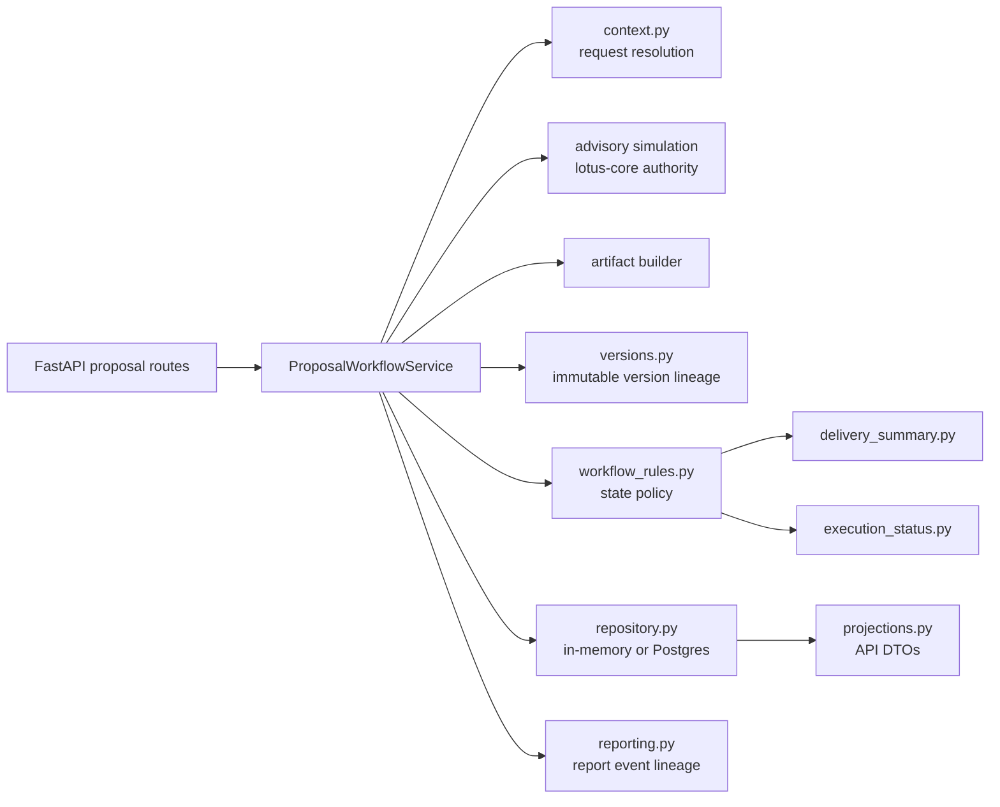
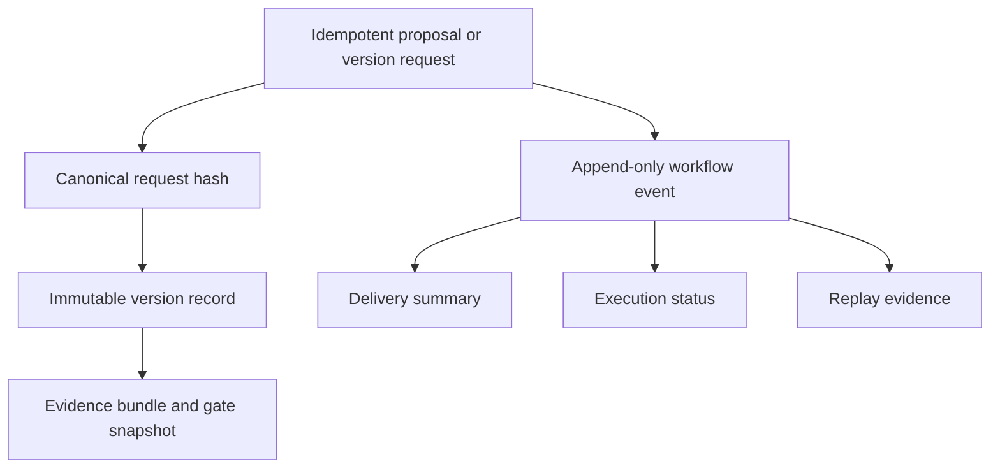

# Architecture

## Service Role

`lotus-advise` sits between authoritative upstream portfolio/risk data and advisory workflow consumers. Its job is to convert canonical portfolio context into governed advisory decisions, proposal versions, and workflow evidence.

## Main Runtime Areas

### API Layer

FastAPI route families are organized into:

- advisory simulation
- advisory proposal lifecycle
- advisory operations and support
- advisory workspace
- tactical house view
- integration
- health and monitoring

### Advisory Domain

The core advisory domain includes:

- proposal orchestration
- funding logic
- suitability and gate evaluation
- decision summary generation
- artifact generation
- proposal alternatives normalization, enrichment, projection, and ranking
- tactical house-view affected-cohort evaluation for supplied source-backed candidates

### Lifecycle Domain

The persisted lifecycle model includes:

- proposal records
- immutable proposal versions
- workflow events
- approval records
- async operation tracking
- idempotency tracking

The repository supports both in-memory and PostgreSQL-backed proposal persistence, but the active runtime direction is PostgreSQL-backed persistence with migration support.

### Proposal Module Boundaries

The proposal lifecycle backend is intentionally split into small domain modules. The service layer
coordinates repository access and use-case orchestration; deterministic rules, projections, and
lineage helpers live outside the orchestration class.

| Module | Primary responsibility | Why it matters |
| --- | --- | --- |
| `src/core/proposals/service.py` | Proposal lifecycle use-case orchestration, repository mutation, and service-boundary errors. | Keeps the use-case flow readable without hiding domain rules in controllers or infrastructure. |
| `src/core/proposals/models.py` | Public and internal proposal contracts. | Keeps OpenAPI, persistence records, and DTOs governed by one typed vocabulary. |
| `src/core/proposals/context.py` | Stateful/stateless request resolution and canonical request payload shaping. | Preserves upstream source authority while allowing advisory workflows to accept multiple input modes. |
| `src/core/proposals/workflow_rules.py` | Lifecycle transition, approval, execution-update, and execution-status vocabulary. | Keeps proposal state policy explicit and directly testable. |
| `src/core/proposals/projections.py` | Record-to-DTO projection for proposal, version, workflow, approval, create, and async operation responses. | Prevents presentation contract shaping from leaking into orchestration code. |
| `src/core/proposals/versions.py` | Immutable version record construction, simulation hashing, artifact hashing, gate snapshotting, and evidence retention policy. | Makes version lineage deterministic and auditable. |
| `src/core/proposals/async_payloads.py` | Async submission hashing and restart-safe payload recovery. | Protects idempotency and recovery behavior from drift. |
| `src/core/proposals/async_operations.py` | Async attempt, success, failure, retry, and replay-lineage state helpers. | Keeps retry and terminal-state behavior explicit for operations. |
| `src/core/proposals/execution_status.py` | Execution status projection from workflow events. | Separates downstream execution posture from execution ownership. |
| `src/core/proposals/delivery_summary.py` | Delivery and reporting summary projection from workflow events. | Keeps operator-facing delivery posture derived from audit history. |
| `src/core/proposals/reporting.py` | Report-request workflow event construction. | Captures report lineage while preserving `lotus-report` ownership. |
| `src/core/proposals/lifecycle.py` | Lifecycle entry-point validation. | Makes direct create versus workspace handoff policy explicit. |

### Proposal Lifecycle Flow

### Operational Lineage Flow

For demos and client-facing explanations, the important message is that proposal history is not a
mutable screen state. Advisory decisions are reconstructed from immutable versions, append-only
workflow events, explicit approval records, and bounded downstream posture events.

### Workspace Domain

The workspace surface exists for iterative drafting before formal proposal lifecycle ownership begins. It supports:

- session creation
- draft actions
- deterministic re-evaluation
- save and resume
- compare to saved version
- replay evidence lookup
- lifecycle handoff into persisted proposal ownership

## Boundary Rules

### `lotus-core`

`lotus-core` remains the authority for:

- portfolio source data
- holdings and cash reads
- instrument, price, and FX reads
- advisory simulation execution contract

`lotus-advise` must not duplicate `lotus-core` execution semantics or source-data authority locally.

### `lotus-manage`

`lotus-advise` can produce `TacticalHouseViewAffectedCohort:v1` as source-owned cohort evidence.
`lotus-manage` remains responsible for DPM campaign workflows, policy application, evidence
packaging, rebalance waves, and downstream execution posture.

### `lotus-risk`

`lotus-risk` remains the authority for risk-lens enrichment and concentration methodology.

### `lotus-performance`

`lotus-performance` is currently a readiness dependency, not a consumed analytics input contract for proposal behavior.

### `lotus-report`

Reporting can be requested through `lotus-advise`, but report generation ownership stays outside this service.

### `lotus-ai`

The current implemented AI seam is workspace rationale generation. Future proposal narrative capability is documented in RFC-0023 and is not yet the active implemented source of truth.
