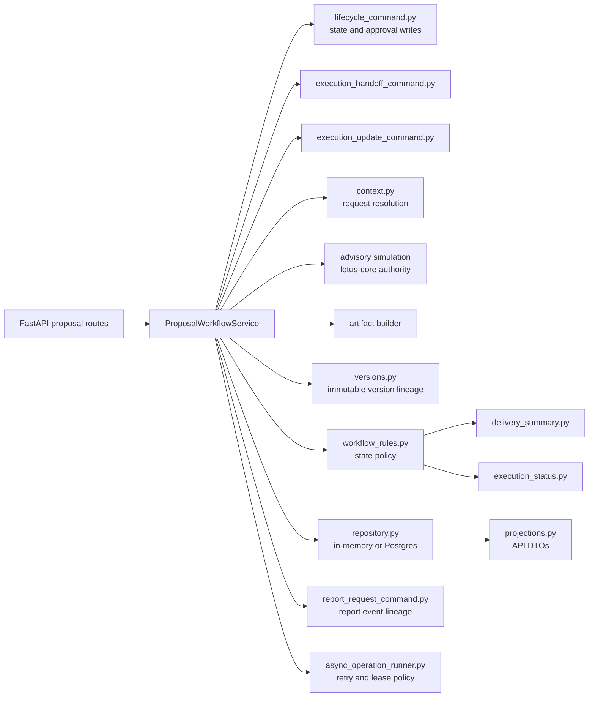
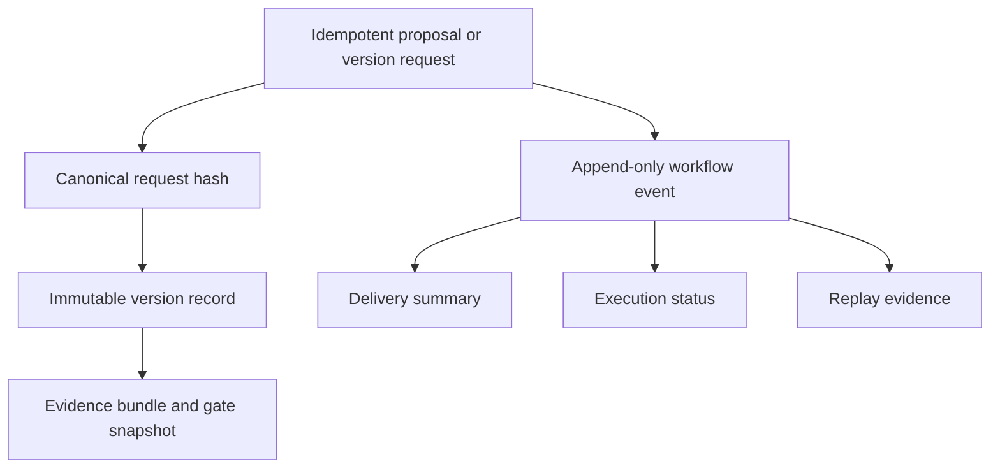
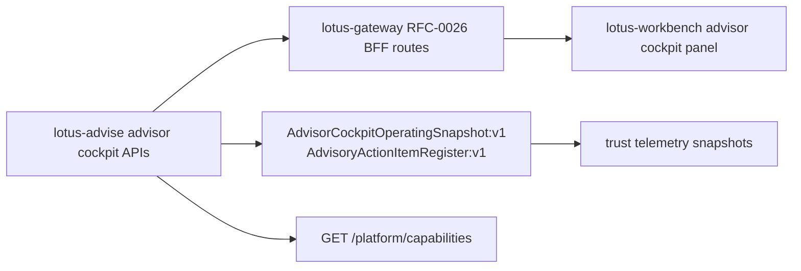

# Architecture

## Service Role

`lotus-advise` sits between authoritative upstream portfolio/risk data and advisory workflow consumers. Its job is to convert canonical portfolio context into governed advisory decisions, proposal versions, and workflow evidence.

## Main Runtime Areas

### API Layer

FastAPI route families are organized into:

- advisory simulation
- advisory proposal lifecycle
- advisory operations and support
- advisory workspace
- tactical house view
- advisor cockpit
- integration
- health and monitoring

### Advisory Domain

The core advisory domain includes:

- proposal orchestration
- funding logic
- suitability and gate evaluation
- decision summary generation
- artifact generation
- proposal alternatives normalization, enrichment, projection, and ranking
- tactical house-view affected-cohort evaluation for supplied source-backed candidates

### Advisor Cockpit Domain

RFC-0026 cockpit behavior lives in `src/core/advisor_cockpit/` rather than in controllers or
Workbench. The package owns private-banking action vocabulary, source-read-model aggregation,
priority and SLA policy, acknowledgement replay, supportability projection, and API DTO mapping for
`AdvisorCockpitOperatingSnapshot:v1` and `AdvisoryActionItemRegister:v1`.

The source boundary is deliberate: Gateway publishes the Advise contract and Workbench renders the
Gateway/BFF response. Neither layer reconstructs suitability, memo, narrative, policy, priority, or
acknowledgement semantics locally.

### Lifecycle Domain

The persisted lifecycle model includes:

- proposal records
- immutable proposal versions
- workflow events
- approval records
- async operation tracking
- idempotency tracking

The repository supports both in-memory and PostgreSQL-backed proposal persistence, but the active runtime direction is PostgreSQL-backed persistence with migration support.

### Proposal Module Boundaries

The proposal lifecycle backend is intentionally split into small domain modules. The service layer
coordinates repository access and use-case orchestration; deterministic rules, projections, and
lineage helpers live outside the orchestration class.

| Module | Primary responsibility | Why it matters |
| --- | --- | --- |
| `src/core/proposals/service.py` | Proposal lifecycle use-case coordination over named command, read-model, projection, simulation, and persistence boundaries. | Keeps the use-case flow readable without hiding domain rules in controllers or infrastructure. |
| `src/core/proposals/models.py` | Compatibility re-export module for public proposal contracts. | Preserves existing imports while smaller contract modules carry responsibility-specific DTOs and records. |
| `src/core/proposals/contract_types.py` | Proposal lifecycle, execution, async, reporting, approval, and input-mode literal vocabularies. | Keeps private-banking workflow vocabulary explicit and reusable. |
| `src/core/proposals/input_models.py` | Proposal create/version/simulation input envelopes and legacy/stateless/stateful validators. | Keeps API input compatibility and validation policy separate from response and persistence records. |
| `src/core/proposals/response_models.py` | Proposal API/read response DTOs for lifecycle, execution, delivery, lineage, idempotency, async, and approval surfaces. | Keeps OpenAPI response contracts governed without coupling them to persistence records. |
| `src/core/proposals/persistence_models.py` | Internal proposal aggregate, version, workflow event, approval, idempotency, transition, and async operation records. | Keeps storage-facing records distinct from API-facing response contracts. |
| `src/core/proposals/context.py` | Stateful/stateless request resolution and canonical request payload shaping. | Preserves upstream source authority while allowing advisory workflows to accept multiple input modes. |
| `src/core/proposals/workflow_rules.py` | Lifecycle transition, approval, execution-update, and execution-status vocabulary. | Keeps proposal state policy explicit and directly testable. |
| `src/core/proposals/execution_boundary.py` | Execution ownership-boundary vocabulary for handoff, status, and delivery posture. | Prevents advisory posture from being mistaken for downstream execution system-of-record truth. |
| `src/core/proposals/lifecycle_command.py` | State-transition and approval command loading, replay, validation, mutation, and persistence. | Keeps approval and lifecycle write behavior auditable outside the workflow facade. |
| `src/core/proposals/execution_handoff_command.py` | Execution handoff command loading, replay, readiness validation, mutation, and persistence. | Keeps execution-readiness handoff behavior explicit while preserving downstream ownership. |
| `src/core/proposals/execution_update_command.py` | Execution update command loading, handoff identity checks, replay, timestamp validation, mutation, and persistence. | Keeps downstream execution updates idempotent and ordered. |
| `src/core/proposals/projections.py` | Record-to-DTO projection for proposal, version, workflow, approval, create, and async operation responses. | Prevents presentation contract shaping from leaking into orchestration code. |
| `src/core/proposals/versions.py` | Immutable version record construction, simulation hashing, artifact hashing, gate snapshotting, and evidence retention policy. | Makes version lineage deterministic and auditable. |
| `src/core/proposals/async_payloads.py` | Async submission hashing and restart-safe payload recovery. | Protects idempotency and recovery behavior from drift. |
| `src/core/proposals/async_payload_resolution.py` | Async payload recovery failure mapping and persistence. | Keeps restart failure outcomes close to payload resolution instead of service orchestration. |
| `src/core/proposals/async_operation_runner.py` | Async lease acquisition, terminal-skip handling, retry/final-failure, lifecycle failure, and success persistence. | Keeps operational retry semantics reusable and testable. |
| `src/core/proposals/async_operations.py` | Async attempt, success, failure, retry, and replay-lineage state helpers. | Keeps retry and terminal-state behavior explicit for operations. |
| `src/core/proposals/execution_status.py` | Execution status projection from workflow events. | Separates downstream execution posture from execution ownership. |
| `src/core/proposals/delivery_summary.py` | Delivery and reporting summary projection from workflow events. | Keeps operator-facing delivery posture derived from audit history. |
| `src/core/proposals/reporting.py` | Report-request workflow event construction. | Captures report lineage while preserving `lotus-report` ownership. |
| `src/core/proposals/report_narrative_package.py` | Reviewed advisor-use narrative package construction and support-safe summary projection for report handoff. | Keeps review-state, hash-continuity, source-lineage, and report-package rules out of API services before RFC-0024 memo report packages are introduced. |
| `src/core/proposals/lifecycle.py` | Lifecycle entry-point validation. | Makes direct create versus workspace handoff policy explicit. |

### Proposal Lifecycle Flow

### Operational Lineage Flow

For demos and client-facing explanations, the important message is that proposal history is not a
mutable screen state. Advisory decisions are reconstructed from immutable versions, append-only
workflow events, explicit approval records, and bounded downstream posture events.

### Workspace Domain

The workspace surface exists for iterative drafting before formal proposal lifecycle ownership begins. It supports:

- session creation
- draft actions
- deterministic re-evaluation
- save and resume
- compare to saved version
- replay evidence lookup
- lifecycle handoff into persisted proposal ownership

### Advisor Cockpit Flow

The canonical `PB_SG_GLOBAL_BAL_001` validation proves this path through Advise, Gateway, and
Workbench. It remains bounded to advisor operating workflow evidence and does not assert
client-ready publication, external client communication, CRM system-of-record behavior, OMS order
lifecycle, completed policy approval authority, or full RFC-0028 demo/RFP readiness.

## Boundary Rules

### `lotus-core`

`lotus-core` remains the authority for:

- portfolio source data
- holdings and cash reads
- instrument, price, and FX reads
- advisory simulation execution contract

`lotus-advise` must not duplicate `lotus-core` execution semantics or source-data authority locally.

### `lotus-manage`

`lotus-advise` can produce `TacticalHouseViewAffectedCohort:v1` as source-owned cohort evidence.
`lotus-manage` remains responsible for discretionary portfolio-management campaign workflows,
policy application, evidence packaging, rebalance waves, and downstream execution posture.

Advisory execution handoff/status routes may reference `lotus-manage` or another downstream
provider as the execution venue. Those routes expose `execution_ownership` evidence and do not make
`lotus-advise` the execution system of record.

### `lotus-risk`

`lotus-risk` remains the authority for risk-lens enrichment and concentration methodology.

### `lotus-performance`

`lotus-performance` is currently a readiness dependency, not a consumed analytics input contract for proposal behavior.

### `lotus-report`

Reporting can be requested through `lotus-advise`, but report generation ownership stays outside this service.

### `lotus-ai`

The implemented AI integration boundaries are workspace rationale generation and RFC-0023 advisor-review proposal
narrative drafting. Proposal narrative is the active source of truth only for advisor-use artifact,
review/replay, reviewed report-request package, report/render/archive, Gateway posture, and
Workbench posture; client-ready narrative and capability promotion remain gated.
