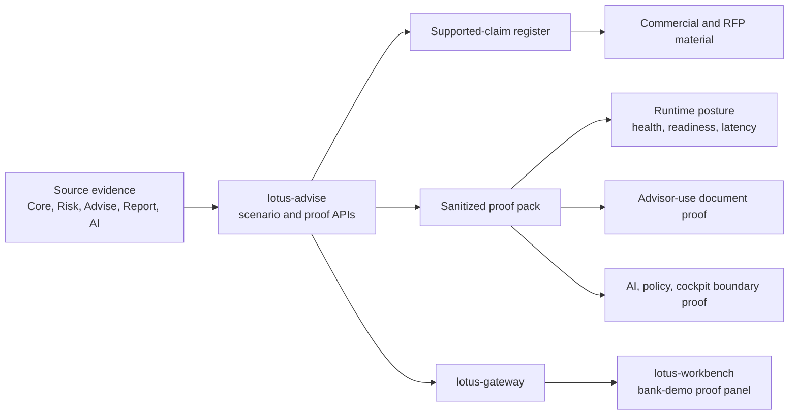

# Demo And Commercial Proof

This page is the wiki entry point for implementation-backed `lotus-advise` demo, RFP, security,
architecture, and commercial proof material. It is written for business users, operations, sales,
pre-sales, demo leads, and engineers who need a shared source of truth without reading every RFC.

The source of truth remains the implemented service, tests, supported-claim register, and proof
pack. This page explains how to navigate that evidence and where the claim boundaries are.

## Current Supported Posture

| Area | Current posture | Evidence to check | Boundary |
| --- | --- | --- | --- |
| Canonical private-banking advisory proof | Supported | Scenario `RFC28_BANK_DEMO_CLIENT_READY_PROOF_CANONICAL`, portfolio `PB_SG_GLOBAL_BAL_001`, proof marker `BANK_DEMO_PROOF_PACK_CREATED` | Proves advisor-review and internal proof posture, not client-ready publication. |
| Supported-claim register | Supported | `GET /advisory/bank-demo-proof/supported-claim-register`, `supported-claim-register.json` | Demo, RFP, security, ROI, and proof-guide wording must map to supported claims. |
| Sanitized proof-pack capture | Supported | `POST /advisory/bank-demo-proof/proof-packs`, `scripts/capture_rfc0028_backend_proof.py`, `proof-pack.json` | Material drift blocks promotion; raw payloads and local-only runtime material are not shared. |
| Gateway and Workbench proof | Supported | Gateway publication and Workbench `advisory.bank_demo_proof` canonical validation | Workbench renders source-owned proof; it does not calculate advisory, policy, memo, narrative, or AI semantics. |
| Advisor-use document proof | Supported with boundaries | `document-proof-summary.json`, memo and policy report/render/archive lineage | Advisor-use evidence only; client-ready document publication remains blocked. |
| AI/model-risk proof | Supported with boundaries | `journey-integration-proof-summary.json`, bounded AI lineage | AI is review-assistive and non-authoritative. It cannot approve recommendations, policy, sign-off, or client communication. |
| Commercial proof material | Supported with boundaries | `docs/commercial/RFC-0028-bank-demo-client-proof-materials.md`, `commercial-material-pack.json` | Sales/RFP material must preserve blocked-claim wording and cannot imply legal, regulatory, bank-certification, or execution authority. |

## Proof Flow

The important operating rule is simple: demo and commercial material follows the supported-claim
register and sanitized proof pack. It does not follow free-form slide language, screenshots taken
before validation, or raw runtime logs.

## Business Flow For Demo Leads

1. Confirm the scenario identity is `RFC28_BANK_DEMO_CLIENT_READY_PROOF_CANONICAL`.
2. Confirm the canonical portfolio is `PB_SG_GLOBAL_BAL_001`.
3. Validate the Gateway/Workbench proof surface before taking demo screenshots.
4. Review `supported-claim-register.json` before writing or reusing sales and RFP language.
5. Review `material-field-review.json`; treat any blocked material field as a stop condition.
6. Use `docs/commercial/RFC-0028-bank-demo-client-proof-materials.md` for talk track and RFP-safe wording.
7. Keep blocked claims visible: client-ready publication, external communication, bank-specific attestation, legal/regulatory advice, completed approval/sign-off, and OMS order/fill/settlement are not supported by this proof.

## Operator Checklist

Before a client playback, operations or the demo lead should confirm:

1. the branch is merged to `main` and required PR checks are green,
2. `GET /health/ready` is healthy for the service under test,
3. `GET /platform/capabilities` exposes the expected advisory supportability posture,
4. the canonical front-office validation has passed for `PB_SG_GLOBAL_BAL_001`,
5. `proof-pack.json`, `scenario-contract.json`, `supported-claim-register.json`, `runtime-posture.json`, `material-field-review.json`, `document-proof-summary.json`, `journey-integration-proof-summary.json`, and `commercial-material-pack.json` have been reviewed,
6. no shared material contains secrets, tokens, credentials, raw prompts, raw source payloads, local runtime bundles, trace IDs, or correlation IDs,
7. any degraded state is explained through bounded proof posture rather than hidden or overwritten.

## Audience Guide

| Audience | Use this page to | Then read |
| --- | --- | --- |
| Business users | Understand what the advisory proof demonstrates and what remains blocked | [Supported Features](Supported-Features) |
| Sales and pre-sales | Build a claim-controlled demo or RFP response | `docs/commercial/RFC-0028-bank-demo-client-proof-materials.md` |
| Operations | Validate readiness, proof artifacts, and stop conditions before playback | [Operations Runbook](Operations-Runbook) |
| Engineers | Trace the proof APIs, source-owned contracts, and validation tests | [API Surface](API-Surface), [RFC Index](RFC-Index) |

## Claim Boundaries

Safe implementation-backed language:

1. Lotus Advise provides a repeatable private-banking advisory proof pack for the canonical
   `PB_SG_GLOBAL_BAL_001` journey.
2. Demo and commercial claims are governed by a supported-claim register and sanitized proof pack.
3. Advisor-use memo, policy, narrative, AI/model-risk, and cockpit evidence is shown with source
   lineage and review boundaries.
4. Gateway and Workbench consume source-owned Advise contracts.

Blocked language:

1. client-ready publication or send-to-client approval,
2. external client communication,
3. legal or regulatory advice,
4. completed policy approval, waiver, or sign-off authority,
5. AI approval or autonomous recommendation authority,
6. OMS order, fill, settlement, or execution system-of-record behavior,
7. bank-specific security, compliance, regulatory, or production certification.

## Implementation References

- `GET /advisory/bank-demo-proof/scenario-contract`
- `GET /advisory/bank-demo-proof/supported-claim-register`
- `POST /advisory/bank-demo-proof/proof-packs`
- `scripts/capture_rfc0028_backend_proof.py`
- `src/core/bank_demo_proof/`
- `docs/commercial/RFC-0028-bank-demo-client-proof-materials.md`
- `docs/rfcs/RFC-0028-bank-demo-journey-and-client-ready-proof.md`
- [API Surface](API-Surface)
- [Supported Features](Supported-Features)
- [Operations Runbook](Operations-Runbook)
