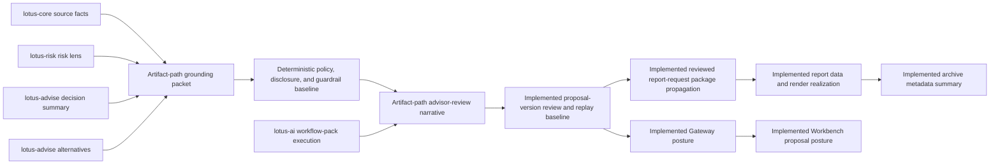
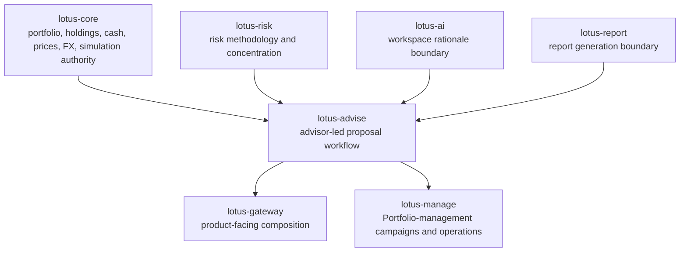

# Supported Features

This page separates implementation-backed `lotus-advise` capability from roadmap intent. It is
written for business, engineering, operations, sales, pre-sales, and demo preparation.

For demo preparation, start with [Demo Readiness Guide](Demo-Readiness-Guide), then use this page
to confirm which capability claims are supported, bounded, or blocked.

## Current Functional Capability Matrix

| Capability | Current support | Primary API or source | Boundary |
| --- | --- | --- | --- |
| Advisory proposal simulation | Supported | `POST /advisory/proposals/simulate` | Simulation execution stays anchored to `lotus-core` authority. |
| Proposal artifact generation | Supported | `POST /advisory/proposals/artifact` | Artifact generation is deterministic advisory evidence, not report rendering ownership. |
| Persisted proposal lifecycle | Supported | `/advisory/proposals/*` | Versions are immutable and workflow history is append-only. |
| Approval and consent workflow | Supported | `/advisory/proposals/{proposal_id}/approvals` and transitions | Approval posture is advisory workflow evidence, not downstream trade approval. |
| `lotus-idea` proposal-intake route foundation | Route foundation only; not a supported product feature | `POST /advisory/proposals/idea-intake`; `contracts/idea-proposal-intake/lotus-advise-idea-proposal-intake.v1.json` | Proves a source-safe handoff route for future opportunity-to-advisory realization. It does not create proposal records, run suitability, grant approval, create orders, authorize client publication, certify a data product, or promote a supported feature. |
| Delivery, report-request, and execution-handoff posture | Supported | delivery, report-request, execution-handoff, and execution-status routes | Execution handoff/status payloads carry ownership-boundary evidence; execution truth remains outside `lotus-advise`. |
| Advisory workspace drafting | Supported | `/advisory/workspaces/*` | Workspace state is pre-lifecycle advisory drafting, backed by the workspace Postgres repository in production runtime, with explicit handoff into proposal ownership. |
| Workspace AI rationale | Supported through governed integration boundary | `/advisory/workspaces/{workspace_id}/assistant/rationale` | Uses the bounded `lotus-ai` workspace-rationale integration boundary; proposal narrative uses its own RFC-0023 artifact-path boundary. |
| Advisor-review proposal narrative | Supported in proposal artifact, stateful and stateless lifecycle create/version requests, standalone proposal-version read, non-persistent regeneration, proposal-version review/replay, reviewed report-request package propagation, downstream report/render paths, archive metadata summaries, Gateway posture, Workbench proposal posture, data-product/trust posture, capability discovery, live validation, and governed canonical Workbench proof | `POST /advisory/proposals/artifact` with `narrative_request`; lifecycle create/version with `narrative_request`; stateful `stateful_input.narrative_request`; `GET /advisory/proposals/{proposal_id}/versions/{version_no}/narrative`; `POST /advisory/proposals/{proposal_id}/versions/{version_no}/narrative/regenerate`; `POST /advisory/proposals/{proposal_id}/versions/{version_no}/narrative/review`; `POST /advisory/proposals/{proposal_id}/report-requests` with `include_reviewed_narrative`; proposal lineage, delivery summary, replay evidence endpoints; `contracts/domain-data-products/`; `contracts/trust-telemetry/`; `GET /platform/capabilities`; `scripts/validate_live_runtime_suite.py`; Workbench `proposal.narrative_posture` canonical panel proof | Generates opt-in `ADVISOR_REVIEW` narrative from proposal artifact grounding evidence with deterministic template mode, deterministic policy, disclosure, and guardrail metadata, optional `AI_ASSISTED_DRAFT` through a bounded `lotus-ai` workflow-pack adapter, version-scoped review events, idempotent review replay, source narrative hashes, exact persisted replay evidence, decision-summary/alternatives-aware section rendering for blockers, insufficient evidence, approvals, material changes, selected-alternative tradeoffs, and limitations. Standalone read returns exact persisted narrative and latest review posture from an immutable proposal version; standalone regeneration returns a non-persisted review-required advisor-use candidate from immutable version evidence. Report requests can include a compact reviewed narrative package only when the selected immutable version has an approved narrative review and matching source hash; the package carries sections, disclosures, guardrails, limitations, AI lineage, source hashes, and advisory execution-boundary evidence where present. `lotus-report` consumes and snapshots the reviewed package, `lotus-render` renders an optional advisor-use portfolio-review advisory narrative page from the package, and `lotus-archive` stores a support-safe archive metadata summary when the rendered portfolio-review artifact includes that page. `lotus-gateway` exposes reviewed-narrative posture through canonical Advise APIs, `lotus-workbench` renders Gateway-backed advisor-use proposal narrative posture and now canonically proves that advisor-review panel through the governed `proposal.narrative_posture` evidence path, `ProposalNarrativeEvidence:v1` is declared and certified as advisor-review evidence, trust telemetry validates against that product, and `/platform/capabilities` advertises `advisory.proposals.reviewed_narrative_evidence` plus `advisory_proposal_reviewed_narrative_evidence`. Gated items still include compliance-review, client-draft, client-ready commentary, and external client communication. |
| AdvisoryProposalMemoEvidencePack:v1 | Supported for advisor-use memo evidence | `/advisory/proposals/{proposal_id}/versions/{version_no}/memos*`; `GET /platform/capabilities`; `contracts/domain-data-products/`; `contracts/trust-telemetry/`; platform mesh SLO/access/evidence policy | `AdvisoryProposalMemoEvidencePack:v1` is active as source-owned advisor-use memo evidence. It covers persisted memo evidence, advisor projection, advisor-use review, report-package handoff, archive refs, review-gated AI commentary lineage, replay hashes, Gateway/Workbench consumption, freshness-gated trust telemetry, and platform catalog/certification posture. Client-ready memo publication and external client communication remain gated; RFC-0028 governs bank-demo/RFP proof through supported claims. |
| AdvisoryPolicyEvaluationRecord:v1 | Supported for advisor/compliance policy evidence | `/advisory/policy-packs*`; `/advisory/proposals/{proposal_id}/versions/{proposal_version_id}/policy-evaluations`; `/advisory/policy-evaluations/*`; `GET /platform/capabilities`; `contracts/domain-data-products/`; `contracts/trust-telemetry/`; platform mesh SLO/access/evidence policy | `AdvisoryPolicyEvaluationRecord:v1` is active as source-owned policy evaluation evidence. It covers policy-pack catalog/activation, source-readiness evidence, finalized evaluation records, replay, review queues, sign-off source packages, workflow/sign-off posture, signed-off report-package lineage, bounded AI evidence lineage, Gateway/Workbench consumption, live-suite proof, and freshness-gated trust telemetry. Runtime policy catalog, audit, idempotency, and evaluation state are backed by repository ports and the `policy_packs` Postgres migration namespace. Completed approval/waiver authority, completed sign-off authority, client-ready policy publication, and external client communication remain gated; RFC-0028 governs bank-demo/RFP proof through supported claims. |
| Proposal decision summary | Supported | simulation, artifact, workspace, replay, and lifecycle surfaces | Backend-owned decision summary; UI and support layers must not infer it independently. |
| Proposal alternatives | Supported | simulation, artifact, workspace, replay, and lifecycle surfaces | Alternatives remain anchored to canonical simulation and risk enrichment. |
| Tactical house-view affected cohorts | Supported | `POST /advisory/tactical-house-view/cohorts/evaluate` | Evaluates supplied source-backed candidate portfolios only; no global portfolio discovery or discretionary portfolio-management campaign ownership. |
| Integration capability discovery | Supported | `GET /platform/capabilities` | Publishes feature, workflow, dependency-readiness evidence, and supportability posture for Gateway and platform consumers. |

## Current Non-Functional Capability Matrix

| Capability | Current support | Evidence |
| --- | --- | --- |
| OpenAPI and Swagger quality | Supported | `make openapi-gate` plus contract documentation tests. |
| API vocabulary and no-alias governance | Supported | `make api-vocabulary-gate` and `make no-alias-gate`. |
| Domain-product declarations | Supported | `contracts/domain-data-products/` and `make domain-data-products-gate`. |
| Trust telemetry freshness validation | Supported | `contracts/trust-telemetry/`, `tests/unit/test_trust_telemetry.py`, and `make trust-telemetry-freshness-gate`. |
| Runtime smoke and production guardrails | Supported | `make ci` includes Postgres runtime smoke and production-profile guardrail negatives. |
| Dependency health and security audit | Supported | `make verify-dependencies` and `make security-audit`. |
| Dependency-lock evidence | Supported | `make dependency-lock-gate` and `uv.lock`. |
| License/IP release evidence | Supported | `make license-ip-gate`, `docs/standards/license-ip-policy.v1.json`, `docs/standards/license-ip-inventory.v1.json`, and `NOTICE.md`. |
| Supportability metrics and readiness evidence | Supported | `GET /platform/capabilities` documents bounded labels for `lotus_advise_advisory_supportability_total` and bounded dependency readiness basis fields. |
| Live cross-service evidence | Supported when the local stack is configured | Live validation scripts prove canonical and degraded proposal behavior. |

## RFC Delivery Status And Guarded Boundaries

This table records current RFC delivery truth. Rows marked implemented may be presented only within
the support boundaries, evidence links, and gated exclusions stated in the row. Rows or row details
that remain planned, unsupported, backend-only, or degraded must not be presented as supported
product capability until implementation, tests, live proof, README/wiki updates, and
`/platform/capabilities` posture are complete.

| RFC | Feature | Product value | Current support |
| --- | --- | --- | --- |
| `RFC-0023` | Grounded advisory AI narrative and client-ready proposal commentary | Implements governed advisor-review proposal narrative evidence from deterministic proposal facts, with downstream advisor-use proof; compliance-review, client-draft, client-ready publication, and external client communication remain separately gated scope. | Slices 0-10 complete: source authority, platform-scaffolding review, cleanup/structure, contract baseline, data-product/supportability non-promotion baseline, deterministic advisor-review artifact-path narrative, policy/disclosure/guardrail baseline, AI-assisted draft adapter baseline, proposal-version narrative review/replay baseline, decision-summary/alternatives/approval/limitation narrative integration, and certified canonical API/OpenAPI route inventory. Slice 10B is complete for standalone proposal-version narrative read and non-persistent regeneration APIs. Slice 11A is complete for reviewed narrative report-request package propagation; Slices 11B/11C are complete for `lotus-report` package consumption and `lotus-render` portfolio-review advisory narrative rendering; Slice 11D is complete for `lotus-archive` support-safe reviewed narrative archive metadata summaries; Slice 11E is complete for `lotus-gateway` product-facing reviewed-narrative posture and `lotus-workbench` Gateway-backed advisor-use proposal posture. Slice 11F is complete for `ProposalNarrativeEvidence:v1`, trust telemetry, platform catalog/certification, and `/platform/capabilities` reviewed narrative evidence posture. Slice 12 is complete for stateful live validation, deterministic guardrail-failure reproduction, optional AI-assisted validation where enabled, and governed Workbench `proposal.narrative_posture` canonical screenshot proof. Slice 13/14 hardens the closure boundary so even a clean advisor-review narrative release request cannot return `APPROVED_FOR_CLIENT_READY`. Compliance-review, client-draft, client-ready narrative, and external client communication remain gated |
| `RFC-0024` | Advisor proposal memo and evidence pack | Turns proposal evidence into an advisor, compliance, operations, audit, and sales-ready memo package. | Slices 0-4 are complete as non-claiming source-map, product-gap allocation, platform-scaffolding, cleanup/structure, proposed/blocked data-product posture, proposed/blocked governance posture, and persisted source-readiness evidence. Proposal evidence bundles now carry `rfc0024.memo-source-readiness.v1`. Existing platform/repo-native controls are sufficient before memo domain work, and reviewed narrative report-package business rules now live in the core proposal report-handoff boundary. Slices 0-5 are complete when the Slice 5 deterministic pure memo-builder foundation is included. Slices 0-6 are complete when the Slice 6 durable memo persistence, idempotency, replay metadata, and audit-event foundation is included. Slice 7 is complete for canonical `lotus-advise` memo create/read/projection/review/report-package-event/lineage/replay APIs and certified OpenAPI. Slice 8 is complete for memo-critical suitability and product eligibility evidence, cost/fee/tax/friction limitation evidence, risk disclosure and product-document evidence, and conflict blocker enrichment without positive client-ready wording. Gateway, Workbench, report/render/archive realization is no longer a single planned bundle: Slice 9 is complete for advisor-use report/render/archive realization, and Slice 11 is complete for Gateway and Workbench product realization. Slice 9 requires exact memo hash continuity and `APPROVE_FOR_ADVISOR_USE` review before requesting a typed memo package from `lotus-report`; Report preserves the package in the immutable snapshot and deterministic render package; Archive stores support-safe memo archive metadata; and Advise memo lineage records report/render/archive refs. Slice 10 is complete for review-gated advisor-use AI commentary through `proposal_memo_commentary.pack@v1`: Advise sends bounded memo evidence only, records append-only AI lineage, returns deterministic unavailable posture when AI is not configured, and prevents AI from changing memo evidence, suitability, approval, or client-ready posture. Slice 11 routes canonical Advise memo endpoints through Gateway and preserves source-owned memo truth, while Workbench consumes Gateway/BFF-only memo posture, projection, report-package, archive-ref, AI-commentary, lineage, replay, degraded, and blocked states with browser proof and no client-ready controls. Slice 12 is complete for memo-specific commercial support material in `docs/commercial/RFC-0024-advisor-proposal-memo-commercial-support.md`, including claim-controlled one-pager language, demo notes, API examples, architecture flow, operator guidance, and RFP-safe wording. Slice 13 is complete for memo implementation proof in the live runtime evidence bundle: Advise memo APIs, stateful source dependency path, advisor projection, advisor-use report/render/archive request posture, review-gated AI commentary, lineage, replay hashes, degraded report posture, and stale-hash/client-ready blocked paths. Slice 14 is complete for active advisor-use memo data-product support: `AdvisoryProposalMemoEvidencePack:v1` is active with freshness-gated trust telemetry, `/platform/capabilities`, and platform SLO/access/evidence-policy posture. Slice 15 is complete for final hardening and canonical Workbench proof: `PB_SG_GLOBAL_BAL_001` validation proves the advisor journey and `proposal.memo_evidence_pack` panel are ready and Gateway-backed. Slice 16 is complete: RFC-0024 is implemented for advisor-use proposal memo evidence, durable closure truth is updated, and no Lotus context or skill guidance change was required. client-ready memo publication remains gated; external client communication remains gated; RFC-0028 now governs bank-demo/RFP proof through supported claims without promoting client-ready memo publication. |
| `RFC-0025` | Enterprise suitability and best-interest policy packs | Adds versioned policy packs for suitability, best-interest, product eligibility, disclosures, approvals, sign-off evidence, review queues, and source-readiness gaps. | RFC-0025 is implemented for advisor/compliance policy evidence through Slice 17. Slices 0-15 implemented policy-pack decisions, source readiness, catalog/activation, evaluation, persistence, certified APIs, workflow/sign-off, report-package handoff, bounded AI evidence, Gateway/Workbench product realization, commercial support material, live-suite `proposal_policy` proof, and centralized supportability hardening. Slice 16 promotes `AdvisoryPolicyEvaluationRecord:v1` as an active governed policy evidence data product with freshness-gated trust telemetry, `/platform/capabilities`, and platform SLO/access/evidence-policy posture. Slice 17 completes post-completion communication with an employer-safe `lotus-platform` LinkedIn draft and content-ledger entry. Completed approval/waiver authority, completed sign-off authority, client-ready publication, and external client communication remain gated; RFC-0028 governs bank-demo/RFP proof through supported claims. |
| `RFC-0026` | Advisor cockpit operating workflow | Creates backend-owned advisor worklists, action items, meeting-preparation packets, and workflow readiness summaries. | Implemented for the source-owned advisor cockpit. Slices 1-7 add platform-scaffolding review, the dedicated `src/core/advisor_cockpit/` package, data-product promotion gates, source-backed action construction, source-read-model aggregation, deterministic SLA/acknowledgement rules, and certified Advise action/snapshot/supportability/acknowledgement APIs with durable acknowledgement persistence. Slice 8 adds paginated preparation packets and client follow-up actions with CRM/calendar/external-communication boundaries. Slice 9 adds source-backed risk, compliance, and consent queue projection with batched approval reads, deterministic owner roles, and blocked completed-approval/client-ready authority. Slice 10 adds report/archive readiness, execution handoff/status attention, and explicit source-batched tactical house-view impact actions while preserving report/archive, OMS, and discretionary portfolio-management source-of-record boundaries. Gateway and Workbench now consume the Advise contract through canonical RFC-0026 routes and `PB_SG_GLOBAL_BAL_001` live validation. Slice 13 promotes `AdvisorCockpitOperatingSnapshot:v1`, `AdvisoryActionItemRegister:v1`, trust telemetry, `/platform/capabilities` feature `advisory.advisor_cockpit`, and `advisor_cockpit_operating_workflow` with canonical `PB_SG_GLOBAL_BAL_001` proof. Client-ready publication, external client communication, CRM system-of-record behavior, OMS order lifecycle, and completed policy approval authority remain gated. RFC-0028 governs bank-demo/RFP proof through supported claims. |
| `RFC-0027` | Governed advisory AI copilot | Adds bounded AI workflow-pack actions for proposal explanation, evidence Q&A, meeting preparation, compliance summary, operations/report handoff summary, and advisor-reviewed client follow-up drafts. | Implemented for governed internal advisor/reviewer copilot interactions. Slices 1-9 build the platform-scaffolding review, Advise copilot domain foundation, non-promoting pre-proof data-product gate, evidence-packet vocabulary and projection, guardrail evaluation, governed `lotus-ai` workflow-pack execution, durable run/review persistence, and certified Advise APIs/OpenAPI. Slices 10-14 close Gateway publication, Workbench Gateway-first product surface, canonical `PB_SG_GLOBAL_BAL_001` proof, repeatability hardening, active `AdvisoryCopilotInteractionRecord:v1` data-product posture, trust telemetry, and supported-feature truth. Advise now enforces the approved provider/model inventory in `contracts/advisory-copilot/approved-model-inventory.v1.json`; unknown, retired, mismatched, or environment-incompatible `lotus-ai` model identity fails closed to unavailable before completed output becomes review-ready, and persisted lineage carries provider/model approval, release, change, and rollback references. Advise also enforces the executable evaluation corpus in `contracts/advisory-copilot/evaluation-corpus.v1.json`; failed groundedness, review posture, or guardrail evidence quarantines output and records evaluator metrics, thresholds, failure reasons, and evaluation hash in lineage. Advise enforces the executable safety-abuse corpus in `contracts/advisory-copilot/safety-abuse-corpus.v1.json`; indirect prompt injection in source evidence, obfuscated forbidden actions, sensitive output, and client-ready publication claims return stable guardrail-rejected posture before output can remain review-ready. Advise enforces the AI data-boundary contract in `contracts/advisory-copilot/ai-data-boundary.v1.json`; outbound workflow-pack payloads use tokenized portfolio/proposal/source identifiers and carry provider no-training, retention, residency, and deletion controls while source refs remain available for claim grounding. Canonical validation records `ADVISORY_COPILOT_CANONICAL_PROOF_CREATED`, proves all six action families, internal review, guardrail rejection for client-ready publication, proposal-version run lineage, and the `advisory.advisory_copilot` panel. Review actions require trusted reviewer principal headers, role/capability authorization, proposal/portfolio/tenant scope, maker-checker enforcement, and replay-safe actor identity; body `actor_id` is only a compatibility echo. Evidence packets and review events remain audit records inside the interaction product boundary rather than standalone promoted data products. Client-ready publication, external client communication, policy approval/sign-off authority, OMS order lifecycle, fills, and settlement remain gated. RFC-0028 governs bank-demo/RFP proof through supported claims rather than RFC-0027 runtime authority. |
| `RFC-0028` | Bank demo journey and client-ready proof | Creates repeatable, implementation-backed advisory demo proof with supported-claim governance. | Implemented for source scenario contracts, supported-claim register, sanitized proof-pack capture, Gateway publication, Platform canonical contract registration, Workbench proof, source-owned AI/model-risk, policy, advisor-cockpit integration proof, claim-controlled commercial proof material, runtime security/latency evidence hardening, final artifact-reference/request-validation hardening, durable docs/wiki/context closure, and post-completion communication evidence. Slice 0 locks hybrid Advise proof APIs plus platform/front-office automation for `RFC28_BANK_DEMO_CLIENT_READY_PROOF_CANONICAL`, portfolio `PB_SG_GLOBAL_BAL_001`, and proof marker `BANK_DEMO_PROOF_PACK_CREATED`. Slice 1 adds the reusable `lotus-platform` supported-claim register schema and validator through PR #366, with main releasability run `26554797152` green. Slices 2-5 add durable index cleanup, no-premature data-product promotion guards, core proof/claim/scenario models, and repeatable backend proof capture through `scripts/capture_rfc0028_backend_proof.py` with sanitized `output/rfc0028/backend-proof` artifacts and material-field review. Slice 6 adds `AdvisoryDocumentProofSummary:v1`, live-suite document proof fields, and `document-proof-summary.json` for advisor-use memo/policy report-render-archive posture while client-ready document publication remains blocked. Slice 7A exposes source-owned Advise proof APIs for the scenario contract, supported-claim register, and sanitized proof-pack capture with HTTP 409 material-drift rejection. Slice 7B closes Gateway publication through `lotus-gateway` PR #252 at `f99ca1dfe074b57c99793ab1ca86542869d579a4`, with Gateway Main Releasability Gate run `26559811341` green and wiki publish commit `a73cd24`. Slice 8 closes Workbench proof through `lotus-workbench` PR #384 and `lotus-platform` PR #367: canonical live validation for `PB_SG_GLOBAL_BAL_001` proves `advisory.bank_demo_proof`, screenshot `advisory-bank-demo-proof-live.png`, and blocked client-ready publication posture through Gateway/BFF. Slice 9 adds `AdvisoryJourneyIntegrationProofSummary:v1`, `journey-integration-proof-summary.json`, governed panel ids, proof marker `RFC0028_JOURNEY_INTEGRATION_PROOF_CREATED`, and supported claim `ai_policy_cockpit_proof_integrated` without promoting AI authority, legal advice, policy approval, or client-ready publication. Slice 10 adds `AdvisoryCommercialMaterialPack:v1`, `commercial-material-pack.json`, proof marker `RFC0028_COMMERCIAL_MATERIAL_PACK_CREATED`, and supported claim `commercial_rfp_security_material_available` for the claim-controlled product one-pager, RFP response, security posture, architecture, ROI, demo, feature-matrix, proof-guide, boundary, and operator material in `docs/commercial/RFC-0028-bank-demo-client-proof-materials.md`. Slice 11 adds `src/core/bank_demo_proof/runtime_posture.py`, bounded `latency_ms`, query/fragment/credential URL rejection, sensitive summary redaction, and proof marker `RFC0028_RUNTIME_SECURITY_POSTURE_HARDENED` for runtime proof artifacts. Slice 12 updates README and wiki product truth for proof APIs, runtime posture artifacts, repeatable capture commands, commercial proof-guide navigation, HTTP 409 material-drift handling, and blocked client-ready publication plus OMS/order/fill/settlement boundaries. Slice 13/14 close implementation proof and final hardening through PR #213, `src/core/bank_demo_proof/artifact_refs.py`, local artifact-reference normalization, safe HTTP 422 validation error responses that do not echo rejected sensitive input, targeted proof tests, `make check`, PR Merge Gate, and Main Releasability Gate run `26573760885` on merge `a99474e5457dcdd4c87e79faf83bc8f64580544b`. Slice 15/16 close durable docs/context/wiki/supported-features truth and post-completion communication through `lotus-platform/thought-leadership/linkedin/drafts/LI-2026-05-28-043-demo-proof-should-show-the-boundary.md`. Slice 17 promotes `/platform/capabilities` feature `advisory.bank_demo_proof` and workflow `advisory_bank_demo_proof` with dependency-aware readiness after implementation-backed proof, and proof capture now blocks stale ready capability evidence that omits those keys. Client-ready publication, external client communication, bank-specific attestations, legal/regulatory advice, completed sign-off/approval, and OMS/order/fill/settlement remain unpromoted. |

Historical Slice 0-11 gate language remains intentionally preserved for auditability. Slice 12
closed only the advisor-review Workbench canonical proof path, and Slice 13/14 hardens the review
workflow so audited client-ready release requests remain blocked even when an advisor-review
narrative has no policy or guardrail blockers. Client-ready narrative,
client-ready publication, compliance-review narrative, client-draft narrative, and external client
communication remain gated after Slice 13/14 and must not be promoted as supported RFC-0023
product claims.

Historical RFC-0025 baseline wording included "Planned RFC only"; that phrase remains historical
audit context, not current support posture. Historical RFC-0025 Slice 1-14 gate language remains
intentionally preserved for auditability. Slice 1 is complete as platform-scaffolding review only,
and no `lotus-platform` code change is required yet; no policy-pack runtime capability is promoted
by that slice. Slice 2 is complete as current-boundary cleanup only. Earlier evidence intentionally
recorded that policy evaluation support is Planned, with proposed, blocked data-product posture
and `rfc0025.policy-source-readiness.v1`, until certified Advise evaluation APIs arrived. Those
APIs are now present without platform capability promotion. Slice 9 is complete for Advise source
workflow projection and sign-off decision recording. Slice 10 is complete for policy
report-package realization, report/render/archive refs are recorded in policy lineage, and
client-ready document requests fail closed. Slice 11 is complete for AI policy-evidence consumption
using redacted bounded evidence; forbidden actions are rejected, and AI output is non-authoritative
for policy status. Slice 12 is complete for Gateway and Workbench product realization. Slice 13 is
complete for policy-pack-specific commercial support material. After Slice 15, active data-product
promotion, final closure, post-completion communication, completed approval/waiver authority,
completed sign-off authority, client-ready publication and external communication remain gated.
Slice 16 supersedes that promotion gate for advisor/compliance policy evidence only:
`AdvisoryPolicyEvaluationRecord:v1` is active with freshness-gated trust telemetry and platform capability
posture, while completed approval/waiver authority, completed sign-off authority, client-ready
publication, and external communication remain gated. RFC-0028 governs bank-demo/RFP proof through
supported claims.
Slice 17 adds the post-completion communication evidence without changing the supported product
claim boundary.

## Advisory Flow

## RFC-0023 Narrative Implementation Boundary

The diagram separates implemented artifact-path narrative plus proposal-version review/replay
support from future promotion gates. Slices 5-10 now support advisor-review narrative inside the
proposal artifact path when explicitly requested, with grounding packet, policy version, disclosure
selection, guardrail results, client-ready blockers, deterministic template mode, optional
`AI_ASSISTED_DRAFT` through a bounded `lotus-ai` workflow-pack adapter with deterministic fallback,
append-only review events, idempotent review replay, source narrative hashes, and exact persisted
replay evidence. Slice 9 adds decision-summary, approval/remediation, material-change,
selected-alternative tradeoff, rejected-candidate, and risk/suitability limitation wording from
backend-owned evidence. Slice 10 certifies the canonical API/OpenAPI route inventory, error-response
documentation, idempotency header guidance, stale-route absence, and material returned-field
coverage. Slice 10B adds standalone exact narrative read and non-persistent regeneration candidate
APIs for immutable proposal versions. Slice 11A adds report-request package propagation for a compact reviewed narrative
package when the selected immutable version has an approved narrative review and matching source
hash. Slices 11B/11C add downstream report package consumption and optional portfolio-review
advisory narrative rendering. Slice 11D adds support-safe archive metadata summary preservation
for rendered advisor-use portfolio-review artifacts. Slice 11E adds Gateway product-facing
reviewed-narrative posture and Workbench Gateway-backed advisor-use proposal posture. Slice 11F
promotes advisor-review narrative evidence as `ProposalNarrativeEvidence:v1`, adds repo-native
trust telemetry, refreshes platform catalog/certification posture, and publishes the bounded
`advisory.proposals.reviewed_narrative_evidence` feature plus
`advisory_proposal_reviewed_narrative_evidence` workflow in `/platform/capabilities`. Proposal
narrative is still not compliance-review narrative, client-draft narrative, client-ready
commentary, or a client-ready artifact. Canonical demo screenshot proof is now supported only for
the advisor-review Workbench posture, not for client-ready publication.

## Integration Boundaries

## Demo And Pitch Boundaries

- Safe to claim: advisor-led proposal simulation, lifecycle evidence, approval and consent posture,
  workspace drafting, decision summaries, proposal alternatives, supportability metrics, and
  governed tactical house-view affected cohorts are implementation-backed.
- Do not claim: `lotus-advise` owns portfolio books, risk methodology, performance methodology,
  report rendering, OMS execution, discretionary campaign workflows, or global portfolio-universe
  discovery.
- For client demos, prepare with `GET /platform/capabilities`, `/health/ready`, and the relevant
  proposal or workspace routes so readiness claims match the current runtime posture.
- For the RFC-0028 bank-demo proof journey, use [Demo and Commercial Proof](Demo-and-Commercial-Proof)
  as the wiki navigation layer before using commercial, RFP, security, architecture, ROI, or
  screenshot material.
- For RFC-0024 memo-specific sales and pre-sales walkthroughs, use
  `docs/commercial/RFC-0024-advisor-proposal-memo-commercial-support.md`; it is the current
  claim-controlled source for advisor-use memo demo notes, API examples, and RFP-safe wording.
- When a dependency is degraded, use the capability contract's `readiness_basis` and
  `degraded_reason` fields to explain whether the issue is missing configuration, a failed runtime
  probe, or a configuration-only non-production posture.
- When explaining execution posture, use the `execution_ownership` evidence to distinguish
  advisory handoff/status reconciliation from downstream execution system-of-record truth.
