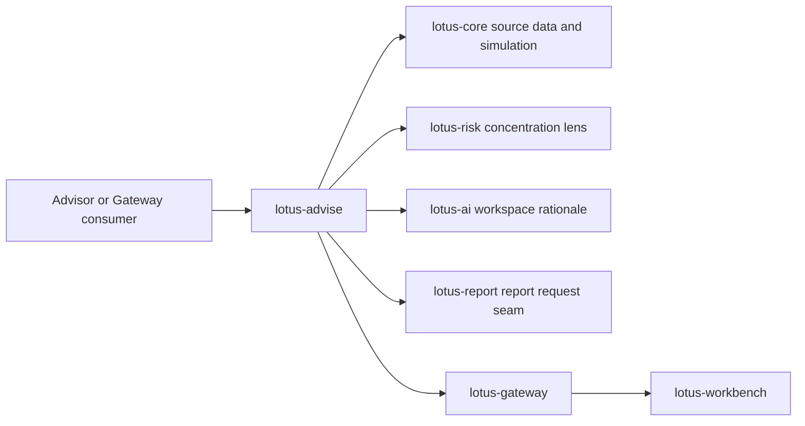
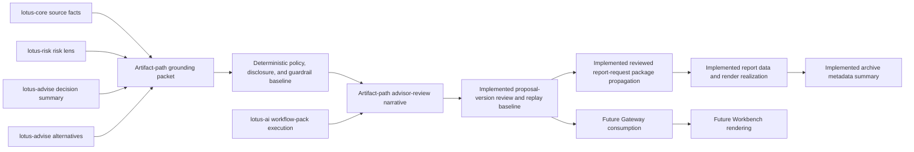
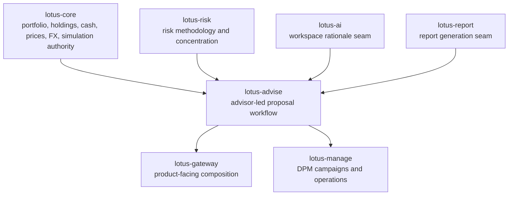

# Supported Features

This page separates implementation-backed `lotus-advise` capability from roadmap intent. It is
written for business, engineering, operations, sales, pre-sales, and demo preparation.

## Current Functional Capability Matrix

| Capability | Current support | Primary API or source | Boundary |
| --- | --- | --- | --- |
| Advisory proposal simulation | Supported | `POST /advisory/proposals/simulate` | Simulation execution stays anchored to `lotus-core` authority. |
| Proposal artifact generation | Supported | `POST /advisory/proposals/artifact` | Artifact generation is deterministic advisory evidence, not report rendering ownership. |
| Persisted proposal lifecycle | Supported | `/advisory/proposals/*` | Versions are immutable and workflow history is append-only. |
| Approval and consent workflow | Supported | `/advisory/proposals/{proposal_id}/approvals` and transitions | Approval posture is advisory workflow evidence, not downstream trade approval. |
| Delivery, report-request, and execution-handoff posture | Supported | delivery, report-request, execution-handoff, and execution-status routes | Execution handoff/status payloads carry ownership-boundary evidence; execution truth remains outside `lotus-advise`. |
| Advisory workspace drafting | Supported | `/advisory/workspaces/*` | Workspace state is pre-lifecycle advisory drafting, with explicit handoff into proposal ownership. |
| Workspace AI rationale | Supported through governed seam | `/advisory/workspaces/{workspace_id}/assistant/rationale` | Uses the bounded `lotus-ai` workspace rationale seam; proposal narrative uses its own RFC-0023 artifact-path boundary. |
| Advisor-review proposal narrative | Supported in proposal artifact, proposal-version review/replay, reviewed report-request package propagation, downstream report/render paths, and archive metadata summaries | `POST /advisory/proposals/artifact` with `narrative_request`; lifecycle create/version with `narrative_request`; `POST /advisory/proposals/{proposal_id}/versions/{version_no}/narrative/review`; `POST /advisory/proposals/{proposal_id}/report-requests` with `include_reviewed_narrative`; proposal lineage, delivery summary, and replay evidence endpoints | Generates opt-in `ADVISOR_REVIEW` narrative from proposal artifact grounding evidence with deterministic template mode, deterministic policy, disclosure, and guardrail metadata, optional `AI_ASSISTED_DRAFT` through a bounded `lotus-ai` workflow-pack adapter, version-scoped review events, idempotent review replay, source narrative hashes, exact persisted replay evidence, decision-summary/alternatives-aware section rendering for blockers, insufficient evidence, approvals, material changes, selected-alternative tradeoffs, and limitations. Report requests can include a compact reviewed narrative package only when the selected immutable version has an approved narrative review and matching source hash; the package carries sections, disclosures, guardrails, limitations, AI lineage, source hashes, and advisory execution-boundary evidence where present. `lotus-report` consumes and snapshots the reviewed package, `lotus-render` renders an optional advisor-use portfolio-review advisory narrative page from the package, and `lotus-archive` stores a support-safe archive metadata summary when the rendered portfolio-review artifact includes that page. Gated items still include standalone narrative read/regeneration routes, compliance-review, client-draft, client-ready commentary, Gateway/Workbench rendering, and capability promotion. |
| Proposal decision summary | Supported | simulation, artifact, workspace, replay, and lifecycle surfaces | Backend-owned decision summary; UI and support layers must not infer it independently. |
| Proposal alternatives | Supported | simulation, artifact, workspace, replay, and lifecycle surfaces | Alternatives remain anchored to canonical simulation and risk enrichment. |
| Tactical house-view affected cohorts | Supported | `POST /advisory/tactical-house-view/cohorts/evaluate` | Evaluates supplied source-backed candidate portfolios only; no global portfolio discovery or DPM campaign ownership. |
| Integration capability discovery | Supported | `GET /platform/capabilities` | Publishes feature, workflow, dependency-readiness evidence, and supportability posture for Gateway and platform consumers. |

## Current Non-Functional Capability Matrix

| Capability | Current support | Evidence |
| --- | --- | --- |
| OpenAPI and Swagger quality | Supported | `make openapi-gate` plus contract documentation tests. |
| API vocabulary and no-alias governance | Supported | `make api-vocabulary-gate` and `make no-alias-gate`. |
| Domain-product declarations | Supported | `contracts/domain-data-products/` and `make domain-data-products-gate`. |
| Trust telemetry fixture validation | Supported | `contracts/trust-telemetry/` and `tests/unit/test_trust_telemetry.py`. |
| Runtime smoke and production guardrails | Supported | `make ci` includes Postgres runtime smoke and production-profile guardrail negatives. |
| Dependency health and security audit | Supported | `make verify-dependencies` and `make security-audit`. |
| Supportability metrics and readiness evidence | Supported | `GET /platform/capabilities` documents bounded labels for `lotus_advise_advisory_supportability_total` and bounded dependency readiness basis fields. |
| Live cross-service evidence | Supported when the local stack is configured | Live validation scripts prove canonical and degraded proposal behavior. |

## Active Roadmap RFCs

These items are documented as future work and must not be presented as currently supported until
their implementation, tests, live proof, README/wiki updates, and `/platform/capabilities` posture
are complete.

| RFC | Feature | Product value | Current support |
| --- | --- | --- | --- |
| `RFC-0023` | Grounded advisory AI narrative and client-ready proposal commentary | Creates governed advisor-review, compliance-review, and client-ready proposal narrative from deterministic evidence. | Slices 0-10 complete: source authority, platform-scaffolding review, cleanup/structure, contract baseline, data-product/supportability non-promotion baseline, deterministic advisor-review artifact-path narrative, policy/disclosure/guardrail baseline, AI-assisted draft adapter baseline, proposal-version narrative review/replay baseline, decision-summary/alternatives/approval/limitation narrative integration, and certified canonical API/OpenAPI route inventory. Slice 11A is complete for reviewed narrative report-request package propagation; Slices 11B/11C are complete for `lotus-report` package consumption and `lotus-render` portfolio-review advisory narrative rendering; Slice 11D is complete for `lotus-archive` support-safe reviewed narrative archive metadata summaries. Compliance-review, client-draft, client-ready narrative, Gateway/Workbench surfaces, data-product, and capability promotion remain gated |
| `RFC-0024` | Advisor proposal memo and evidence pack | Turns proposal evidence into an advisor, compliance, operations, audit, and sales-ready memo package. | Planned RFC only |
| `RFC-0025` | Enterprise suitability and best-interest policy packs | Adds versioned policy packs for suitability, best-interest, product eligibility, disclosures, approvals, and source-readiness gaps. | Planned RFC only |
| `RFC-0026` | Advisor cockpit operating workflow | Creates backend-owned advisor worklists, action items, meeting-preparation packets, and workflow readiness summaries. | Planned RFC only |
| `RFC-0027` | Governed advisory AI copilot | Adds bounded AI workflow-pack actions for proposal explanation, evidence Q&A, preparation, and review support. | Planned RFC only |
| `RFC-0028` | Bank demo journey and client-ready proof | Creates repeatable, implementation-backed advisory demo proof with supported-claim governance. | Planned RFC only |

## Advisory Flow

## RFC-0023 Narrative Implementation Boundary

The diagram separates implemented artifact-path narrative plus proposal-version review/replay
support from future promotion gates. Slices 5-10 now support advisor-review narrative inside the
proposal artifact path when explicitly requested, with grounding packet, policy version, disclosure
selection, guardrail results, client-ready blockers, deterministic template mode, optional
`AI_ASSISTED_DRAFT` through a bounded `lotus-ai` workflow-pack adapter with deterministic fallback,
append-only review events, idempotent review replay, source narrative hashes, and exact persisted
replay evidence. Slice 9 adds decision-summary, approval/remediation, material-change,
selected-alternative tradeoff, rejected-candidate, and risk/suitability limitation wording from
backend-owned evidence. Slice 10 certifies the canonical API/OpenAPI route inventory, error-response
documentation, idempotency header guidance, stale-route absence, and material returned-field
coverage. Slice 11A adds report-request package propagation for a compact reviewed narrative
package when the selected immutable version has an approved narrative review and matching source
hash. Slices 11B/11C add downstream report package consumption and optional portfolio-review
advisory narrative rendering. Slice 11D adds support-safe archive metadata summary preservation
for rendered advisor-use portfolio-review artifacts. Proposal narrative is still not a domain data product,
trust-telemetry fixture, client-ready commentary, `/platform/capabilities` feature,
Gateway/Workbench surface, standalone read/regeneration API, or client-ready artifact until the
later implementing slices close.

## Integration Boundaries

## Demo And Pitch Boundaries

- Safe to claim: advisor-led proposal simulation, lifecycle evidence, approval and consent posture,
  workspace drafting, decision summaries, proposal alternatives, supportability metrics, and
  governed tactical house-view affected cohorts are implementation-backed.
- Do not claim: `lotus-advise` owns portfolio books, risk methodology, performance methodology,
  report rendering, OMS execution, discretionary campaign workflows, or global portfolio-universe
  discovery.
- For client demos, prepare with `GET /platform/capabilities`, `/health/ready`, and the relevant
  proposal or workspace routes so readiness claims match the current runtime posture.
- When a dependency is degraded, use the capability contract's `readiness_basis` and
  `degraded_reason` fields to explain whether the issue is missing configuration, a failed runtime
  probe, or a configuration-only non-production posture.
- When explaining execution posture, use the `execution_ownership` evidence to distinguish
  advisory handoff/status reconciliation from downstream execution system-of-record truth.
