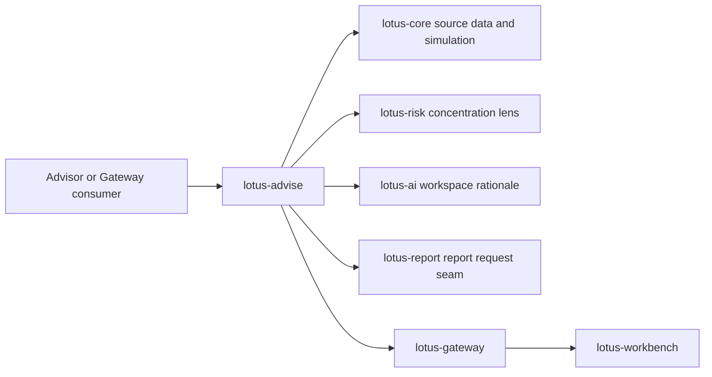
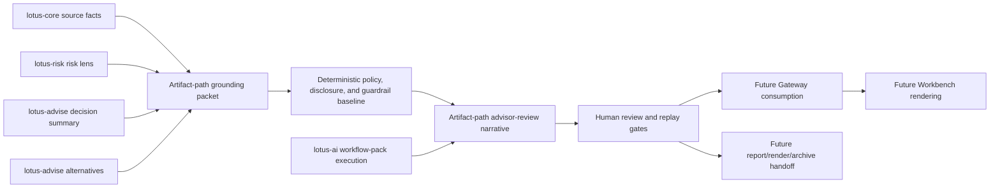
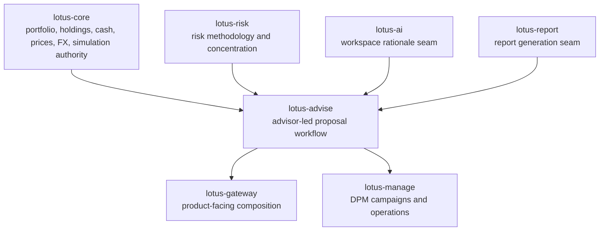

# Supported Features

This page separates implementation-backed `lotus-advise` capability from roadmap intent. It is
written for business, engineering, operations, sales, pre-sales, and demo preparation.

## Current Functional Capability Matrix

| Capability | Current support | Primary API or source | Boundary |
| --- | --- | --- | --- |
| Advisory proposal simulation | Supported | `POST /advisory/proposals/simulate` | Simulation execution stays anchored to `lotus-core` authority. |
| Proposal artifact generation | Supported | `POST /advisory/proposals/artifact` | Artifact generation is deterministic advisory evidence, not report rendering ownership. |
| Persisted proposal lifecycle | Supported | `/advisory/proposals/*` | Versions are immutable and workflow history is append-only. |
| Approval and consent workflow | Supported | `/advisory/proposals/{proposal_id}/approvals` and transitions | Approval posture is advisory workflow evidence, not downstream trade approval. |
| Delivery, report-request, and execution-handoff posture | Supported | delivery, report-request, execution-handoff, and execution-status routes | Execution handoff/status payloads carry ownership-boundary evidence; execution truth remains outside `lotus-advise`. |
| Advisory workspace drafting | Supported | `/advisory/workspaces/*` | Workspace state is pre-lifecycle advisory drafting, with explicit handoff into proposal ownership. |
| Workspace AI rationale | Supported through governed seam | `/advisory/workspaces/{workspace_id}/assistant/rationale` | Uses the bounded `lotus-ai` workspace rationale seam; broad proposal narrative remains RFC-0023 future work. |
| Deterministic advisor-review proposal narrative | Supported in proposal artifact path | `POST /advisory/proposals/artifact` with `narrative_request` | Generates opt-in `ADVISOR_REVIEW` narrative from proposal artifact grounding evidence without AI dependency and includes deterministic policy, disclosure, and guardrail metadata; standalone narrative endpoints, persistence, review approval, AI-assisted drafts, and client-ready commentary remain gated. |
| Proposal decision summary | Supported | simulation, artifact, workspace, replay, and lifecycle surfaces | Backend-owned decision summary; UI and support layers must not infer it independently. |
| Proposal alternatives | Supported | simulation, artifact, workspace, replay, and lifecycle surfaces | Alternatives remain anchored to canonical simulation and risk enrichment. |
| Tactical house-view affected cohorts | Supported | `POST /advisory/tactical-house-view/cohorts/evaluate` | Evaluates supplied source-backed candidate portfolios only; no global portfolio discovery or DPM campaign ownership. |
| Integration capability discovery | Supported | `GET /platform/capabilities` | Publishes feature, workflow, dependency-readiness evidence, and supportability posture for Gateway and platform consumers. |

## Current Non-Functional Capability Matrix

| Capability | Current support | Evidence |
| --- | --- | --- |
| OpenAPI and Swagger quality | Supported | `make openapi-gate` plus contract documentation tests. |
| API vocabulary and no-alias governance | Supported | `make api-vocabulary-gate` and `make no-alias-gate`. |
| Domain-product declarations | Supported | `contracts/domain-data-products/` and `make domain-data-products-gate`. |
| Trust telemetry fixture validation | Supported | `contracts/trust-telemetry/` and `tests/unit/test_trust_telemetry.py`. |
| Runtime smoke and production guardrails | Supported | `make ci` includes Postgres runtime smoke and production-profile guardrail negatives. |
| Dependency health and security audit | Supported | `make verify-dependencies` and `make security-audit`. |
| Supportability metrics and readiness evidence | Supported | `GET /platform/capabilities` documents bounded labels for `lotus_advise_advisory_supportability_total` and bounded dependency readiness basis fields. |
| Live cross-service evidence | Supported when the local stack is configured | Live validation scripts prove canonical and degraded proposal behavior. |

## Active Roadmap RFCs

These items are documented as future work and must not be presented as currently supported until
their implementation, tests, live proof, README/wiki updates, and `/platform/capabilities` posture
are complete.

| RFC | Feature | Product value | Current support |
| --- | --- | --- | --- |
| `RFC-0023` | Grounded advisory AI narrative and client-ready proposal commentary | Creates governed advisor-review, compliance-review, and client-ready proposal narrative from deterministic evidence. | Slices 0-6 complete: source authority, platform-scaffolding review, cleanup/structure, contract baseline, data-product/supportability non-promotion baseline, deterministic advisor-review artifact-path narrative, and policy/disclosure/guardrail baseline; AI-assisted, persisted/replayable, compliance-review, client-draft, and client-ready narrative remain gated |
| `RFC-0024` | Advisor proposal memo and evidence pack | Turns proposal evidence into an advisor, compliance, operations, audit, and sales-ready memo package. | Planned RFC only |
| `RFC-0025` | Enterprise suitability and best-interest policy packs | Adds versioned policy packs for suitability, best-interest, product eligibility, disclosures, approvals, and source-readiness gaps. | Planned RFC only |
| `RFC-0026` | Advisor cockpit operating workflow | Creates backend-owned advisor worklists, action items, meeting-preparation packets, and workflow readiness summaries. | Planned RFC only |
| `RFC-0027` | Governed advisory AI copilot | Adds bounded AI workflow-pack actions for proposal explanation, evidence Q&A, preparation, and review support. | Planned RFC only |
| `RFC-0028` | Bank demo journey and client-ready proof | Creates repeatable, implementation-backed advisory demo proof with supported-claim governance. | Planned RFC only |

## Advisory Flow

## RFC-0023 Narrative Implementation Boundary

The diagram separates implemented artifact-path narrative support from future promotion gates.
Slices 5-6 now support deterministic advisor-review narrative inside the proposal artifact path
when explicitly requested, with grounding packet, policy version, disclosure selection, guardrail
results, and client-ready blockers. Proposal narrative is still not a domain data product,
trust-telemetry fixture, standalone endpoint, persisted/replayable narrative, review-approved workflow,
`/platform/capabilities` feature, AI-assisted draft, client-ready commentary, or report/render/archive
artifact inclusion until the later implementing slices close.

## Integration Boundaries

## Demo And Pitch Boundaries

- Safe to claim: advisor-led proposal simulation, lifecycle evidence, approval and consent posture,
  workspace drafting, decision summaries, proposal alternatives, supportability metrics, and
  governed tactical house-view affected cohorts are implementation-backed.
- Do not claim: `lotus-advise` owns portfolio books, risk methodology, performance methodology,
  report rendering, OMS execution, discretionary campaign workflows, or global portfolio-universe
  discovery.
- For client demos, prepare with `GET /platform/capabilities`, `/health/ready`, and the relevant
  proposal or workspace routes so readiness claims match the current runtime posture.
- When a dependency is degraded, use the capability contract's `readiness_basis` and
  `degraded_reason` fields to explain whether the issue is missing configuration, a failed runtime
  probe, or a configuration-only non-production posture.
- When explaining execution posture, use the `execution_ownership` evidence to distinguish
  advisory handoff/status reconciliation from downstream execution system-of-record truth.
