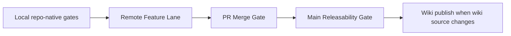

# Validation And CI

`lotus-advise` uses the Lotus multi-lane validation model. The lanes are designed to give agents
fast feedback, block real degradation before merge, and confirm release-grade posture after the
change reaches `main`.

## Lane Map

| Lane | Primary proof | What it protects |
| --- | --- | --- |
| Local fast gate | `make check` | Lint, typecheck, OpenAPI, no-alias, API vocabulary, domain data products, quality-baseline freshness, high-severity security, and unit behavior. |
| Local PR-grade gate | `make ci` | Dependency health, static governance, migrations, security audit, release-image provenance, coverage, Docker build, Postgres runtime contracts, and production-profile guardrail negatives. |
| Remote Feature Lane | GitHub `Remote Feature Lane` | Branch feedback for workflow lint, unit tests, dependency governance, high-severity Bandit, demo-assurance checks, and quality-baseline freshness. |
| PR Merge Gate | GitHub `Pull Request Merge Gate` | Merge readiness across lint/typecheck governance, unit/integration/e2e tests, coverage, Docker build, Postgres migration smoke, production startup smoke, and production guardrail negatives. |
| Main Releasability Gate | GitHub `Main Releasability Gate` | Post-merge release evidence on `main`, including the same static, runtime, migration, coverage, Docker, security, observability, and advisory-domain signals. |
| Report-only quality evidence | `Quality Baseline / Report Only` and `make quality-baseline` | Trend evidence for code health and refactoring scorecards. Report-only signals should not be promoted until deterministic, low-noise, locally runnable, and policy-backed. |



## Repo-Native Commands

Use these commands instead of ad hoc command sequences:

```powershell
make check
make ci
make ci-local
make ci-local-docker
make quality-baseline-check
make demo-assurance-gate
make demo-certification-live
make security-audit
make bandit-high-severity-gate
make openapi-gate
make no-alias-gate
make api-vocabulary-gate
make domain-data-products-gate
make external-adapter-contracts
make release-image-provenance-gate
make observability-diagnostics
make advisory-domain-golden-regressions
```

Use focused pytest, Ruff, or script targets for diagnosis, but PR evidence should state whether the
full repo-native target or a focused target was run.

## Blocking Gates

The current blocking posture is intentionally high-signal:

1. `make lint`
   runs Ruff, format check, monetary-float guard, import-linter architecture contracts, global
   complexity regression blocking for C-ranked and worse blocks, and refactored-module complexity
   gates for hardened source files.
2. `make typecheck`
   runs the repository mypy configuration.
3. `make openapi-gate`
   runs OpenAPI quality checks, lifecycle OpenAPI documentation tests, and the Spectral report. The
   quality gate distinguishes authored route contracts from Swagger display enrichment; generated
   operation summaries, descriptions, inferred tags, and generic default errors do not satisfy the
   public-route contract bar.
4. `make no-alias-gate`
   blocks accidental compatibility aliases.
5. `make api-vocabulary-gate`
   regenerates and validates the governed API vocabulary inventory. The gate rejects
   placeholder-shaped generated examples such as `sample_text`, `sample_key`, `STANDARD_TEXT`,
   `STANDARD_ITEM`, `ENTITY_001`, and `example_*`; public examples must be source-authored or
   derived from governed deterministic domain examples.
6. `make domain-data-products-gate`
   validates repo-native domain data product declarations against platform contracts.
7. `make external-adapter-contracts`
   validates the versioned consumer-contract fixture manifest for `lotus-core`, `lotus-risk`,
   `lotus-report`, and `lotus-ai`. The lane requires valid-response, malformed JSON, missing
   fields, identity/as-of mismatch, partial data, auth failure, timeout, retry or bounded
   non-retry, duplicate/idempotency, provider error mapping, and raw-payload/secret non-leakage
   evidence to reference real regression tests.
8. `make quality-baseline-check`
   blocks stale committed quality report and scorecard truth.
9. `make bandit-high-severity-gate`
   blocks high-severity Bandit findings in the fast local and Feature Lane path.
10. `make security-audit`
   runs dependency health with audit posture and the high-severity Bandit gate in PR-grade paths.
11. `make release-image-provenance-gate`
    blocks drift in Dockerfile build metadata args, OCI labels, Docker build arguments, and
    support-safe metadata naming before the image is built or pushed.
12. `make coverage-combined`
    enforces the combined coverage floor across unit, integration, and e2e suites.
13. `make postgres-runtime-contracts-local` and `make production-profile-guardrail-negatives-local`
    protect supported runtime startup and production-profile guardrail behavior.

These gates are blocking because they are measured, deterministic, repo-native, and low-noise for
the current codebase.

## Release Image Evidence

`Main Releasability Gate` is the only lane that pushes the release image. It tags the image with the
Git SHA, applies OCI labels for commit, branch/ref, repository URL, service version, build
timestamp, CI run ID, and image-digest posture, then retains one evidence bundle:

1. `release-evidence.json` with the pushed digest and immutable image reference,
2. SBOM,
3. vulnerability scan report,
4. image signature reference,
5. provenance attestation reference.

The running service exposes `GET /version` with the same support-safe metadata. Release deployment
must use the digest reference from the retained manifest and promote the same image across
environments instead of rebuilding. PRs and local builds may validate image labels, but they must not
push release images.

## Demo Assurance And Live Certification

`make demo-assurance-gate` is a deterministic local/static gate. It composes:

1. OpenAPI governance,
2. no-alias governance,
3. API vocabulary governance,
4. domain data product declarations,
5. observability diagnostics,
6. advisory-domain golden regressions.

`make demo-certification-live` is a live runtime certification command. It writes machine-readable
evidence under `output/demo-certification/` by default and should remain report-only until the
signal is proven stable enough for blocking CI. Use it for app-level demo proof, not as a shortcut
around canonical front-office validation when Workbench proof is required.

## Async CI Posture

Heavy GitHub lanes should run asynchronously where practical. Agents should:

1. run targeted local proof first,
2. push once the local signal is healthy,
3. poll GitHub sparsely,
4. inspect only failed or stalled jobs,
5. fix forward from the concrete failing log,
6. avoid rerunning broad lanes just to watch already-green checks.

This keeps development moving while preserving release evidence.

## Wiki And Documentation Changes

When `wiki/` changes:

1. run the repo-local docs and workflow contract tests that cover the changed page,
2. run the platform wiki check before merge:

From a sibling `lotus-platform` checkout:

```powershell
..\lotus-platform\automation\Sync-RepoWikis.ps1 -CheckOnly -Repository lotus-advise
```

3. publish after the merged commit is on `main`:

From a sibling `lotus-platform` checkout:

```powershell
..\lotus-platform\automation\Sync-RepoWikis.ps1 -Publish -Repository lotus-advise
```

The repo-local `wiki/` directory is the authored source of truth. The GitHub wiki repository is only
the publication target.

## What This Page Does Not Claim

Green CI proves the scoped repository gates passed for the tested commit. It does not by itself
prove bank certification, regulatory approval, legal advice, client-ready publication, external
client communication, completed approval authority, or OMS/order/fill/settlement support.
