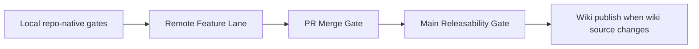

# Validation And CI

`lotus-advise` uses the Lotus multi-lane validation model. The lanes are designed to give agents
fast feedback, block real degradation before merge, and confirm release-grade posture after the
change reaches `main`.

## Current Scope

This page is the operating map for local gates, GitHub Actions lanes, release evidence, and
post-merge wiki publication. It names blocking commands and the evidence each lane protects.

The opt-in Queue Auto Merge workflow runs only for ready, internal, non-fork PRs targeting `main`
with the `automerge` label. It uses `LOTUS_AUTOMERGE_TOKEN` to queue the repository-approved
rebase merge so post-merge releasability dispatch is triggered by a non-`GITHUB_TOKEN` actor. If
the secret is missing, the workflow emits a machine-readable GitHub error and fails the check;
it does not report a green skipped result. After required checks pass, an authorized human or
release actor may use the documented manual rebase-merge fallback.

`make ci-local-docker` mounts the central Platform contract tree read-only at `/lotus-platform`,
plus all repo-native domain-product source checkouts at their canonical `/lotus-*` paths. The
platform host path defaults to `../lotus-platform` and can be overridden with
`LOTUS_PLATFORM_ROOT`; the federated repository root defaults to `..` and can be overridden with
`LOTUS_REPOSITORIES_ROOT`. The image includes the workflow-matching pinned Node `22.14.0` runtime
for Spectral; if Spectral cannot execute, the gate fails rather than treating a report-only `127`
result as evidence.

The monetary-float guard runs inside `make lint` and fails closed for unauthorized findings,
malformed approvals, stale approvals, and approved findings inside the inclusive seven-calendar-day
pre-expiry window (`0 <= days_remaining <= 7`). Each allowlist entry must retain a justification,
owner, and `review_by` date. The pre-expiry gate makes review work visible in the PR lane before a
post-merge mainline failure; it is CI/developer evidence only and does not change runtime, API,
persistence, migration, or data-model behavior.

Target-generation solver conversions are kept behind the typed `src/core/target_solver_boundary.py`
adapter. The guard inventories its one intentional Decimal-to-cvxpy conversion separately from
domain monetary calculations; its approval carries owner, expiry, and #544 removal evidence.
The coverage configuration does not omit `src/core/target_generation.py`, so the combined 97%
coverage gate and the 90% changed-source gate both measure refactored target-generation behavior;
changed source cannot pass with an empty coverage record caused by a stale omission.

The fast static lanes also run `make dead-code-gate`. It scans `src` and `scripts` with the pinned
Vulture version and fails on any finding outside the versioned
`quality/dead-code-policy.v1.json` exception set. Each reviewed compatibility exception carries a
stable fingerprint, owner, reason, and expiry date; scanner or parser failures fail closed. The
policy version ends with a 12-character content fingerprint, so changing policy content without
an explicit version update fails closed and keeps evidence comparable. This gate covers new
dead/unused-code regressions only.

The same fast static lanes also run `make duplicate-code-gate`. It scans `src` and `scripts` with
pinned jscpd `5.0.16` in strict mode, requiring at least 100 tokens and 10 lines per clone. The
reviewed fingerprint inventory is committed as stable content fingerprints with owner, reason,
expiry, and policy/baseline hash provenance; any new or resolved fingerprint or scanner, parser,
policy, or baseline-integrity failure blocks the lane. This gate is CI/developer evidence only and does not
change runtime, API, persistence, migration, or data-model behavior.

The same fast static lanes also run `make unused-dependency-gate`. It runs the pinned deptry
`0.25.1` configuration, classifies the committed install-closure inventory in
`quality/dependency-hygiene-baseline.v1.json`, and fails on tool-version drift, malformed output,
new or resolved fingerprints, duplicate identities, expired provenance, or policy/baseline hash
drift. The gate emits `output/dependency-hygiene-gate.json` and uploads it from each governance
lane. It is CI/developer evidence only and does not change runtime, API, persistence, migration,
or data-model behavior.

The same fast static lanes also run `make oversized-code-gate`. It scans Python modules and
functions under `src/` and `scripts/` against the explicit `1,000`-module-line and `200`-function-
line thresholds. The reviewed baseline at `quality/oversized-code-baseline.v1.json` is
content-hashed and each entry carries an owner, reason, and expiry; new findings, growth, shrinkage
without a reviewed `max_lines` ratchet, stale entries, expiry, scanner/parser failures, or
policy/baseline hash drift fail closed. When an oversized finding remains above its threshold but
measures below its baseline ceiling, update `max_lines` to the measured value and refresh the
baseline and policy fingerprints. Evidence is emitted at
`output/oversized-code-gate.json` and uploaded from each governance lane. This is CI/developer
evidence only and does not change runtime, API, persistence, migration, or data-model behavior.

The fast static lanes also run `make proposal-decision-vocabulary-gate`. It validates the
versioned `docs/standards/proposal-decision-vocabulary.v1.json` artifact directly against the
Advise-owned decision-status and workflow-gate rule modules. A changed decision pairing or gate
next-step mapping fails with the affected vocabulary name, so Gateway consumers can compare a
producer-owned contract rather than silently carrying a local snapshot. The gate also cross-checks
decision-status workflow-gate pairings against the runtime gate inverse and checks insufficient-
evidence next actions against the evidence-gap branch map. The legacy top-level status projection
is explicitly a reviewed compatibility declaration because it has no separate runtime producer.
The artifact publishes pairings only; approval requirements and gate reasons remain separate
runtime evidence fields.

The same fast static lanes also run `make quality-trend-gate`. This gate compares the committed
`quality/baseline_report.md` metrics at the merge base of the supplied base/head revisions and the
exact head revision, then writes `output/quality-trend-gate.json`. The versioned policy allows at most 200 additional Python lines;
this is an evidence-based ratchet from 500 through 250 to 200 that admits the ordinary +12-to-+166-line run across merged PRs #526-#535
with 34 lines of measured headroom while requiring exact reviewed exceptions for the +435 and +511 large batches, rather than admitting an
unreviewed half-kiloline batch;
no increase in Radon B-ranked blocks, no increase in the worst Radon complexity, and no decrease
in Interrogate coverage. Interrogate comparisons derive from the exact `covered` and `total`
counts in the evidence line rather than its one-decimal display percentage; inconsistent or
zero-total counts fail closed. Any reviewed exception must name the metric, exact effective
comparison `base_sha` (the measured merge base), and the deterministic fingerprint of every
tracked Python blob at the measured head, plus justification, approver, and expiry date. Any
tracked Python-content change invalidates the exception; this avoids the impossible
self-reference of embedding a final policy-commit SHA inside that same policy. The evidence
artifact also reports the resolved base-ref SHA separately from the comparison pair. Policy content changes require a
matching content-fingerprint version. Feature
Lane supplies `origin/main`; PR Merge Gate supplies pull-request base/head SHAs on `pull_request`
and deterministically compares `origin/main` with the selected `github.sha` on `workflow_dispatch`.
Manual PR-gate dispatches therefore cannot silently run with empty pull-request fields. The same
event-aware comparison refs drive changed-source coverage, and the gate logs the event, refs, and
checkout SHA before resolving both revisions. Main Releasability supplies `HEAD^` with `HEAD`;
all comparisons resolve and record the merge base so unrelated mainline merges cannot erase branch
growth. Evidence records the supplied base ref, effective base ref, explicit fallback state,
requested base SHA, and resolved merge-base SHA. The gate records the effective ref and fallback
state at the decision boundary, so failed revision or baseline reads preserve truthful fallback
provenance as well as successful comparisons. The gate is CI/developer evidence only and does not
change runtime, API, persistence, migration, or data-model behavior.

## Reader Map

| Reader | Start here |
| --- | --- |
| Agent or developer | Lane Map, Repo-Native Commands, Blocking Gates |
| PR reviewer | Blocking Gates, Pull Request Merge Gate evidence |
| Release operator | Release Image Evidence, Main Releasability Gate |

## Lane Map

| Lane | Primary proof | What it protects |
| --- | --- | --- |
| Local fast gate | `make check` | Lint, typecheck, OpenAPI, no-alias, API vocabulary, producer-owned proposal decision vocabulary, domain data products, trust telemetry freshness, advisory data-lifecycle inventory, quality-baseline freshness, quality trend comparison, dead-code/duplicate-code/unused-dependency/oversized-code regression gates, high-severity security, dependency-lock evidence, license/IP evidence, and unit behavior. |
| Local PR-grade gate | `make ci` | Dependency health, static governance including proposal decision vocabulary, quality trend comparison, and dead-code/duplicate-code/unused-dependency/oversized-code regression gates, migrations, security audit, dependency-lock evidence, license/IP evidence, release-image provenance, coverage, Docker build, Postgres runtime contracts, and production-profile guardrail negatives. |
| Remote Feature Lane | GitHub `Remote Feature Lane` | Branch feedback for workflow lint, unit tests, producer-owned proposal decision vocabulary, quality trend comparison, dependency governance including dead-code/duplicate-code/unused-dependency/oversized-code regression gates, dependency-lock evidence, license/IP evidence, Bandit severity regression, and demo-assurance checks. |
| PR Merge Gate | GitHub `Pull Request Merge Gate` | Merge readiness across lint/typecheck, producer-owned proposal decision vocabulary, quality trend comparison, dead-code/duplicate-code/unused-dependency/oversized-code governance, unit/integration/e2e tests, coverage, Docker build, Postgres migration smoke, production startup smoke, and production guardrail negatives. |
| Main Releasability Gate | GitHub `Main Releasability Gate` | Post-merge release evidence on `main`, including the same proposal decision vocabulary and quality trend comparison, static dead-code/duplicate-code/unused-dependency/oversized-code, runtime, migration, coverage, Docker, security, observability, and advisory-domain signals. |
| Report-only quality evidence | `Quality Baseline / Report Only` and `make quality-baseline` | Detailed code-health and refactoring scorecards remain report-only; the versioned quality trend comparison is separately enforced by local and governance lanes. |


```mermaid
flowchart LR
    Local["Local repo-native gates"]
    Feature["Remote Feature Lane"]
    PR["PR Merge Gate"]
    Main["Main Releasability Gate"]
    Wiki["Wiki publish when wiki source changes"]

    Local --> Feature --> PR --> Main
    Main --> Wiki
```

## Repo-Native Commands

Use these commands instead of ad hoc command sequences:

```powershell
make check
make ci
make ci-local
make ci-local-docker
make quality-baseline-check
make quality-trend-gate
make dead-code-gate
make duplicate-code-gate
make unused-dependency-gate
make oversized-code-gate
make proposal-decision-vocabulary-gate
make demo-assurance-gate
make demo-certification-live
make security-audit
make dependency-lock-gate
make license-ip-gate
make bandit-severity-regression-gate
make openapi-gate
make no-alias-gate
make api-vocabulary-gate
make domain-data-products-gate
make trust-telemetry-freshness-gate
make external-adapter-contracts
make migration-rollout-contract-gate
make release-image-provenance-gate
make observability-diagnostics
make advisory-domain-golden-regressions
```

The CI-local Docker targets derive one checkout-specific Compose project from the absolute
repository path and use it for both startup and cleanup. With the default identity, this keeps
`make ci-local-docker-down` and its `--remove-orphans` cleanup scoped to CI-owned resources and
prevents collision with the product Compose project or an active Advise container.
`CI_LOCAL_COMPOSE_PROJECT` may override the derived identity only when an orchestrator supplies a
unique, CI-owned name; arbitrary overrides are not collision-safe. If a shared runtime is active,
verify its health after both targets complete.

The CI-local image carries the pinned Node `22.14.0` runtime used by the workflow OpenAPI Spectral
gate. If Spectral cannot execute, `make openapi-gate` fails closed; a report containing a tool
execution error is not a passing CI result.
The Docker-local lane mounts the central Platform contract tree read-only at `/lotus-platform`;
`LOTUS_PLATFORM_ROOT` overrides the default sibling checkout path `../lotus-platform` so the
domain-data-products gate runs against the same governed contracts as hosted CI.

Use focused pytest, Ruff, or script targets for diagnosis, but PR evidence should state whether the
full repo-native target or a focused target was run.

## Blocking Gates

The current blocking posture is intentionally high-signal:

1. `make lint`
   runs Ruff, format check, monetary-float guard, import-linter architecture contracts, global
   complexity regression blocking for C-ranked and worse blocks, and refactored-module complexity
   gates for hardened source files.
2. `make typecheck`
   runs the repository mypy configuration.
3. `make openapi-gate`
   runs OpenAPI quality checks, lifecycle OpenAPI documentation tests, and the Spectral report. The
   quality gate distinguishes authored route contracts from Swagger display enrichment; generated
   operation summaries, descriptions, inferred tags, and generic default errors do not satisfy the
   public-route contract bar.
4. `make no-alias-gate`
   blocks accidental compatibility aliases.
5. `make api-vocabulary-gate`
   regenerates and validates the governed API vocabulary inventory. The gate rejects
   placeholder-shaped generated examples such as `sample_text`, `sample_key`, `STANDARD_TEXT`,
   `STANDARD_ITEM`, `ENTITY_001`, and `example_*`; public examples must be source-authored or
   derived from governed deterministic domain examples.
6. `make domain-data-products-gate`
   validates repo-native domain data product declarations against platform contracts.
7. `make trust-telemetry-freshness-gate`
   derives trust telemetry age and blocking posture from observed implementation evidence so stale
   snapshots cannot keep claiming current promotion posture.
8. `make advisory-data-lifecycle-gate`
   validates `contracts/data-governance/advisory-evidence-telemetry-field-inventory.v1.json`
   so persisted advisory evidence, emitted telemetry, and downstream AI payload fields carry
   classification, purpose, owner, allowed consumers, retention/purge, masking, and projection
   decisions.
9. `make external-adapter-contracts`
   validates the versioned consumer-contract fixture manifest for `lotus-core`, `lotus-risk`,
   `lotus-report`, and `lotus-ai`. The lane requires valid-response, malformed JSON, missing
   fields, identity/as-of mismatch, partial data, auth failure, timeout, retry or bounded
   non-retry, duplicate/idempotency, provider error mapping, and raw-payload/secret non-leakage
   evidence to reference real regression tests.
10. `make quality-baseline-check`
   blocks stale committed quality report and scorecard truth.
   `make quality-trend-gate` resolves the merge base of committed base/head revisions, then blocks
   policy-defined regressions in Python-line growth, Radon B-ranked blocks, worst Radon complexity,
   or Interrogate coverage. Interrogate coverage is calculated from the report's exact counts and
   malformed counts are rejected before comparison. It emits `output/quality-trend-gate.json` with supplied and effective
   base refs, explicit fallback state, requested and resolved revision SHAs, metric deltas,
   thresholds, policy fingerprint, and any exception provenance. Fallback provenance is written
   before later revision or baseline-read work, so failed artifacts do not falsely report that
   fallback was unused.
   This is a CI/developer quality gate and does not alter product behavior or contracts.
11. `make duplicate-code-gate`
   runs strict jscpd against `src` and `scripts`, compares normalized clone fingerprints with
   the reviewed baseline, and fails on new or resolved findings or any tool/parser/policy/baseline-
   integrity failure. Baseline changes require a policy hash/version update and remain reviewable
   in Git.
12. `make unused-dependency-gate`
   runs pinned deptry, compares normalized dependency fingerprints with the reviewed
   `quality/dependency-hygiene-baseline.v1.json`, and fails on new/resolved findings, expired
   classifications, tool-version drift, malformed reports, duplicate identities, or policy/baseline
   integrity failures. Baseline changes require explicit owner/reason/expiry evidence plus a
   policy/baseline hash update.
13. `make oversized-code-gate`
    scans `src/` and `scripts/` for modules over 1,000 physical lines and functions over 200
    physical lines, compares stable fingerprints against the reviewed
    `quality/oversized-code-baseline.v1.json`, and fails on new, grown, resolved, expired, or
    malformed findings. Baseline changes require explicit owner/reason/expiry evidence plus a
    policy/baseline hash update.
14. `make migration-rollout-contract-gate`
   validates every checked-in Postgres migration has explicit namespace coverage, rollout phase,
   old/new application compatibility, lock and online behavior, backfill checkpoint/resume/quarantine
   posture, rollback limits, and non-production rehearsal evidence.
15. `make bandit-severity-regression-gate`
   blocks high-severity Bandit findings and fails on any new, stale, expired, or worsened
   medium/low finding relative to `quality/bandit_security_baseline.v1.json`.
16. `make security-audit`
   runs dependency health with audit posture and the Bandit severity-regression gate in PR-grade
   paths.
17. `make release-image-provenance-gate`
     blocks drift in Dockerfile build metadata args, OCI labels, Docker build arguments, and
     support-safe metadata naming before the image is built or pushed.
18. `make dependency-lock-gate`
     validates `uv.lock` as the generated mirror of the requirements install strategy and
     dependency inventory.
19. `make license-ip-gate`
     validates the committed runtime/development dependency license inventory and owner-approved
     expiring exceptions in an isolated virtual environment installed from governed
     runtime/development requirements files constrained to exact package versions projected from
     `uv.lock`, with pinned pip/setuptools bootstrap tooling and pip isolated from caller
     configuration. Transitive version-only drift is not a governance event; new packages, license
     terms, classifications, dependency groups, and exception evidence remain blocking with
     actionable package/version/license output.
20. `make coverage-combined`
     enforces the combined coverage floor across unit, integration, and e2e suites.
21. `make postgres-runtime-contracts-local` and `make production-profile-guardrail-negatives-local`
     protect supported runtime startup and production-profile guardrail behavior.

These gates are blocking because they are measured, deterministic, repo-native, and low-noise for
the current codebase.

## Release Image Evidence

`Main Releasability Gate` is the only lane that pushes the release image. It tags the image with the
Git SHA, applies OCI labels for commit, branch/ref, repository URL, service version, build
timestamp, CI run ID, and image-digest posture, then retains one evidence bundle:

1. `release-evidence.json` with the pushed digest and immutable image reference,
2. SBOM,
3. dependency-lock evidence,
4. license/IP dependency inventory,
5. passing high/critical fixable-vulnerability scan report plus full all-severity inventory,
6. image signature reference,
7. provenance attestation reference.

The running service exposes `GET /version` with the same support-safe metadata. Release deployment
must use the digest reference from the retained manifest and promote the same image across
environments instead of rebuilding. PRs and local builds may validate image labels, but they must not
push release images.

## Demo Assurance And Live Certification

`make demo-assurance-gate` is a deterministic local/static gate. It composes:

1. OpenAPI governance,
2. no-alias governance,
3. API vocabulary governance,
4. domain data product declarations,
5. observability diagnostics,
6. advisory-domain golden regressions.

`make demo-certification-live` is a live runtime certification command. It writes machine-readable
evidence under `output/demo-certification/` by default and should remain report-only until the
signal is proven stable enough for blocking CI. Use it for app-level demo proof, not as a shortcut
around canonical front-office validation when Workbench proof is required.

## Async CI Posture

Heavy GitHub lanes should run asynchronously where practical. Agents should:

1. run targeted local proof first,
2. push once the local signal is healthy,
3. poll GitHub sparsely,
4. inspect only failed or stalled jobs,
5. fix forward from the concrete failing log,
6. avoid rerunning broad lanes just to watch already-green checks.

This keeps development moving while preserving release evidence.

## Wiki And Documentation Changes

When `wiki/` changes:

1. run the repo-local docs and workflow contract tests that cover the changed page,
2. run the platform wiki check before merge:

From a sibling `lotus-platform` checkout:

```powershell
..\lotus-platform\automation\Sync-RepoWikis.ps1 -CheckOnly -Repository lotus-advise
```

3. publish after the merged commit is on `main`:

From a sibling `lotus-platform` checkout:

```powershell
..\lotus-platform\automation\Sync-RepoWikis.ps1 -Publish -Repository lotus-advise
```

The repo-local `wiki/` directory is the authored source of truth. The GitHub wiki repository is only
the publication target.

## What This Page Does Not Claim

Green CI proves the scoped repository gates passed for the tested commit. It does not by itself
prove bank certification, regulatory approval, legal advice, client-ready publication, external
client communication, completed approval authority, or OMS/order/fill/settlement support.
